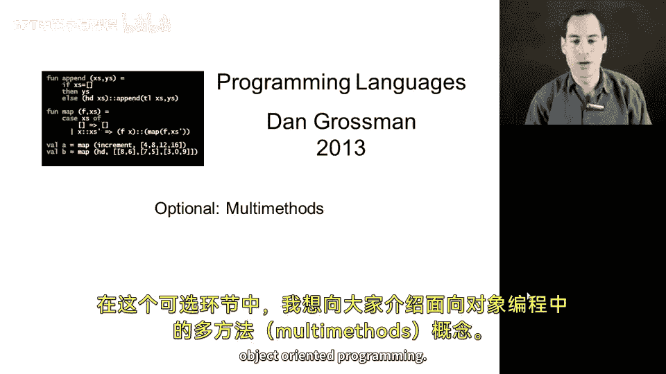
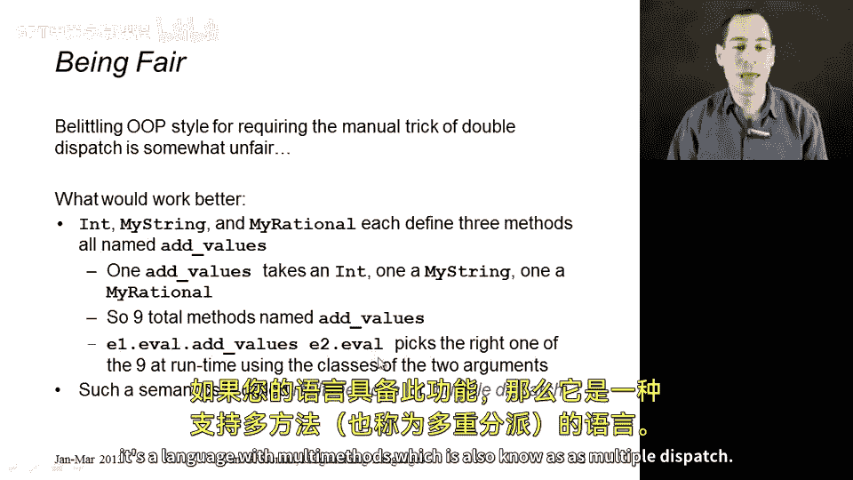
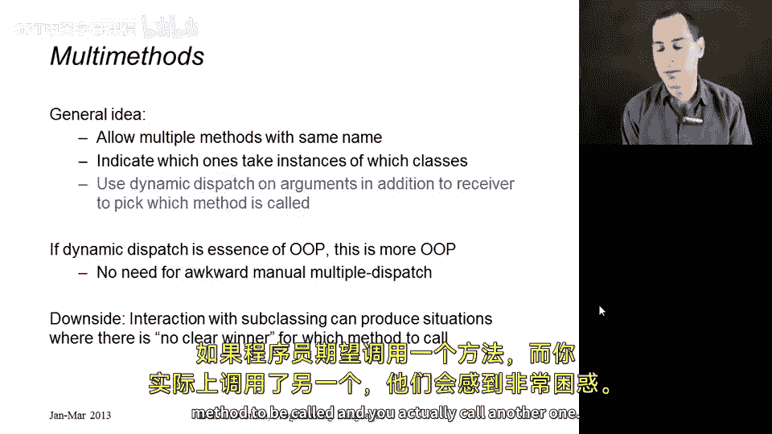
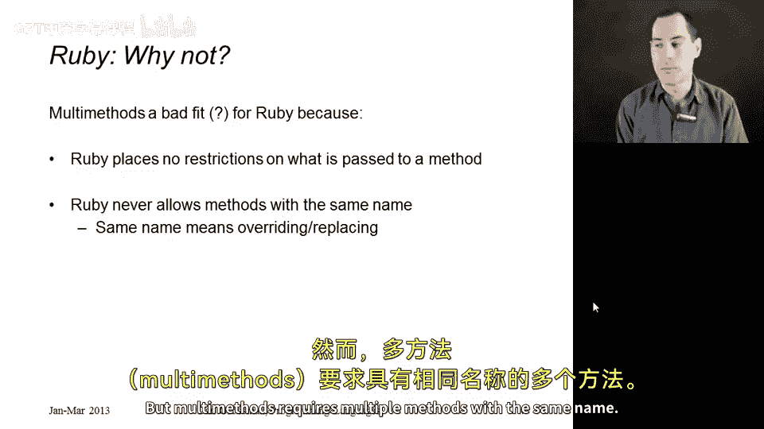
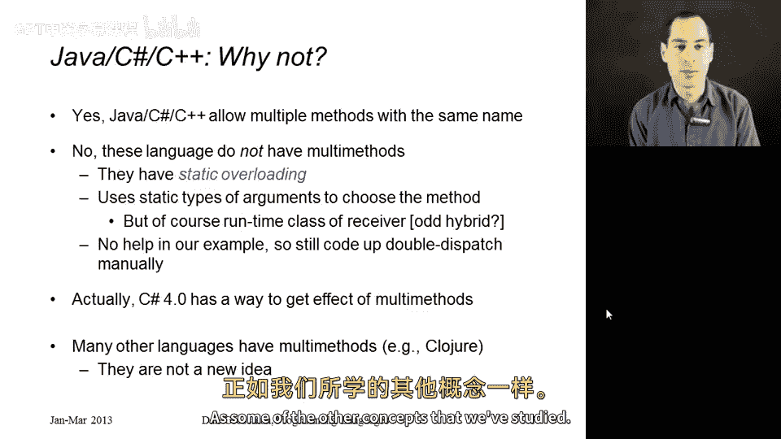

# 【编程语言 A⧸B⧸C CSE341 Coursera】华盛顿大学—中英字幕 p167 26_05_optional-multimethods -BV1bw4m1D7MM_p167-

In this optional segment， I want to tell you about the concept of multi methods in object oriented programming。

 This lets me be a little more fair because a language that had multi methodss could does not need the manual and awkward double dispatch idiom that we just saw in Ruby in the previous segment。

 So here's what you could do in a language， not Ruby。

 but a different language that had something different。

What we could do is we could take our int， our my string and our myrational classes。

 which were three kinds of values that we can add in any combination。

 and we could have them each define three methods all called the same thing， all called add values。

And in these three methods， one of them would take an int。 One would take a myering。

 and one would take a myrational。 So we' would actually have9 total methods called add values。

 Three of them define an int，3 in mying，3 and myrational， and all9 combinations correspond to one of。

The methods called the same thing。And then in our language， when we said e1。evval。ad values e2。evval。

What we would end up doing is saying， well， E1 do eval is either an antiomister or myrational。

 E2 do eval is an antiing orration， and the semantics of our language will pick the correct method out of the nine possibilities and call that one。

So we have multiple methods with the same name and we're going to pick the right one based on the runtime class of our operarans。

 both the operaand on the left of add values and the operaran it is the other argument。

 and if your language does that it's a language with multiple methodss which is also known as multiple dispatch。

So the general idea is that we allow multiple methods with the same name。

 we have to indicate which ones take instances of which classes。And then at runtime。

 we use dynamic dispatch not just on the receiver， which is what every OOP language does。

 but on the receiver and the arguments， we use all of the arguments， including the receiver。

 to pick the best method， even when multiple methods have the same name。So on the one hand。

 if dynamic dispatch is the thing that makes OOP different， we just added more dynamic dispatch。

 which makes this kind of a more OOP construct right now we're doing dynamic dispatch not just on the thing to the left of the dot。

 but we're also using the arguments to pick the best method based on the runtime classes of more things。

The downside is there are situations where this idea interacts with subclassing such that it's not clear what the best method is to call。

 there are multiple methods with the same name and you could call more than one。

 they would all make sense and you're not sure which one to call and you need to define that in your language or programmers are going to get very confused when they expect one method to be called and you actually call another one。

Okay， so I actually think multi methods are pretty neat， but I would not suggest adding them to Ruby。

 There's a couple reasons。1 is Ruby does not have method definers indicate the class of the thing they accept。

 That's not Ruby at all。 Ruby is a very dynamic language。 You can pass any object to any method。

 But multi methodsds relied on that。 when we are picking which one to call we needed to know that this method called add values expects a myration as its argument。

 And that one called add values expects a my string as its argument。

 This is pretty fundamentally incompatible with Ruby。

The second reason why I wouldn't add it to Ruby is Ruby has a very simple rule。

 which is that classes never have more than one method with the same name right when you're defining a class。

 if you repeat a method definition， it replaces the earlier one and similar in subclassing having a method of the same name is something the superclass means overwriting It's a simple rule it works just fine。

 but multi- methods requires multiple methods with the same name。

Finally， probably some of you are thinking， I know Java or C sharpp or C++。

 and they definitely allow multiple methods in the same class with the same name， and you are right。

But these languages do not have multi methods。 They have something different。

 something that has different advantages and disadvantages， and which is called static overloading。

When you have multiple methods with the same name in Java and C sharpharp and C++。

You use the static types of the arguments to choose which method you actually meant。😡。

So on the receiver， the thing to the left of the dot， of course we use the runtime class。

 that's dynamic dispatch。 But then for the other arguments， we use the static types。

 which of course doesn't work in Ruby where we don't have a type system that gives us that information。

 And while static overloading is convenient to a lot of people。

I've always found it a bit of a strange hybrid that you use the runtime class of the receiver and the compile time types of the other arguments。

 I'm not going into the details of static overloading here。

 but I would point out that it does not help in our example that our binary operation where we add two values where each value can be an into myration or my string static overloading is not very helpful。

 we need to code up double dispatch manually。 The only thing static overloading lets us do is instead of calling the methods add string add rational and add in。

 we can give them all the same name add， which I personally find more confusing than helpful。

 but it is conventional and languages of static overloading to just give them all the same name。

 should also be fair to C sharpp。 C sharpp 4。0 when they added the dynamic type。

 turns out you can use dynamic to get the effect of multi methodss。

 So this is a sufficient solution that you would basically make it seem like you're using the static overloading approach。

 but then by essentially casting your arguments to。

Dynamic the C sharpp language will give you multi methodsds and that's kind of cool and is helpful in examples like this。

 but there are many other languages where multi methodss aren't something added in version 4 or aren't sort of coded up by combining them with another feature。

 but it's actually just built into their idea of how method calls work modern examples closure。

 but there's been many languages with multi methodsds that go back decades， there're not a new idea。

 there're just something that hasn't gone as mainstream in object oriented programming as some of the other concepts that we've studied。

😊。

