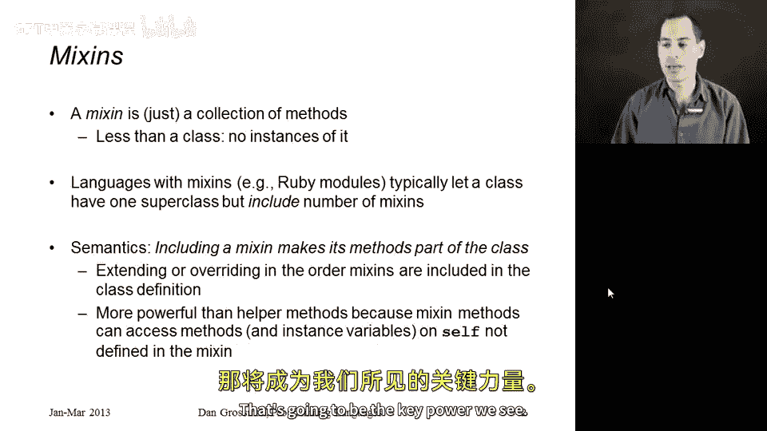
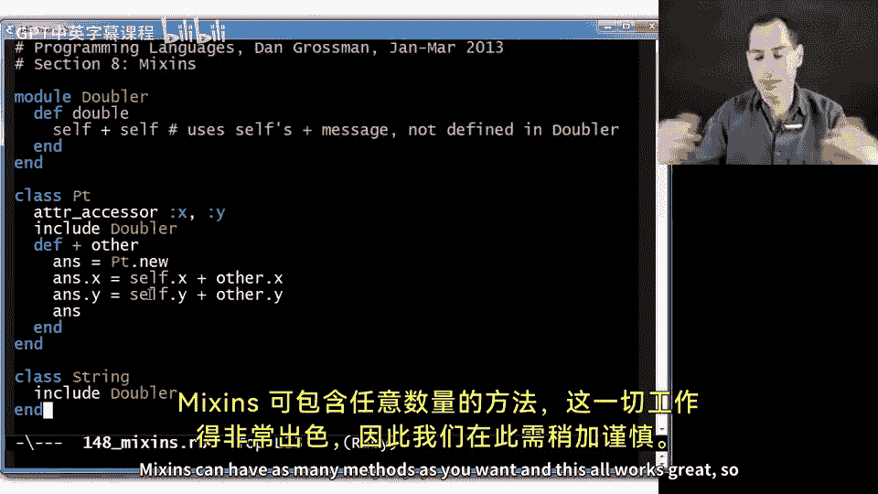
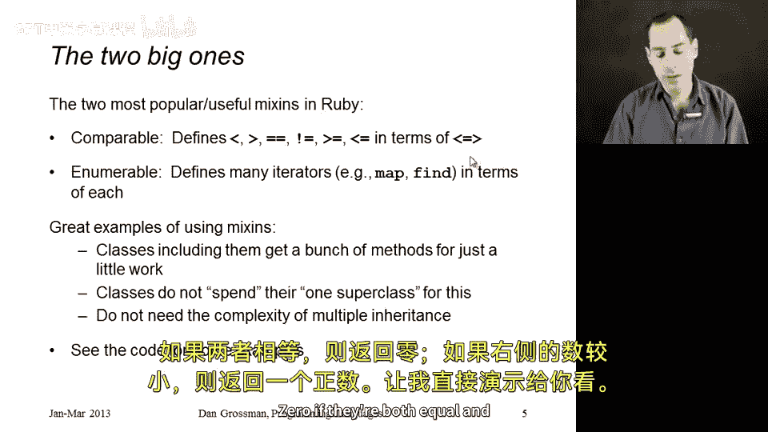
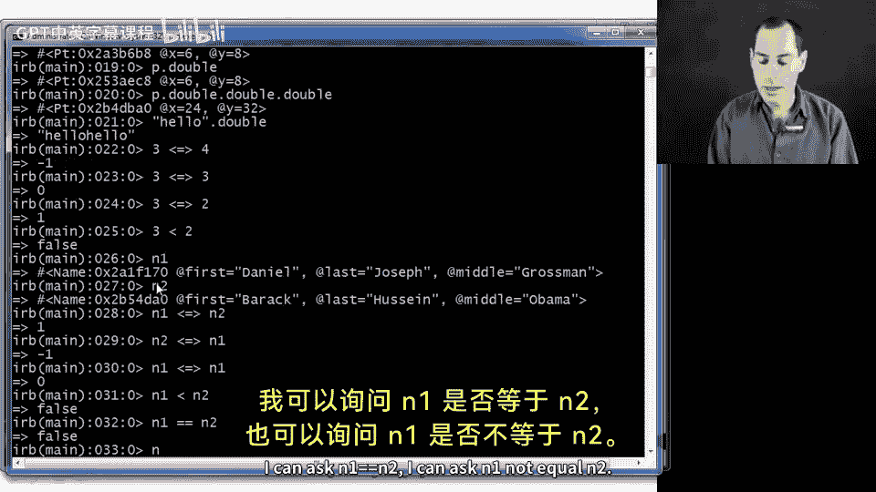
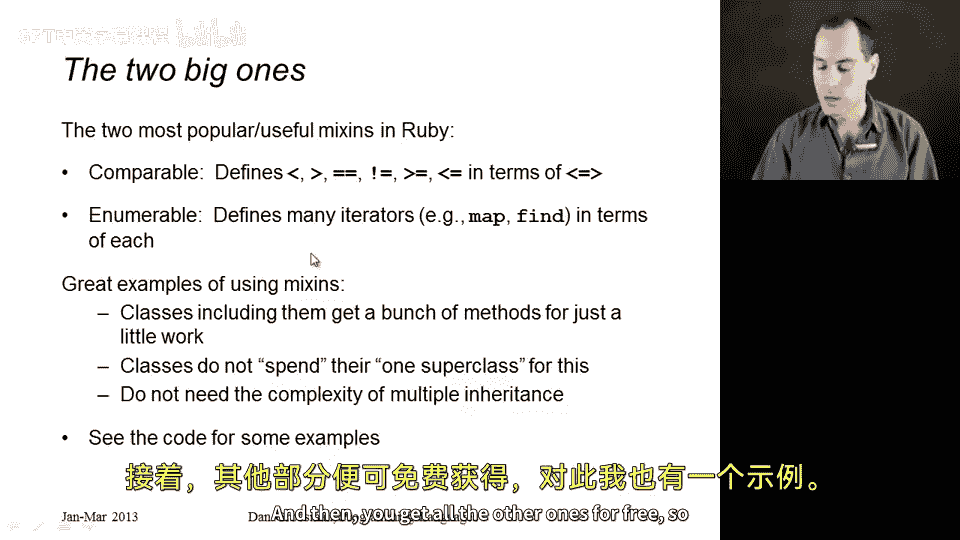
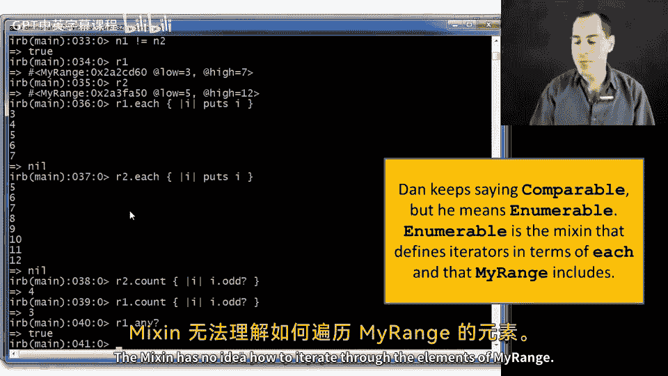
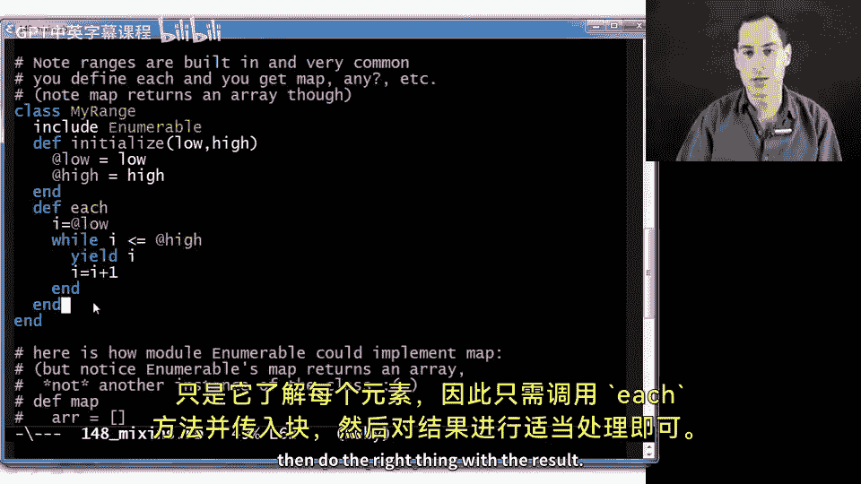
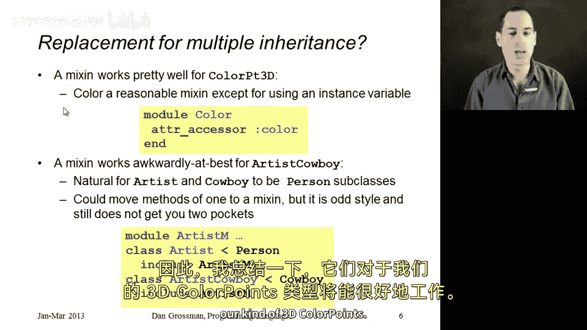
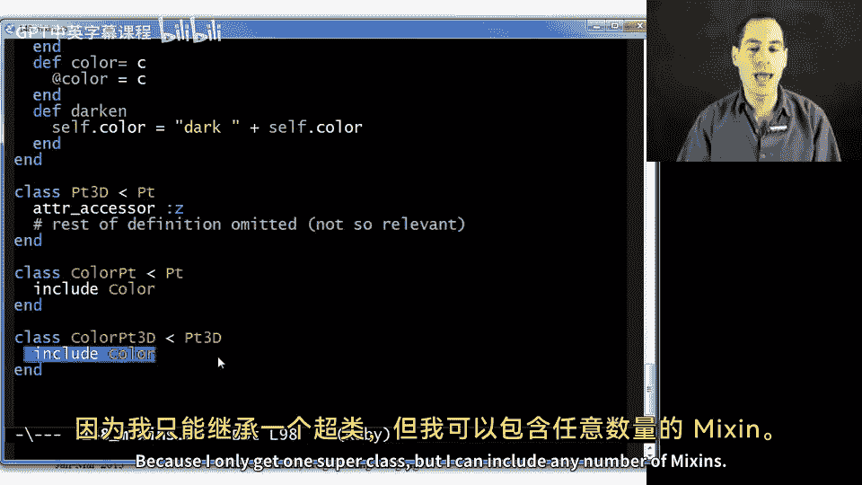
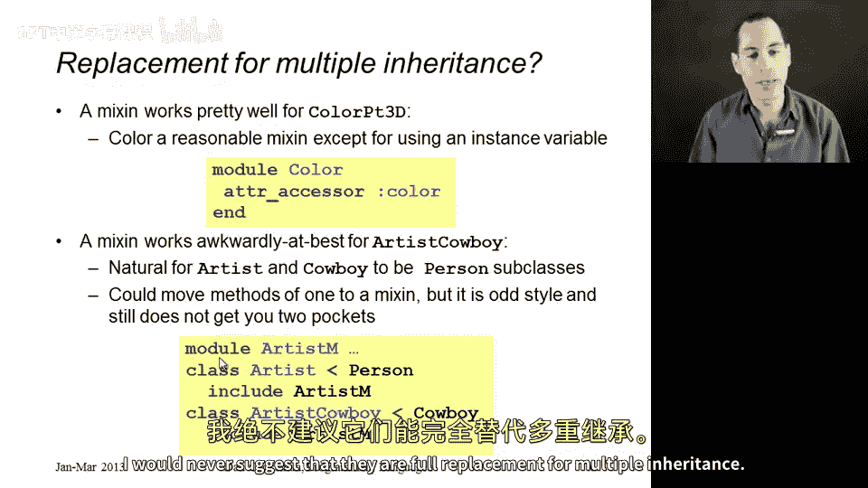

# Ruby编程：第28章：Mixins详解 🧩

在本节课中，我们将要学习Ruby中的Mixins。这是一种优雅的多重继承替代方案，与其他编程语言中的“特质”非常相似。

## 什么是Mixins？ 🤔

上一节我们介绍了Mixins的基本概念，本节中我们来看看它的具体定义。

Mixin是一个**方法集合**，且仅包含方法。它不是类，无法实例化，也不能通过`new`调用获取其实例。它只是一组方法定义。

那么如何使用Mixin呢？在类定义中，你可以包含任意数量的Mixins。你仍然可以拥有一个超类，继承其方法，同时也可以包含Mixins，从而获得它们的所有方法。这就像你通过包含Mixin，手动输入了相同的方法定义，从而避免了复制粘贴。实际上，当你包含一个Mixin时，它只是向某个类添加方法定义。



这种方式允许你用这些方法扩展你的类定义。通过包含一个Mixin，你甚至可以覆盖超类中定义的方法。这非常强大。我们将看到的关键原因是，包含在类中的这些Mixin方法可以使用`self`。它们作为类定义的一部分，可以调用你在类中定义的其他方法，这正是其核心威力所在。

## 一个简单示例 🔧

现在我们已经了解了Mixins是什么，让我们通过一个简单的例子来看看它的实际应用。

在Ruby中，我们使用`module`关键字来定义Mixin。模块也支持命名空间管理，但在这里我们只将其视为Mixins使用。

以下是一个Mixin示例，我将其命名为`Doubler`，它恰好只定义了一个方法：

```ruby
module Doubler
  def double
    self + self
  end
end
```

在这个Mixin中，我们没有定义`+`方法，只定义了`double`。我们假设任何包含此Mixin的类都会定义`+`方法，然后我们将调用这个`+`方法。

我们可以定义一个类，如下所示：

```ruby
class Point
  attr_accessor :x, :y

  def initialize(x, y)
    @x = x
    @y = y
  end

  def +(other)
    Point.new(@x + other.x, @y + other.y)
  end

  include Doubler
end
```



通过包含`Doubler`，这个类现在拥有了`double`方法。当我们调用它时，该方法会调用`+`方法。

例如，如果我们创建一个点`p = Point.new(3, 4)`，那么`p.double`将返回一个新的点，其坐标为`(6, 8)`。

我们也可以将这个Mixin包含到现有的类中，例如`String`类：

```ruby
class String
  include Doubler
end
```

现在，字符串`"hello".double`将返回`"hellohello"`。你可以包含任意多的Mixins，它们也可以包含任意多的方法。

## 方法查找规则与注意事项 ⚠️

了解了Mixins的基本用法后，我们需要谨慎对待方法查找规则，因为现在我们有更多方式向类添加方法。

Ruby有一套明确的规则来查找方法`M`。如果多个Mixin定义了同名方法，或者Mixin和类都定义了它，该如何处理？以下是规则：

1.  首先在对象的类中查找。
2.  然后在该类包含的任何Mixins中查找。
3.  接着在超类中查找。
4.  最后在超类包含的任何Mixins中查找，依此类推。

检查顺序是：先类定义，后Mixins。并且，Mixins的检查顺序是后包含的会覆盖先包含的。

关于实例变量，Mixin方法可以获取或设置实例变量，但这些变量属于常规类的一部分。如果来自两个不同Mixin的方法都试图使用同一个实例变量，它们可能会相互干扰。因此，许多人认为Mixin方法以任何方式访问实例变量是一种不良风格。然而，在某些情况下，这可能是你需要或想要做的。从语义上讲，Mixin方法可以访问它们所属对象的实例变量。

## 强大的内置Mixins：Comparable 🚀



现在我们已经了解了Mixins的基本规则，让我们看看Ruby中广受喜爱的两个内置Mixin。首先是`Comparable`。

`Comparable` Mixin定义了`<`、`>`、`==`、`!=`、`>=`、`<=`等方法。它假设任何包含它的类只定义一样东西：**三向比较运算符**（`<=>`），有时也称为“太空船运算符”。

太空船运算符接受两个参数，如果左边的小于右边的则返回负数，相等则返回0，如果右边的小于左边的则返回正数。

例如，在数字上：`3 <=> 4` 返回 `-1`，`3 <=> 3` 返回 `0`，`3 <=> 2` 返回 `1`。

实际上，当你在数字上调用`3 < 2`返回`false`时，这是由`Comparable` Mixin通过定义`<`来调用太空船运算符实现的。它所做的就是定义`<`来调用`<=>`，然后检查结果是否小于0。

让我们为自己的类实现这个功能：

```ruby
class Name
  attr_accessor :first, :middle, :last

  def initialize(first, last, middle)
    @first = first
    @last = last
    @middle = middle
  end

  def <=>(other)
    # 比较逻辑：先比较姓，再比较名，最后比较中间名
    last_cmp = @last <=> other.last
    return last_cmp unless last_cmp == 0

    first_cmp = @first <=> other.first
    return first_cmp unless first_cmp == 0

    @middle <=> other.middle
  end

  include Comparable
end
```

通过这一行`include Comparable`，我们免费获得了所有其他比较运算符（`==`、`!=`、`<`等），因为它们都通过调用我们定义的`<=>`运算符来实现。这就是Mixins的强大之处。



## 另一个核心Mixin：Enumerable 🔄

接下来，让我们看看另一个我认为更酷的核心Mixin：`Enumerable`。

`Enumerable`定义了许多迭代器和高阶方法（如`map`、`select`、`count`等），它们都以`each`为基础。作为包含`Enumerable`的类实现者，你只需要定义`each`方法，然后就可以免费获得所有其他方法。

我也有一个示例。我定义了自己的小`Range`类（当然，实际中不需要，因为Ruby内置了完善的`Range`）：



```ruby
class MyRange
  include Enumerable

  def initialize(low, high)
    @low = low
    @high = high
  end

  def each
    i = @low
    while i <= @high
      yield i
      i += 1
    end
  end
end
```

因为我定义了`each`，所以我可以使用所有其他迭代器。例如，`count`是在`Enumerable` Mixin中定义的。我可以计算范围内有多少个奇数：

```ruby
r1 = MyRange.new(3, 7)
r1.count { |x| x.odd? } # 返回 3 (3, 5, 7)
```

我还可以使用`map`、`any?`等方法。它们都由`Enumerable`定义，并且都基于`each`实现。Mixin除了知道不断调用`each`并向其传递代码块外，并不知道如何遍历我的范围元素，然后它们会对结果进行正确处理。





## Mixins的适用场景与限制 ⚖️

通过前面的例子，我们看到了Mixins的强大。但最后需要总结的是，它们并非多重继承的完全替代品。



对于像“3D彩色点”这样的例子，Mixins工作得很好。我可以定义一个`Color` Mixin，然后让`ColorPoint`继承`Point`并包含`Color`，让`ColorPoint3D`继承`Point3D`并包含`Color`。这样一切都能正常工作，`ColorPoint3D`将拥有我期望的所有方法和行为。因为我只能有一个超类，但可以包含任意数量的Mixins。

然而，对于“艺术家牛仔”这种场景，Mixins就不那么适用了。如果我想要一个“艺术家牛仔”，它应该拥有艺术家的一切和牛仔的一切。但将“艺术家”或“牛仔”定义为Mixin并不合理。`Color`作为Mixin或许可以，但“艺术家”和“牛仔”都应该真正是类。如果它们都是类，你就无法同时从两者继承。

## 总结 📝



本节课中我们一起学习了Ruby中的Mixins。我们了解到：

*   **Mixins是什么**：它们是方法集合，用于向类添加功能，是多继承的一种优雅替代。
*   **如何使用**：通过`module`定义，在类中使用`include`包含。
*   **方法查找规则**：遵循类 -> Mixins -> 超类 -> 超类的Mixins的顺序，后包含的覆盖先包含的。
*   **强大的内置Mixins**：
    *   `Comparable`：只需定义`<=>`运算符，即可免费获得全套比较方法。
    *   `Enumerable`：只需定义`each`方法，即可免费获得大量迭代和高阶方法。
*   **优势与局限**：Mixins非常强大和灵活，可以避免代码重复并优雅地扩展类功能。但它们并非多重继承的完全体，在需要从多个“完整类”（而不仅仅是方法集合）继承的场景下存在限制。



总而言之，Ruby的Mixins是一项非常巧妙的功能，极大地提升了代码的复用性和可读性。