# 【编程语言 A⧸B⧸C CSE341 Coursera】华盛顿大学—中英字幕 p17 16_06_functions-formally -BV1bw4m1D7MM_p17-

In our last segment， we learned how to define functions like the functions PA and cube that you see here that we wrote。

 and we learned how to call functions like you see at the bottom with cube before。

 and you see in the bodies of cube where we called PA and in PA， where we called PA。

 So we got a sense of how to write these things。 But I want to take a more formal look because one of the things that I'm trying to teach you is how to give precise understanding to what constructs in a programming language mean So let's just jump in and look first at that function binding when you define a function。

 What's the syntax。 What are the type checking rules and what are the evaluation rules so the syntax in general is the keyword fun F UN。

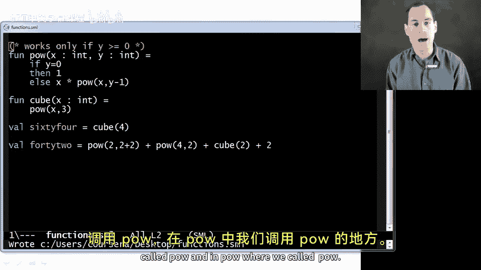

Then a variable which will be the name of the function， Then the list of arguments。

 which for now will have the variable name， colon type separated by commas， inside parentheses。

 then the equal character， and then in expression， any expression you want as deeply nested as you want with all sorts of subexpressions。

 and that E is what we call the function body。Let me do evaluation rules next because this is so simple it may seem strange。

A function is already a value。 When we have a function binding。

 we add x 0 to our dynamic environment so that later expressions can call that function。

 And that's all we do。 We don't evaluate that function body until we call the function。

 And that's a different language construct will' do next。 So takeaway message。

 A function is already a value。😊，Alright， type checking is not as simple。

 So let's think about how this works。 Allright， the end result of type checking a function body。

 So we're gonna take that function name called x 0 here on the slide。

 and we're going to add it to the static environment with the type takes arguments。 T 1， T 2。

 T 3 up to T N。 and returns a T。 And you see the function index here with T1 star separated arguments by star。

 and then an arrow for the T。 If the function binding type checks appropriately。

 And here's how we type check that function body。Basically。

 we type check E using everything that was already in the static environment because E can use any earlier bindings。

And it gets to use the argument so it knows x1 has type T1， x2 has type T2， and so on。

And since we allowed functions to be recursive， x 0。Can be used in E。

 It is in the static environment， and it has the type of the function overall。

That last one might seem a little bit magical since the typehier has to figure out the type of x0。

 but we'll learn later in the course that it's not so magical。

 it's just one of the neat things that ML can do that for us。Allright。

 so let's go into a little bit more detail on the type checking here。

 so we do have this new kind of type， T1 star for all the arguments， then the arrow and the T。

 so that's the result type of the function over on the right。

The overall type checking result is to give x0 this type。And those arguments， X1 and x2。

 those variable names， those are not added to the static environment for after this binding。

 They're only in the static environment for the body of the function。

 That's probably not too surprising。 That's how methods work in Java or functions or methods in Python or anything else。

 Those arguments are only in scope or only in the static environment for E。

 not for the code after this function definition。系。Next。

 because the evaluation of a call to x0 is going to return the result of E。

That type that is the return type for the function。 T is the type that E has。

 So what the type checker does is it type check E。 It gets some type。

 And then that's the return type for x 0。 And as I already match mentioned。

 this is a little bit magical。 since we never wrote down T。

 The type checker is just able to figure it out。 And we'll have to discuss later in the course how it's able to figure it out。

Okay， so those are function bindings， how we define functions。

 It turns out we added another construct to our language， and that's calling a function， using it。

 And so those function calls also have a syntax， type checking and evaluation rules。

 So let's go through those。

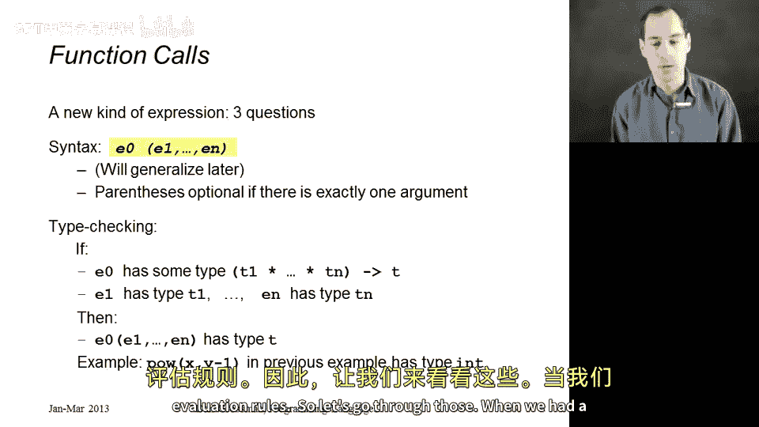

When we had a function call， let me show you here in the code， so something like PAu X y minus1。

 or here's another function call or here's one， or here's one， there's a couple more， all right。

 the way we always wrote those is with one expression which is what function we want to call and then some other expressions in parentheses and separated by commas and those are the arguments we're calling the function with。

 so when we had something like PAu of two and 2 plus2。

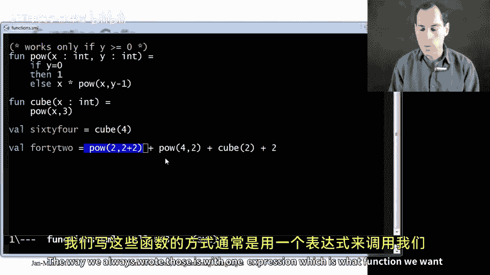

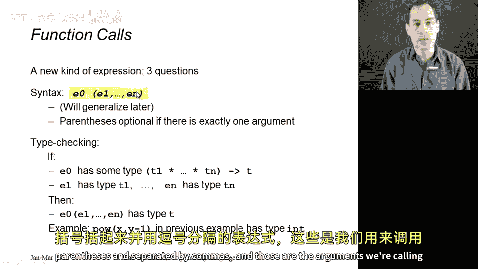

The first expression pal will look that up in the dynamic environment to get a function。

 And then these other arguments will evaluate。 and those will be the arguments of the function。

 But that's getting ahead to evaluation rules。 Stactically， it's just expression。

 and then more expressions in parentheses separated by commas。

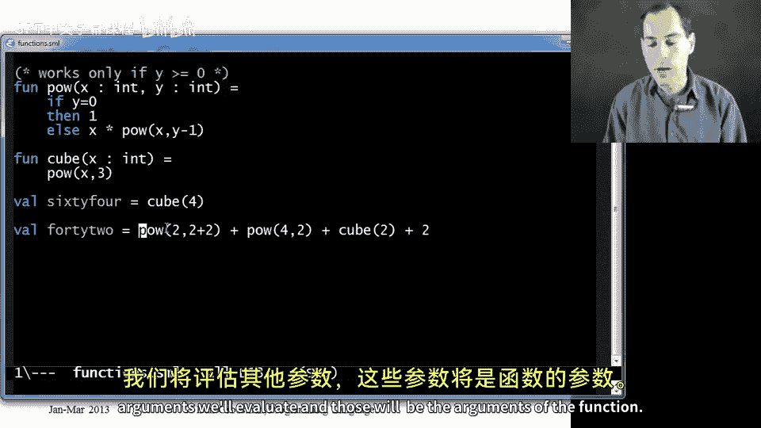

You don't need the parentheses if there's exactly one argument。

 but if there's zero or two or three or four， then you do。That's the syntax type checking。

 how do you type check a function call， Well rule number one， E0 better have a function type。

 it better have a type that has that arrow in the middle with the arguments on the left and the result on the right。

Assuming it does， then we type check all of the other expressions， E1 up through EN。

 there better be the right number of them for the function that we're calling。

 and each one better have the right type for the function that we're calling。And if that's all true。

 then the result of the function call is the result type of E0。 So it would have type T。

 as indicated here on the slide。So that's why when we had something like pu of x comma y minus1 in that recursive function。

 it ended up having type in and let's see why here， because we have this call here。

 so we look up PO and P itself has type。

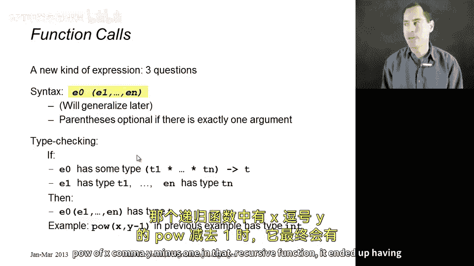

Int star andt arrow int。So fortunately， we're calling it with two arguments。And when we type check X。

 we look it up in the static environment， which here in the function body has type int。

 then we have to type check y-1， which similar we have type in because we can look up y and then subtraction takes two ins。

 So the call type checks and then the result of the call will have type int because that is indeed the result type of the function we're calling。

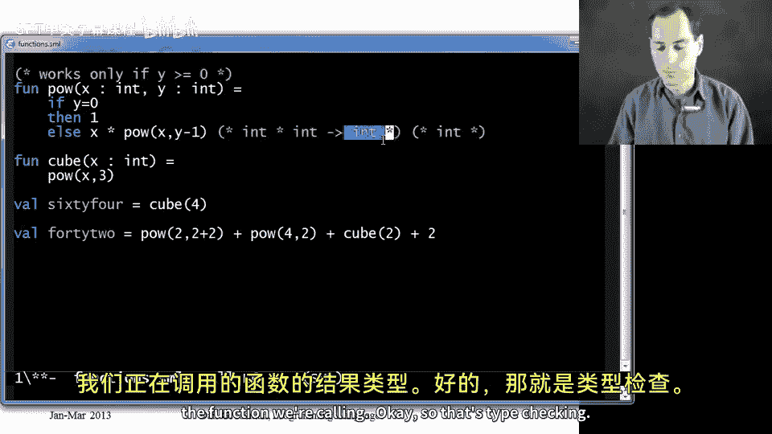

Okay， so that's type checking。 Evaluation rules are also interesting for a function call。

 So here's what we do。 There's really three steps to evaluating a function call。 First。

 evaluate E0 to figure out what function you're going to call。 So if you're going to call Pwell。

 you're going to look up how in the dynamic environment。

 you're going to find the right function binding。Second。

 you're going to evaluate all of the arguments。 E1 up through E。 So you're going to get values。

 So when we had something over here like p of2 and 2 plus 2。

 we looked up power to get a function binding， then  two is already a value。

 Then we go ahead and eagerly evaluate 2 plus 2 to4。 So the body when we call power。

 it's only going to see a4。 It's going to have no idea how we got that for as the result of an addition So that step 2。

 and then step 3 is to actually evaluate the function body Now how are we going to evaluate that function body like the body of p We're going to extend the dynamic environment that was there back when we defined the function with x values for the arguments。

 So x will be two and y will be4。 in general are the n arguments to our function x1 x2 up through xN end up with the being bound to the values for this call the first value argument。

 the second value the third value argument。

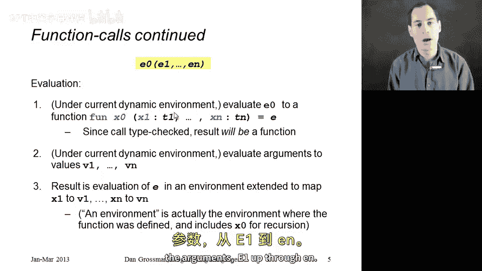

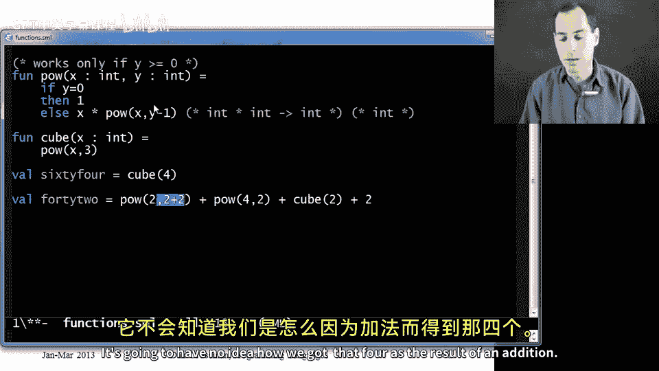

And lastly。Inside that function body， any recursive calls are bound to the function itself。

 and so that's why when we do something like call PAO with  two and 4。

 we end up evaluating this function body in a dynamic environment where x is bound to2 y is bound to4 and pO is bound to the function itself。

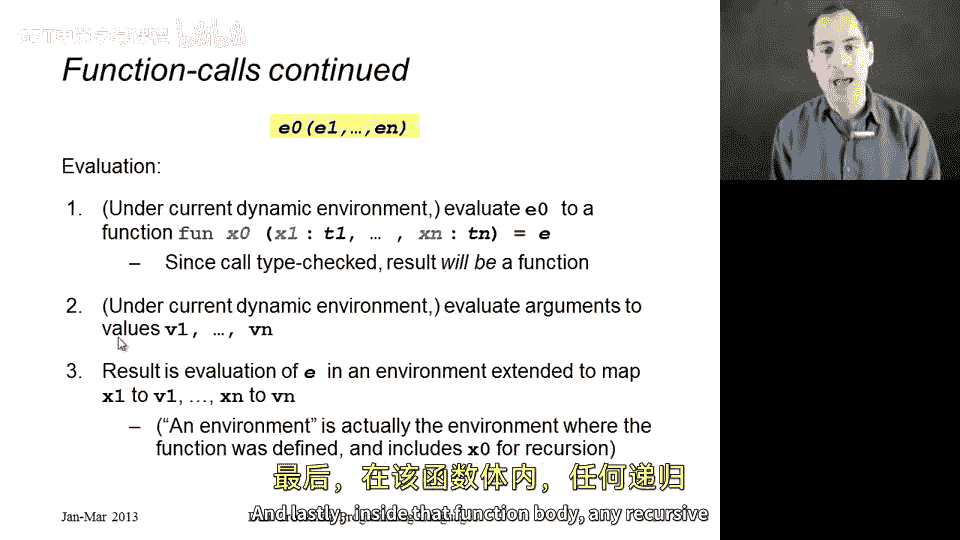

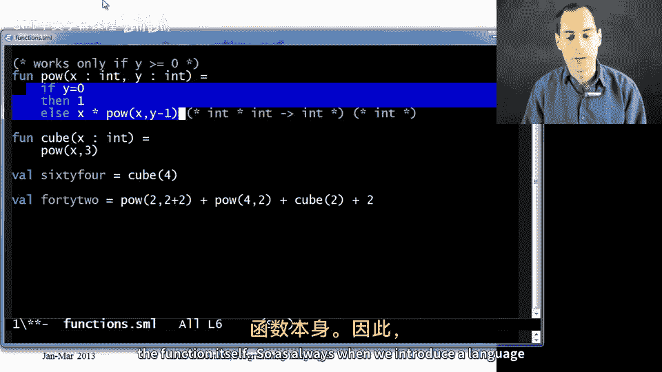

So as always， when we introduce a language concept， no matter how simple or how complicated。

 we can understand it completely with syntax， type checking rules， and evaluation rules。

 and that's functions。

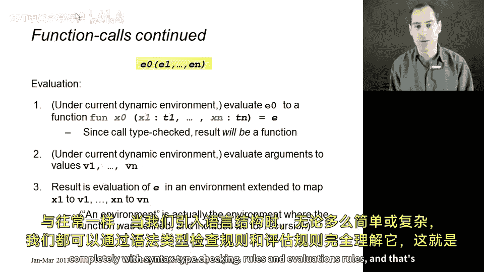