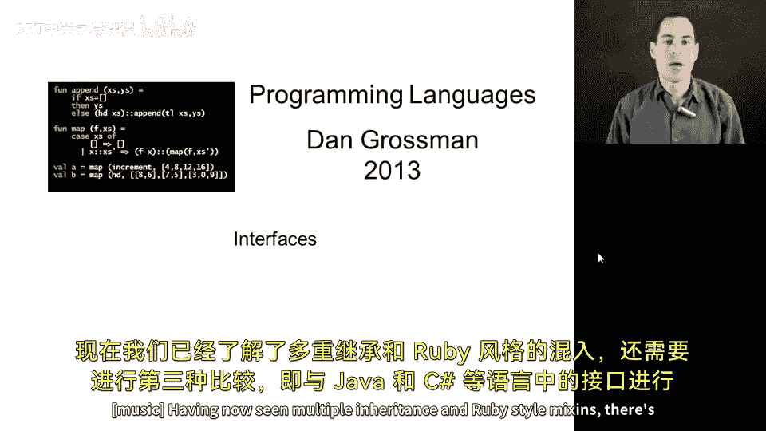
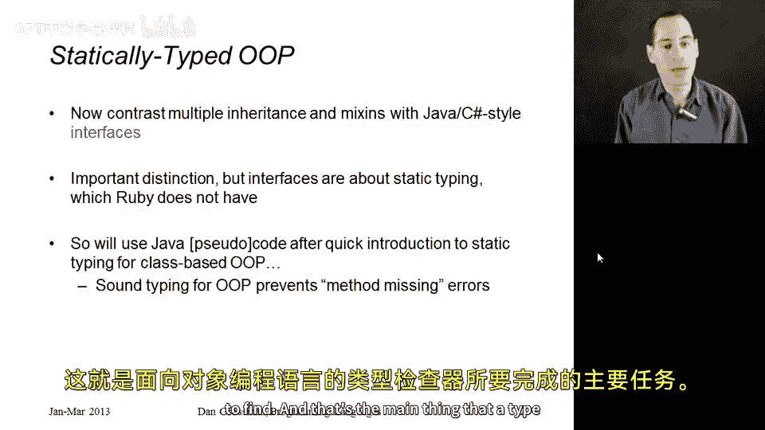
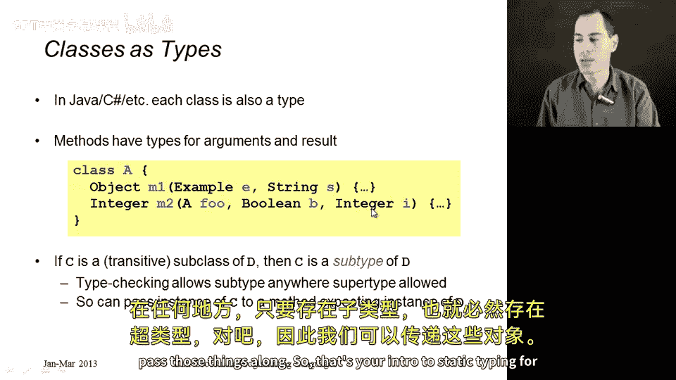
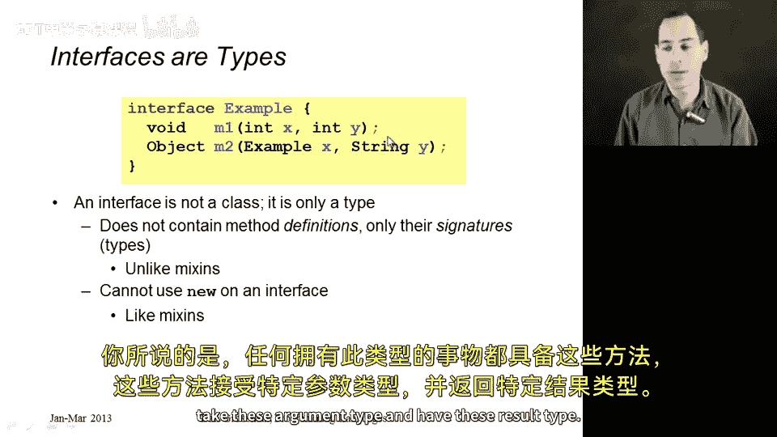
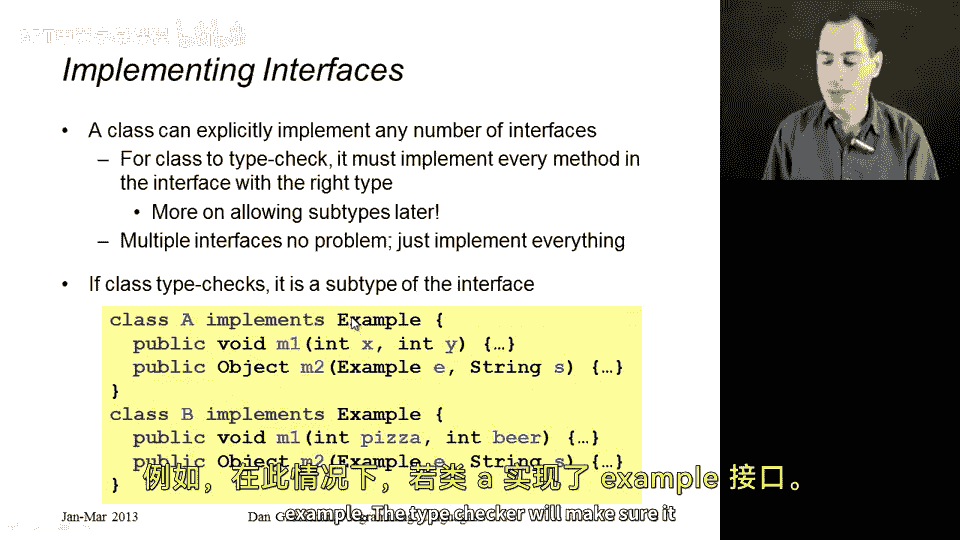
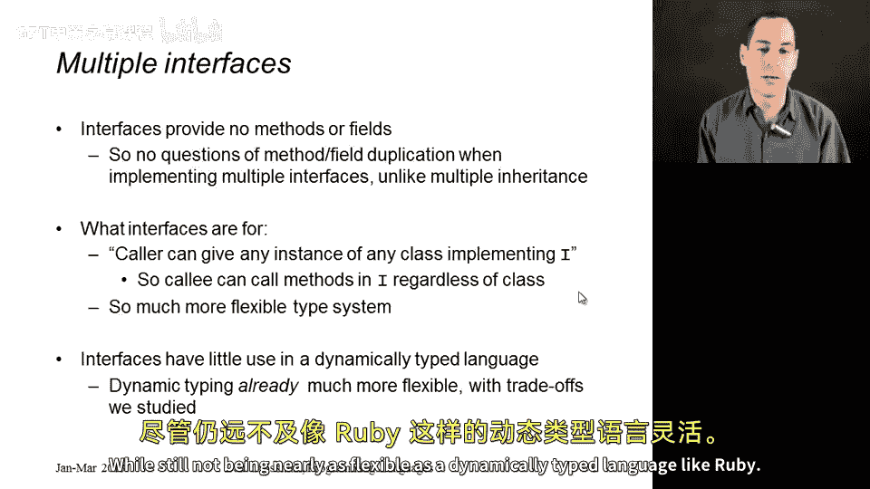

# 【编程语言 A⧸B⧸C CSE341 Coursera】华盛顿大学—中英字幕 p170 29_08_interfaces -BV1bw4m1D7MM_p170-

Having now seen multiple inheritance and Ruy style mixins。

 there's a third comparison we need to make which are is with interfaces as you see in languages like Java and C sharpp。

 This is an important distinction， even though interfaces are really about static typing and Ruby doesn't have static typing。

 but Ruby also doesn't have multiple inheritance， we can learn concepts even if we're not using a language that happens to have that concept。

 So since interfaces really don't make sense in Ruby， I will use Java code in this segment。

 but I'll explain what's going on and it shouldn't be any trouble even if you haven't seen Java before。

 but we do need to take a step back and say wait a minute， static typing， we've only seen that for M。

 what is static typing mean for objectoriented programming。 Well。

 it turns out what we're typically trying to prevent is a method missing error。

 We want to use our type system to make sure that we only pass around objects so that when we call methods on those objects。

 they actually have those methods defined。 and that's the main。

That a type checker for an OO language would do。So how does this work in languages like Java and CSharp。

 well each class that you define also introduces a type。

 just like when we add a data type binding and a meta type， every class in Java is also a type。

And when we declare methods， they have argument types and result types。

 just like functions in ML have argument types and result types。 So for example， here in Java syntax。

 I'm defining a class A and has two methods M1 and M2。

 I've omitted their bodies that's here in the dot dot dot because I don't care about the bodies of these methods those would be type checkedck what I care about is saying that M1 takes two arguments in E of type example and in S of type string and it returns we put the return type over here on the left。

 something of type object Similarlyly， class A defines a method M2 that takes three arguments。

 one of type A one of type Boolean one of type integer and returns an integer。

Now the interesting thing is how subtyping works in these languages， so we know subclassing right。

 we could have a class C that you know is a subclass of D， turns out that when you do that。

 you also are a subtype， in fact， no matter even if you're a transitive subclass。

 like we studied with multiple inheritance， you're still a subtype of the type for the superclass。

Now， the way type checking works is you can always use a subtype of what's actually asked for。

 So if you have something that is a subtype of A， you can pass that thing for the first argument to A M2。

 Similarly， if you have a subtype of Boolean， you can pass that for the second argument。

 subtype of integer for the third argument anywhere you have something in the subtype。

 it also has the supertype so we can pass those things along。

So that's your intro to static typing for OOP。 Now， what are interfaces。Interfaces are also types。

 but they are not classes。 So every class also introduces a type。 Every interface introduces a type。

 but just like Ruby mixs， you cannot create objects of interfaces。Unlike a mix in。

You can't put method definitions in an interface either。Instead。

 the only thing you put in an interface is that a method exists。

 These are its types of its arguments， and this is the type of its result。 So， for example。

 this interface。You know， example here has two methods M1 and M2。

 M1 takes in two ins and returns a void M2 takes an example in a string and returns an object。

 whatever types you want。 Ive highlighted in red here， the semicolon。 There's no method body here。

 You're just saying anything that has this type has these methods and the methods take these argument types and have this result type。

So now what a class can do is implement an interface。So in Ruby， we can have one superclass。

 we can include any number of mixs。In Java and C Sha， you can have one super class。

 and you can implement any number of interfaces。 If you say you implement an interface。

 then you better implement it。 You better define either explicitly or through inheritance。

 every method that that interface requires and you better do so with the correct types。In that sense。

 having multiple interfaces that you implement is no problem。

 you just have to provide all the methods that all of them require you to do so。

And then if your class definition does implement an interface。

 then the type for that class is a subtype of the interface type。So for example， here。

 if class A implements example， the type checker will make sure it actually does。

 and then since it does。

In the rest of the program， anywhere we need something of type example。

 we can instead pass something of type A。 and that gives us the flexibility to treat instances of a as things that have type example and another class could implement example as well。

 And then if you have some code somewhere like the body of M2 that takes an example。

 it does not know whether it's being given an instance of a or an instance of B or an instance of any other class that implements example。

 but it does know that whatever is bound to this variable E has a method has all the methods that the example interface requires and they take things of the correct types。

So interfaces provide no methods， they provide no fields。

 so all the complications that we had for multiple inheritants are not relevant。

They don't give you anything。If a class implements an interface。

 all it gives you is more obligations， things you have to do。😡。

What they are for is to produce a more flexible type system that you can now define methods that take some argument of type I or I is some interface and then pass into that method。

 anything that implements that interface。 you can also have fields like Ruby's instance variables whose types are interfaces instead of classes。

 they are types that tell you what things of that type have in terms of methods so。

What is going on here is Java with interfaces has a much more flexible type system than Java without interfaces。

 It lets us take two different classes in our program， have them both implement the same interface。

 and then we can pass instances of either class anywhere we just need something with the interface type。

 so they provide a lot of type system flexibility to Java。😊，But that's really all they provide。

 So in a dynamically typed language like Ruby， you're never going to have interfaces。

 I would never expect them to be added because you don't have a type system you're trying to make flexible。

 You already have a dynamically typed language， which is way more flexible than even Java with interfaces。

 So dynamic typing versus static typing is something we studied。

 We know dynamic typing is more flexible。 Sta typing is less flexible in many ways。

 when through all those advantages and disadvantages。

 The key idea of interfaces is to start with a statically typed OopP language and then make the type system more powerful while still not being nearly as flexible as a dynamically typed language like Ruby。

😊。

