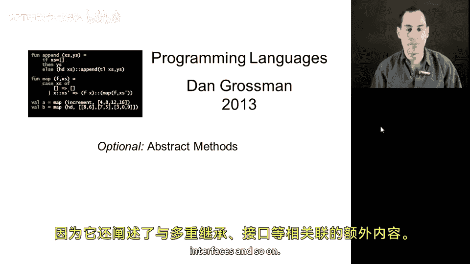
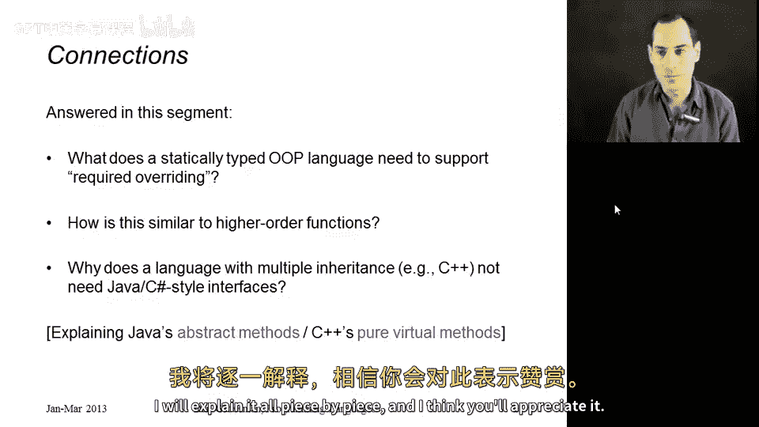
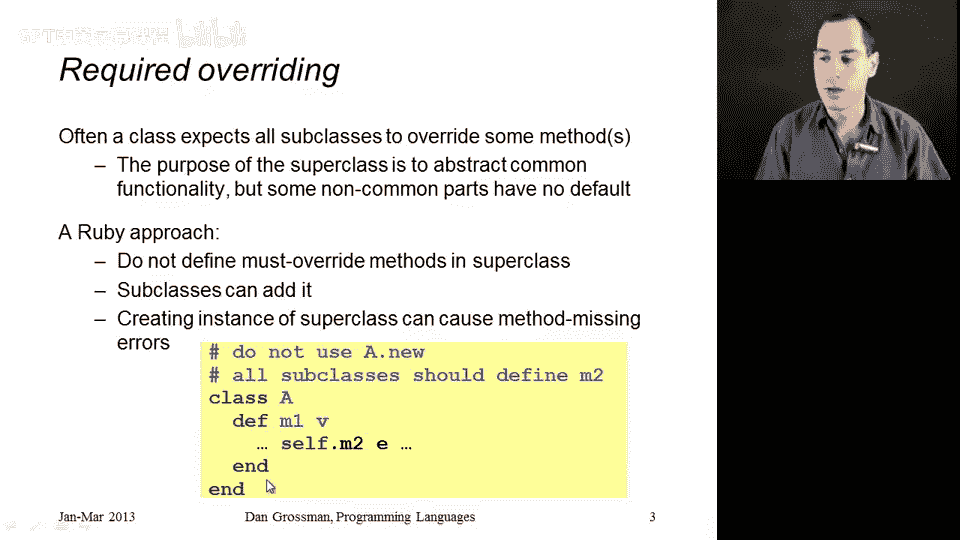
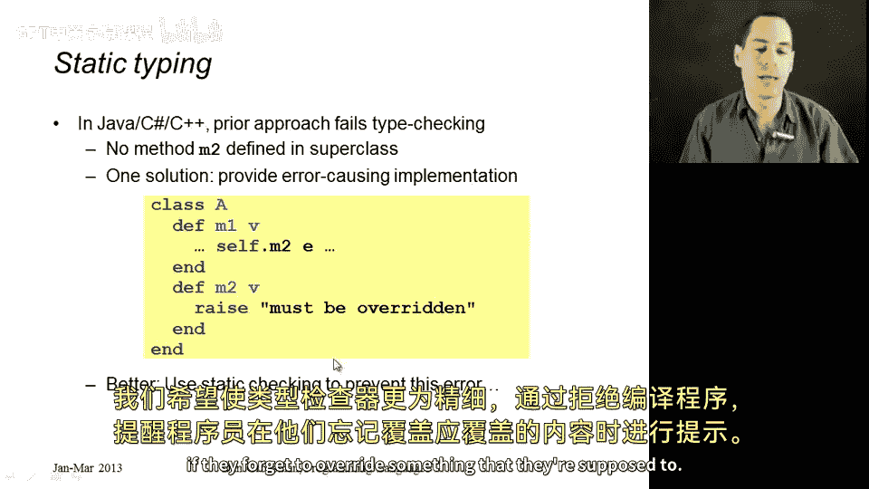
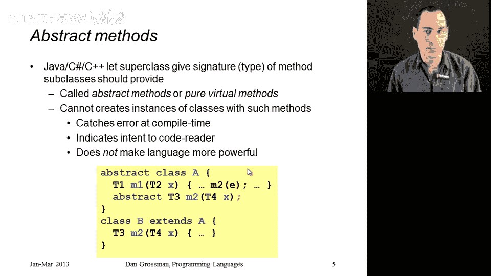
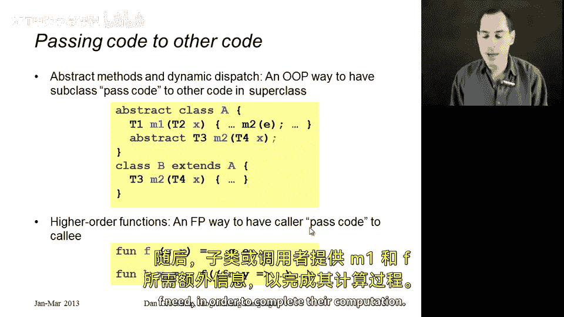
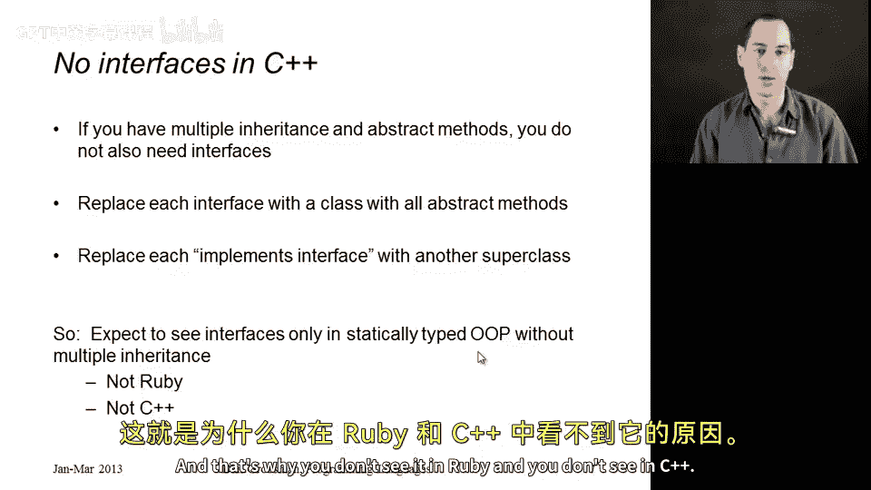

# 面向对象编程：第30章：可选抽象方法 🧩



在本节课中，我们将要学习面向对象编程中的一个高级概念：抽象方法（在Java和C#中称为抽象方法，在C++中称为纯虚方法）。我们将探讨为何静态类型语言需要这一特性，它如何帮助我们在编译时捕获错误，以及它与高阶函数之间的有趣联系。最后，我们还会解释为何像C++这样的语言不需要单独的“接口”概念。

---



## 抽象方法的核心概念

上一节我们介绍了动态类型语言（如Ruby）中方法重写的灵活性。本节中我们来看看在静态类型语言中，如何强制子类必须实现某些方法。

在面向对象设计中，经常会出现这样的情况：一个超类包含了许多对多个子类都有用的通用代码和实例变量，但其中某些部分（例如，图形对象的大小）没有合理的默认值。超类希望并要求所有子类必须覆盖这些方法。

在Ruby这样的动态语言中，我们只能通过注释来提醒程序员。但在静态类型语言（如Java、C#、C++）中，我们希望类型检查器能在编译时就确保子类实现了必要的方法，从而避免运行时错误。



这就是**抽象方法**（或**纯虚方法**）的设计初衷。它允许我们在超类中声明一个方法的**类型签名**（返回类型和参数类型），但不提供具体实现。这会产生两个效果：
1.  无法创建该超类的实例。
2.  任何**可被实例化**的子类都必须按照声明的签名实现该方法。

以下是在Java中声明抽象方法的示例：
```java
abstract class A {
    abstract int m2(int x); // 只有声明，没有方法体
    void m1() {
        int result = this.m2(5); // 调用抽象方法
    }
}
```
通过这种方式，我们获得了额外的编译时检查，可以在程序运行前就捕获“忘记实现必要方法”这类错误。抽象方法本身并没有增加语言的表达能力，它主要是一种提升代码安全性和可读性的工具。



---

## 抽象方法与高阶函数的联系

抽象方法和高阶函数表面上看似乎关联不大，但它们本质上都是**向其他代码传递代码**的机制。

*   **抽象方法**是面向对象的方式。超类中的方法（如 `m1`）调用了一个它自己未定义的方法（`m2`）。具体的代码由子类通过重写 `m2` 来提供，并通过动态派发机制执行。
*   **高阶函数**是函数式编程的方式。一个函数（如 `F`）接收另一个函数（`G`）作为参数。`F` 并不知道 `G` 的具体实现，具体的代码由调用者传入的函数来提供。

它们的共同点是：**通用逻辑**（在 `m1` 或 `F` 中）与**可变部分**（`m2` 或 `G` 的实现）分离。在OOP中，可变部分由子类提供；在FP中，则由调用者提供。这两种模式都实现了代码复用与定制的解耦。



---

## 为何C++没有“接口”

最后，关于抽象方法还有一个重要的推论：它解释了为什么C++语言没有单独的“接口”（Interface）概念。

接口的主要作用是定义一个必须实现的方法集合，而不提供任何具体实现。在只支持单继承的语言（如Java）中，接口是让一个类拥有多种“类型”的关键机制。



然而，C++支持**多重继承**。如果一个类中的所有方法都是**纯虚方法**（即抽象方法），那么这个类本身不包含任何可执行代码，其作用就完全等同于一个接口。其他类可以通过继承这个“全抽象”的类来承诺实现所有方法，从而获得相应的类型。

因此，**接口**这种语言特性通常只出现在**同时满足**“静态类型检查”和“只支持单继承”这两个条件的语言中。这就是为什么你在动态类型的Ruby中没有接口，在支持多重继承的C++中也不需要专门的接口语法。

---



本节课中我们一起学习了抽象方法（纯虚方法）的概念。我们明白了它是静态类型OOP语言用于强制子类实现特定方法、并在编译时进行检查的机制。我们看到了它与高阶函数在“代码传递”思想上的相似之处。最后，我们也理解了在支持多重继承的语言中，抽象类可以完全替代接口的角色。掌握这些概念有助于你更深入地理解不同编程范式的设计思想与实现方式。