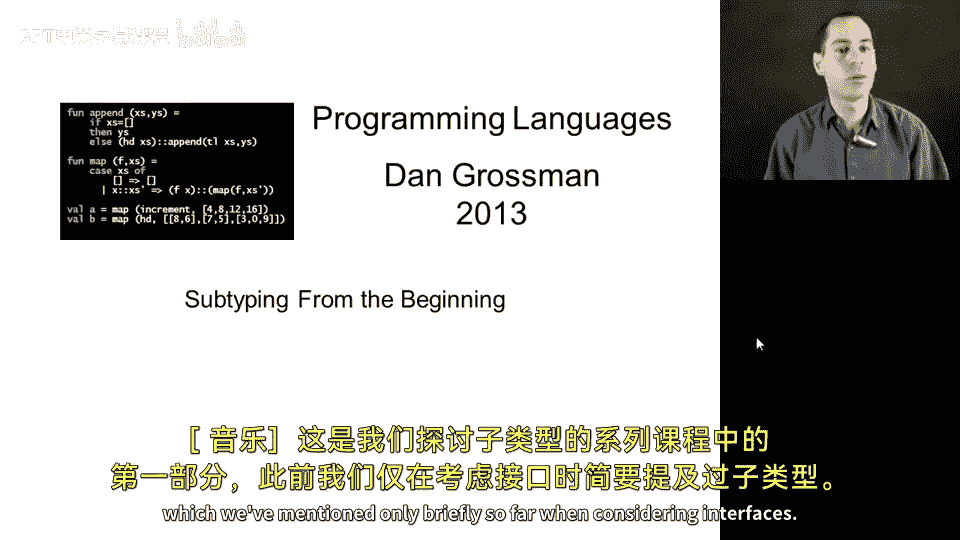
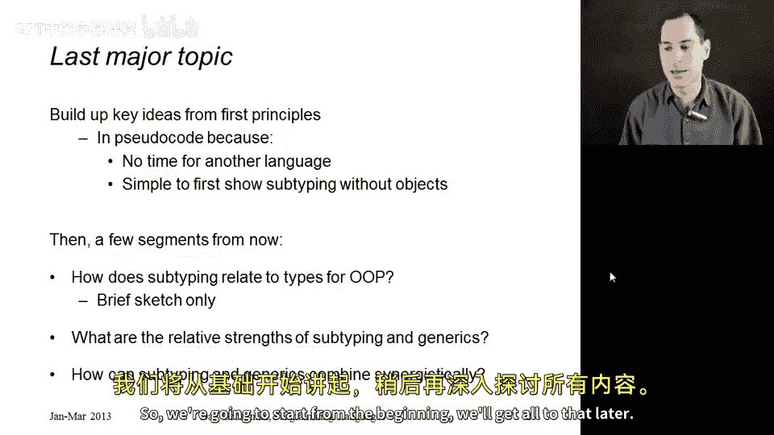
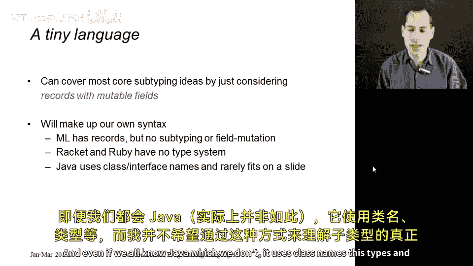
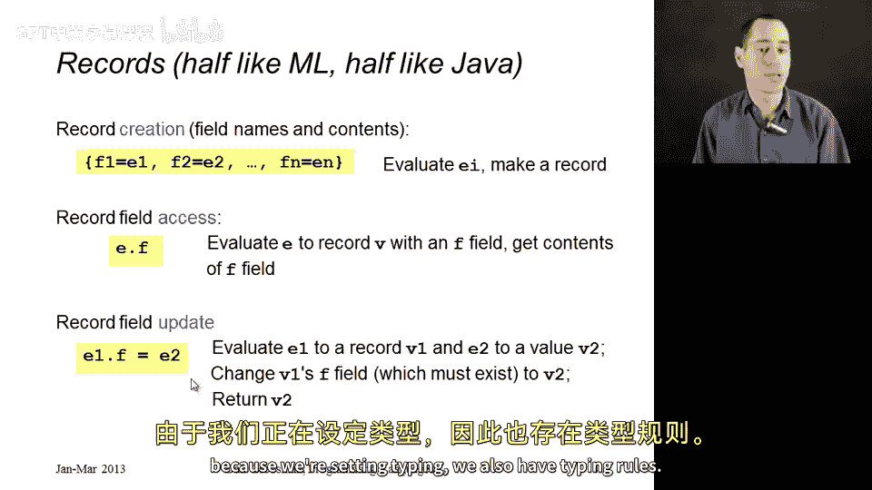
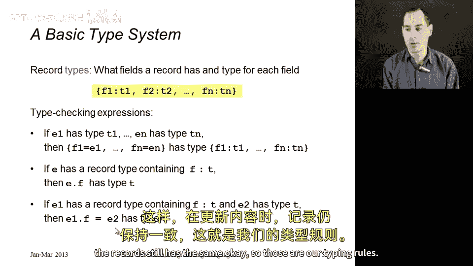
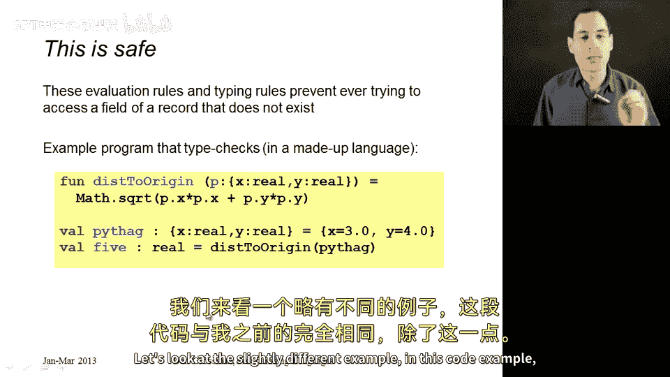
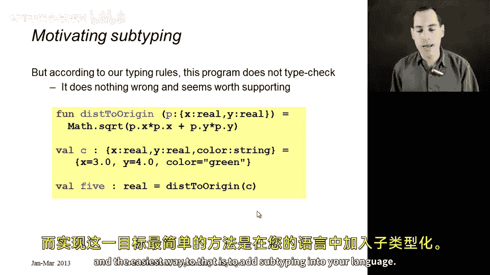
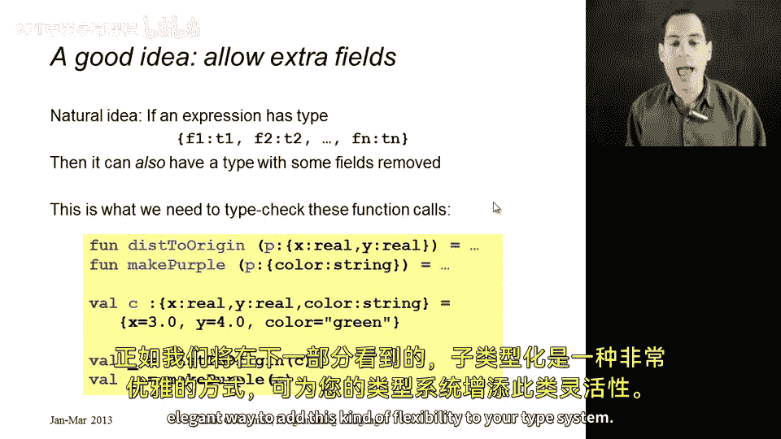

# 编程语言 A/B/C CSE341 Coursera：31：子类型化入门 🧩

在本节课中，我们将学习子类型化。这是我们首次系统性地探讨这一主题，它也是本课程最后一个主要知识点，将为我们构建编程语言的核心思想奠定最终基础。

我们将全程使用伪代码进行讲解，仅通过幻灯片展示。这是因为我们没有时间引入另一门编程语言，并且即使有时间，实际编程语言中的子类型化实现也远比其核心思想复杂。因此，我们将首先通过幻灯片理解子类型化的核心概念，之后再将其关联到一些重要问题上，例如静态类型面向对象编程语言如何使用子类型化，子类型化如何与我们之前在 ML 中见过的泛型和多态性相关联，以及它们如何互补。事实上，在最后，我们还将看到如何将它们结合，获得超越简单相加的效果。



我们将从头开始，逐步构建所有概念。首先，我们将通过想象一个小型语言来涵盖大部分思想，这个语言将包含函数、加法、算术等。但最关键的是，它将包含记录。记录类似于 ML 中的记录，具有字段和内容。它们很像对象，但只包含实例变量，不包含方法。并且，我们将使这些字段可变。

## 记录语法与语义 📝



我们需要定义自己的语法，因为我们学过的语言都不完全适用。ML 有记录，但没有子类型化，也没有可变字段。Ruby 是动态类型语言，而本节内容关乎静态类型。因此，我们将设计一种类似 ML 但使用点号访问语法的伪代码语言。

以下是关于记录的三种结构：

**1. 记录创建**
语法：`{f1 = e1, f2 = e2, ..., fn = en}`
语义：依次求值每个表达式 `e1` 到 `en`，返回一个记录值，其字段 `f1` 到 `fn` 分别持有对应表达式的求值结果。



**2. 字段访问**
语法：`e.f`
语义：求值表达式 `e` 得到一个记录值 `v`，假设该记录拥有字段 `f`，则检索该字段的内容。如果 `e` 不是记录或没有字段 `f`，则会发生错误。我们的类型系统将确保类型检查成功时，这种情况永远不会发生。

**3. 字段更新**
语法：`e1.f = e2`
语义：求值 `e1` 得到一个记录（该记录应拥有字段 `f`），求值 `e2` 得到一个值，然后将 `e1` 的 `f` 字段内容更新为 `e2` 的结果。

## 记录类型与类型规则 🔍

现在，我们为记录定义一种特殊的类型，并给出相应的类型检查规则。



**记录类型**
语法：`{f1: t1, f2: t2, ..., fn: tn}`
含义：该类型描述了拥有字段 `f1`（类型为 `t1`）、`f2`（类型为 `t2`）……直到 `fn`（类型为 `tn`）的记录。

以下是三个表达式的类型检查规则：

**1. 记录创建的类型规则**
如果 `e1` 具有类型 `t1`，`e2` 具有类型 `t2`，……，`en` 具有类型 `tn`，那么记录创建表达式 `{f1 = e1, f2 = e2, ..., fn = en}` 就具有类型 `{f1: t1, f2: t2, ..., fn: tn}`。

**2. 字段访问的类型规则**
如果表达式 `e` 具有记录类型 `{..., f: t, ...}`（即该类型包含字段 `f`，其类型为 `t`），那么字段访问表达式 `e.f` 就具有类型 `t`。

**3. 字段更新的类型规则**
如果表达式 `e1` 具有记录类型 `{..., f: t, ...}`，并且表达式 `e2` 具有类型 `t`，那么字段更新表达式 `e1.f = e2` 就具有类型 `t`（通常返回 `e2` 的值或 `unit` 类型，此处简化处理）。



## 示例与子类型化的动机 💡

让我们通过一个示例来整合以上概念，并引出子类型化的需求。

假设我们有一个函数 `distance_from_origin`，它接受一个点作为参数：
```pseudocode
fun distance_from_origin(p: {x: real, y: real}) -> real {
    return math.sqrt(p.x * p.x + p.y * p.y)
}
```
我们可以这样调用它：
```pseudocode
let point = {x = 3.0, y = 4.0} // 类型为 {x: real, y: real}
distance_from_origin(point) // 返回 5.0
```
这一切都能正常进行类型检查。

现在，考虑一个略有不同的情况。假设我们有一个颜色点 `c`：
```pseudocode
let c = {x = 3.0, y = 4.0, color = "green"} // 类型为 {x: real, y: real, color: string}
```
我们想用 `c` 作为参数调用 `distance_from_origin` 函数：
```pseudocode
distance_from_origin(c)
```
在目前描述的语言规则下，这个调用**不应该**通过类型检查。因为函数期望的参数类型是 `{x: real, y: real}`，而我们传递的是 `{x: real, y: real, color: string}`。它们是不同的类型。



然而，我们**希望**这个调用能够通过类型检查。因为从逻辑上讲，`c` 拥有函数所需的所有字段（`x` 和 `y`），额外的 `color` 字段并不会影响 `distance_from_origin` 函数的执行。函数只是忽略了它。

这就引出了子类型化的核心思想：我们希望类型系统更加灵活，允许一个拥有“更多字段”的记录类型，在需要“较少字段”的地方被使用。

## 引入子类型化 🚀

子类型化提供了一种优雅的方式来实现这种灵活性。其基本思想是：如果某个表达式具有记录类型 `{f1: t1, f2: t2, ..., fn: tn, ...}`（即包含字段 `f1` 到 `fn` 以及其他可能字段），那么它也应该可以被视为具有类型 `{f1: t1, f2: t2, ..., fn: tn}`（即“忘记”了一些额外字段）。



应用到我们的例子中：
*   类型 `{x: real, y: real, color: string}` 应该是类型 `{x: real, y: real}` 的**子类型**。
*   这意味着，任何类型为 `{x: real, y: real, color: string}` 的值（如变量 `c`），都可以安全地用在任何期望类型为 `{x: real, y: real}` 的地方（如函数 `distance_from_origin` 的参数）。

这不仅解决了我们最初的问题，还带来了更广泛的灵活性。例如，一个只要求参数具有 `{color: string}` 类型的函数，也可以接受我们的颜色点 `c`，因为 `c` 也包含 `color` 字段。

## 总结 📚



本节课中，我们一起学习了子类型化的入门知识。我们首先定义了一个包含可变记录的小型伪代码语言，并阐述了其语法、语义和类型规则。接着，我们通过一个具体的代码示例，发现了现有类型系统的局限性：它无法处理“拥有额外信息的记录在忽略这些信息时依然安全可用”的情况。这自然引出了对子类型化的需求。子类型化的核心思想是允许一个类型（子类型）在需要其父类型的地方被使用，对于记录而言，通常意味着子类型拥有父类型的所有字段（可能还有更多），从而保证了类型安全下的灵活性。在接下来的课程中，我们将深入探讨如何形式化地定义和使用子类型关系。