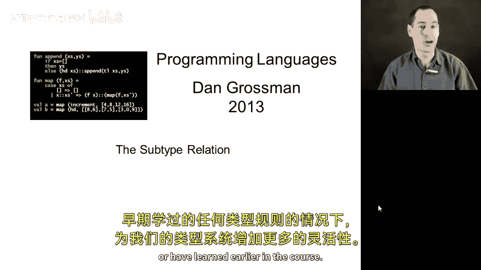
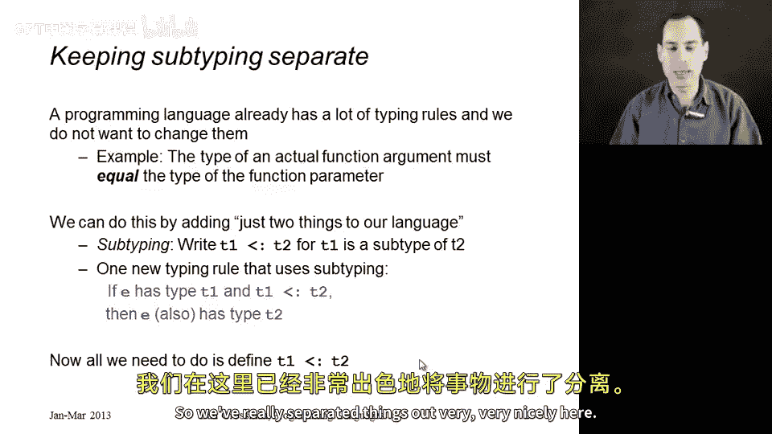
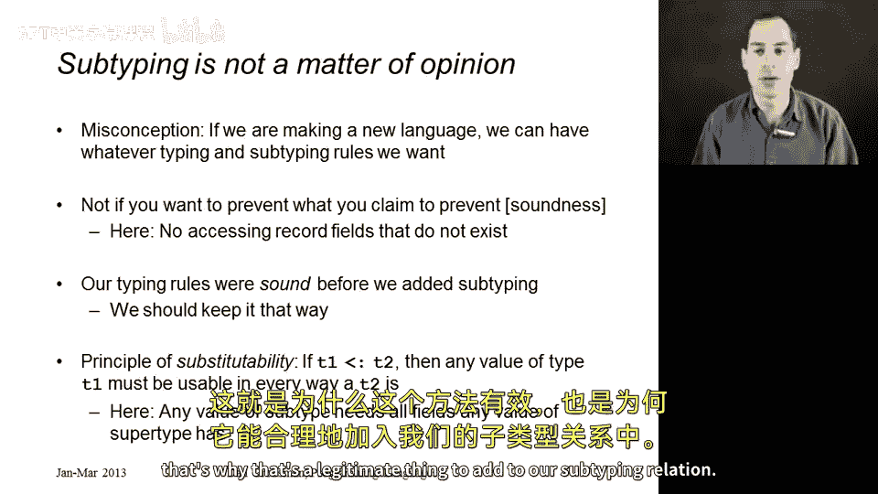
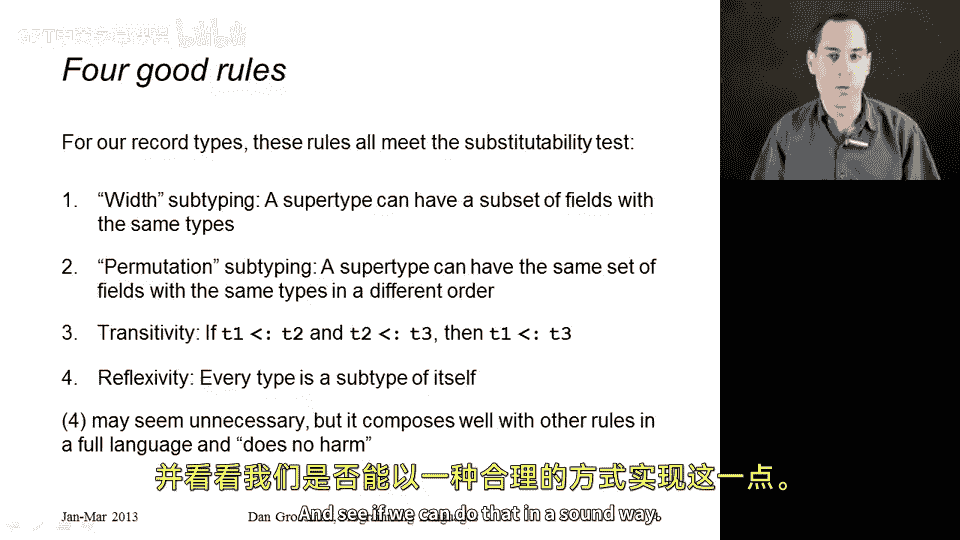

# 编程语言 A/B/C CSE341 Coursera：32_02：子类型关系

在本节课中，我们将为子类型化提供一个非常精确的定义。我们将以一种方式来实现它，这种方式能为我们的类型系统增加极大的灵活性，而无需修改编程语言中已有的任何类型规则，也无需修改课程早期学到的规则。

## 概述

在上一节中，我们遇到了一个情况：我们希望传递一个包含三个字段的记录给一个只需要其中两个字段的函数，但现有的类型规则不允许这样做。本节中，我们将通过引入子类型关系来解决这个问题，同时确保类型系统的“可靠性”不被破坏。我们将定义子类型关系，并仅向语言中添加一条新的类型规则。

## 子类型关系与单一规则

编程语言已经拥有许多复杂而精密的类型规则。如果为了支持传递一个包含额外字段的记录，而需要修改所有这些规则，那将非常繁琐。

我们已有的类型规则很好，例如，当你向函数传递参数时，该参数的类型应等于函数参数的类型。这条规则简单明了，易于实现。然而，正是这条规则在上节中阻止了我们传递一个无害的、我们想要传递的值。

因此，我们现在将通过仅向语言中添加两样东西来修复这个问题。

首先，我们将添加一个独立于其他概念的“子类型”概念。在幻灯片上，我将写作 **T1 <: T2** 来表示 T1 是 T2 的子类型。这不必是语言中的语法，它只是两个类型之间的二元关系。给定两个类型 T1 和 T2，可能一个是另一个的子类型，也可能不是。我们需要像定义整数上的“小于”关系一样，来定义这个关系。

一旦我们有了这个被称为子类型关系的关系，我们对编程语言只需要添加一条规则。这条规则用蓝色标出，它表示：如果某个表达式 **e** 具有类型 **T1**，并且 **T1** 是 **T2** 的子类型，那么 **e** 也具有类型 **T2**。这是我们唯一需要添加的规则，一切都会随之正常工作。

例如，如果 `{x: real, y: real, color: string}` 是 `{x: real, y: real}` 的子类型，那么任何具有三个字段类型的值也就具有两个字段的类型。既然它也具有那个超类型，我们就能够将它传递给期望超类型的函数。这样，我们就非常清晰地将概念分离开了。

## 确保类型系统的可靠性

我们需要谨慎地处理此事。一个常见的误解是，如果你在创造一门新语言，你可以为所欲为。但正如我们在课程中反复学到的，虽然语言设计有很大的灵活性，但如果做错了，语言就不会按你预期的方式工作。例如，动态作用域对于闭包来说就是个糟糕的主意。

类型和子类型规则也是如此，你不能随意使用任何规则，至少在你希望类型系统真正实现其目的时不能。当我们学习静态类型时，我们了解到类型系统的目的是防止语言中的某些操作。对于子类型，其目的是确保永远不会出现一个程序通过了类型检查，但在运行时却试图访问一个记录中不存在的字段。

事实证明，仅凭上一节的类型规则，我们已经拥有了这个属性——我们的系统在防止错误的记录字段访问方面是“可靠”的。现在，当我们添加子类型时，我们希望确保保持这种可靠性。如果我们定义的子类型关系破坏了类型系统的可靠性，那我们就做错了。编程语言领域有句俗语：子类型不是观点问题。你的子类型规则要么破坏了可靠性，要么没有。对我们来说，重要的是它们不能破坏可靠性。

确保不破坏可靠性的关键推理在于“可替换性”原则。如果 **T1** 是 **T2** 的子类型，那么我们要求任何 **T1** 类型的值，都能在所有 **T2** 类型的值可以使用的地方使用。这对于我们那个包含更多字段的记录例子是成立的。对于超类型 `{x: real, y: real}`，你除了传递它之外，唯一能做的就是获取 x 字段、获取 y 字段、设置 x 字段、设置 y 字段。所有这些操作都可以在 `{x: real, y: real, color: string}` 类型的值上完成。因此，可替换性原则成立。这就是为什么它是合法的，也是为什么它可以被添加到我们的子类型关系中。

## 初步定义子类型关系

现在，让我们来初步定义子类型关系。以下规则用于说明一个类型 **T1** 可以“小于”另一个类型 **T2**。

以下是构成我们初步子类型关系的规则：

1.  **宽度子类型**：这是我们已经讨论过的规则。如果一个更“宽”的记录（拥有更多字段）包含了另一个更“瘦”的记录的所有字段名和对应类型，那么这个宽记录就是瘦记录的子类型。本质上，你可以从宽记录中丢弃一些字段。
2.  **排列子类型**：这是另一个你可能没想到的规则。假设有两个记录，它们拥有相同的字段和相同的类型，但书写顺序不同。顺序并不重要。因此，我们应该允许一个记录类型成为另一个仅仅重新排列了字段顺序的记录类型的子类型。这显然符合可替换性测试，因为你仍然可以获取和设置所有相同的字段。如果不将此规则纳入子类型关系，许多你希望类型检查通过的程序将无法通过。
3.  **传递性**：如果 **T1** 是 **T2** 的子类型，且 **T2** 是 **T3** 的子类型，那么 **T1** 是 **T3** 的子类型。这直接由可替换性推导而来。如果 T1 的值可以当作 T2 的值使用，而 T2 的值可以当作 T3 的值使用，那么 T1 的值也应该可以当作 T3 的值使用。拥有这条规则很好，这样我们其他更有趣的规则就不必一次性涵盖所有情况。
4.  **自反性**：这是一个来自离散数学或逻辑学的术语。每个类型都是其自身的子类型，即对于任何类型 **T**，**T <: T**。目前我们可能并不急需这条规则，但当我们看到其他子类型规则时，特别是即将讨论的函数子类型规则，它将有助于简化其他规则。

## 总结

本节课我们一起学习了子类型化的核心概念。我们引入了子类型关系 **<:**，并仅向类型系统中添加了一条新规则：如果 **e** 具有类型 **T1** 且 **T1 <: T2**，则 **e** 也具有类型 **T2**。

我们初步定义了子类型关系，包含四条规则：
*   **宽度子类型**：允许丢弃记录中的字段。
*   **排列子类型**：允许改变记录字段的顺序。
*   **传递性**：子类型关系可以链式传递。
*   **自反性**：每个类型都是自身的子类型。

这些规则共同工作，在保持类型系统可靠性的前提下，极大地增加了代码的灵活性。在接下来的课程中，我们将尝试添加更多规则，并检验是否能以可靠的方式实现。