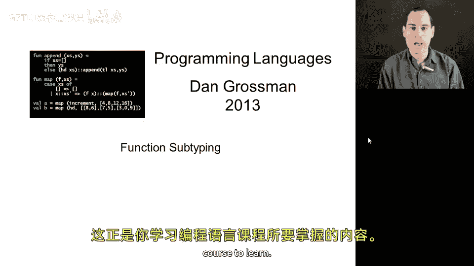
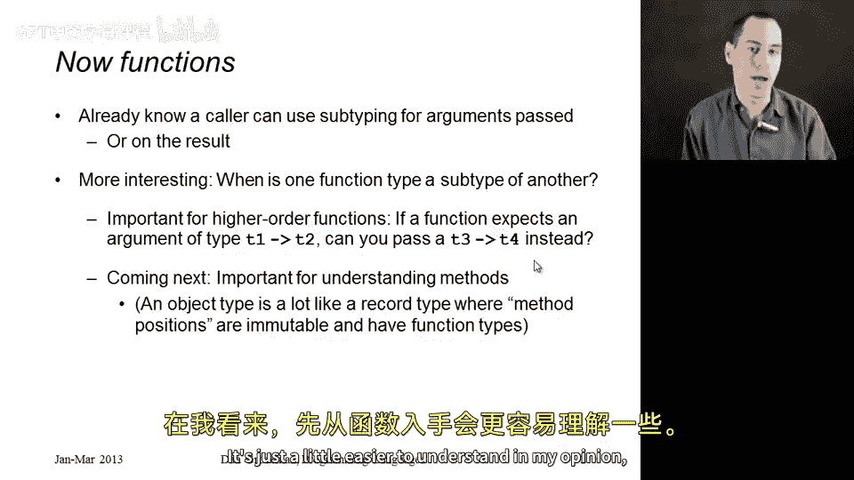
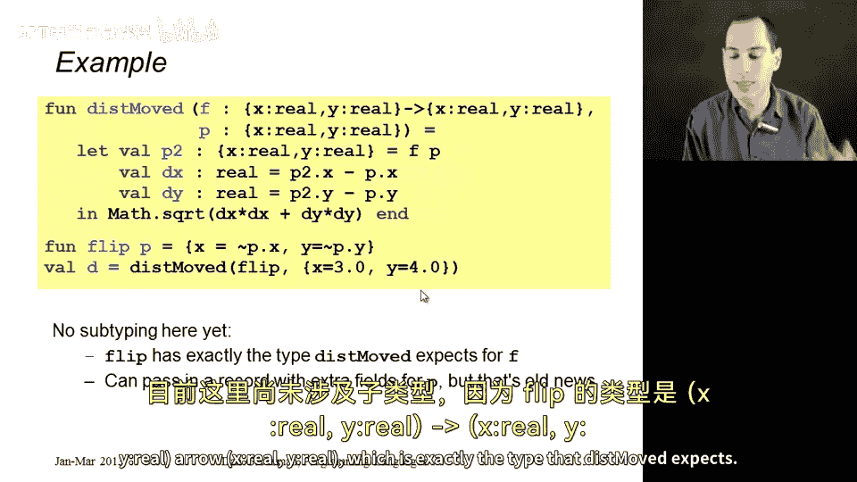
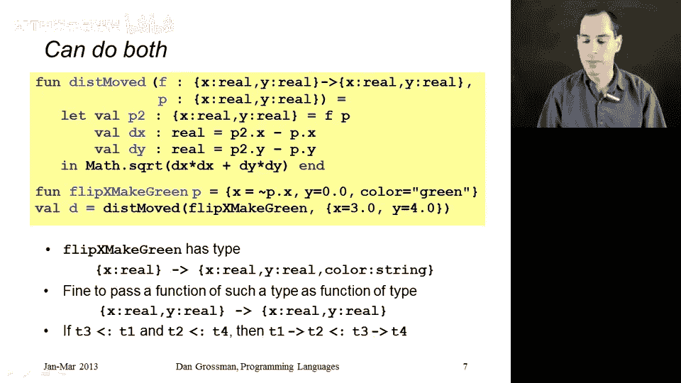
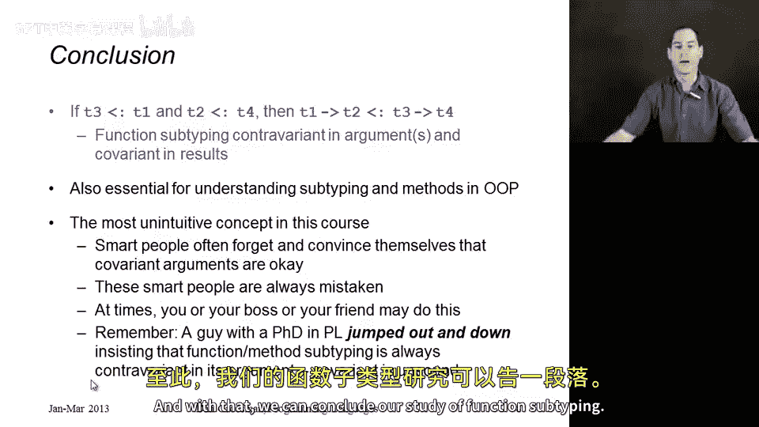

# 【编程语言 A⧸B⧸C CSE341 Coursera】华盛顿大学—中英字幕 p176 35_05_function-subtyping -BV1bw4m1D7MM_p176-

This segment has perhaps the most counterintuitive result in the entire course。

 but's also exactly the sort of thing that you take a programming language course to learn。

So we're going to discuss subtyping for functions and let me be clear about what I mean here。

 Now there's some things we already know。 We know if you're the caller to a function。

 you can pass a subtype of the argument that the function is already expecting。

And similarly， after you get back something from the function， like maybe you get back a color point。

 you can think of that color point as a point。 This is all normal subtyping。 Okay。

 It doesn't matter that we're using it with a calling a function。

More interesting is to ask the question， when is one function itself having a type that is a subtype of another function type。

 this is important in a language with high order functions。 supposeuppose the function argument。

 Is itself self a function， something of type T1arrow T2 using our M syntax for function types takes a T1 and returns a T2。

 if that's the argument to some other function， are you allowed to pass in a T3arrow T4 instead。

 and under what circumstances， Clearly， T1arrow T2 and T3 or T4 are going to have to be related somehow。

 you can't just pass in some totally different function with some totally different type。

 but is there a subtyping relationship there， And let's try to figure out what it is。

This is not just important for subtyping in languages with higher order functions。

 What we're going to study here is also directly relevant to subtyping for object oriented languages。

 and we'll study that next。 It's just a little easier to understand， in my opinion。

 thinking about functions first。

So here's an example we're going to build off of， there's actually no subtyping on this slide。

 but I just want to show you a higher order function involving records。So it's a function disk moved。

 It takes in a function F and a point P。 It calls F with P。

 And then it returns the distance between P and F of P。 All right， That's all it does。

 It's a little function。 So F has type X colon real， Y colon real。arrow X colon real， Y colon real。

 It takes a point and returns a point。P is a point。

 And then the body here calls F with P determines how much the x coordinate change。

 determines how much the y coordinate change and returns the appropriate distance。

 Here's a completely normal call to it。 Here's a function flip that takes a point and negates the x coordinate in the Y coordinate to produce a new point。

 So it's a functional flip it around on both aes aes。

 And then we call disk moved with the function flip and some point like x coordinates 3 Y coordinate is4。

 There's no subtyping here yet， because flip has type X colon real Y colon real arrow X colon real Y colon real。

 which is exactly the type that disk move expects Okay， so this works fine。😊。

Now let's consider this call。It's exactly the same definition of disk moved。

 but now I want to pass in this function Flip green。

 What it does is it to build a new record that flips X， flips Y and adds a color field green。Okay。

 so the return type of flip green is x colon real Y colon real color colon string。

 So flip green overall takes an x colon real Y colon re and returns an x colon real Y colon real color colon string。

Dis move does not expect exactly that type。 It expects an X colon re， Y colon re， arrow X colon real。

 Y colon re， but it's no problem。If we add this subtyping rule that if T is a subtype of TB。

 then Tarrow TA is a subtype of Tarrow TB。 In other words。

 we're allowed to go into the return type of a function and add subtyping there。

So a function is allowed to return something with fields we don't need。 something extra。

 A function can return more than it needs to。 There's jargon for this。

 We say that function types are covariant in their return type。 I will not test you on that jargon。

 But if you've ever heard the term covariance， they mean the subtyping goes the same way。

 And here the subtyping goes the same way。 If T is a subtype of TB。

 Then Tarrow T is a subtype of Tarrow TB。 So that works great for the return type。😊。

But what about the argument type？😡，So here is a different function we're trying to pass in to disk moved。

 flip if green。Flip if green says if P's color is green。

 then build this record with an X field in the Y field。

 otherwise build this other record with an X field and a Y field。

Now the argument type of flip if green is x colon real， y colon real color， colon string， excuse。

 it requires all three fields。But up here in disk moved。We pass to the function。

 something that does not have a color field。 If you look at this call。

 we call disk moved with flip if green and something and just has an X field and a Y field。

 this will get stuck。This， if you run try to run this program， it's not sound。

 it will try to read the color field of a record that does not have a color field。

 and therefore we better make sure this code does not type check。😡，And so what we cannot allow。

Is subtyping on argument types just because T is a subtype of T B。

 You cannot allow T arrow T to be a subtype of TB arrow T。 You cannot say， oh。

 it's okay to assume this function doesn't need all the fields。 It does need all the fields。

 or at least it might。 And so you cannot drop fields from arguments to functions。

 So this better not type check。 We better not have this type checking rule。

But what may surprise you is it's okay to go the other way。

It's okay to allow subtyping on function argument types as long as that subtyping is backwards。

 as long as it goes the other way。 you see the rule here in this last bullet at the bottom。

 It turns out that if TB is a subtype of T A。Then T ROTT is a subtype of TB RT。

See how I flipped it around。The subtype here is in the supertype of the result。So this has a jargon。

 it's called contravariance， but what it's saying is a function can assume less than it needs to about arguments。

So here's your example。It turns out it's fine to call dis moved with a function that does not need an X colon reel and a Y colon reel。

 maybe it only needs an X colon reel。Here's an example。 This function， flip X， Y 0 takes in a point。

Returns takes in some P， returns a new record that has an X field that's minus P dot X and a Y field that's just 0。

 So notice it never asks for P dot Y。 It does not care if P has a Y field。

So if I pass flip X Y0 into diskmoved。D move。Needs F to work。As though it had this type。

And Flip X Y0 can act like it has that type， even though it does not need its argument to have a Y field。

So。Flip X， Y 0。Has an argument type of x colon real。

 but we can pretend it has an argument type of X colon real， Y colon real。Yet X colon real。

 Y colon real is the subtype compared to X colon real。

 And that's why this subtyping rule is reversed。 This is the correct rule。

 It says if T B is less than T A， then T A O T is less than T B， A O T。

And it turns out you could do both at once。 So here's our final example， Flip X make green。

Returns a record with an X field， a Y field， and a color field。😡。

And only requires its argument to have an X field。So we can pass this in for disk Mo。

 Flip X make green has type。 If you give me an X colon re。

 I'll give you back an X colon real Y colon real color colon string。

 If you just look at fliplip X make green， that's the type it should have。

We can pass it into disk move， which expects an x colon real y colonarrow x colon real y colon re and nothing bad will happen because this function works just fine。

 if you give it something with an x field in a Y field and it always gives back something that has an x field in a Y field it just happens to give back more and it happens to need less we're just combining the two ideas together and that's why the general rule for function subtyping is that if T3 is a subtype of T1 and T2 is a subtype of T4 then T1arrow T2 is a subtype of T3arrow T4 So we see for the result types T2 and T4。

 the subtyping goes the same way， and for the argument types T3 and T1 it's flipped around and it goes the other way。

So the fancy jargon way of saying this is that function subtyping is contra variantant in its arguments and covariant in its results。

And this is essential for understanding subtyping and object oriented programming。

 actually and understanding how it is sound to override methods in a subclass in a language with subtyping。

 and we'll see that next。I would just like to be honest。

 as I said at the beginning that I think this is the most unintuitive concept in the course。

 when you get confused， I can encourage you to go back and work through the examples or make up your own examples and convince yourself that the arguments really are contravariant。

 they really do have to be flipped around， otherwise you can break the soundness of the type system。

NowMany smart people have gotten this wrong， have made mistakes about this。

 and I just want to emphasize this point that at some point in your life， you may make this mistake。

 your boss might make this mistake。 your friend might make this mistake and so I'm trying to just get you to memorize that there's something weird going on here and you can always come back and watch this video later And if nothing else I want you to know that I do have a PhD in programming languages and I am happy to jump up and down and insist that subtyping for functions and methods has to be contravarit in the arguments I'm going to do this quite literally because I think it's silly and I think it's fun and you might remember it that way so here's what I'm gonna to do I'm actually I move the chair to the side I'm actually jumping up and down and while I'm jumping up and down。

 I'm telling you that function subtyping has to be contratroverent in the arguments and it's not the direction that you naively think it is And with that we can conclude our study of function subtyping。

