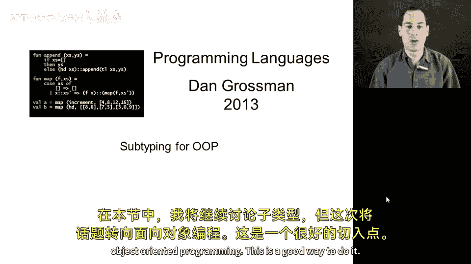
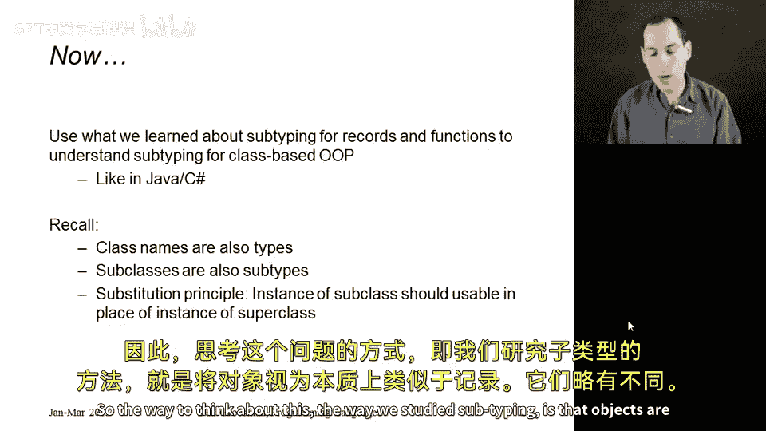
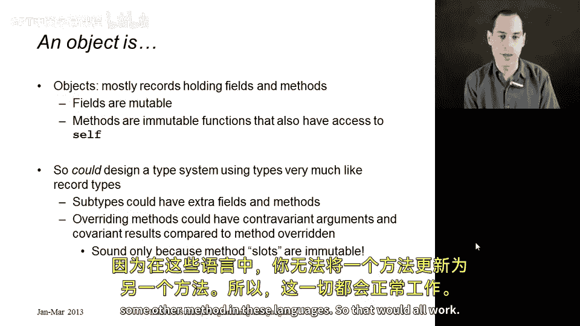
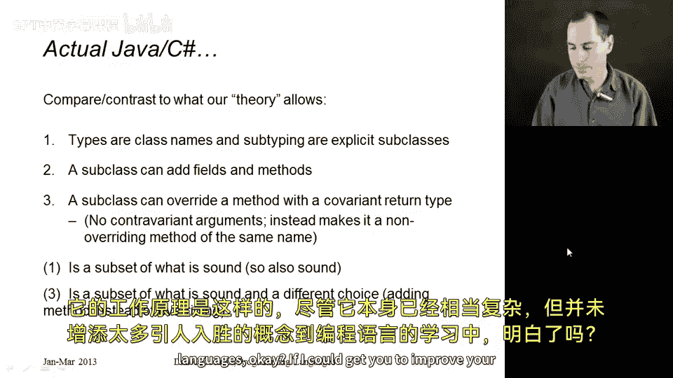
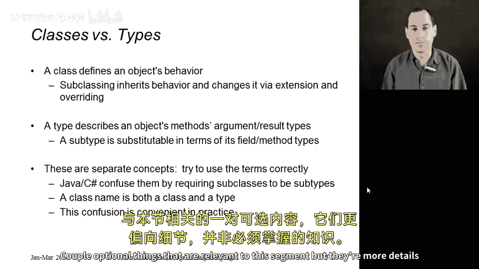
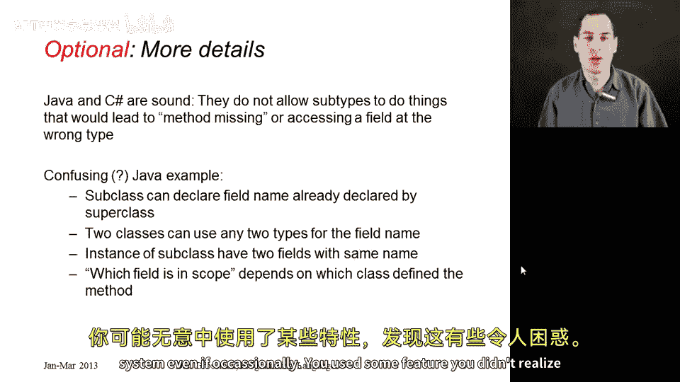
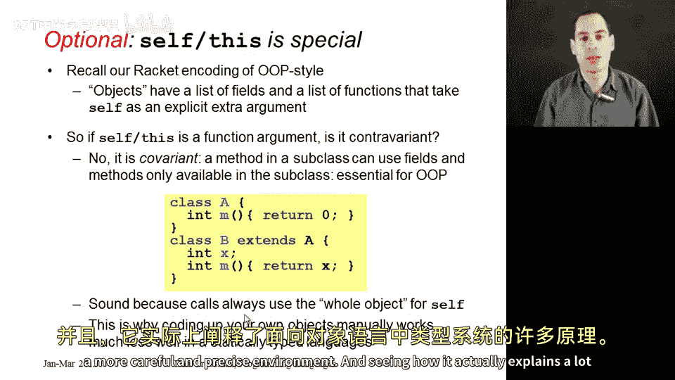

# 面向对象编程中的子类型化：第36章：面向对象编程中的子类型化

在本节课中，我们将学习如何将之前学到的子类型化理论应用到面向对象编程中。我们将看到，基于类的面向对象语言（如Java和C#）的静态类型检查，其核心思想正是源于记录和函数的子类型化规则。

## 子类即子类型

上一节我们介绍了记录和函数的子类型化规则，本节中我们来看看这些规则如何应用于面向对象编程。

在像Java和C#这样的语言中，类名同时也是类型名。如果类C是类D的子类，那么类型C就是类型D的子类型。由于子类型关系具有传递性，一个子类实例可以安全地替代其继承链上任何父类（直至顶层的Object类）的实例。

为了确保这一点，我们必须遵守替换原则：任何子类的实例都可以出现在需要超类实例的地方，而不会导致调用不存在的方法或访问不存在的字段。

## 将对象视为记录

理解这一点的关键，是将对象本质上视为一种记录。对象包含一组字段（实例变量）和一组方法。我们可以将字段名和方法名看作是记录中的字段名。

驱动子类型化的核心在于：
*   **字段通常是可变的**。因此，我们知道在字段上使用深度子类型化是不安全的。
*   **方法通常是不可变的**。因此，我们可以在方法上使用子类型化，而方法本身就像函数。

所以，我们之前学习的关于函数参数逆变和返回值协变的规则，正是我们理解子类如何改变方法类型的理论基础。

## 面向对象语言中的子类型化规则

基于记录子类型化的思想，我们可以为面向对象语言设计一个类型系统。以下是其工作原理：

**子类可以添加新的字段和方法。**
这对应于宽度子类型化，是安全的。使用子类实例作为超类实例时，代码不会关心对象是否拥有类型未承诺的额外内容。

**子类可以重写方法。**
重写的方法（类似于函数）必须能在任何使用超类方法的地方被使用。这意味着：
*   **参数类型必须是逆变的**：重写方法的参数类型必须是超类方法参数类型的超类型。
*   **返回类型必须是协变的**：重写方法的返回类型可以是超类方法返回类型的子类型。

这与深度子类型化相关，因为在Java/C#中，方法一旦定义就不能被更新为另一个完全不同的方法。

## 实际语言的设计选择

虽然上述理论是基础，但Java和C#等语言在实际设计中做出了一些选择：

*   **使用类型名而非记录类型**：它们使用类名或接口名作为类型，而不是写出类似 `{x: real, y: real}` 的记录类型。这限制了子类型化：只有存在显式继承关系的类，其类型才构成子类型关系，而不能仅仅因为一个类“恰好”拥有另一个类的所有成员就构成子类型。这种限制是安全的。
*   **允许协变的返回类型**：子类重写方法时，可以使返回类型更具体（子类型），这是允许的。
*   **不允许逆变的参数类型**：这些语言选择不允许通过改变参数类型来“重写”方法。如果你改变了参数类型，就被视为定义了一个全新的重载方法。由于子类可以添加新方法，这不会造成问题。

## 类与类型的区别

关于面向对象编程，一个重要的概念区分是**类**和**类型**。

*   **类**：定义对象的行为。它包含带有具体实现代码的方法定义。我们在Ruby中定义的就是类。
*   **类型**：描述对象的接口。它说明一个具有该类型的对象拥有哪些方法，以及这些方法的参数和返回类型是什么。
*   **子类型**：描述的是在方法和类型层面上的可替换性。

在大多数静态类型、基于类的面向对象语言（如Java、C#）中，出于便利性，它们选择将这两个概念混合：类名同时作为类型名使用。该类型所描述的内容，就是去类定义中查找所有方法及其参数/返回类型得出的接口。

简而言之：**类关乎实现（行为），类型关乎接口（契约）**。

## 关于`self`/`this`的特殊性

最后，我们来看一个有趣的特殊情况：`self`（在Ruby中）或`this`（在Java/C#/C++中）。

如果我们把`self`看作方法的第一个隐式参数（就像我们在Racket中模拟OOP时做的那样），那么它是一个非常特殊的参数：**它被协变地处理**，尽管我们刚强调过普通参数必须是逆变的。

考虑这个例子：类A有一个方法`m`。子类B重写了`m`。在B的`m`方法内部，我们知道`self`是一个B的实例（因此可以访问B独有的字段`x`），而在A的`m`方法内部，我们只知道`self`是一个A的实例。

这看起来像是协变（在子类中，`self`的类型更具体了），但它为什么是安全的呢？因为`self`不是一个普通的、可以由调用者随意选择值的参数。它总是被绑定到调用该方法的整个对象上。因此，当B的`m`方法被执行时，我们确信`self`就是一个B的实例，所以在这个上下文中假设它拥有B的所有属性是安全的。

## 总结

本节课中，我们一起学习了如何将严谨的子类型化理论应用于面向对象编程。我们看到，对象可以模型化为记录，方法的子类型化遵循函数的逆变与协变规则。实际语言（如Java、C#）基于此理论构建了类型系统，同时做出了一些实用的设计选择。我们还厘清了类与类型的关键区别，并探讨了`self`/`this`参数在子类型化中的特殊处理方式。这些核心概念构成了理解现代静态类型OOP语言类型检查的基础。