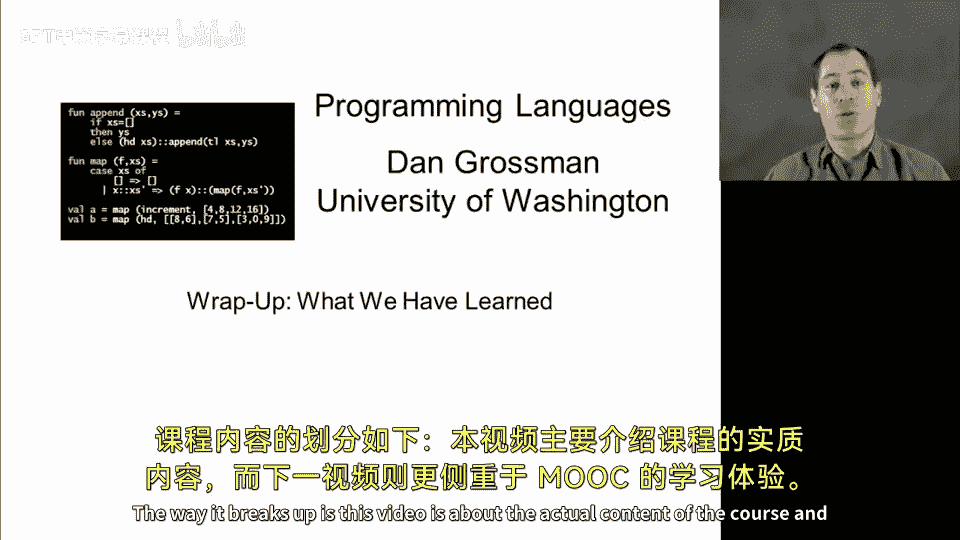
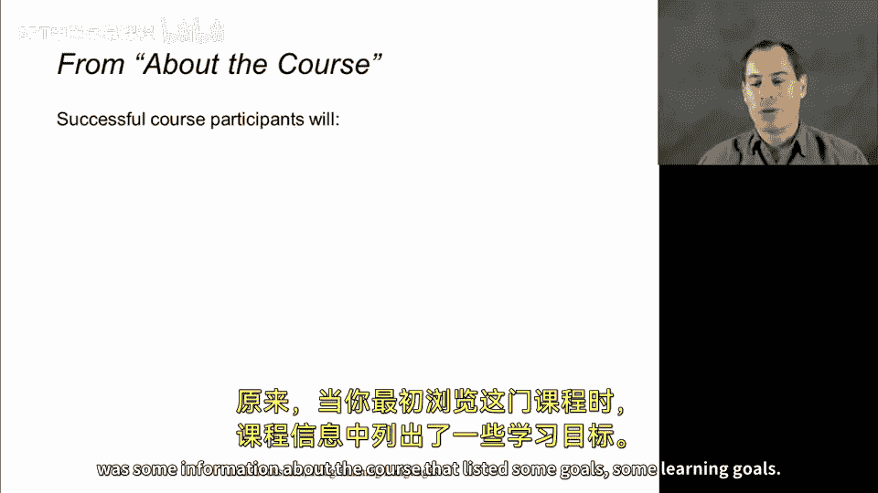
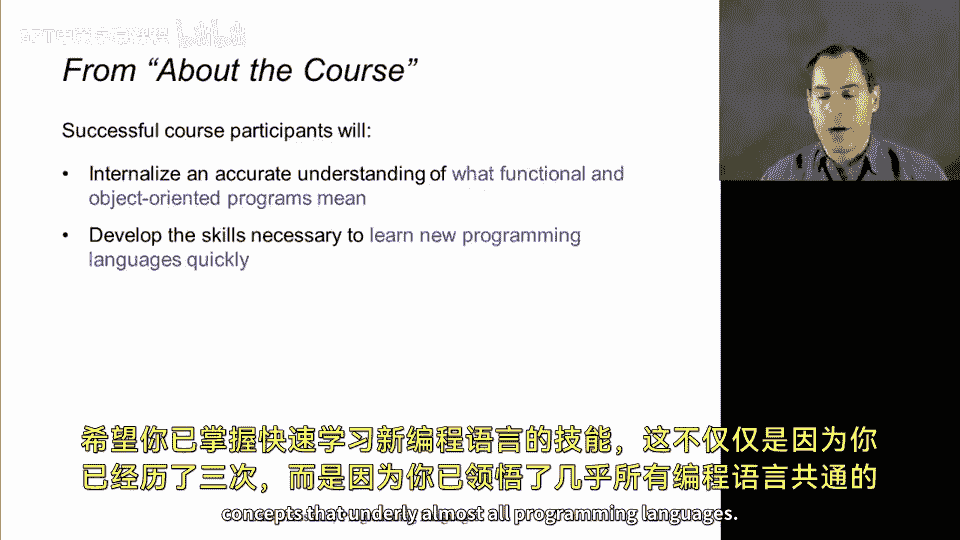
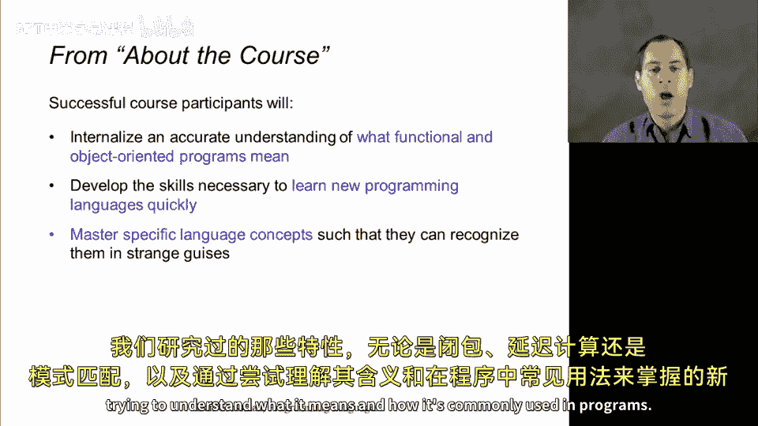
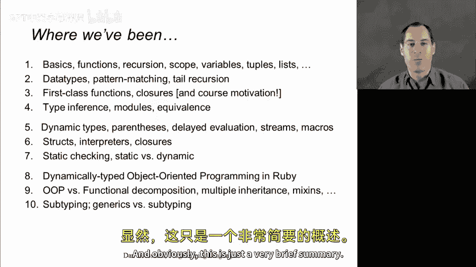
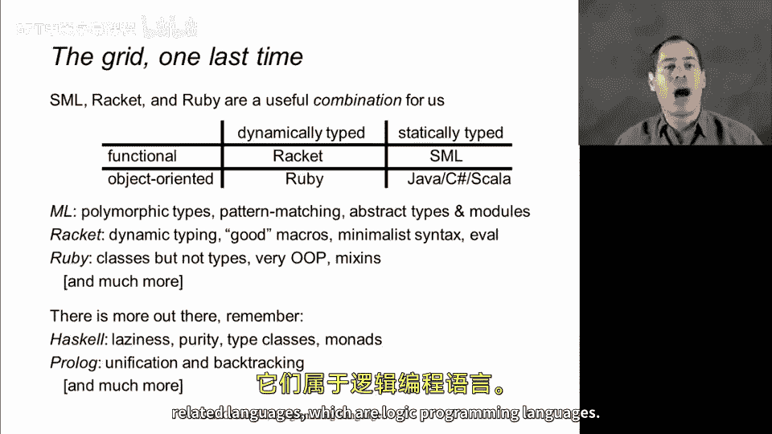
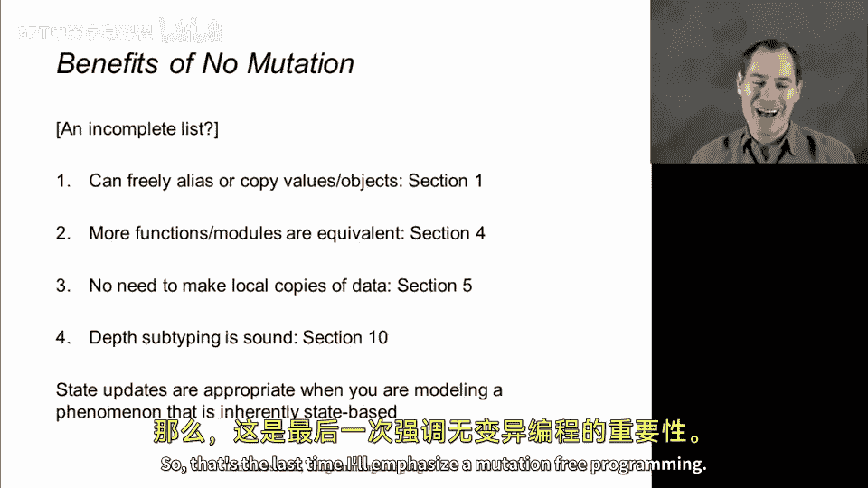
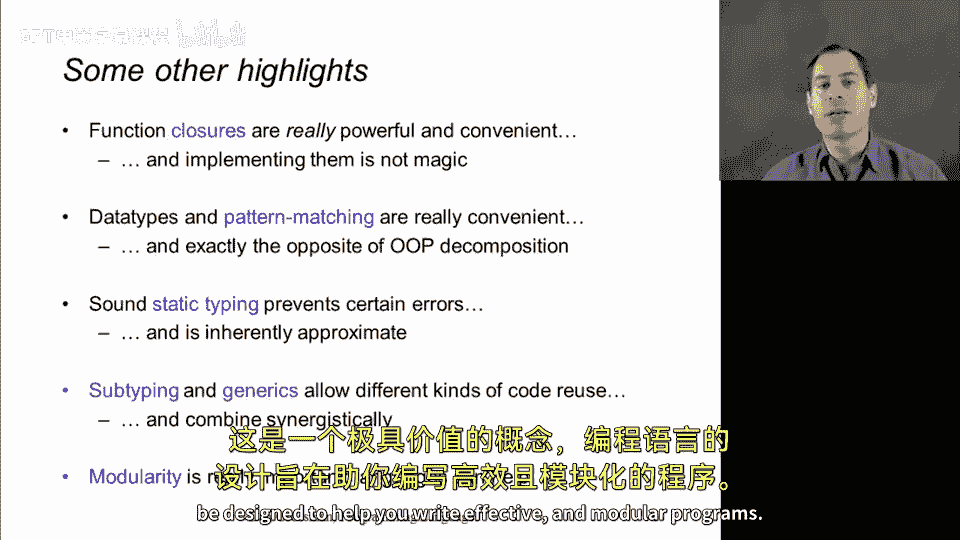
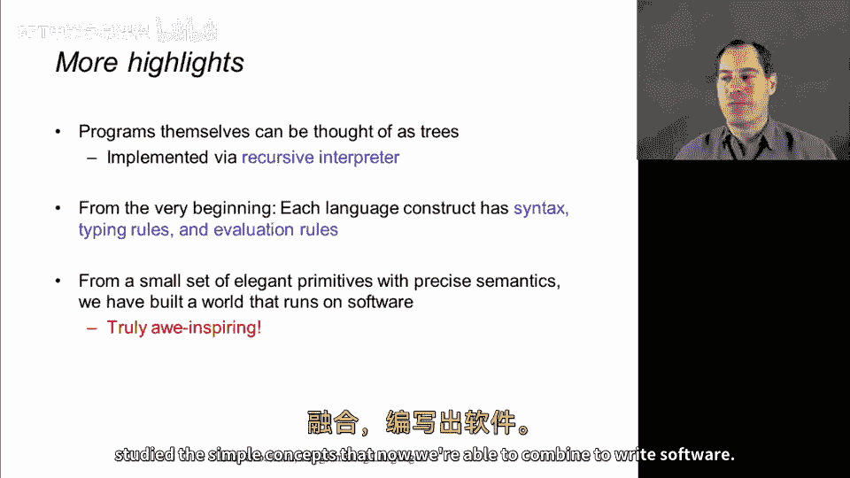
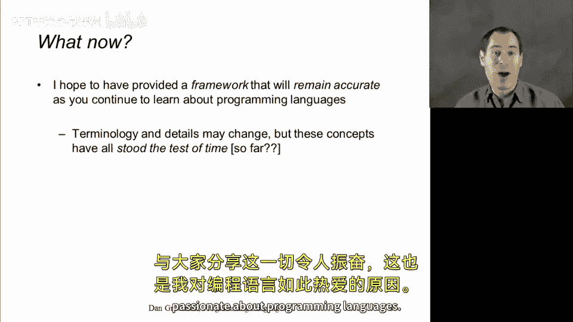

# 【编程语言 A⧸B⧸C CSE341 Coursera】华盛顿大学—中英字幕 p180 39_01_summarizing-all-we-have-learned -BV1bw4m1D7MM_p180-

So what I'd like to do now is welcome you to really the wrap up to the end of the course。

 The idea is that this video and the next one are situated after all the work in the course after the final exam。

 so I want to congratulate you and just take a few minutes to review where we've been and what's been special about it the way it breaks up is this video is about the actual content of the course and then the next video is more about the MOC experience。

So it turns out that way back when you were first looking at this course。

 there was some information about the course that listed some goals， some learning goals。

 so I thought I'd really just put these up they're not the outline of the course。

 but they're what I hope you got a got out of participating and the first is this accurate understanding of both functional and object oriented programming。

 the sort of thing you'll never forget because we focused on it so much all the way through I hope you've developed the skills to learn new programming languages quickly。

 not just because you've done it three times but because you've learned the key concepts that underlie almost all programming languages。

 I hope that you can now master specific language concepts。

 both the ones we've studied whether it's closures or delaying evaluation or pattern matching。

 as well as new ones by knowing how to approach something by trying to understand what it means and how it's commonly used in programs。

I hope you've learned to evaluate the power and elegance of programming languages。

 even recognize sort of which tools， which constructs are appropriate for different tasks you might be using or at least have additional insight into how to go about doing that。

 and I hope that you've not only become a quote unquote be programmer in ML rackcet and Ruby。

 but in every programming language you ever have used or ever will use。

 as I've emphasized over and over again， programming languages is not about ML Raet and Ruby that's just the setting in which we've learned far more universal concepts。

So in terms of the actual outline， if you break things down into 10 sections。

 this is where you've now been， it's amazing how much content you can have behind these short phrases that describe these ideas so you've seen functional programming and pattern matching and ML style type systems you've seen the dynamic typing of Ruby you've implemented your own programming language。

 you've compared object oriented programming to functional programming。

 you've learned how to decompose programs under both approaches。

 you've seen subtyping and advanced type system concepts so a whole lot of stuff and obviously this is just a very brief summary。

😊。

Let me now for probably the third or fourth time， show you this slide。

 which is the very simple high levelvel grid of how we've covered three out of four possibilities of combining functional or objectoriented with dynamically typed or statically typed and that's a good complement to a lot of people's prior knowledge or if not then future knowledge of a statically typed object oriented programming language like Java or C sharpp and so that's been our framework is doing three of these four quadrants。

 but I want to emphasize that it is not the case that all programming languages can be described by being in one or even more than one of these quadrants。

 There are additional things。 So for example， Haskell is a statically typed functional language。

 but its laziness the way it delays evaluation of almost everything in the language makes it quite different from ML。

And then there are additional rows of this grid， the most commonly known one that's neither functional nor object oriented nor sort of lower level and procedural like C would be prologue and related languages which are logic programming languages。

 so we could do more， but I feel that where we are here at the end of part C tells a complete story that covers a lot of the space of programming languages。

 but certainly not all of it。

So I want to emphasize a couple more highlights of what we've gone through things that I like to emphasize and the first。

 perhaps no surprise is emphasizing the benefits of not mutating data of programming without side effects and assignment statements and imperative updates。

 so I thought I'd point out that while that's by no means all that we covered in this course。

 it did come up several times， and I think it's worth pointing that out and I may have missed a few here。

 you know all the way back in the first section of the course。

 I pointed out that if you don't update things， then you don't have to worry about when different references in your program or aliases of each other or not。

 this is a huge burden lifted from you when you're trying to write correct， easy to read。

 easy to maintain programs。Then in section 4， when we were discussing the equivalentence of two functions or two programs。

 we saw that if you can assume that both are functional， both don't have side effects。

 then a lot more things become equivalent。In section 5 we looked at the need to make copies of data if you're worried that some other part of the program might update that data and you don't want it updated。

 but if you know that the program is not going to update something。

 perhaps because the language forbids it then you don't have to worry about that and so your programs can actually be more efficient。

 shorter and simpler and here near the end of the course when we studied subtyping。

 I made a big point that in a mutable setting， depth subtyping is unsound， it's incorrect。

 it's wrong， but if your data is immutable， then depth subtyping is in fact not a problem。

Now I want to emphasize all these reasons and more to avoid mutation。

 but I also want to emphasize that I understand there are situations where updating imperative state does make sense when it's the natural thing that you are doing when your program is modeling an imperative update of the world。

 then imperative updates can make sense。 it's just not necessary to use them for every little algorithm in your program。

Okay， so that's the last time I'll emphasize mutation free programming。

 Let me hit briefly some other highlights， function closures and how powerful and convenient they are。

 We didn't just teach what they are。 We saw idiom after idiom of how they are a powerful programming construct。

😊。

Back in part A of the course， I really emphasized data types and pattern matching as a really powerful way to organize the cases of your program that a lot of languages don't have。

 and so we saw that come back in the last programming assignment of the course where you had some pretty concise ML code that you then had to port to Ruby in a way that was probably a bit harder to understand and that's a debatable point and one where people are allowed to have different opinions we talked about static versus dynamic typing。

 what static typing can accomplish and what it's not designed to do and how it's inherently approximate that sound static languages always reject programs that are perfectly fine and that's considered okay because they catch so many bugs and enforce so many invariance that that's a tradeoff we're willing to have。

Here at the end of the course， we saw that subtyping and generics are a very interesting contrast。

 and it's important not to use one when the other is the right thing for describing what you're doing。

 And if there's one thing I wish we had emphasized more in the course。 it's probably modularity。

 We certainly focused on M's mod system around the middle of the course。

 there are approaches to modularity in rackcet and rubby that would have been worth learning as well。

 But as you write larger and more complex programs， there's no substitute for modularity。

 It's a really valuable concept and programming languages can be designed to help you write effective and modular programs。

A few more highlights， I love to think of programs themselves as trees， not text in a file。

 but the sort of abstract syntax tree that was essential when we wrote our own interpreter for the madeup programming language we did in Part B。

 and then you know going all the way back to the very beginning that you can think of every language construct is having a syntax。

 how you write it， having typing rules what makes a legal program and what doesn't and evaluation rules。

 what does it mean to evaluate such a language construct when a program is executing and what I find truly aweinspiring what makes me happy to be spending my professional career focused on programming languages is the way a small set of simple language constructs can combine languages like M Ra and Ruby are not that large compared to the amazing variety of software that we as humankind have built we take these languages that have a small number of really powerful idea。

And we combine them with human ingenuity， and that's what software is all about。

 and I hope to have shared some of that passion and allwe with you as we've gone through and studied the simple concepts that now we're able to combine to write software。

So what now， I mean we're done with the material and so I hope I've provided you with an intellectual framework that will serve you well as you continue throughout your life to become a better software developer who enjoys learning new languages and writing new programs and as we all get older as the years pass ahead。

 surely there will be new languages， the details will change， the terminology may change。

 but the concepts that we've covered in this course are have been around for a long time。

 have been very successful， and I believe and hope that they have stood the test of time and that there will always be some variant of the concepts we've studied in this course at the core foundation of the languages we use to write the software that runs our world and that's exciting。

 It's been exciting to share it with you and that's why I'm so passionate about programming language。

Just。