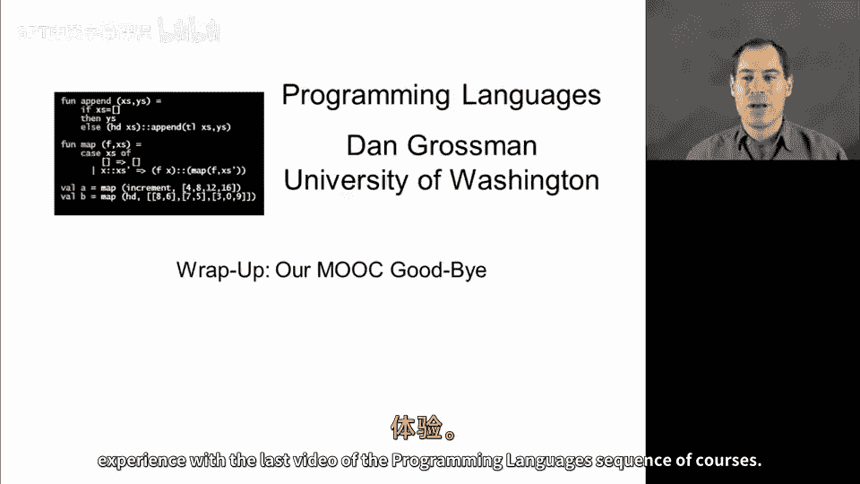
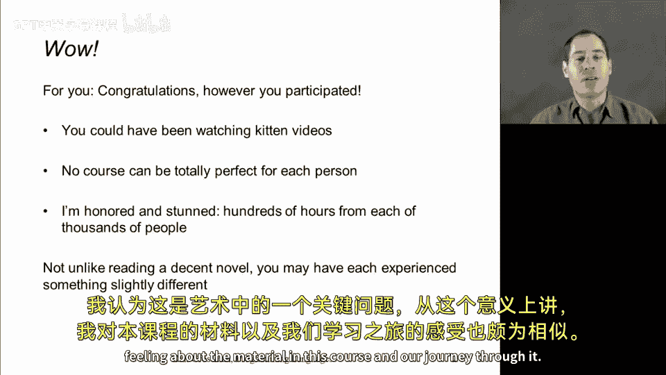
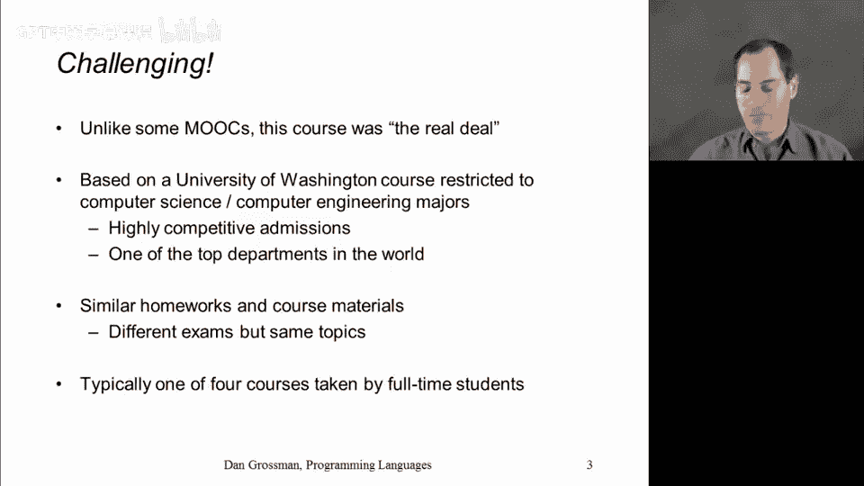
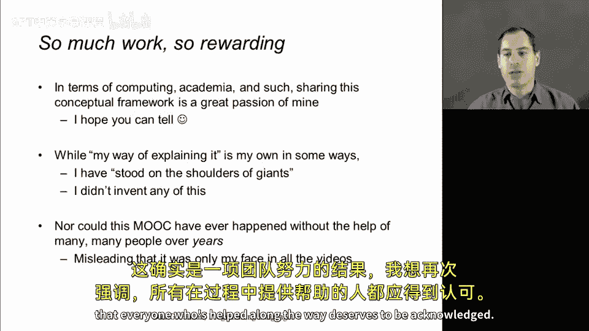
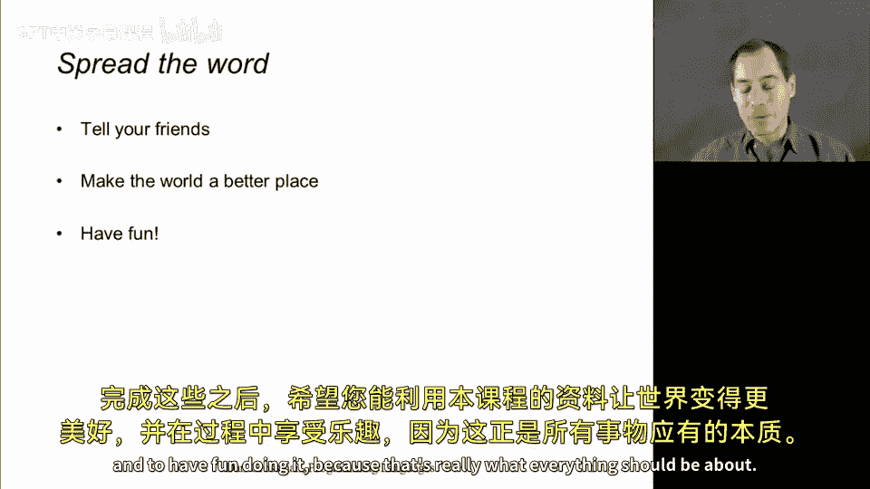
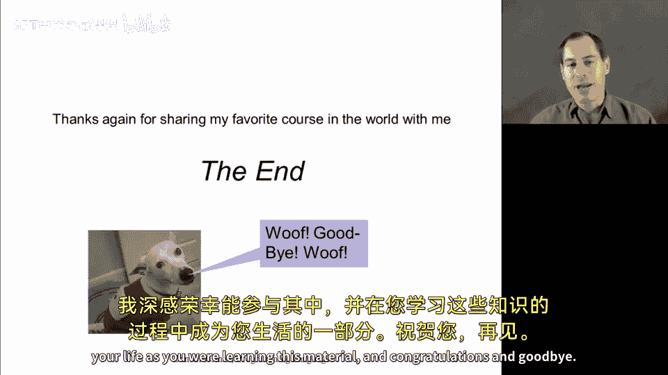

# 编程语言：CSE341：告别与回顾 🎓

在本节课中，我们将一起回顾整个编程语言系列课程的学习历程，并对这段学习体验进行总结与告别。

---

## 概述

本节是编程语言系列课程的最后一课。我们将借此机会告别，并反思整个MOOC学习体验。课程讲师将分享他对课程的看法，并对所有参与者的努力表示祝贺与感谢。

---

## 课程性质与挑战

上一节我们介绍了本节的目的。本节中，我们来看看讲师对课程本身特点的阐述。

这门课程包含极具挑战性的知识体系。与许多其他MOOC不同，本课程的内容确实对应着一门高难度的课程，属于顶尖计算机科学项目的一部分。它基于我在华盛顿大学多次讲授的一门课程。在那门课程中，学生们首先需要通过激烈的竞争性选拔，才能获得学习此课程及其他课程的机会。他们完成类似的作业，虽然课程本身存在一些差异，并且由于传统大学的小规模和亲身体验性质，他们的经历有所不同，但他们学习的主要是相同的材料，并且基本上是作为全日制学生来完成的。

因此，对于所有在繁忙生活中抽出时间、兼职学习这门课程的你们，我认为这尤其令人印象深刻。我想确保你们知道，我了解这一点。

---

## 课程的理念与归属

在计算、学术界以及我职业生涯的几乎所有方面，与你们分享这门课程一直是我的极大热情所在，可以说是近年来最让我感到满足的部分。我希望你们能看出，我对课程内容充满自豪感。

但我不希望这被误解为这门课程中的所有材料，甚至课程中提供的所有资料，在某种意义上是属于我或由我发明的。这只是我解释它的方式，是我思考它的方式，是我选择的措辞。所有的错误都由我承担。

这里有一个古老的观点：站在巨人的肩膀上，我们才能看得更远。在这种情况下，我想明确指出，这些编程语言的核心思想在我之前就已存在，并且被我所在领域的许多同事以及众多开发者所深刻理解。我只是非常荣幸地以某种方式将它们组织并呈现出来。

---

## 团队的努力

我还想强调，你们在所有视频中只看到我的脸，这其实是一种误导。是的，我录制了所有视频，并主导了这门课程的创建。但正如我在课程附带的致谢中所指出的，这是一个共同的经历，到目前为止，我得到了数十人的帮助，他们共同完成了许多我独自一人无法完成的工作。因此，这确实是一项团队努力。我想再次指出，所有在此过程中提供帮助的人都值得被感谢。

---

## 后续行动与期望

那么，接下来你们可以做什么呢？以下是一些建议：

如果你喜欢这门课程并从中收获良多，我希望你能传播关于这门课程的信息。通过你告诉你的朋友，让更多的人来体验它。

完成上述之后，我希望你能运用本课程中的知识，让世界变得更美好，并在此过程中享受乐趣。因为这才是所有事情真正应该关乎的核心。

---

## 总结

本节课中，我们一起回顾了整个编程语言课程的学习旅程。讲师祝贺了所有参与者付出的努力，强调了课程的挑战性与团队协作的本质，并鼓励大家将所学知识用于创造更美好的世界。

最后，再次感谢你们与我一同分享这门我最喜爱的世界级课程。你们付出了巨大的努力，能成为你们学习这段材料时生活的一部分，我感到无比自豪和荣幸。祝贺你们，再见。