# 【编程语言 A⧸B⧸C CSE341 Coursera】华盛顿大学—中英字幕 p19 18_08_introducing-lists -BV1bw4m1D7MM_p19-

RightIn this segment， we'll start studying lists right now。

 we're just going to learn the basic rules for them。

 Then in the next segment we'll program with functions that either take lists or produce lists just to break things into slightly smaller pieces。

 we've already seen one way to build up compound data and that was with tuples and they're a nice contrast with lists。

 So with tuples， even though we could make them as wide as we wanted or as deep as we wanted tuples inside of other tuples we still had to pick that size when we were writing the program So there was no way with tuples to say take in a number like 10 or n or X and then produce a tuple that had that many pieces because there'd be no type to write down for that thing because you don't know the size until you run the program。

So lists don't have that restriction。 We're going to be able to build lists with any number of elements and we won't be limited by the type of the list。

 but there's a tradeoff here， and that is that any list we build will' have to have pieces that all have the same type and that's just the rule for lists and ML and we'll learn in future segments and parts of the course how to program around that restriction by using other constructs in the language All right。

 so to understand lists just like with tuples we're going to have ways to build them and we're going to have ways to use them So let's start with how we can build lists。

The simplest list has zero elements in it。 and you can build that zero element list by just writing left bracket right bracket。

 This is itself a value。 So the evaluation rule is trivial。 The syntax evaluates to itself。

 and that's the empty list。 Now if you wanted a list with multiple elements in it。

 you can just write those down separated by commas。 So let me show you few examples here。

 So I really can write the empty list and that's its value。 You see the type there。 quote a list。

 we'll get back to that in a few minutes。 Let's ignore that for now。 I could also make a list 34，5。

 and that would hold 3，4，5。 you can see from the type here。 it's a list of ins。

 So it doesn't matter how many elements are in it。 a two element list has the same has the same type and so does a four element list and so on。

 These are all values because a list of values is a value。 But I could put expressions in here。

3 plus 4，7 like this。 and it will。

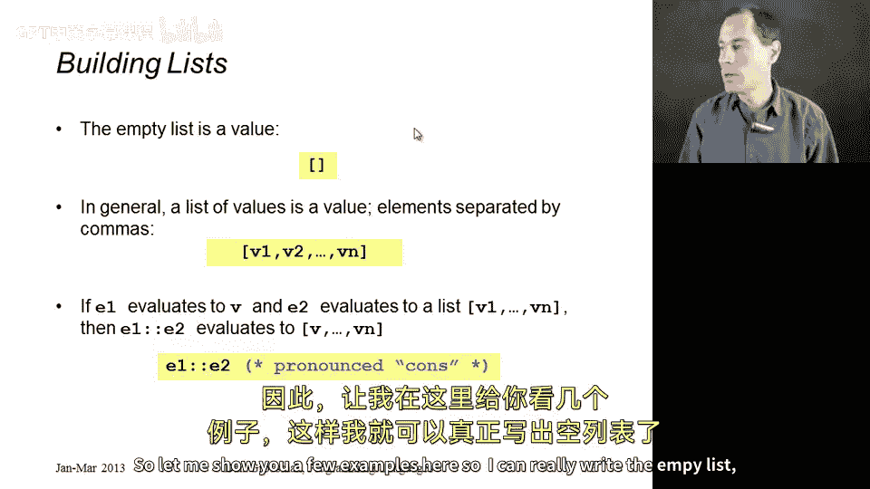

Ealuate each of those。 So this is the list holding a3 and then a 7 and then a 7。

 You don't have to have lists of。Integers， you can have lists of booles as well。

 So here's a three element bo list， but you can't mix them。 So if I had something like 3。

4 plus 5 true， then that's going to give a type error the same way 4 plus true gives a type error。

 All the elements of a list have to have the same type。 Of course， these are just values。

 I could bind a list to a variable and so on。

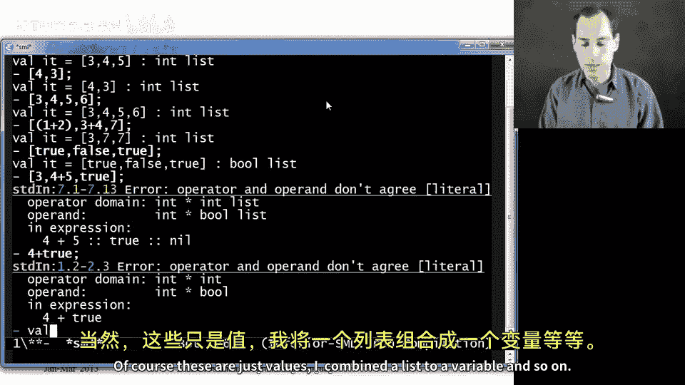

Okay， so there's one other way to build lists， which is very useful。

 And that's using this colon colon operation， which I'll pronounce cons for constructing a list。

 con CO N S。 And here's how it works。 All it does is evaluate E1 to some value。

 E2 to some value that is itself a list。 And then it makes a list that has one more element than that list that E2 evaluated to。

 namely， it puts the result of E1 on the front of the list。 So if I flip back here。 remember。

 x is this list 7，8，9。 I could say 5 cons on to x。 Now would produce the list 5，7，8，9。

 could even say6 cons on to 5 cons on to x， the parentheses would go like this。

 you don't actually need them。

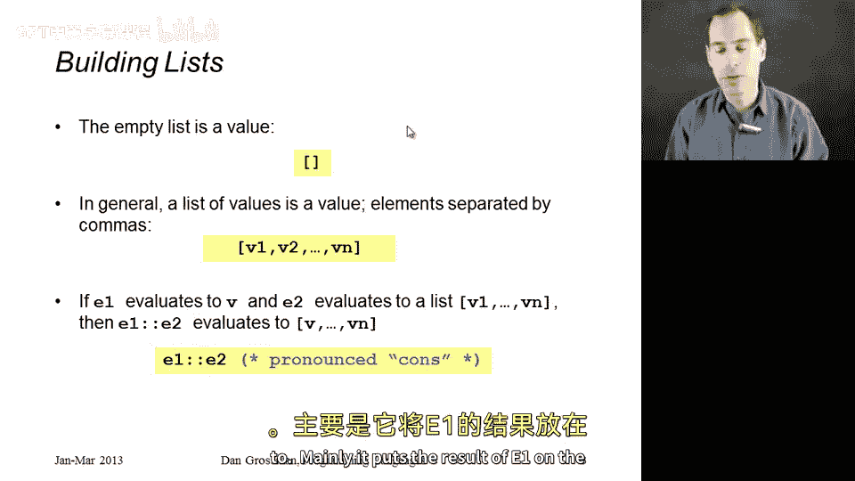

And that would be 6，5，7，8，9， and so on。 All right one thing you can't do is something like this。

 right and that just doesn't type check。 and that's because we're trying to take a list of integers。

 namely the list holding6 and put that on the front of a list of integers and the list of integers can't hold a list of integers。

 It is a list of integers。 So this is the correct thing to do。

You can have a list of a list of integers。 so I could cons that 6 onto a list of list of integers。

 maybe like this。Allright， and now indeed， I have a list holding three lists of integers。

 The first is the list6， the second， the list 7 comma 5， and the third， the list5 comma 2。

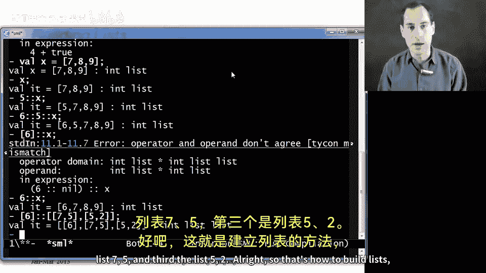

All right， so that's how to build lists。 Now， How about using them。Well。

 we need a way to access the pieces and we need to know a way to find out if our list is empty or not。

 because if we try to access the pieces of an empty list， you get a runtime error。

So let's do that test first。 There's a function N Ml called null and U L L。

 do not think of this like the null and Java or C plus plus or any number of other languages。

 This is a function that takes a list as an argument and it returns true if that list is empty and false otherwise。

 So， for example， if I ask null of X， I'll get false。 because remember， X is not the empty list。

 But if I ask null of the empty list， I get true。 And indeed， if some other list was empty。

 And I asked null of that， I would get true。

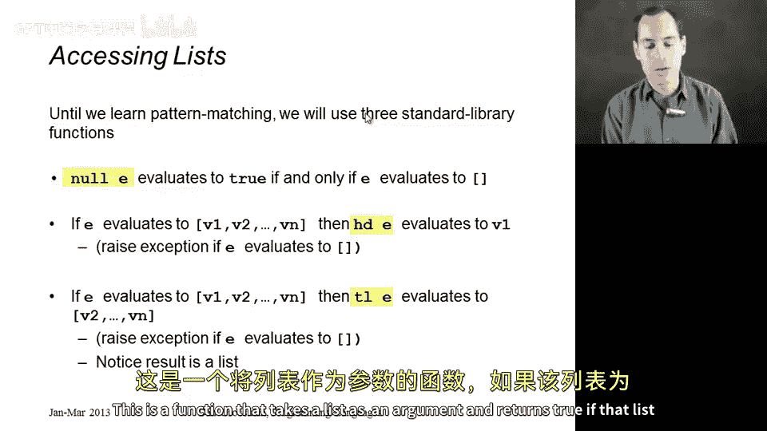

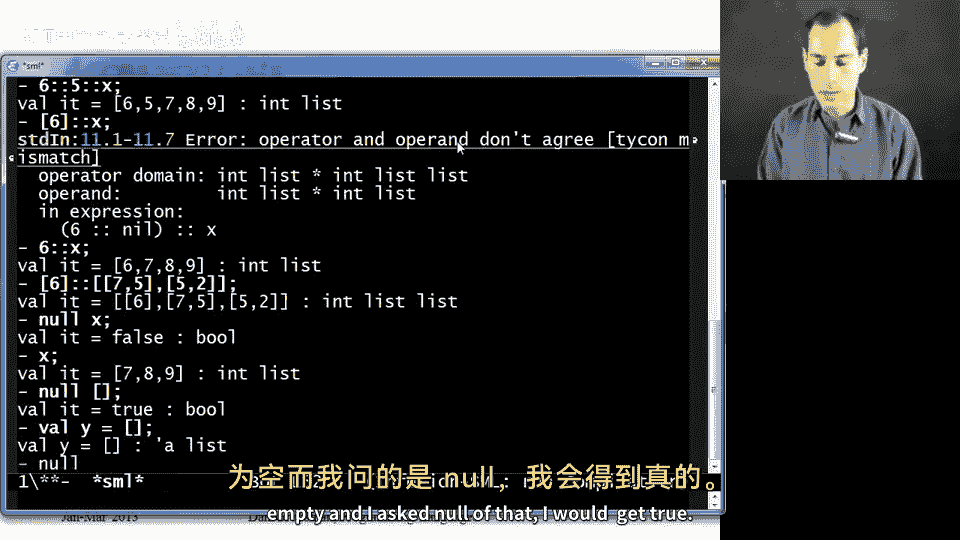

So once you know a list is not empty， it's reasonable to ask for its head。

 the first element in the list， or its tail， which is the list which is all the elements except the first one。

 and these are the two operations we are going to use to access the pieces of a list。

 so the head function spelled HD just takes a list and returns the first element， the tail function。

 takes a list and returns all the other elements。

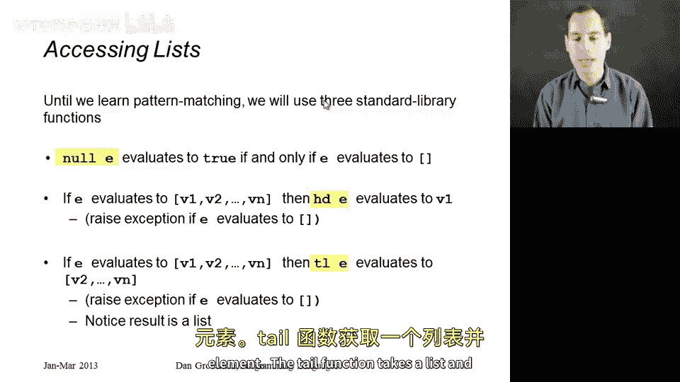

Alright， so these are just functions。 So I just call them like any other functions。

 So if I ask for head of x， I get 7 because remember， x is this example list 7，8，9。

 I can ask tail of x。 that will give me back the list 8，9。

 If I wanted the first element of that list， I'd have to ask head of tail of x。 Then I would get 8。

 You can ask， of course， also get tail of tail of x。 That would be the one element list 9。

 You could ask tail of tail of tail of x。What's the tail of a one element list。

 It's the zero element list。 So this is the empty list。 Now， if you asked header tail of that。

That would type check just fine。But if I actually evaluate this。

 I get an uncut exception for trying to take head or tail of the empty list。

 I get the same thing if I use head。嗯。

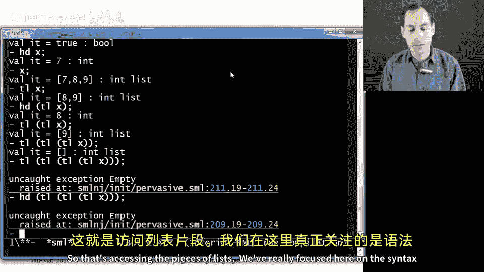

So that's accessing the pieces of lists。 we've really focused here on the syntax and the evaluation rules。

 so now let's switch to talking a little bit more about the types of lists and the types of functions for making them and using them。

So just like when we added tuples， we had a new way of writing types。

 so int star int was a pair of ints， for example， we have new types for lists。

 so for any type T the type T space list describes the values that are lists holding T elements in them so as we've seen in the examples。

 int list is a list of ints Bool list is a list of bos and so on now these things can nest。

 I think I've shown you a little bit of this if I make a list of pairs of ints。

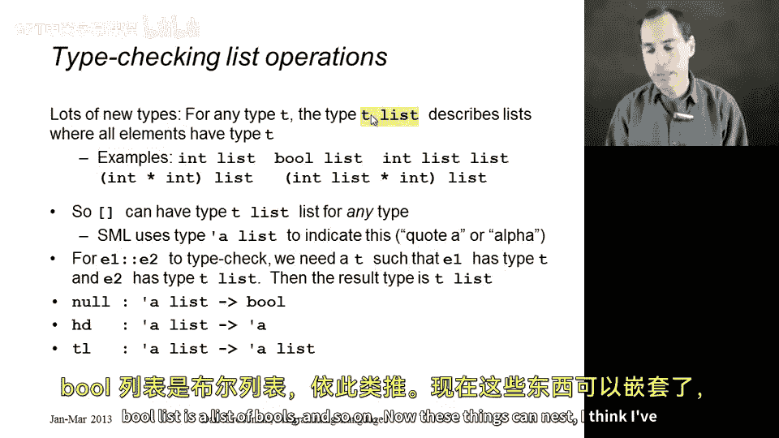

That's fine。 That's an int star int list。 It's a list whose elements have type int star int。

 If I try to do something like cons3 onto that， it won't type check。

 But if I try to cons a pair of ints onto that。

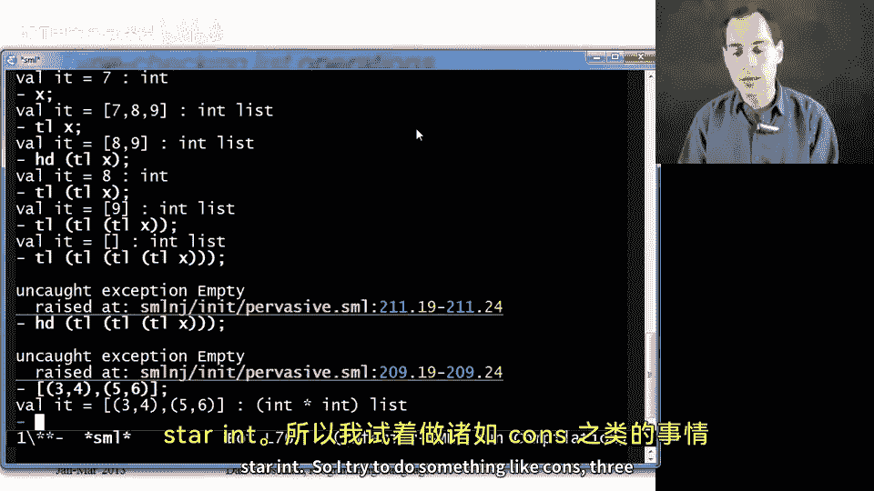

Well type check just fine。so you can nest these things however you want。

 you could have a list with another list of ins inside of it， I've shown you one of those。

 you could have a list with a pair in it where that pair has a list inside of it and so on。Alright。

 but what about the types of the operations I've given you for building lists and accessing lists。

 So probably the hardest one to understand is the type of the empty list。

 So I showed you before this has this type written quote a space list。

 And I'll always pronounce quote a as alpha like the Greek letter。

 So we say that the empty list has type alpha list。

 What that actually means is that you can replace that alpha with any type you want。

 So the empty list can have type int list。But it can also have type bo list。

 and it can also have type， int star int list and so on。

 And that's good because that's what lets us cons3 onto the empty list to get an int list or true onto the empty list to get a bo list。

 So the empty list is a special thing that can have lots of types。

 It's type is alpha list that lets it also have type T list for any type T。😊，Alright。

 so we're going to see that as a theme with these other operations as well。

 The cons operator also works for any kind of list。

 The rule is E2 has to have type T list for some T。

 and then E1 has to have type T because you have to add something of the correct type onto the list you started with。

Then we have our operations for accessing lists， testing if they're empty， getting their head。

 getting their tail。 And these really are just functions in M。 So I have their types written here。

 but we can also see that the read of Al print loop。 So null is just a function。 Again。

 it's nothing like null in other languages that takes in a list of any type alpha。 So for all types。

 Al， you can take in an alpha list。 and we'll give you back to or false。

 And that's why I can ask null with a list of integers or with a list of Boolean。

 In a couple sections later in the course， we'll learn how to write our own functions that have types with these alphas in it and other Greek letters。

 if you like。 But for now， we're just going to use ones provided to us by the ML language。

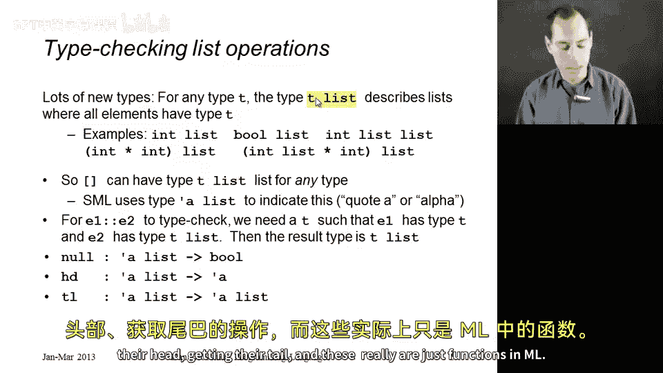

Similarly， head takes in a list of alphas for any type alpha and what you get back is an alpha。

 that's why if you call head with a list of integers。

 you get back an integer and if you call it with a list of Booleanions， you get back a Boolean。

And finally， tail takes a list and returns a list， alpha list to alpha list。

 and those two type lists have to have the same type， which is why if I say tail of three comma 4。

 I get an int list back because I pass it in in list。

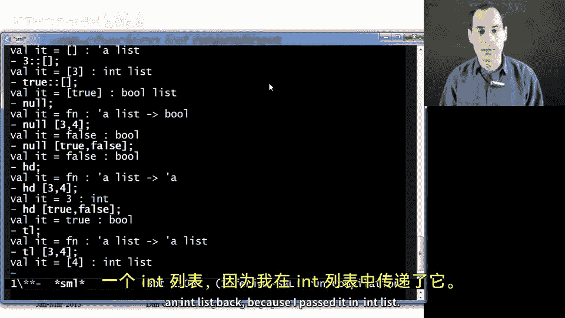

Al right， so now we know our key operations for building lists and accessing lists。

 What we'll do next is a very powerful， very common thing in functional programming。

 which is the right useful functions that take and return lists。😊。

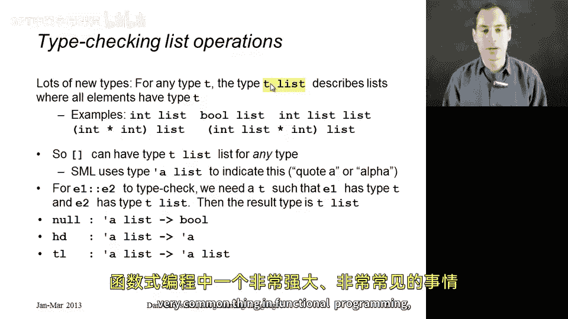