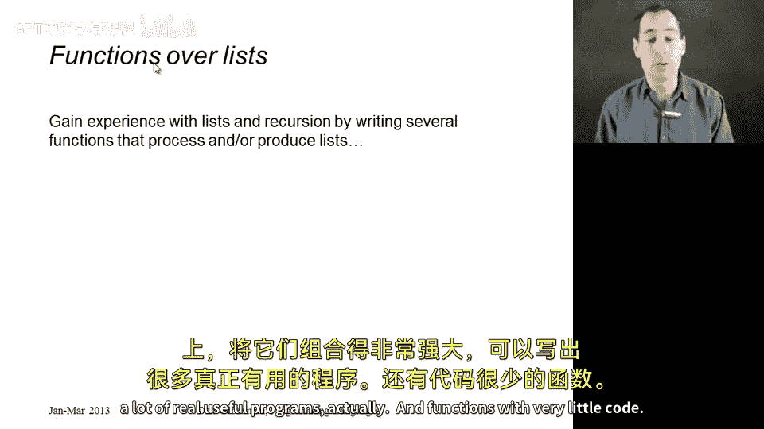
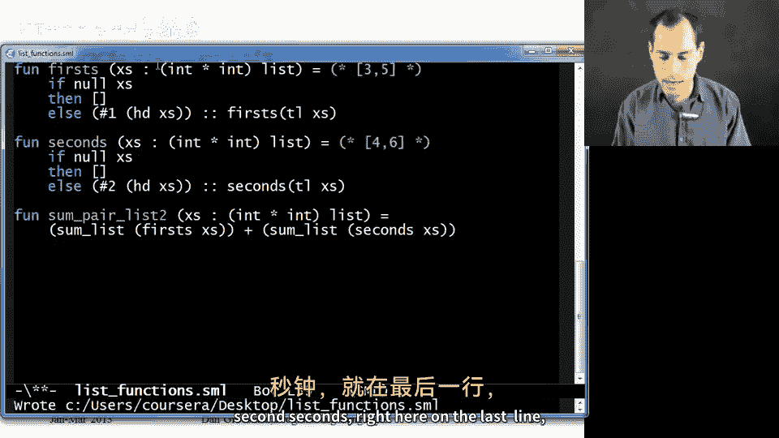
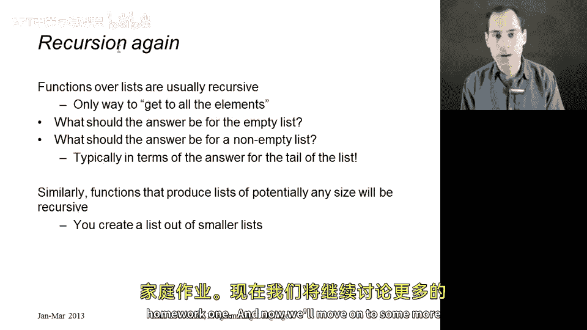

# 【编程语言 A⧸B⧸C CSE341 Coursera】华盛顿大学—中英字幕 p20 19_09_list-functions -BV1bw4m1D7MM_p20-

In this segment， we're just going to write a bunch of functions that either take lists as arguments or return lists as results。

 We're not going to learn any new language constructs instead what we're going to do is take our understanding of how recursive functions work as well as well as our understanding for how lists work and combine them very powerfully to write a lot of really useful programs actually and functions with very little code right so let's just go over here and get started。

 how about as an initial example we write a function to add up all the numbers in a list so let's just take one argument of type int list。

 I'll call it x's。 this is just a convention to give variables that hold list names that end in S like the x' is where each element in the list is an x。

 but it's just a variable name， nothing nothing more or less and now we just have to add them up now the key thing when you're processing a list is to ask what should I do if the list is empty what should I do if it's not empty well now if it is empty。

 maybe you think that's not a well-defined question。

It's perfectly well defined。 The sum of zero elements is zero。 All right。

 that's going to help us out for a recursion。 It's also what mathematicians would tell you is the proper sum over an empty collection。

 but in any case， let's just now handle the non-empty case。

 So the way you sum up the elements of a non-empty list is you take the first element and you add to it the sum of adding up。

😊，All the other elements， so take the tail of the list， sum that up to get a number。

 add to that the head。It's a simple， recursive thought that follows directly from understanding what should I do if the list is empty。

 what should I do if the list is not empty。So this is a good example of a function that processes a list。

 how about we look at this for just a second， make sure it works。

 we see indeed that its type is it takes a list of ints and it returns an int and we could try it out with。

 for example， 3，4， and5 and get 12。Allright， very good。

 So that was an example of a function that took a list and returned here a single answer like ant。

 How about a function that takes that has kind of the opposite type that takes an int and returns an int list。

😊，And what I want to do actually， is， if I call this with， for example，7。

 I want this to return7 the list， excuse me，7，6，5，4，3，2，1， something like that。

 That's just the function I want to write。Alright， so now I have a different recursive question。

 I want to say， well， when should I stop making a bigger list？ Well， that's if x is 0， So if x is 0。

 then let's just return the empty list。 That's how you count down from 0。 You just have no more list。

 Otherwise， let's put x on the front of some smaller list。 And in fact。

 the list you would get from evaluating the expression call countdown with x -1。All right。

 so that's that。 let's go over here and try this out。And indeed。

 countdown takes an int and returns an int list。 And I could say countdown of 7。 And I get 7，6，5，4，3。

2，1。 By the way， if you say countdown is 700， it will do the right thing。

 But the readta Val print loop is trying to be nice to you in figuring you don't want to see the entire answer。

 So you'll notice this dot dot dot here in the buffer。 It really is a 700 element list。

 And I could actually prove that to you by calling some list on countdown。Of 700。

 and I'll leave it to you to verify that it produced the correct sum。Allright。

 let's go back here and write some more functions。 Here's probably one of my favorite ones。

 This might look familiar。 And I'll tell you why in just a second。 Let's take two in lists。😊。

And append to them。 So to return a new list that has all the elements of X， X's。

 followed by all the elements of Y's。 Now， we'll learn later how to define this in a way that works for any kind of list。

 not just an in list， but we'll keep it simple for this segment。And boy。

 that seems like a tough thing。 In fact， this is sometimes even an interview question。

 If you're using a language like C or Java。 But let's just think about how we would do this recursively。

 We could think， well。If the first list is empty。Then it's really easy to put all of the elements of the first list in front of the elements of the second list。

 there aren't any， so just return wise。Otherwise， what would we do？

Well what I could do is I know the final result is going to start with the first element of the first list。

 and then I'm going to have to cons that on to some other list。

So how am I going to get all the rest of the elements of the first list appended to the second list。

Well， all I have to do is call a pen because that's how I append things with a smaller argument。

 So this isn't going to be an infinite loop or anything。 and then。Wise。And that's it。

 Some of these parentheses aren't needed， but that's exactly the idea。

 You append a nonempty x's by taking the first element of x's and consing it on to the result of appending the rest of x's onto Y's。

 And I promise to tell you why this might look familiar。

 This is the first half of the course logo is an implementation of this append function。All right。

 let's look at the type of this。 I'll just tell you you could type it into the repel and see this is going to take two int lists。

And it's going to return an inlist。And that's what we would expect for pending two endless together。

All right， so now let's write some functions。Over。Pairs of lists。

 especially since on your first homework assignment。

 you'll have to write a number of functions over lists that have triples in them。

 So int star int star end。 So this will be somewhat similar。 For example。

 what if we wanted to take a list of pairs of ints。Like this。

 And add together all the ints in the whole list， including both components of the pairs。 Well。

 if there is nothing in that list， then we'll get0。 That's still the right answer for the empty list。

 Otherwise， we need to take hash one of the first element of the list。

 Add to that hash2 of the first element of the list and add to that。Some parallelous tail of x's。

 This makes perfect sense， because if I do， for example， head of x's。

 that'll give me back an int star int。 and then I can do hash1 or hash2 to get the actual in。

If we wanted to test this out， we would have to call it with something like some pair list。

 three comma 4，5， comma 6， and hopefully if we tried that out， we would get 18。

Here's another interesting function。 How about first。

 So this is also going to take an instar int list。 And what I want to do is return the first component of everything。

 So， for example， if I called it with this list of pairs 3 comma 4，5 comma 6。

 I would want to get back the list。😊，3 comma 5， because that's the first component of each thing。

Well， if I start with the empty list， the list holding the first component of everything is the empty list。

Otherwise， if I know that I have a non empty list， then I'm going to take the first component of the head。

And cons that onto the first component。Of。The tell the lists。So for example。

 if you call this with three comma 4，5， comma 6， we' would end up making a recursive call with the list holding the single pair5 comma 6。

 so that would come back with the list five。By the way。

 and here I'm going to do a little bit of cut and paste in the interest of time。

We can compare this to the function seconds， which just looks like this， and it's exactly the same。

 except we would have a hash2 right there。 And， of course。

 our recursive call needs to call seconds instead of first。

 and probably a little later in the course， we'll see nice ways to not have to copy code like that to be able to write first and seconds in terms of the same helper function。

 But for now， we can at least see that if we applied this to our example。

 we would hope to get four comma 6。And then lastly。

 I would point out that one of the nice things in functional programming or really any programming is sometimes you notice that some of the functions you want to write can be done quite simply in terms of functions you already have。

 so I thought I would show you another version of summing pairs of lists so I'll just call it some pair list to so that I'm not shadowing my earlier one remember this was the thing that took our example list and returned 18 it just added everything together。

And I would argue， let me maybe try to show you everything at once here that these three of the functions I've written earlier are exactly what I need up at the top of the file。

 the very first function I wrote knows how to sum all the elements in a list。

 So what if I called that。With the first elements of the components。And then added that to summing。

All the second components。And then I would have a solution to that。 So let's go over here。

 try these things out。You can try it out on your own as well。 Oh， second。

Second right here on the last line。

Alright。Much better。 And， for example， I could call some pair list2 on3 comma 4。5， comma 6。

 And since I'm feeling bold here， how about 9 comma negative 3。And I get 24。

Alright so that's a bunch of examples。 Let me flip back to the slides here just to talk a little bit more about recursion and to remind you that it's not surprising that functions over lists are pretty much always recursive If you're given a list and you want to implement some function that accesses all the elements。

 the only way you're gonna be able to get to all those elements is which some sort of recursive processing of the tail of the list。

 So you just ask yourself， what should the answer be for the empty list。

 And how can I compute the answer for the non-empty list in terms of the tail of that list。

 That's all there is to recursion， There's nothing magical about it。Similarly。

 if you want to produce a list whose length depends on some argument you took。

 like in our countdown example， where you ended up with 7，6，5，4，3，2，1。

 you're going to need something recursive so that you can create your final result out of some smaller list that you created via recursion。

All right， so that's a lot of practice you're going to get a lot more practice on homework1。

 and now we'll move on to some more language constructs。

