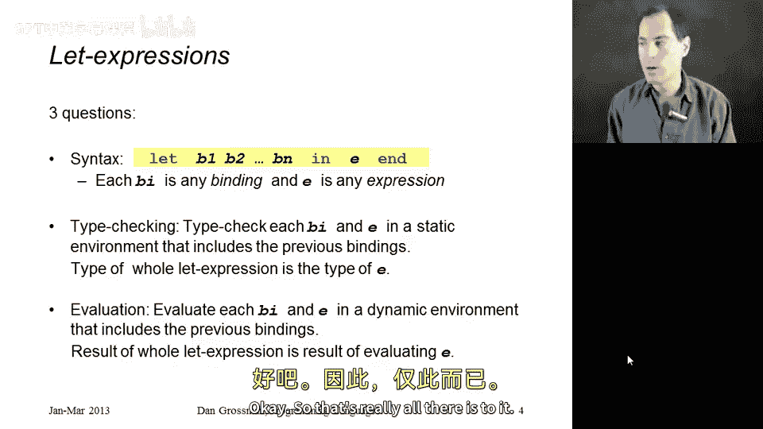
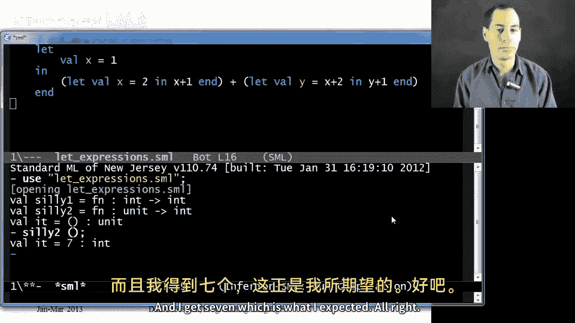
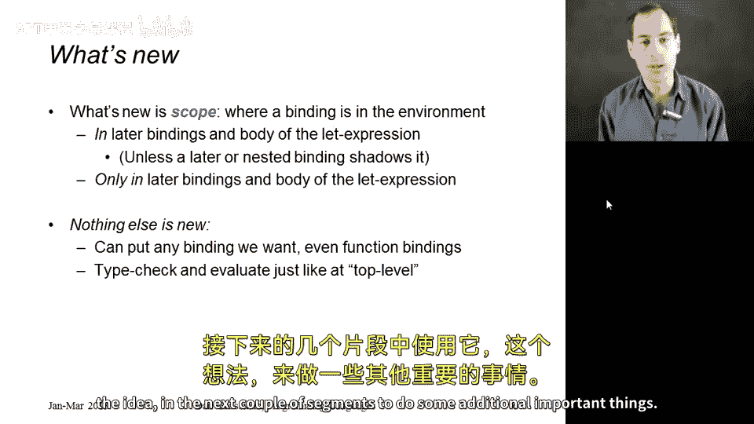

# 编程语言 A/B/C CSE341：第21章：let表达式 🧩

在本节课中，我们将要学习M语言编程基础中的最后一个重要语言特性：**let表达式**。let表达式允许我们在函数内部定义局部变量，这些变量仅在该函数内部可见，这有助于提升代码风格和便利性。我们将从语法、求值规则和类型检查三个方面详细介绍let表达式，并通过示例代码帮助初学者理解其用法。

---

## 回顾已学内容

上一节我们介绍了函数、元组和列表的构建与使用方法。我们已经学习了如何定义和使用整数、布尔值、元组和列表，以及如何通过函数参数和返回值进行编程。我们还了解了环境在顶层、函数绑定、元组和列表中的作用机制。

然而，我们尚未掌握如何在函数内部定义局部变量。局部变量可以仅在特定函数内部使用，这对于代码组织和风格非常重要。本节中，我们将学习如何使用let表达式实现这一功能。

---

## let表达式的基本语法

let表达式使用三个关键字：**let**、**in**和**end**。在**let**和**in**之间，我们可以放置任意数量的绑定；在**in**和**end**之间，我们放置一个表达式，称为let表达式的**主体**。

以下是let表达式的语法结构：

```sml
let
    binding1
    binding2
    ...
in
    body_expression
end
```

---

## 求值规则

let表达式的求值规则如下：

1. 按顺序求值每个绑定，就像它们在程序顶层一样。
2. 每个绑定可以在后续绑定中使用，但不能在之前的绑定中使用。
3. 所有绑定都可以在主体表达式中使用。
4. 主体表达式的求值结果即为整个let表达式的结果。
5. let表达式中的绑定不会影响外部环境。

---

## 类型检查规则

let表达式的类型检查规则与求值规则类似：

1. 按顺序对每个绑定进行类型检查。
2. 使用新的静态环境对后续绑定进行类型检查。
3. 所有绑定都可以在主体表达式的类型检查中使用。
4. 主体表达式的类型即为整个let表达式的类型。

---



## 示例代码

以下是使用let表达式的一些示例代码，帮助理解其用法：

### 示例1：基本let表达式

```sml
fun silly1 z =
    let
        val x = if z > 0 then z else 34
        val y = x + z + 9
    in
        x + y
    end
```

在这个示例中：
- 绑定`x`的值取决于`z`是否大于0。
- 绑定`y`的值依赖于`x`和`z`。
- 主体表达式使用`x`和`y`进行计算。

整个函数的类型为`int -> int`，因为主体表达式的类型为`int`。

---

### 示例2：嵌套let表达式

```sml
fun silly2 () =
    let
        val x = 1
    in
        (let val x = 2 in x + 1 end) +
        (let val y = x + 2 in y + 1 end)
    end
```

在这个示例中：
- 第一个let表达式中的`x`绑定为2，**遮蔽**了外层的`x`绑定。
- 第二个let表达式中的`x`引用外层的`x`绑定（值为1）。
- 两个let表达式的结果相加，得到最终结果。

运行`silly2 ()`将返回7。

---

## 作用域的概念

let表达式引入了**作用域**的概念，即绑定在程序中的可见范围。对于顶层绑定，其作用域为整个文件（除非被遮蔽）。而对于let表达式中的绑定，其作用域仅限于该表达式的后续绑定和主体部分，不会影响外部环境。



这种局部作用域机制使得我们可以灵活地定义和使用局部变量，提升代码的模块化和可读性。

---

## 总结

本节课中，我们一起学习了**let表达式**的基本语法、求值规则和类型检查方法。通过示例代码，我们了解了如何在函数内部定义局部变量，并掌握了作用域的概念。let表达式是M语言中实现局部变量的关键工具，为后续学习嵌套函数和算法优化奠定了基础。



在接下来的课程中，我们将进一步探讨如何利用let表达式实现函数嵌套，并学习其在提升算法效率方面的应用。