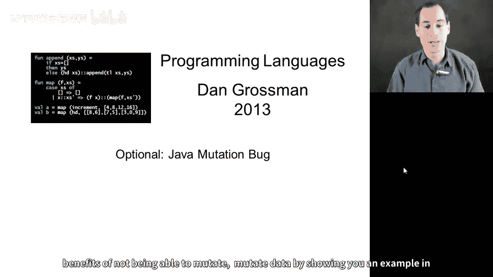
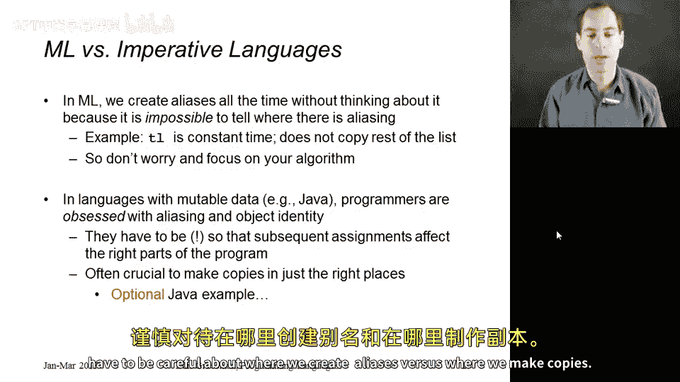
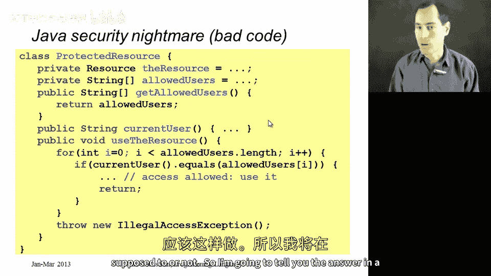
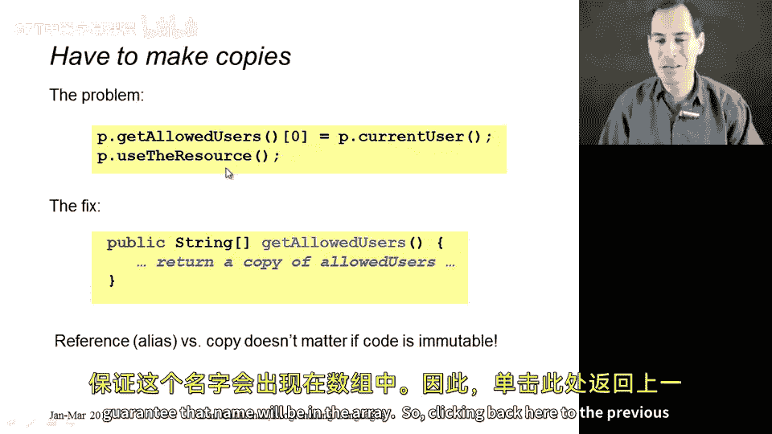
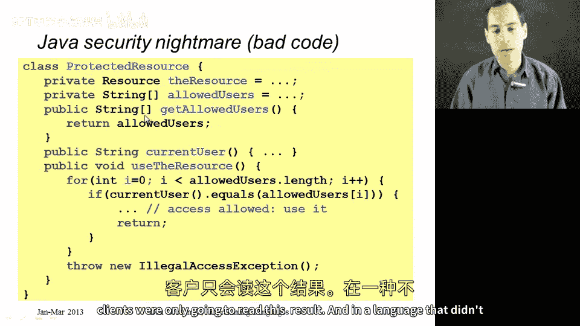
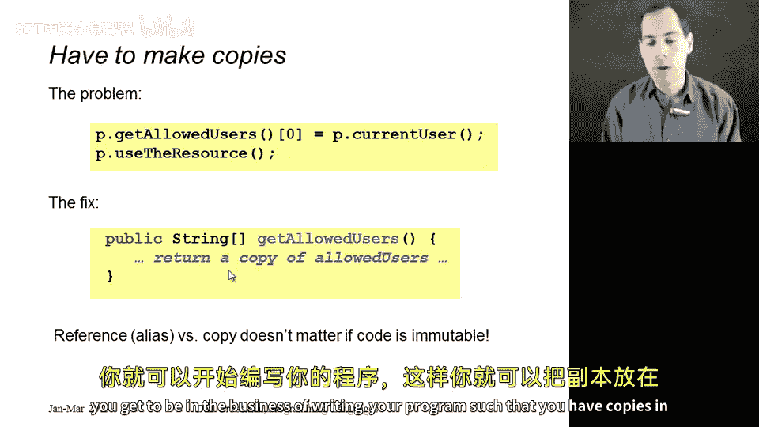

# 编程语言 A/B/C CSE341 Coursera：27：Java 可变性安全漏洞示例 🛡️

在本节中，我们将通过一个 Java 示例，继续探讨不可变数据带来的好处。本节内容为可选，但能帮助我们更深刻地理解为何在某些情况下避免数据突变至关重要。

## 概述

上一节我们讨论了在 ML 等语言中创建别名（aliases）是安全的，因为数据不可变，一个别名的更新不会影响其他别名。然而，在像 Java 这样允许数据突变的语言中，我们必须非常小心地区分何时创建别名，何时需要创建副本。本节将通过一个源自真实 Java 库安全漏洞的简化示例，展示因不当处理别名而可能引发的严重安全问题。



## 问题场景：一个“安全”的资源访问类



假设我们有一个包含私有资源的类。我们不希望所有人都能访问这个资源，只允许特定的用户列表中的用户访问。允许访问的用户名单并非秘密，但资源本身的内容是保密的。

以下是该类的核心结构：

```java
public class ResourceHolder {
    private SomeResource theResource; // 私有资源
    private String[] allowedUsers; // 允许访问的用户数组

    // 返回允许用户列表的方法
    public String[] getAllowedUsers() {
        return allowedUsers; // 注意：这里直接返回了数组引用
    }

    // 使用资源的方法
    public void useResource() {
        String currentUser = getCurrentUser(); // 获取当前用户
        for (int i = 0; i < allowedUsers.length; i++) {
            if (currentUser.equals(allowedUsers[i])) {
                // 用户在白名单中，允许访问资源
                accessResource(theResource);
                return;
            }
        }
        // 用户不在白名单中，抛出异常
        throw new SecurityException("Access denied");
    }

    // 其他辅助方法...
    private void accessResource(SomeResource r) { /* ... */ }
    private String getCurrentUser() { /* ... */ }
}
```

`useResource` 方法的逻辑看起来是合理的：它遍历 `allowedUsers` 数组，检查当前用户是否在列表中。如果在，则允许访问；如果遍历完整个数组都没找到，则拒绝访问。

## 安全隐患：别名的滥用

问题并不出在 `useResource` 方法上，而出在 `getAllowedUsers()` 方法。

以下是关键问题所在：

`getAllowedUsers()` 方法直接返回了私有字段 `allowedUsers` 数组的引用（即一个别名）。在 Java 中，数组是可变的。这意味着，任何获得此数组引用的客户端代码都可以修改数组的内容。

一个恶意的用户可以这样做：



```java
ResourceHolder holder = new ResourceHolder(...);
String[] usersAlias = holder.getAllowedUsers(); // 获得内部数组的别名
usersAlias[0] = "maliciousUser"; // 修改数组的第一个元素为当前恶意用户名
holder.useResource(); // 现在调用会成功，因为“maliciousUser”在数组里了
```

通过这种方式，恶意用户将自己添加到了允许访问的列表中，从而绕过了安全检查。这正是历史上一些 Java 标准库（如类加载器相关部分）中出现过的真实安全漏洞的简化原理。

## 解决方案：返回副本而非别名

在允许突变的语言中，修复此类问题的责任完全落在了程序员肩上。语言本身或类型系统（除非正确使用 `final` 或特定的不可变集合库）通常不会提供帮助。





修复方法是修改 `getAllowedUsers()`，使其返回 `allowedUsers` 数组的一个副本，而不是原始引用：

```java
public String[] getAllowedUsers() {
    // 创建并返回数组的一个全新副本
    return Arrays.copyOf(allowedUsers, allowedUsers.length);
}
```

这样，客户端获得的只是一个数据的快照。他们可以读取这个副本，但对其进行的任何修改都只会影响这个副本，而完全不会触及 `ResourceHolder` 类内部私有的 `allowedUsers` 数组。因此，`useResource` 方法所依赖的内部状态得到了保护。

## 总结



本节课我们一起学习了可变数据可能带来的安全隐患。我们通过一个具体的 Java 示例看到，一个看似无害的、用于“只读”目的的方法（`getAllowedUsers`），由于返回了内部可变数据的别名，可能导致严重的安全漏洞，使得未授权访问成为可能。解决之道在于，当需要向外部暴露内部状态时，如果该状态是可变的，则应返回其副本而非别名。这个例子也强化了之前的观点：如果程序的大部分数据都是不可变的，那么我们根本无需进行此类复杂的推理，从而从根本上避免这类错误。