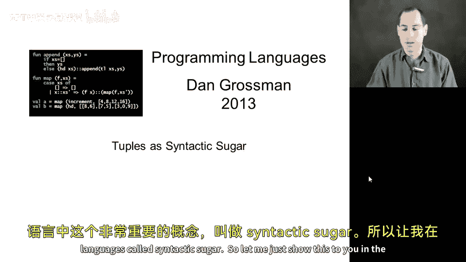
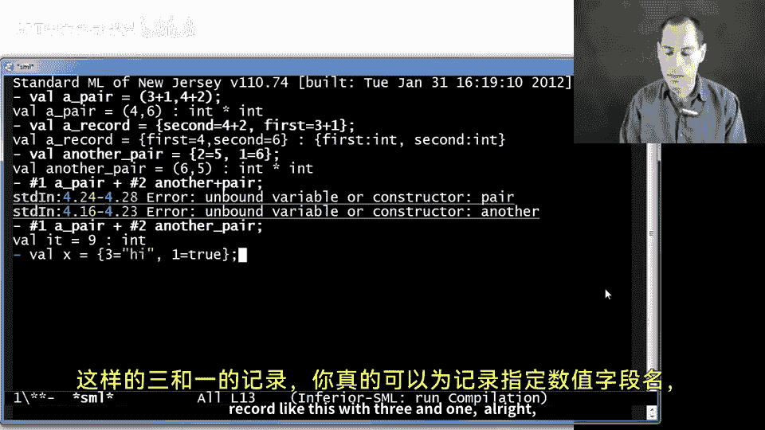
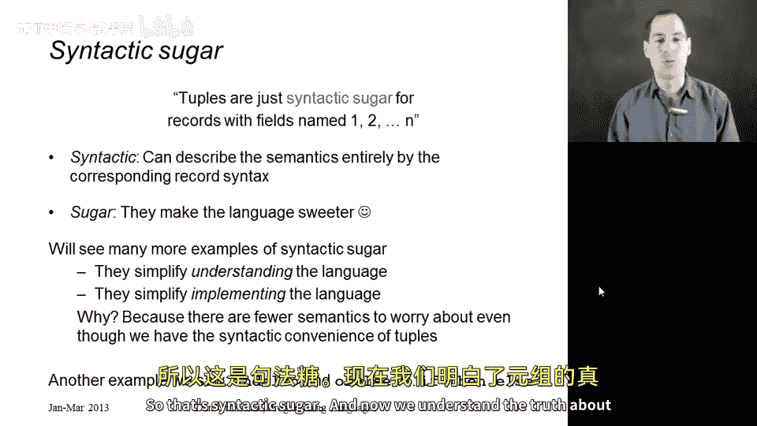

# 【编程语言 A⧸B⧸C CSE341 Coursera】华盛顿大学—中英字幕 p31 30_03_tuples-as-syntactic-sugar -BV1bw4m1D7MM_p31-

Allright， in this lecture I want to show you something kind of neat about tuples and to use that to introduce this really important concept in programming languages called syntactic sugar。

 so let me just show this to you in the repple we have already seen how to build pairs。

 Here's a pair， three plus one， four plus two creates the pair four comma 6。

 no problem and similarly we could create a record maybe with a field second of four plus two and a field first of three plus one。

Alright， so nothing unusual there。 We see that tubs and records are similar， but different， but now。

 suppose I did something kind of strange。 And I made a record， but I made the field names。

 say one and2 in whatever order I want， because the order never matters。 something like this。

 Watch this。Oh， isn't that weird？I made a record with field names 1 and 2。

 and the repple printed it out as a pair，6 comma 5， and it printed the type as int star int。

 It's like it turned my record into a tuple or something。 Of course， this is no problem， right。

 If I wanted to say take a hash one of a pair。And add to that hash2 of another pair。옷 아。Underscore。

 not plus。 There we go。 I get9 of type in。 and you know for hash 1 and hash 2。

 it doesn't really matter。 hash2 can mean get the second component of a pair。

 or it can say get field2 of a record。So it doesn't seem to matter。

And just to show that you really can give numeric field names to records if I had a record like this with three and one。

All right， well that prints a normal record， it has a type1 colon bull， three colon string。

But if I had something with three equals high，1 equals true， two equals， say3 plus 2。

Now I have a triple true 5， high Bo star and star string。

And what I want to convince you is that this is because there's no such thing as tus and M。

 There are only records and tus are just a way a different way of writing records that you as the programmer can use whenever you want。

 And the repple always chooses to use if it can。 And this is because tus are just quote unquote syntactic sugar for records。

 So let's unpack that idea a little bit here。😊，Previously， I taught you tus as though they're N。

 we gave syntax， we gave type checking rules and we gave evaluation rules。

 but we could have done something else instead。 I could have taught you records first even though they're a little more complicated and then told you that there are some special syntax for writing certain kinds of records that whenever you write the syntax for building a tuple E1 comma up to EN in parentheses that that's just another way of writing the record with field names one up to N and with the corresponding expressions and whenever you write the type for a tuple type with those stars in between the component pieces。

 that's just another way of writing the record type where again the field names are one through N。

 In other words， tus are nothing more and nothing less than records with particular field names and that is how the M language definition actually works that all there is about tus are special syntax that you can use。

When writing programs and that we print when we write the results of things in the reple。

 So you really can write things like the record 1 equals 4，2 equals 7，3 equals 9。

 It's terrible style。 I don't know why you would do this。 The Tuple syntax is easier to read。

 It's what people expect。 I just showed you this for the purpose of teaching you this idea。

 But it really is that N Ml， we have records。 Tups are just a particular way of writing particular records。

So what we say in programming language speak is that tus are just syntactic sugar for records with fields named one to up to n。

 So I'm going use this phrase a lot in the course。 So let's understand exactly what it means。

 syntactic because we can describe the semantics。 the evaluation rules and typing rules for tus。

 completely in terms of something else。 right We do this just you wrote this。

 It's like you wrote that。 and then we can use all the semantic rules we have for a different language construct。

 So that's why it's called syntactic when we do this。

 We call it sugar because it makes the language sweeter。 It's a pleasant thing to use and see。

 So we call it syntactic sugar。 We're going to see many more examples of this。

 they're syntactic sugar is great because it simplifies our understanding of the language。

 Once you understand how tus are really a form of records。

 You understand everything there is to know about tus as long as you understand records。

 They also simplify implementing the language。😊，The M implementation just has to convert topples into the corresponding records。

 and there isn't as much duplicative work to do。 We only have to implement one kind of each of type。

 instead of two。So this is far from the only example we'll see there are other examples of syntactic sugar。

 and actually you've already seen one other， you can think of E1 and also E2 as being syntactic sugar for if E1。

 then E2 else false right we can explain everything that is to explain about and also in terms of that syntactic transformation in terms of an if than else。

 and also as better style， but we can define its semantics in terms of another construct we already understand。

 So that syntactic sugar， and now we understand the truth about tus。

