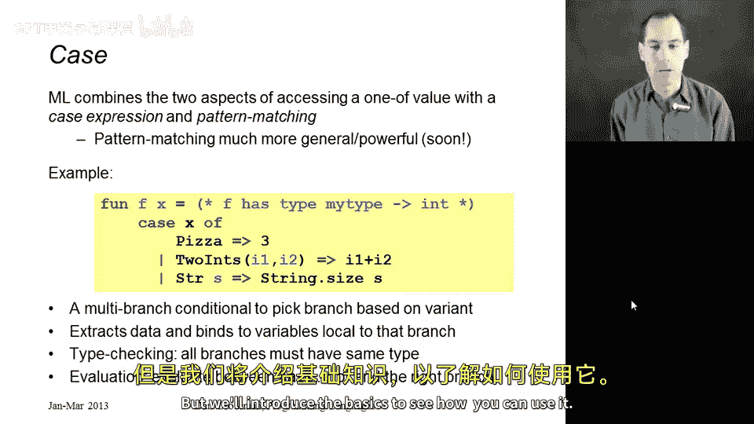
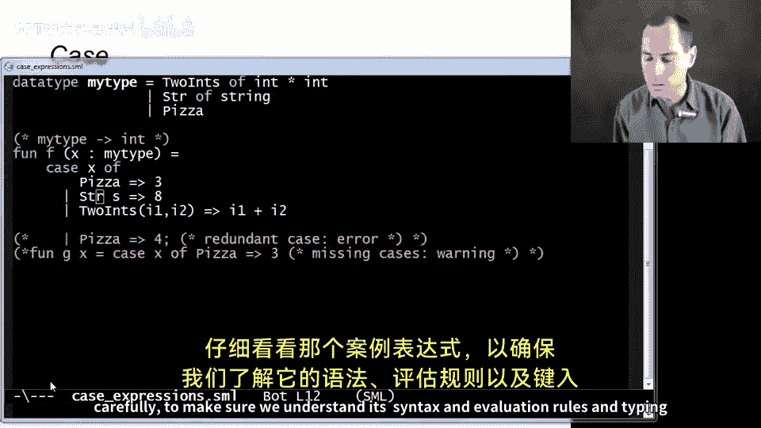
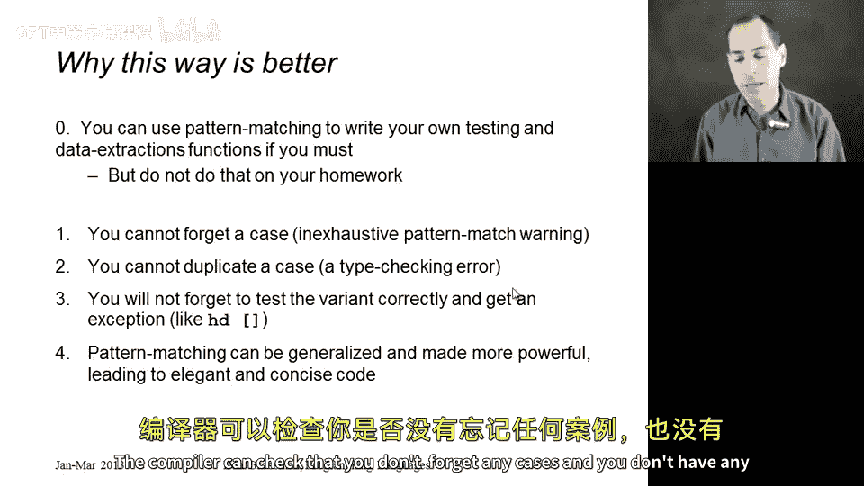
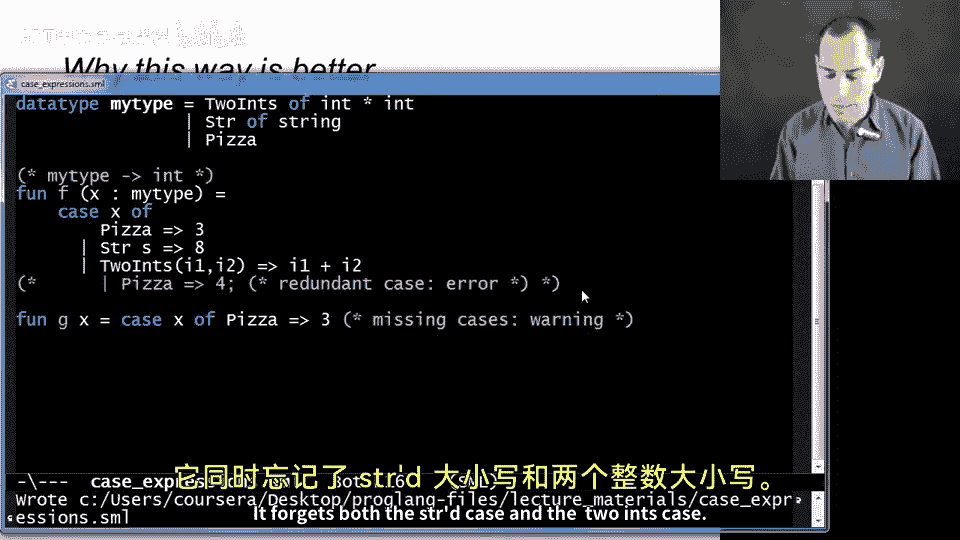
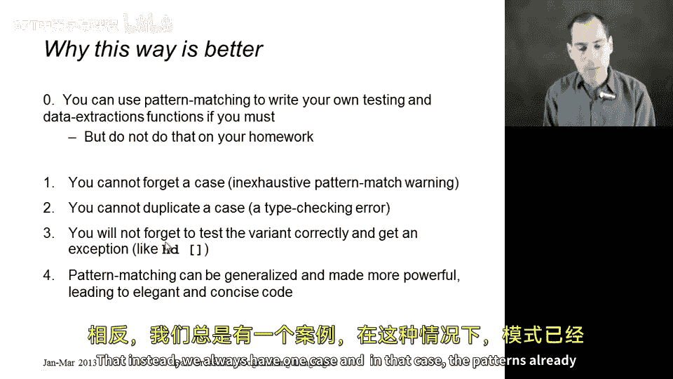
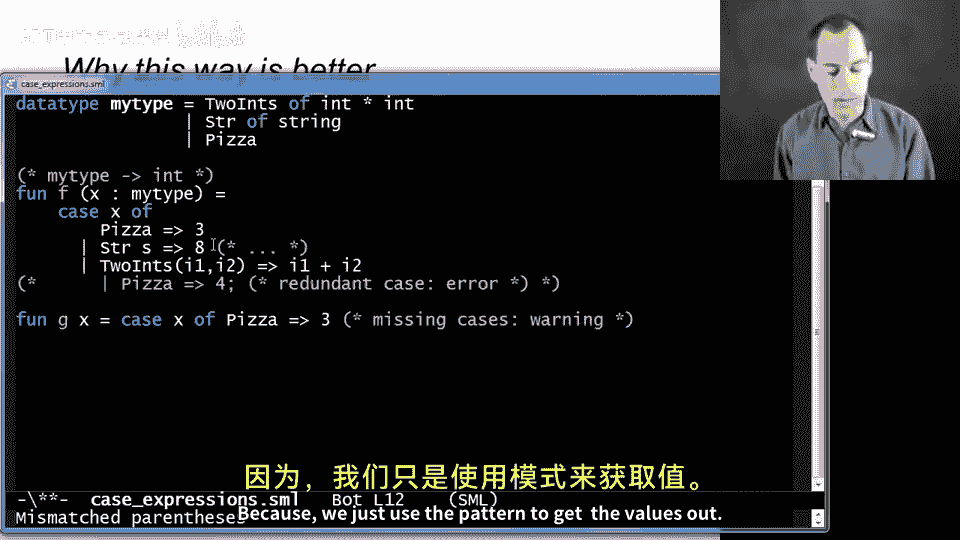
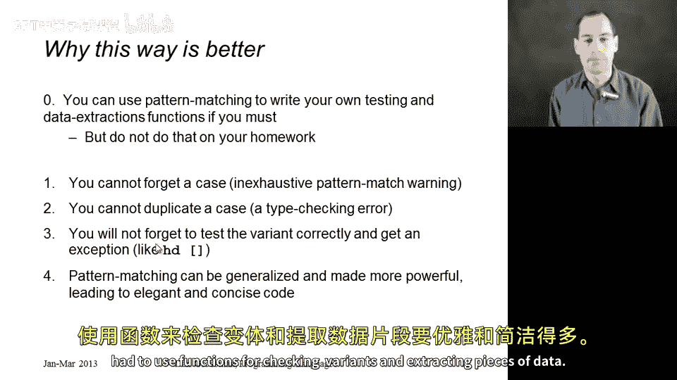

# 【编程语言 A⧸B⧸C CSE341 Coursera】华盛顿大学—中英字幕 p33 32_05_case-expressions -BV1bw4m1D7MM_p33-

All right， in this segment we're going to start studying case expressions。

 which is the ML language construct we're going to use to access values made of from the types we introduce with data type bindings so what we're going to do is we're going to take these two ideas we learned in the last segment that we need a way to figure out which variant of a one of type we have and we need a way to get the pieces out we're going to see that ML combines these into a single language construct in future segments we'll see it's actually much more powerful than we're showing here。

 but we'll introduce the basics to see how you can use it。

So you see the example here on the slide， I also have it here in M。 So in in a file here。

 So you see the same data type binding we studied before。

 So this is a new type my type that's built from one of these three constructors， either two ins。

 stir or pizza。OkayAnd now what I have is a function that's actually going to take in something of type my type。

 We could have written this here。 But as we'll see， this is not this is optional。

 It's fine to let M figure this out for us。 And this is going to take in a my type。 And in this case。

 return an int。 All So the way we're going to do this is we're going have this case expression。

 What we're going do is between the case in the of， which are both keywords。

 we're going to have a value that was built out of a data type。 In this case， my type。

 If we had a different data type binding， we can use case expressions on that， too。

 We use case expressions to access the pieces of a data type。Then what we have。

 as indicated by the English word case is several cases and each of these cases is separated by this pipe character。

 and what this basically says is if it's a pizza， then take this branch， so like an if then else。

 it's something with branches and evaluate this thing on the right， so you'll get three。

If it's a string， then I'll take this branch and get an eight。But what is this S for。

 This S is a variable that we will bind to the data under the string constructor。 Now。

 we're not using that here because we didn't want to use the string， but we could have。

 And this variable S would be in scope in this branch。And finally， in this last branch。

 we actually are going to use this idea。 We're going to say take this branch if X was made from the two int constructor and when evaluating this corresponding expression。

 let I1 be the first int made from the two ins。 and I2 be the second int that was provided when we made the two ins。

 And so in this case， we'll add the two branches together。 All right， so let's try that out。😊。

Let's go over here， and use。This file。And sure enough， F is just a function from type my type to int。

 and now we could try calling F with pizza。And we'll get three， or we could call F with stir of high。

And we'll get8。 Notice， by the way， we can't call F with just high， right， high as type string。

 right， not type my type。 So if we do this， we'll get a type error message that this is not the type that F expects。

 F's argument X has to be a my type。 And you can tell that because of these patterns that we use to match against the value。

And now probably the most interesting case， if we call F with two ins of some pair of ints。

 like maybe seven common9。We will get 16。All right， so that's how you use it， of course。

 if we had had some v x that equals a stir of high， then we could have called F with x。

 and this would all work as usual。So now let's go back and look at that case expression a little more carefully to make sure we understand its syntax and evaluation rules and typing rules and I think the slides will help us do that so here's the same code so we're really focusing in on this case expression and in one sense it's a multi- branchch conditional it's like an if then else if then else that's nested what we do is we evaluate this expression between case and of that's going to give us some value。

And then we're going to see which branch matches。 So this is called pattern matching。

 because to the left of this arrow， the equal angle bracket are different patterns。

 And we take the first branch that matches。 and the definition of matching is built from the same constructor。

Alright， once we built the same match the constructor。

 we then use these variables that are part of the pattern to introduce local bindings。

 So in this case， it's like a little let expression。

 So this is letting I1 be the first int and I2 being the second int in the pair that was made with the two ins。

 And then this branch we're letting s be the underlying string。

 And we can choose whatever variable names we want。

 And the scope of those variables is just that branch。

 so the pattern match far is first find what branch matches and bind the variables appropriately。

 then in that extended environment evaluate the expression on the right。

 and that's the answer for the whole thing。 So this example is slightly different than what I showed you in the code。

 but in each case we have some expression over here。 They all have to have the same type。

 just like a then branch in an else's branch have to have the same type because。😊。

The result of the entire case expression is going to be the result of whatever branches expression we evaluate。

 And so the type of the entire case expression has to be the type of those branches。Okay。

So that is a case expression in general， let's now generalize it past our example。

 we're going to have some expression between the case and the of。

 and then we're going to have a bunch of branches， each branch is a pattern which I'm writing with P here and then this equal angle bracket and then an expression。

 and we separate them with these pipe characters。So a pattern is a new kind of thing。

 I know that they look like expressions。 If I go back here。

2 ants I1 comma I2 kind of looks like an expression。 It is not an expression。 Okay。

 it is something we are going to use to to do the matching and then to introduce variable bindings。

 Okay， for the corresponding branch。 So for today， in this segment。

 Each pattern is just a constructor name， and then the correct number of variables。 So for pizza。

 it was just the constructor name for stir it was a constructor name in one variable for two ants。

 it was a constructor name and then two variables in parentheses separated by comms。

 if you had three arguments。 it would be similar and so on。 So syntactically。

 they look like expressions。 but we don't evaluate them。 They're not expressions。

 we use them for pattern matching。 And then what we do is we match the result of evaluating E0 against those patterns。

😊，Get the variables bound to the corresponding pieces and evaluate the same branch on the right hand side。

So why is this better than a different model where we just provided functions like ist and gettR data。

 Like I said， Ml could have done。 Well， first of all， if you really wanted such functions。

 you could define them yourself。 You could use pattern matching to write a function of type my type arrow bo that for stir return true and for any two ins or pizza return false。

 do not do that， it's poor style， you're giving up most the benefits of pattern matching。

 but certainly case expressions are just as powerful as that approach。

 because we can use case expressions to do that approach。OkayBut these next two reasons。

 one and two are probably the most important ones， which is that thanks to writing all your different possibilities together in a case expression。

 the compiler can check that you don't forget any cases and you don't have any redundant cases。

 So let me show that by flipping back here。 You might have seen I had some commented out things here。

 Suppose I uncomment this last case。 So now I have two branches for pizza。 Allright。

 could be an error that you make。 If you come over your SMl always restart， by the way， Otherwise。

 you end up shadowing the constructors。 It's very confusing。 case expressions SML。

Oh， look at that。 It no longer compiles。 And in fact。

 it actually says that we have a redundant match。 It's a compile time error because it knows that this fourth branch in my code could never be taken。

 that's different file， there we go。 that this fourth branch could never be taken。

 And so it's a compile time error since you know there'd be no reason to write such code。 right。

 So that's very helpful suppose conversely that we forget our two inch case。

 or rather than showing you that， how about I leave that in。

 and I show you this other function that forgets a couple cases。

 It forgets both the stirircase and the two inch case。 Well， in this case。

 I believe we will just get a warning if I recall correctly。

 but a warning that we would be very wise to heed And it says warning match non-exhausive。

 And indeed， if you take that function G， and you call it with stir of high。

You now get a runtime exception saying I tried to find a matching pattern and I didn't。

 and if we don't have any of those warnings when we compile， then we know that will never happen。

 So this is a nice guarantee we're getting from the type checker。

 which is looking at all our patterns and making sure we've covered all the possibilities。Okay。

 so that's the first two reasons。 The third reason is that we'll never。

 if we use case expressions the way they're intended。

 do things that lead to errors like head of the empty list。 Allright。

 that instead we always have one case。 and in that case， the patterns already extracted the values。

 So when we had in our program over here。

Stir of s。 we already know in this case that S is going to be down to the underlying string。

 and we'll never make the mistake that over here in this branch of trying to get one of the int values under two ins because we just use the pattern to get the values out And finally。

 we're not done showing you case expressions。 right this is the simple use of them but we're going to generalize them。

 It turns out patterns can be much richer and more powerful than what we've shown so far and we'll be able to use those patterns to write very elegant and very concise code。

 much more elegant and concise than if we had to use functions for checking variants and extracting pieces of data。

