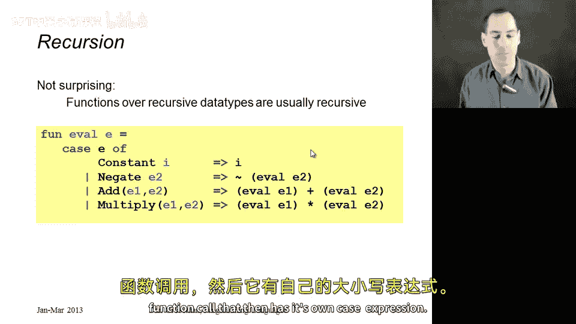
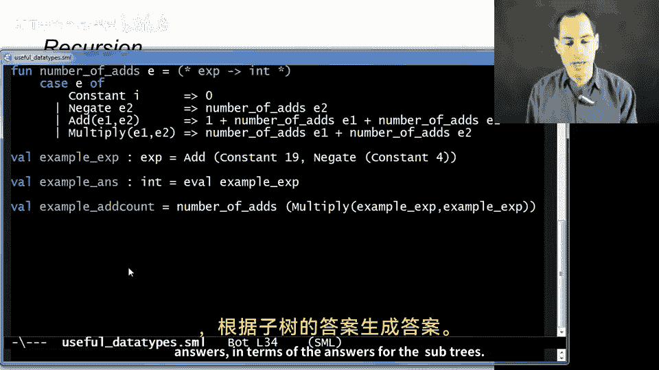

# 编程语言 A/B/C CSE341：34：实用数据类型示例 🎯

在本节课中，我们将学习数据类型的实际应用。我们将通过几个具体示例，展示如何使用数据类型绑定来建模现实世界中的概念，并编写操作这些数据的函数。

---

## 枚举类型示例 ♠️

上一节我们介绍了数据类型的基本概念，本节中我们来看看它的一个简单应用：枚举。

假设我们需要表示扑克牌的花色。在英语中，每张扑克牌的花色是梅花、方块、红心或黑桃之一。使用数据类型可以完美地表示这个概念：

```sml
datatype suit = Club | Diamond | Heart | Spade
```

以下是使用枚举的优势：
*   避免使用魔术数字（如用1代表梅花，2代表方块），代码更易读。
*   获得编译器的类型检查支持，减少错误。
*   处理所有可能情况时，可以使用`case`表达式，为每个构造器提供一个分支。

如果不使用枚举，代码将难以维护和理解。

---

## 带数据的构造器示例 🔢

现在，我们来看一个构造器可以携带数据的例子：扑克牌的牌面大小。

牌面可以是数字（2-10），也可以是J、Q、K、A。我们可以这样定义：

```sml
datatype rank = Num of int | Jack | Queen | King | Ace
```

这里，`Num`构造器携带一个`int`类型的数据。虽然这个定义没有限制`int`必须在2到10之间，但它提供了一种简洁、可读性高的方式来表示牌面。之后，我们可以创建一个记录类型，将`suit`和`rank`组合起来，表示一张完整的扑克牌。

---

## “多选一”与“全都要”的对比 ⚖️

理解何时使用“多选一”类型（`datatype`）与“全都要”类型（记录/元组）至关重要。

假设我们要表示学生的身份标识。有些学生有学号，而另一些旁听生只有姓名。这是一个典型的“多选一”场景：

```sml
datatype id = StudentNum of int
            | Name of {first:string, middle:string option, last:string}
```

然而，学生有时会错误地使用记录类型来模拟这种情况，例如定义一个包含`student_num`、`first`、`middle`、`last`所有字段的记录，并约定当`student_num`为-1时使用姓名字段。这种做法很差，因为它：
*   放弃了语言对“多选一”的强制保障。
*   依赖注释和特殊值（如-1），容易出错且不清晰。

相反，如果我们要建模的场景是“每个学生都有姓名，并且**可能**有一个学号”，那么这就是一个“全都要”但包含可选字段的场景，应使用记录加`option`类型：

```sml
type student_info = { student_num : int option,
                      first : string,
                      middle : string option,
                      last : string }
```

设计软件时，关键在于理解数据的内在关系，并选择正确的复合类型来直接体现这种关系。

---

## 递归数据类型与函数示例 🌳

最后，我们探讨一个更强大的概念：递归数据类型。这对于表示像程序语言本身这样的嵌套结构非常有用。

我们定义一个表示简单算术表达式的数据类型：

```sml
datatype exp = Constant of int
             | Negate of exp
             | Add of exp * exp
             | Multiply of exp * exp
```

这个定义是递归的，因为`Negate`、`Add`、`Multiply`这些构造器内部又包含了`exp`类型的数据。它定义了一棵树：叶子节点是带整数的`Constant`，内部节点是`Negate`（一个子节点）、`Add`或`Multiply`（两个子节点）。

例如，表达式 `(10+9) + (-4)` 可以构建为：
```sml
Add(Constant(19), Negate(Constant(4)))
```

其对应的树形结构如下：
```
     Add
    /   \
  19    Negate
          |
          4
```

定义了数据类型后，我们可以编写递归函数来处理它。最明显的函数是求值器`eval`：

```sml
fun eval (e : exp) =
    case e of
        Constant i => i
      | Negate e2 => ~ (eval e2)
      | Add(e1, e2) => (eval e1) + (eval e2)
      | Multiply(e1, e2) => (eval e1) * (eval e2)
```



函数通过`case`表达式分析`exp`的具体形式。对于`Constant`，直接返回值。对于`Negate`、`Add`、`Multiply`，则递归地对子表达式调用`eval`，然后将结果组合。处理递归数据类型的函数本身也常常是递归的。

我们还可以编写其他函数，例如计算表达式中加法运算的数量：

```sml
fun number_of_adds (e : exp) =
    case e of
        Constant i => 0
      | Negate e2 => number_of_adds e2
      | Add(e1, e2) => 1 + (number_of_adds e1) + (number_of_adds e2)
      | Multiply(e1, e2) => (number_of_adds e1) + (number_of_adds e2)
```

---

## 总结 📚

本节课中我们一起学习了数据类型的多种实用模式：
1.  **枚举**：用于表示固定集合的值，使代码清晰、安全。
2.  **带数据的构造器**：为类型变体关联具体信息。
3.  **“多选一”建模**：正确使用`datatype`来精确表示互斥的可能性，并与记录类型进行对比。
4.  **递归数据类型**：用于定义树状等嵌套结构，并编写相应的递归函数来处理它们。



数据类型是强大工具，能帮助我们精确建模问题域，并编写出结构清晰、易于维护的代码。