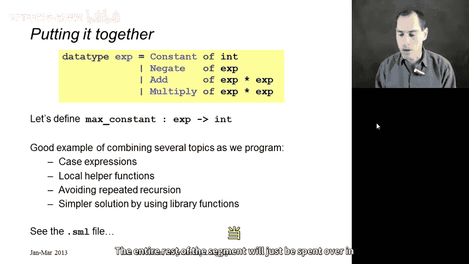
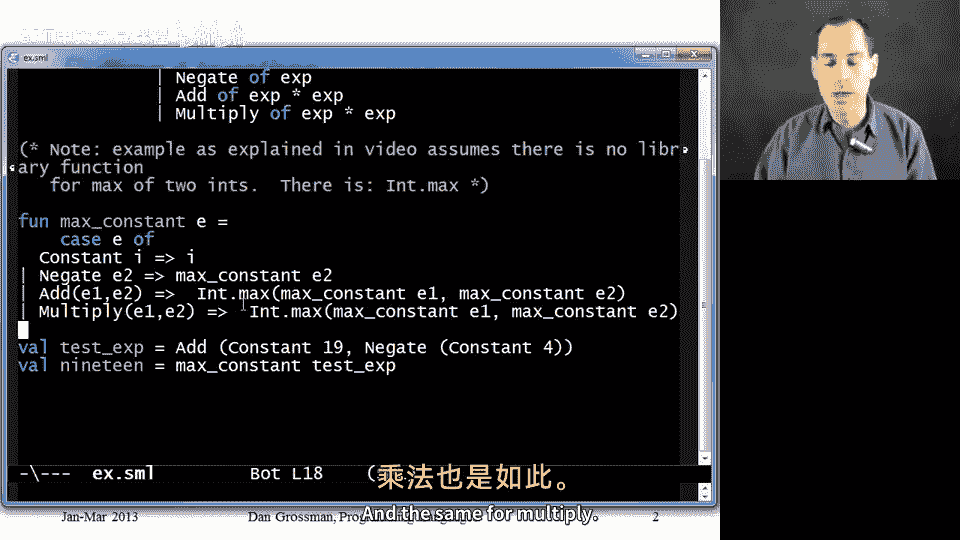

# 编程语言 A/B/C CSE341：第36讲：另一个表达式示例教程 🧮

在本节课中，我们将学习如何编写一个函数来查找算术表达式中的最大常量。我们将使用一个已定义的数据类型，并通过多个步骤逐步优化我们的解决方案，确保代码既正确又高效。

---

## 概述

本节课的目标是演示如何编写一个函数，该函数能够在一个算术表达式中找到最大的常量。我们将使用一个数据类型绑定，该数据类型定义了常量、取反、加法和乘法等构造器。我们将从基础实现开始，逐步优化，最终得到一个简洁高效的解决方案。

---

## 数据类型定义



首先，我们定义了一个数据类型 `exp`，用于表示算术表达式。它包含以下构造器：

- `Constant`：表示一个整数常量。
- `Negate`：表示对一个表达式的取反操作。
- `Add`：表示两个表达式的加法操作。
- `Multiply`：表示两个表达式的乘法操作。

以下是数据类型的定义：

```sml
datatype exp = Constant of int
             | Negate of exp
             | Add of exp * exp
             | Multiply of exp * exp
```

---

## 函数目标

我们需要编写一个名为 `max_constant` 的函数，其类型为 `exp -> int`。该函数的功能是查找表达式中所有常量中的最大值。

---

## 测试用例

在编写函数之前，我们先创建一个测试用例，以确保函数的行为符合预期。以下是测试用例：

```sml
val test_exp = Add (Constant 19, Negate (Constant 4))
val test_result = max_constant test_exp
```

测试表达式的最大常量应为 `19`。

---

## 初始实现

首先，我们使用 `case` 表达式对输入表达式进行模式匹配。以下是初始实现：

```sml
fun max_constant e =
    case e of
        Constant i => i
      | Negate e2 => max_constant e2
      | Add (e1, e2) =>
          if max_constant e1 > max_constant e2
          then max_constant e1
          else max_constant e2
      | Multiply (e1, e2) =>
          if max_constant e1 > max_constant e2
          then max_constant e1
          else max_constant e2
```

这个实现虽然正确，但存在效率问题，因为它会多次递归计算相同子表达式的最大常量。

---

## 优化：使用 `let` 绑定

为了避免重复计算，我们使用 `let` 绑定来存储递归调用的结果。以下是优化后的实现：

```sml
fun max_constant e =
    case e of
        Constant i => i
      | Negate e2 => max_constant e2
      | Add (e1, e2) =>
          let
              val m1 = max_constant e1
              val m2 = max_constant e2
          in
              if m1 > m2 then m1 else m2
          end
      | Multiply (e1, e2) =>
          let
              val m1 = max_constant e1
              val m2 = max_constant e2
          in
              if m1 > m2 then m1 else m2
          end
```

这个版本避免了重复计算，提高了效率。

---

## 优化：提取辅助函数

注意到 `Add` 和 `Multiply` 分支的代码非常相似，我们可以提取一个辅助函数来避免代码重复。以下是优化后的实现：

```sml
fun max_constant e =
    let
        fun max_of_two (e1, e2) =
            let
                val m1 = max_constant e1
                val m2 = max_constant e2
            in
                if m1 > m2 then m1 else m2
            end
    in
        case e of
            Constant i => i
          | Negate e2 => max_constant e2
          | Add (e1, e2) => max_of_two (e1, e2)
          | Multiply (e1, e2) => max_of_two (e1, e2)
    end
```

这个版本通过辅助函数 `max_of_two` 减少了代码重复。

---

## 优化：使用内置函数

SML 标准库提供了一个内置函数 `Int.max`，用于计算两个整数的最大值。我们可以直接使用它来简化代码。以下是优化后的实现：

```sml
fun max_constant e =
    case e of
        Constant i => i
      | Negate e2 => max_constant e2
      | Add (e1, e2) => Int.max (max_constant e1, max_constant e2)
      | Multiply (e1, e2) => Int.max (max_constant e1, max_constant e2)
```

这个版本更加简洁，并且仍然保持了高效性。

---

## 最终实现

经过多次优化，我们得到了一个简洁且高效的最终实现：

```sml
fun max_constant e =
    case e of
        Constant i => i
      | Negate e2 => max_constant e2
      | Add (e1, e2) => Int.max (max_constant e1, max_constant e2)
      | Multiply (e1, e2) => Int.max (max_constant e1, max_constant e2)
```

这个实现通过模式匹配和内置函数 `Int.max` 高效地计算了表达式的最大常量。

---

## 总结

在本节课中，我们一起学习了如何编写一个函数来查找算术表达式中的最大常量。我们从基础实现开始，逐步优化，最终得到了一个简洁高效的解决方案。通过这个过程，我们复习了以下概念：

- 使用 `case` 表达式进行模式匹配。
- 使用 `let` 绑定避免重复计算。
- 提取辅助函数减少代码重复。
- 利用内置函数简化代码。



希望这个示例能够帮助你更好地理解如何编写高效且优雅的 SML 函数！