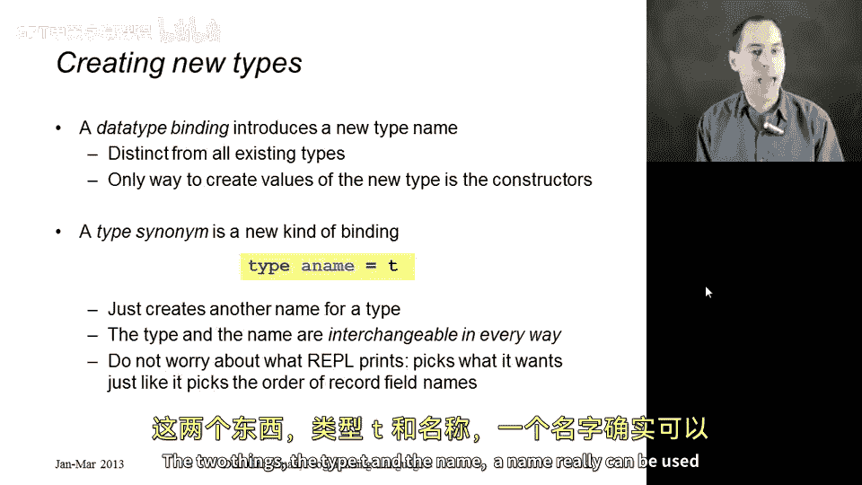
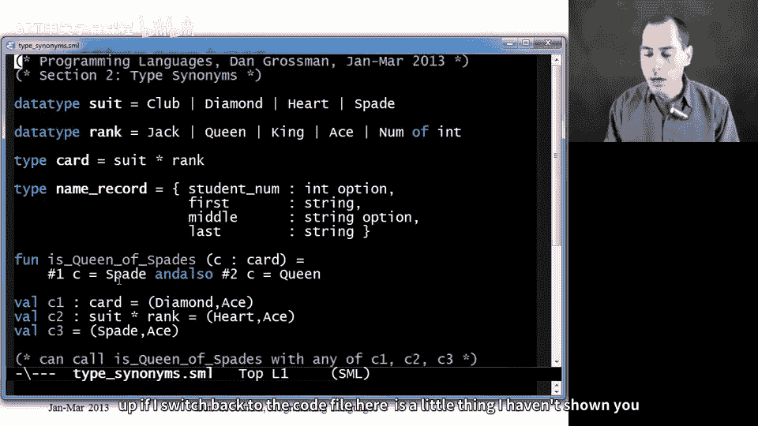
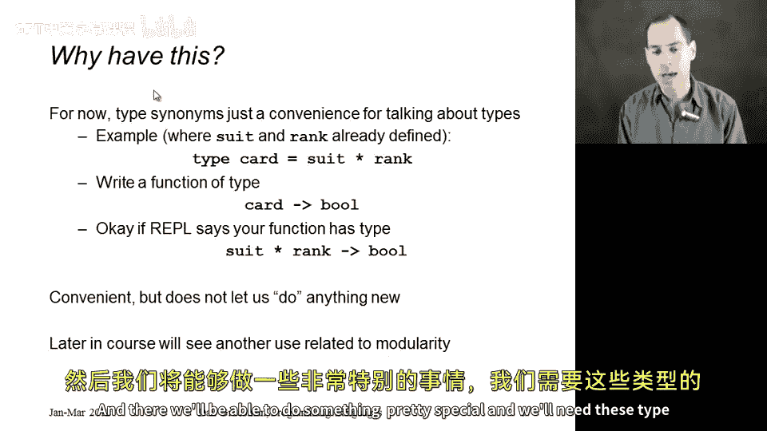

# 编程语言 A/B/C CSE341：第37讲：类型别名 📝

在本节课中，我们将要学习**类型别名**。这是一种与之前学过的数据类型绑定不同的新概念。虽然它有点偏离数据类型绑定和case表达式的主线，但对完成接下来的作业非常有帮助，并且与数据类型绑定形成了很好的对比。

## 概述

数据类型绑定会引入一个全新的类型名称，这个新类型与其他所有类型都不同。创建该类型实例的唯一方法，就是使用该数据类型绑定中定义的构造函数。

而**类型别名**则是一个全新的结构。它并不创建新类型，只是为**已有的类型**创建一个新的名称。接下来，我们将详细探讨它的语法、用途以及与数据类型绑定的区别。

## 类型别名的语法与含义

类型别名的语法非常简单。你只需要使用关键字 `type`（注意，不是 `datatype`），后面跟上你为类型起的新名字，然后是等号 `=`，最后是已有的类型。

```sml
type card = suit * rank
```

这里的英文单词“synonym”（同义词）非常贴切。它只是为已经存在的类型（例如 `suit * rank`）创建了另一个名字（`card`）。现在，我们可以在任何使用 `suit * rank` 的地方使用 `card`，反之亦然。它们在所有方面都是可以互换的。

你甚至不必担心交互环境（REPL）会打印出哪一个名字。类型 `card` 和类型 `suit * rank` 完全可以互换使用。



## 代码示例：扑克牌

为了更好地理解，让我们看一些ML代码。首先，我们有两个之前见过的数据类型绑定，用于定义扑克牌的**花色**和**点数**。

```sml
datatype suit = Clubs | Diamonds | Hearts | Spades
datatype rank = Jack | Queen | King | Ace | Num of int
```

现在，我们引入一个类型别名。这个别名提醒我们，并且允许我们在程序中，将“花色和点数的配对”视为一个名为 `card` 的类型。

```sml
type card = suit * rank
```

现在，`card` 这个新类型名称就存在于我们的环境中了。它意味着 `suit * rank` 这个配对类型。因此，写 `suit * rank` 或写 `card` 都是可以的。

## 类型别名的常见用法

类型别名还有一个常见的用法，就是为**记录类型**命名。直接写出完整的记录类型定义非常麻烦，也不便于记忆和引用。

例如，与其写注释说明“这个记录类型用于描述我班上学生的姓名和学号”，不如直接在程序中给这个类型起个名字。

```sml
type student = {name: string, id: int}
```

然后，你就可以在程序中任何需要的地方使用 `student` 这个类型名了。

## 类型的可互换性

现在，让我们重点强调这种可互换性。我写了一个简短的函数 `is_queen_of_spades`，它接受一个类型为 `card` 的参数 `c`。

```sml
fun is_queen_of_spades (c: card) =
    (#1 c) = Spades andalso (#2 c) = Queen
```

注意，我可以在函数签名中使用上面定义的 `card` 这个类型名。

接下来，我们看三个变量绑定：`c1`, `c2`, `c3`。

```sml
val c1 : card = (Spades, Ace)
val c2 : suit * rank = (Spades, Ace)
val c3 = (Spades, Ace)
```

`c3` 是我们最常用的变量绑定写法，我直接创建了一个 `(Spades, Ace)` 对。你可能会问，它的类型是什么？是 `suit * rank` 还是 `card`？

答案是：**两者都是**，因为这两个类型是相同的。实际上，`c1` 和 `c2` 都是完全合理的变量声明。在ML中，你可以选择性地使用冒号 `:` 为变量标注类型，类型检查器会确保右侧的表达式确实具有该类型。



在REPL中运行，我们会发现 `c1`、`c2`、`c3` 都能顺利通过类型检查。REPL可能会打印出 `c1` 的类型是 `card`，而 `c2` 和 `c3` 的类型是 `suit * rank`。但请放心，这完全没有问题，因为 `card` 和 `suit * rank` 是同一个类型。

## 为何使用类型别名？

这引出了一个有趣的问题：既然类型别名没有增加新功能，为什么语言要支持它？

首先，**方便性**本身就是有价值的。如果你想写 `card` 而不是又长又具体的 `suit * rank`，语言提供这种便利是很好的。

唯一的潜在困惑是，如果你写了一个函数，其类型标注为 `card -> bool`，而REPL可能显示为 `suit * rank -> bool`。你必须认识到，这是等价的类型，完全没有问题。

目前，类型别名确实没有让我们能做任何新的事情。但在本课程后续关于**ML模块系统**的学习中，我们将在此基础上构建更强大的功能，那时类型别名将是必不可少的工具。

## 总结

本节课我们一起学习了**类型别名**。

*   **数据类型绑定**（`datatype`）会创建一个**全新的、不同的类型**。
*   **类型别名**（`type`）只是为**已存在的类型**创建一个**新的名称**，两者在所有上下文中都可以互换使用。
*   类型别名的主要作用是**提高代码的可读性和便利性**，例如为复杂的配对类型或记录类型赋予一个有意义的名称。
*   理解类型别名与其底层类型的**完全等价性**至关重要，这能帮助你正确理解类型检查器的输出。



掌握类型别名，将为后续学习更高级的编程概念打下坚实的基础。