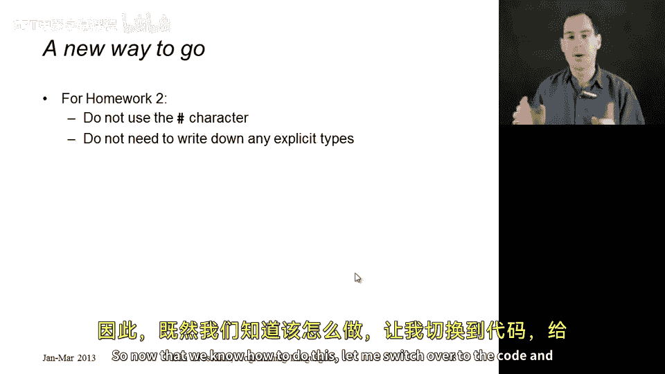
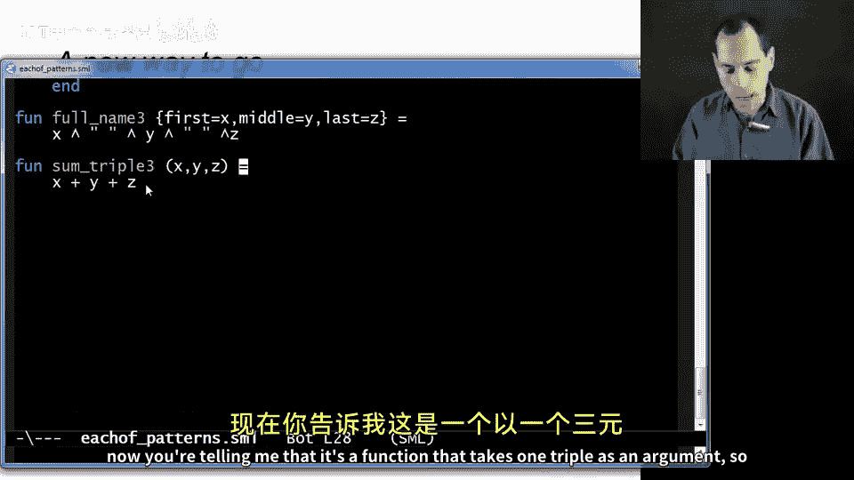
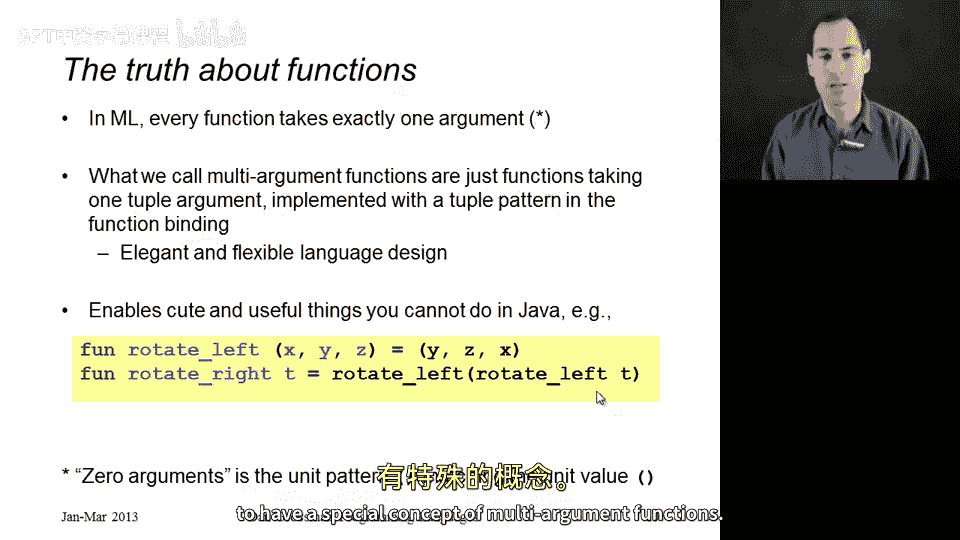

# 编程语言 A/B/C CSE341 Coursera：40：模式匹配的真相与函数的本质

在本节课中，我们将深入探讨模式匹配的扩展应用，并揭示一个关于ML函数的重要真相。我们将学习如何对“each of”类型（如元组和记录）使用模式匹配，并最终理解ML中所有函数都只接受一个参数这一核心概念。

## 模式匹配的扩展应用

上一节我们介绍了如何对“one of”类型（即自定义数据类型）使用模式匹配。本节中，我们来看看模式匹配如何同样适用于“each of”类型，即元组和记录。

### 元组模式匹配

元组模式匹配允许我们直接提取元组中的各个分量。其语法类似于元组表达式，但逗号之间放置的是变量。

**公式**：`(x1, x2, ..., xn)` 匹配一个n元组，并将第i个分量绑定到变量`xi`。

类型检查器会确保模式中的变量数量与元组的分量数量一致。

### 记录模式匹配

记录模式匹配允许我们按字段名提取记录中的值。

**公式**：`{f1=x1, f2=x2, ..., fn=xn}` 匹配一个具有字段`f1`到`fn`的记录，并将对应字段的值绑定到变量`x1`到`xn`。

字段的顺序无关紧要。

## 从案例表达式到更优雅的风格

以下是使用模式匹配的不同风格示例，我们将看到如何从基础的案例表达式过渡到更简洁的写法。

### 初始风格：使用单分支案例表达式

这种风格有助于理解原理，但并非最佳实践。

```sml
(* 对三元组求和 *)
fun sum_triple triple =
    case triple of
        (x, y, z) => x + y + z

(* 拼接全名 *)
fun full_name r =
    case r of
        {first=x, middle=y, last=z} => x ^ " " ^ y ^ " " ^ z
```

### 改进风格：使用`let`绑定进行模式匹配

我们可以用`let`绑定来替代单分支的`case`表达式，这更符合习惯。

```sml
(* 对三元组求和 *)
fun sum_triple triple =
    let val (x, y, z) = triple
    in x + y + z
    end

(* 拼接全名 *)
fun full_name r =
    let val {first=x, middle=y, last=z} = r
    in x ^ " " ^ y ^ " " ^ z
    end
```

### 最佳风格：直接在函数参数中使用模式匹配

ML允许函数参数本身就是一个模式，这是最简洁优雅的方式。

```sml
(* 对三元组求和 *)
fun sum_triple (x, y, z) = x + y + z

(* 拼接全名 *)
fun full_name {first=x, middle=y, last=z} = x ^ " " ^ y ^ " " ^ z
```

使用这种风格，类型检查器能自动推断出参数的类型，我们通常不再需要显式标注类型。

## 函数的真相：每个函数只接受一个参数

现在，让我们揭示ML中关于函数的核心真相。观察以下两个函数定义：



```sml
(* 版本A：我们刚刚学到的“接受一个元组”的函数 *)
fun sum_triple (x, y, z) = x + y + z

(* 版本B：我们一直以来认为的“接受三个参数”的函数 *)
fun sum_three x y z = x + y + z
```

**真相是**：在ML中，**每个函数都只接受恰好一个参数**。

我们一直所称的“多参数函数”，实际上只是一个接受**单个元组**作为参数的函数。函数定义中的`(x, y, z)`就是一个**元组模式**，它将该元组的三个分量分别绑定到变量`x`、`y`和`z`上。

因此，函数调用`sum_triple (3, 4, 5)`实际上是传递了一个三元组`(3, 4, 5)`给这个只接受一个参数的函数。



### 这种设计的好处

这种统一性带来了极大的灵活性和优雅性。由于每个函数都只接受和返回一个值，组合函数变得非常容易。

例如，我们可以定义一个旋转元组的函数：

```sml
fun rotate_left (x, y, z) = (y, z, x)
```

然后轻松地将一个函数的输出直接作为另一个函数的输入：

```sml
val result1 = rotate_left (3, 4, 5)          (* 得到 (4, 5, 3) *)
val result2 = sum_triple (rotate_left (3, 4, 5)) (* 得到 12 *)
val result3 = sum_triple (rotate_left (rotate_left (3, 4, 5))) (* 同样得到 12 *)
```

我们甚至可以利用这一点定义新函数：

```sml
(* 右旋转可以通过两次左旋转实现 *)
fun rotate_right t = rotate_left (rotate_left t)
```

这种“单参数”哲学使得数据流（一个函数的输出成为另一个函数的输入）在代码中表达得非常清晰和直接。

## 总结

本节课中我们一起学习了：
1.  **模式匹配**可以扩展到**元组**和**记录**（“each of”类型），用于优雅地提取其内部值。
2.  使用模式匹配的最佳实践是**直接在函数参数中**使用元组或记录模式。
3.  ML中一个根本性的设计是：**每个函数都只接受一个参数**。所谓的“多参数函数”只是接受一个元组并使用模式匹配来提取其分量的语法糖。
4.  这一设计使得函数组合和数据传递变得异常简洁和强大。



理解这一点，你就能以更统一、更本质的视角来看待ML中的函数定义和调用。