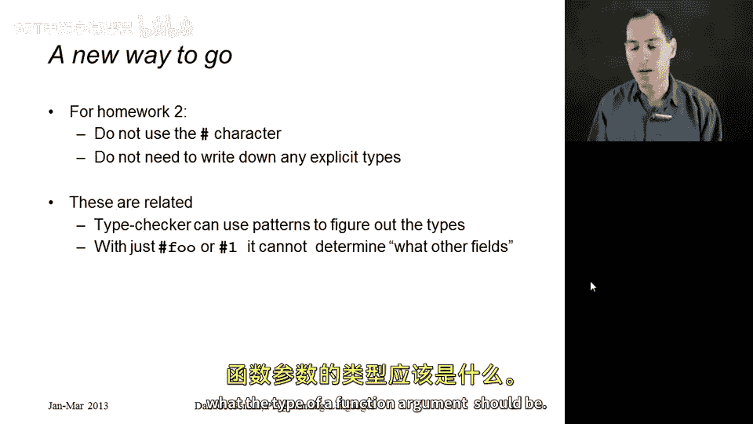
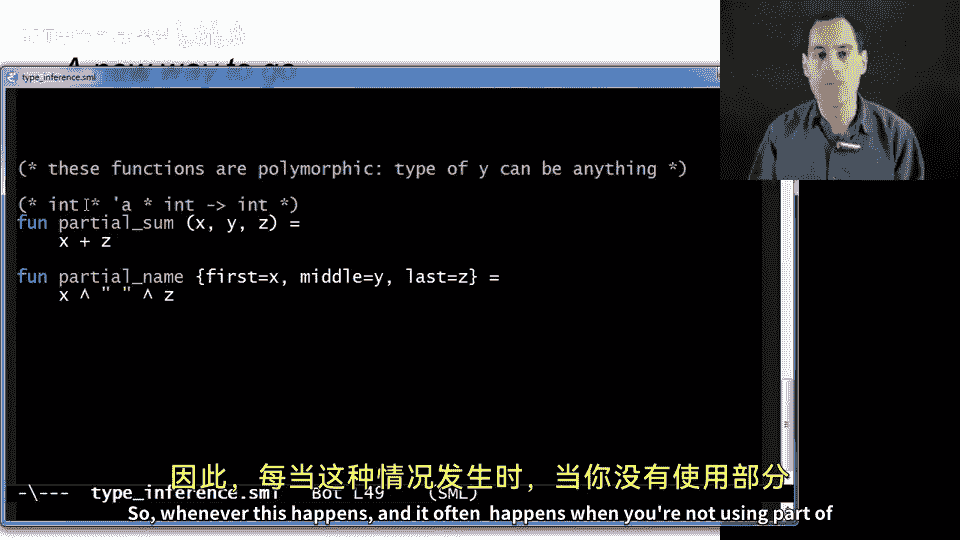
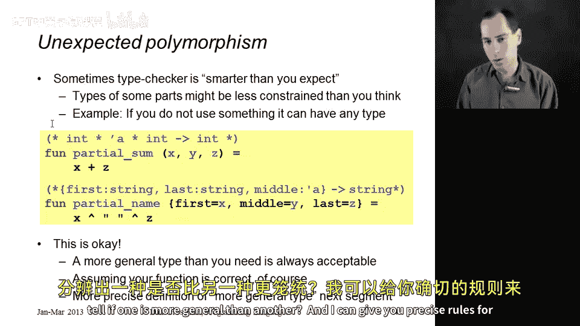

# 编程语言 A/B/C CSE341 Coursera：第41章：类型推断初探 👨‍🏫

在本节课中，我们将要学习类型推断的基本概念。我们将通过具体的代码示例，了解ML语言如何推断函数类型，并解释为何有时推断出的类型可能比我们预期的更通用。理解这一点对于完成后续作业至关重要。

## 类型推断与模式匹配的关系

上一节我们介绍了模式匹配的基本用法。本节中我们来看看类型推断如何与模式匹配协同工作。

当我们使用模式匹配来解构元组或记录时，类型检查器通常能够推断出函数参数的类型。这是因为模式本身提供了关于数据结构形状的信息，而函数体中对变量的使用则揭示了其具体类型。

以下是两个我们之前见过的函数示例：



```sml
fun sum_triple1 (x, y, z) = x + y + z
fun full_name1 {first=x, middle=y, last=z} = x ^ " " ^ y ^ " " ^ z
```

对于 `sum_triple1`，类型检查器可以推断出其类型为 `int * int * int -> int`。模式 `(x, y, z)` 表明它是一个三元组，而 `x + y + z` 表明这三个元素必须是整数。

对于 `full_name1`，类型检查器可以推断出其类型为 `{first:string, middle:string, last:string} -> string`。模式表明参数是一个包含 `first`、`middle`、`last` 字段的记录，而字符串连接操作 `^` 表明这些字段的内容必须是字符串。

## 使用 `#` 字符的局限性

如果使用旧的 `#` 字符方式来访问元组或记录的字段，类型检查器获得的信息就会减少，有时甚至无法推断出完整类型。

以下是使用 `#` 字符的版本：

```sml
fun sum_triple2 triple = #1 triple + #2 triple + #3 triple
fun full_name2 r = #first r ^ " " ^ #middle r ^ " " ^ #last r
```

虽然这些函数可以工作，但如果我们尝试省略参数的类型标注，`sum_triple2` 就会引发编译错误：“Unresolved flex record”。这是因为类型检查器无法仅从 `#1`、`#2`、`#3` 确定元组的确切宽度（它可能有三项、四项或更多）。ML的类型系统要求函数的参数类型是明确的，不能同时处理三元组和四元组。

这就是为什么在作业中，一旦我们学会了模式匹配，就不再鼓励使用 `#` 字符的原因之一。

## 未使用全部参数导致的“意外多态”

在编写函数时，如果你没有使用通过模式匹配绑定的所有变量，可能会得到一个比预期更通用的类型。这有时被称为“意外多态”。

考虑以下两个函数：

```sml
fun partial_sum (x, y, z) = x + z
fun name {first=x, middle=y, last=z} = x ^ " " ^ z
```

函数 `partial_sum` 只使用了元组的第一和第三个元素 `x` 和 `z`，没有使用 `y`。函数 `name` 只使用了记录的 `first` 和 `last` 字段，没有使用 `middle`。

如果我们加载这些函数，ML 推断出的类型是：
*   `partial_sum` : `int * 'a * int -> int`
*   `name` : `{first:string, middle:'a, last:string} -> string`

你可能会期望 `partial_sum` 的类型是 `int * int * int -> int`，但 ML 给出了 `int * 'a * int -> int`。这是因为函数体根本没有对第二个位置的值 `y` 进行任何操作（没有对其做加法、比较等），因此这个位置可以是任何类型（用类型变量 `'a` 表示）。这个函数因此是多态的。

以下是关于这种多态性的关键点：
*   这完全没问题。函数 `partial_sum (3, 4, 5)` 返回 `8`，正确工作。
*   它甚至可以用在其他类型上，例如 `partial_sum (3, "hello", 5)` 也能通过类型检查并返回 `8`。字符串 `"hello"` 被简单地忽略了。
*   但是，`partial_sum (3, 4, "hello")` 会类型检查失败，因为第三个位置 `z` 参与了加法运算，必须是整数。

只要函数的行为对于要求的类型是正确的，并且推断出的类型比要求的更通用（即，所有要求的输入都能被新类型覆盖），那么就没有问题。这实际上使函数更可重用。

## 总结



本节课中我们一起学习了类型推断的几个关键方面：
1.  **模式匹配是强大的**：它能为类型检查器提供丰富的信息，使其能够推断出函数参数的类型，从而通常无需显式编写类型标注。
2.  **避免使用 `#` 字符**：在新代码中使用模式匹配而非 `#` 字符，可以避免一些类型推断的局限性，并让代码更清晰。
3.  **理解“意外多态”**：当函数没有使用其所有参数时，可能会推断出带有类型变量（如 `'a`）的更通用的多态类型。只要函数对所需类型正确工作，这就不是一个错误，反而是函数灵活性的体现。



在下一节中，我们将更深入地探讨“一个类型比另一个类型更通用”这一概念的精确规则，让你能准确判断和比较类型的通用性。