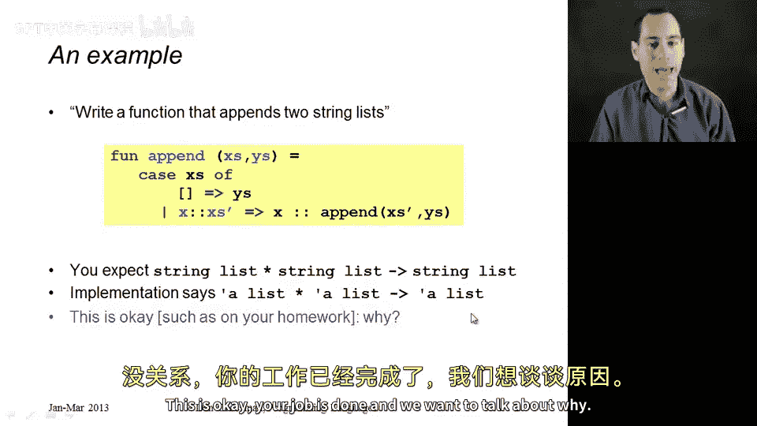
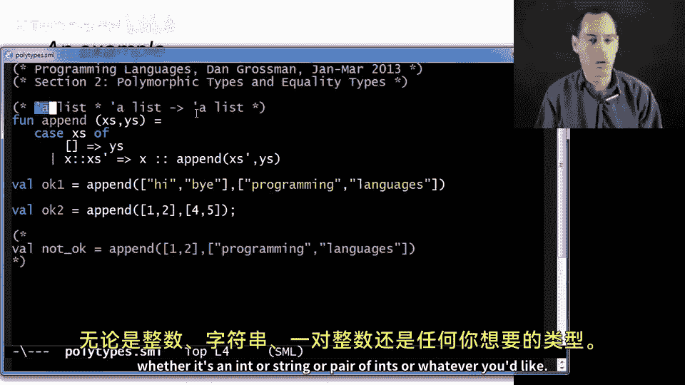
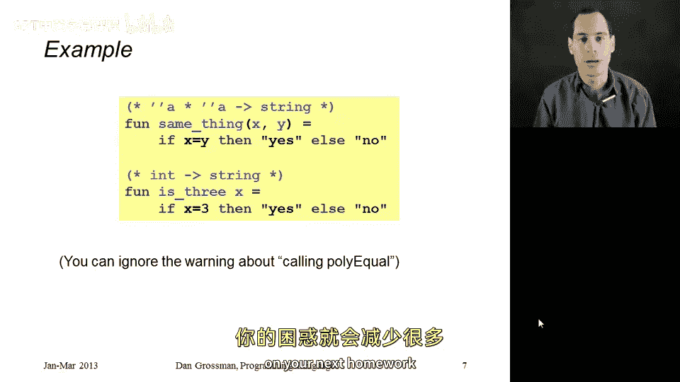

# 【编程语言 A⧸B⧸C CSE341 Coursera】华盛顿大学—中英字幕 p42 41_14_polymorphic-and-equality-types -BV1bw4m1D7MM_p42-

In this segment， I want to continue our discussion of how ML's polymorphism allows some types to be more general than other types。

 and then also point out this strange feature of ML equality types that you might accidentally run across on homework2 and it's okay if you do。

So to take a simple example， suppose that you were required on a homework assignment or just this part of your job to write an ML function that took two lists of strings and appended them together and you went off and you wrote a wonderful function for a pen like you see here and you expected it to have type string list。

 star string list arrow string list but as we've seen code like this in fact it's a polymorphic type of alpha list star alpha list arrow alpha list this is okay your job is done and we want to talk about why now we already know the informal story that if you do write this code and it has this type。

 you'll be able to call a pen with two list of strings and get back a list of strings it has four elements in it or even though this wasn't part of your job you could call it with two list of ints but what you couldn't do is call it with a list of ints and a list of strings and in fact you can tell that just from the type because what I want to convince you of is that even though this quote a this。

Alpha can be any type。 It has to be the same type throughout the overall type。

 So these three uses of alpha have to be replaced consistently with some type。

 whether it's ant or string or pair of events or whatever you like。

 So let me explain how that works in general。

We can say that the type Al list star alpha list or alpha list is more general than the type string list star string list arrow string list。

 and in fact， this polymorphic type can be used at any less general type。

 so it could also be used at int list star int list arrow int list。

 but it is not more general than something where the first alpha is replaced by int and the second alpha is replaced by string and the third alpha is replaced by int because we did not replace alpha consistently。

So the general rule is a type T1 is more general than a type T2。

 if you can take T1 replace its type variables consistently， so every alpha replaced with one type。

 every beta with another type， either the same or different than what you replace the alpha with and so on to get T2 so you can replace alpha within star n。

 you can replace alpha with bo and beta with bo， you replace alpha with bo and beta with int。

 you could even replace each beta with alpha and each alpha with alpha。

 and I don't have an example of that here， but you could take a really polymorphic function and come up with a different type that was a bit less general。

 but still had some polymorphism in it。Okay， so that is what we have been doing。

 Let me now combine this with a couple other rules I have told you about before。

 Remember our whole idea that if you see type synonyms。

 it doesn't matter whether you see the type name or what it's a synonym for。

And remember that with record types， the order of the fields doesn't matter。

So here's an example on the slide。 Suppose I have some type synonym where type F equals int star int。

And suppose that you write some homework function and the type you get for some part of it is some record type where I have a quas field of type beta。

 a bar field of type instar alpha， and a Ba field of type beta。Now， the question is。

 is that more general than this type here， the second record type you see on the slide。

 because if I asked for this second one and you wrote something of the type first one and it's more general than that's okay。

 And it turns out that it is。 because for this record type to be more general than in the next one。

 it has to have all the same fields and it does it as quax bar and Baaz。

 quaxbar and Baaz and each field of the less general one has to be created by this sort of consistent instantiation and every beta has been replaced by string。

And then this bar field is even more interesting if you replace the alpha with int。

 and it's the only alpha， so we are replacing the alphas consistently， you would get int star int。

 and since P is the same thing as intstar int， indeed。

 this second type is less general than the first type。

Another thing that is less general than the first type is this written here。

 it turns out this last type is absolutely equivalent to the middle type。

 it has all the same fields and all those fields have the same type。

 The only difference is I've reordered the fields which never matters and I've replaced the fo for the type of bar withinstar int。

So this is the sort of thing you might have to do on homework too。

 the ML type checker tells you one thing， and you'll have to check using your own brain that it's more general than the type that you needed to produce。

So that's one thing you might trip across。 Here's an even somewhat stranger thing。

 You might see some types that have two quotes before a type variable。 So quote quote a。

 instead of just quote a。 So for example， here's a type that says I take an alpha list and an alpha and return a bull。

 but these alphas have this extra apostrophe at the beginning。

What that means is that these are equality types so indeed a function of this type is polymorphic but you can't replace the quote quote alpha with any type you want。

 you can only replace it with types that you can use the equals operator on Now we have mostly only used the equal operator for int to compare to ints or for strings to see if they're the same strings but it turns out it works for lots of types。

 it works for tuples as long as all the pieces of the tuples are themselves equality types。

 but not everything is an equality type， it turns out that ML in order to enforce good style doesn't let you compare values of type real floating point numbers with equals because that's pretty much always a bad idea and doesn't let you compare function types with equals something that we'll get into in subsequent segments when we're passing functions to other functions and stuff。

So the rules are exactly the same if you see a type like this。

 it works for any type as long as you instantiate the alpha consistently。

 but certain instantiations won't be allowed。So this is a rather strange feature of ML。

 it basically treats this equal operator specially has special support in the type system for things that can be compared with the equals operator。

 and it's not something that I plan to study in depth， but in case you see it。

 I wanted to prepare you for it。Here's a very short example of how it might come up。

 Suppose you wrote this function， which just takes an x and a y， and if they're the same。

 returns the string， yes， else the string no， and maybe you thought you were intending x and Y to be of type int。

 but instead you would get a type like quote quote a star quote quote a arrow string。

 you would also get a warning from the ML type checker about calling poly equalal。

 you can ignore that warning。But you might not ever see this sort of warning。

 So here's a second function that uses the equals operator on this argument X。

 But since it compares x to 3， the type checker knows that you can only ever compare two things of the same type。

 That's the typing rule for equals。 So， in fact， X has to have type int。 You would see that overall。

 this function has type int arrow string because it must take an int and it must return a string and there's no weird equality types anywhere to be seen。

So those are the strange things to look for。 there's a very nice precise rule of one type being more general than another。

 and you'll now get a lot less confused if you see unexpected polymorphism on your next homework。

