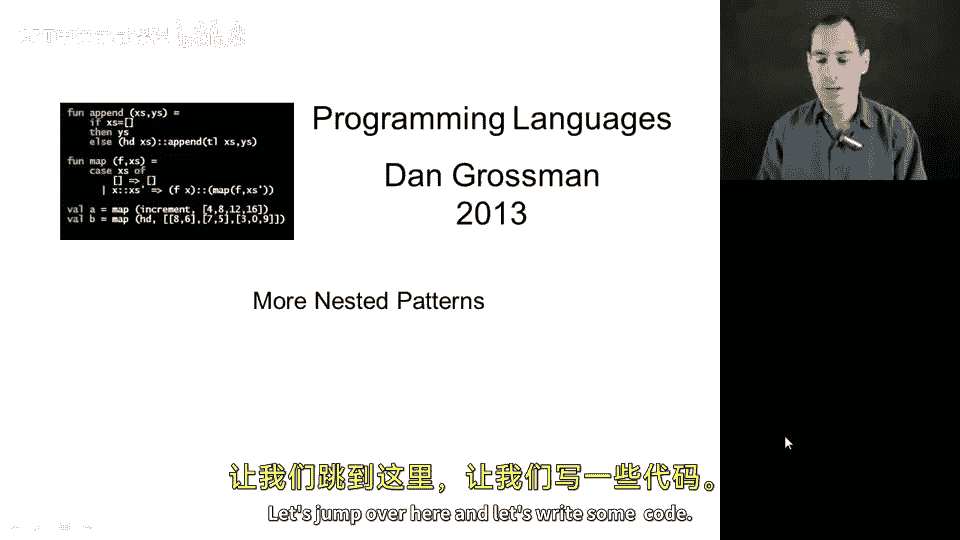
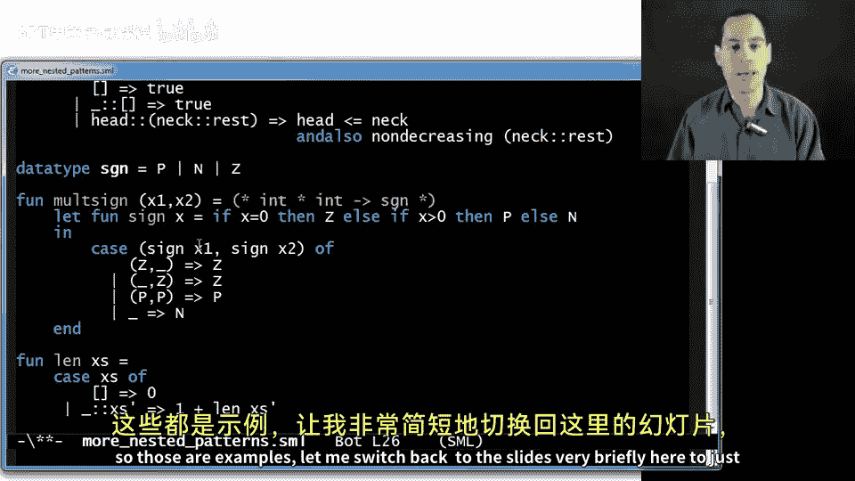
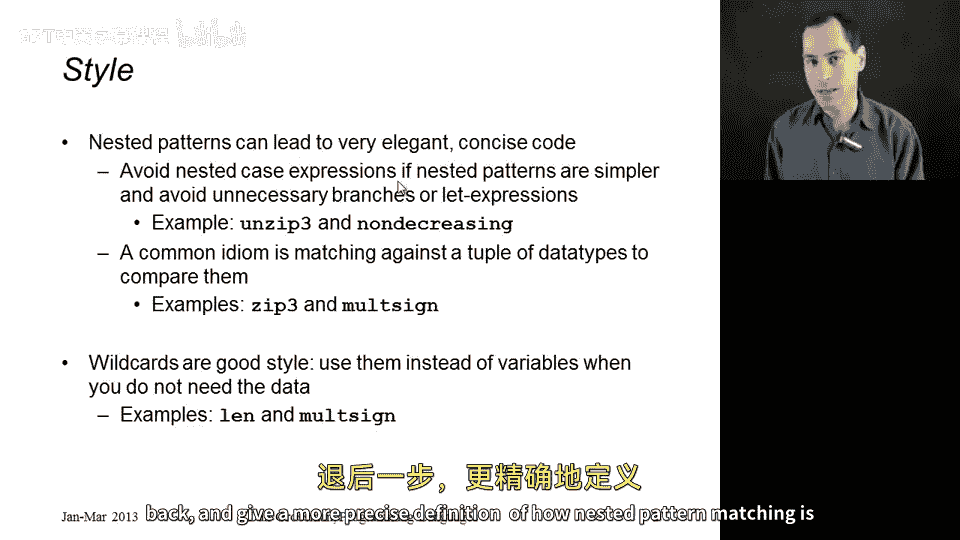

# 【编程语言 A⧸B⧸C CSE341 Coursera】华盛顿大学—中英字幕 p44 43_16_more-nested-patterns -BV1bw4m1D7MM_p44-

In this segment， I want to show some more examples of using nested pattern matching。

 so let's just do it， let's jump over here and let's write some code。

 The first example I want to write is a function that I'll call nondeecreasing it's just going to take a list of integers and return a bull and true means that at no point in the list you find a number that is smaller than the number that comes before All right so if we did this our old-fashioned way with simple pattern matching。

 we might case on whether the list is empty or not。

X colon on to x is prime and the empty list。 that's definitely true。

 You never see a decreasing situation。 but in this case。

 I kind of need to look at the next element as well。

 And so you might now do another pattern match on that tail of the list And then if that were empty。

 Well， this would be the situation where you have a one element list and that's also non-deecreasing。

 otherwise you would have that next element to the list and then really the tail and you would have to say make sure that x is less than or equal to y and also that we were nondeecreasing actually a common bug would be to say y is prime that's actually wrong。

 you actually need x' is prime in order to make sure you're checking every position and not just every other position。

 So this would work。 But these nested case expressions are a little clumsy and with nested patterns we can express what I consider to be a more direct and。

algorithm。 So the empty list case is just fine。 I have no problem with that。

 But now let's use nested pattern matching to handle the one element case directly。So， this pattern。

Will match when X's is some head of the list， which we can match against x。

 And then the rest of the list matches against the empty list。

 So this pattern will match exactly against one element lists so we can just write true。😊。

And then if that does not match now we can have another pattern。

 which is maybe let's say head cons onto neck。 get， get it。

 That's the thing in the list after the head。 maybe on to rest Okay。

 and this pattern matches all lists that have two or more elements because head will match the first neck will match the second and rest will match the rest of the list。

 And now we could just check that indeed， head is less than or equal to neck and also nondeecreasing。

neckck。Cons on to rest。 All right， Something like that。 And that is it。That's our whole function。

 and the type checker will actually make sure that our patterns are exhaustive。 And indeed they are。

 We have a case for the empty list case for the one element list and a case for all list that have two or more elements。

 so that's another example of nested pattern matching that I actually rather like one little thing we can do to clean this up whenever you have a variable that you're not using in the corresponding branch。

 you can also write underscore that slightly better style。

 What it does is it's just like a variable pattern。 it always matches。

 but it doesn't actually introduce a variable and that makes your code a little easier to read。

 it says to the reader of your code that you don't actually need what's in that position you just need that it's there。

All right， so that's fine。 Now let's do another example。 This one's a little sier。

 but it shows something that I find quite common and convenient。

 I'm going to define a little data type for the sine of a number。

 So p for positive n for negative z for0。 And now what I want to do is write a little function mot s it's going to take a pair of integers and it's going to return so it takes two integers。

 it's going to return the s of the number you would get if you multiply those numbers together。

 but it's not actually going to do the multiplication。

 I'm going to define a little helper function here inside my function that just tells you the sine of a number。

 and so if you have0， then you end up with z， otherwise you get positive of x is greater than0 else negative and I'm going to use that to figure out the s that you get when you multiply x1 and x2。

 Now it turns out。😊，There's in the extreme 9 different cases based on the sine of x and the sine of x。

3 possibilities for each3 times 3 is 9。And if I tried to do this with nested case expressions。

 it would get a little messy， but what if I just pattern matched on the pair of calling sine with x1 and calling sine with x2？

And now what I could do right here is simply have my nine cases。

 so I could have Z comma Z and have a case for that， I could have p comma Z。

 I could have n comma Z and so on， and I would continue that for nine cases and the code would read like a nice table of exactly what the answer should be for each combination。

 but we can do even better than that when we realize that patterns are matched in order。

And so we know that if either thing is Z， the result will be Z because we multiply anything by zero。

 you get zero， and so let's use these nested patterns to clean that up a bit and let's say that if I have this first pattern。

So if the sine of x1 is0， then no matter what the sine of x2 is so I could have a variable here。

 like y， or I could use underscore since I don't actually care what that s is， and that's it。

 that's three of my nine cases just handled like that and here's another three if the second position is Z then the entire thing is Z So I've already handled six of my nine cases and now in handling the other the remaining cases。

 I can use the fact that I now know neither position will be Z because I've already handled all those cases So another possibility is if both things are positive。

 then the result is positive， another possibility is if both things are negative then the result is positive and there's two more cases and comma P which would be negative and P comma N which would be negative。

And not only do I have a nice table here， but my type checker will again check。

 I haven't left anything out。 and that's pretty neat。 by the way。

 you can do this slightly differently you could just here at the end use a single wild card which will match anything including a pair and say。

 hey， in all remaining cases， the answer is negative。

 and now you better get rid of these or the type checker will complain that you have unreachable。

 impossible cases。 And now whether this， as I now have it written is better style or the one where I don't have this line and instead of these two is better style。

 is really a matter of taste。 the way I have it now is a little bit shorter， it kind of reads nicely。

 it says otherwise the result is negative but you are giving up a little bit of the type checker's helpfulness because if I wrote this。

The type checker will still say that this pattern match is exhaustive。

 but my code's now wrong because I forgot the case of n comma N。

 whereas if I leave this case out and do it this way。Here， the type checker will， in fact。

 give a warning telling me that the N comma N case has been forgotten。 In fact， let me show you that。

Use more nested patterns。Got Sml。And in fact， up here， it says warning， match non exhaustive。

 And then you could go and look at it and try to puzzle out which case you forgot。 Okay。

 But nonetheless， let's just leave it as。This one。Since that's the shortest version and sometimes people like to see nice and short code。

Let me finish up with one more much simpler example which is just to compute the length of a list so we've done this plenty of times。

 at least things very similar to it， if you have the empty list then return zero。

 otherwise x colon x is prime，1 plus L of x is prime and this is just another example even though there's not anything particularly nested or fancy here where I would argue it's a little better style to go ahead and put this underscore here to emphasize that we don't care about the value at the head of the list。

 we just care that we have a non-empty list and we do need the tail because we need to call L recursively with x is prime。

All right， so those are examples。 let me switch back to the slides very briefly here to just talk a little bit more about style and how these nested patterns lead to very elegant and concise code to give you an intuition on how to look for opportunities for nested pattern matching and the first is to try to avoid where convenient nested case expressions if instead of having nested case expressions。

 you can just have more branches using nested pattern matching。

 it often leads to simpler code we saw that with unzip3 in the previous segment and we saw that with non-deecreasing in this segment that's not to say that nested case expressions are always a bad idea。

 it's just a good hint to yourself to look and see if nested patterns might be a little better。

Another very common idiom is to match against a topple of data types。

 So instead of pattern matching against one data type and then another data type and then another one。

 go ahead and match against a tuple all at once。 we just saw that with the mut sign example where I matched against two things of type SGN we also saw that in the zip3 example where we actually matched against a triple of lists and that was in the previous segment and finally as a separate issue of style。

 I do encourage you to use wildcard instead of variables。

 a variable in the wildcard both match against everything。

 the difference is the variable actually introduces a local binding for the thing it matched against and the wildcard does not And when you don't need that corresponding data in the branch wildcard concisely communicates that to the person reading your code。

That is nested pattern matching， and the next segment will take a step back and give a more precise definition of how nested pattern matching is actually defined in ML and similar programming languages。

