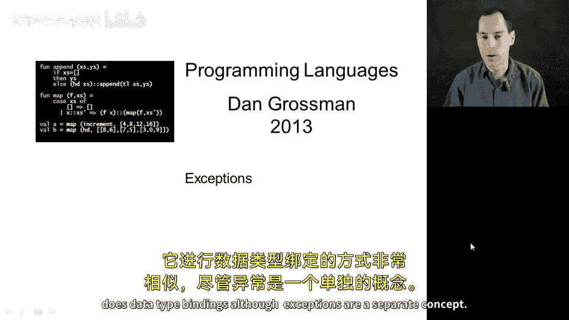
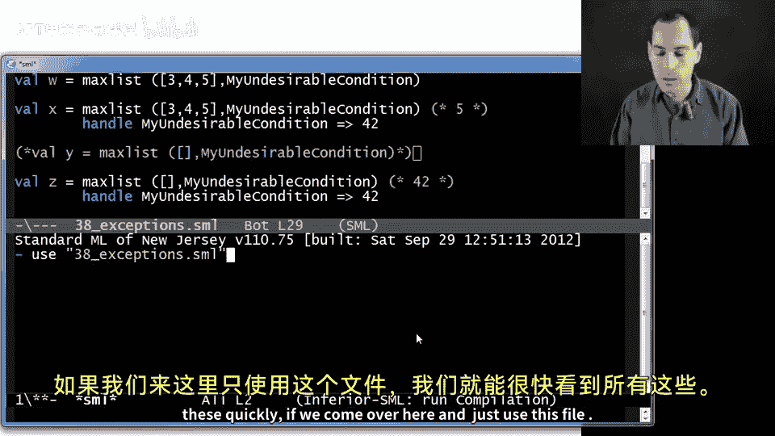
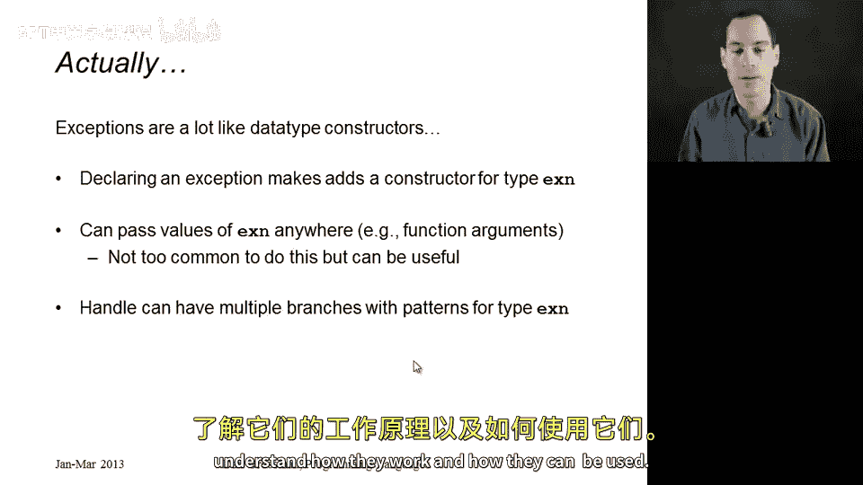

# 编程语言 A/B/C CSE341：第47讲：异常处理 🚨

在本节课中，我们将要学习异常处理。异常用于处理运行时出现的错误情况。我们将介绍如何创建异常、如何抛出异常（在许多语言中称为“throwing”），以及如何捕获和处理异常（在许多语言中称为“catching”）。在课程的这个阶段介绍异常是合适的，因为 ML 语言处理异常的方式与其处理数据类型绑定的方式非常相似，尽管异常是一个独立的概念。我们将通过代码示例来详细解释，然后用几张幻灯片进行总结。

## 概述

首先，让我们看看 `head` 函数是如何实现的。`head` 函数接收一个列表，如果列表非空，则返回第一个元素；如果列表为空，则抛出一个预定义的异常 `List.Empty`。

以下是 `head` 函数的预期实现代码：

```ml
fun head xs =
    case xs of
        [] => raise List.Empty
      | x::_ => x
```

在非空列表的情况下，函数返回第一个元素 `x`；对于空列表，则使用 `raise` 关键字抛出 `List.Empty` 异常。如果使用空列表调用 `head` 函数，它将永远不会返回，因为 `raise` 会导致异常发生。



## 自定义异常

除了使用预定义的异常，我们还可以定义自己的异常类型。定义异常时使用 `exception` 关键字，后跟你选择的异常名称。按照惯例，异常名称通常以大写字母开头。

以下是一个自定义异常的例子：

```ml
exception MyUndesirableCondition
```

定义异常后，你可以使用 `raise` 关键字抛出它：

```ml
raise MyUndesirableCondition
```

你还可以创建携带数据的异常，语法与数据类型的构造函数类似：

```ml
exception MyOtherException of int * int
```

这样，你可以抛出携带数据的异常，例如：

```ml
raise MyOtherException (3, 4)
```

这允许你将数据传递给可能处理该异常的代码。

## 抛出异常

现在，让我们看一个函数示例，该函数在特定条件下抛出异常。假设我们有一个函数 `myDiv`，它接收两个整数，如果分母为零，则抛出我们自定义的异常 `MyUndesirableCondition`，而不是 ML 语言通常抛出的异常。

以下是 `myDiv` 函数的实现：

```ml
fun myDiv (x, y) =
    if y = 0 then raise MyUndesirableCondition else x div y
```

这样，当分母为零时，函数会抛出我们自定义的异常。

## 异常值与抛出异常的区别

需要注意的是，创建异常值与抛出异常是不同的。异常值只是类型为 `exn` 的值，而抛出异常会导致程序控制流的改变。

考虑以下函数 `maxList`，它接收一个整数列表和一个异常值。如果列表为空，则抛出传入的异常；否则，返回列表中的最大元素。

以下是 `maxList` 函数的实现：

```ml
fun maxList (xs, ex) =
    case xs of
        [] => raise ex
      | [x] => x
      | x::xs' => Int.max (x, maxList (xs', ex))
```

`maxList` 函数的类型为 `int list * exn -> int`，因为它可能返回一个整数，也可能抛出异常。

现在，如果我们调用 `maxList` 并传入一个非空列表和一个异常值，不会触发异常，函数会正常返回最大值：

```ml
val w = maxList ([3,4,5], MyUndesirableCondition)  (* w 被绑定为 5 *)
```

这里，`MyUndesirableCondition` 只是一个异常值，并没有被抛出，因此 `w` 被绑定为 `5`。

## 处理异常



处理异常是异常机制的关键部分。在许多语言中，这被称为“捕获”异常。在 ML 中，我们使用 `handle` 关键字来处理异常。

`handle` 表达式的语法如下：

```ml
E1 handle Pattern => E2
```

如果 `E1` 正常求值，则忽略 `handle` 部分；如果 `E1` 抛出一个与 `Pattern` 匹配的异常，则执行 `E2`；如果不匹配，则异常继续向上传播。

以下是一个简单的示例：

```ml
val x = (5 handle MyUndesirableCondition => 42)  (* x 被绑定为 5 *)
```

因为 `5` 不会抛出异常，所以 `x` 被绑定为 `5`。

另一方面，如果我们调用 `maxList` 并传入空列表，则会抛出异常，然后被 `handle` 捕获：

```ml
val z = maxList ([], MyUndesirableCondition) handle MyUndesirableCondition => 42  (* z 被绑定为 42 *)
```

这里，`maxList` 抛出 `MyUndesirableCondition` 异常，然后被 `handle` 捕获，`z` 被绑定为 `42`。

## 总结

在本节课中，我们一起学习了异常处理的基本概念和操作。我们介绍了如何通过 `exception` 关键字定义新的异常类型，如何使用 `raise` 关键字抛出异常，以及如何使用 `handle` 表达式捕获和处理异常。我们还了解了异常值与抛出异常的区别，并通过代码示例加深了理解。



异常处理是编程中处理错误和异常情况的重要机制，掌握它可以帮助你编写更健壮和可靠的代码。在后续的作业中，你将有机会使用异常处理来确保程序的正确性和稳定性。