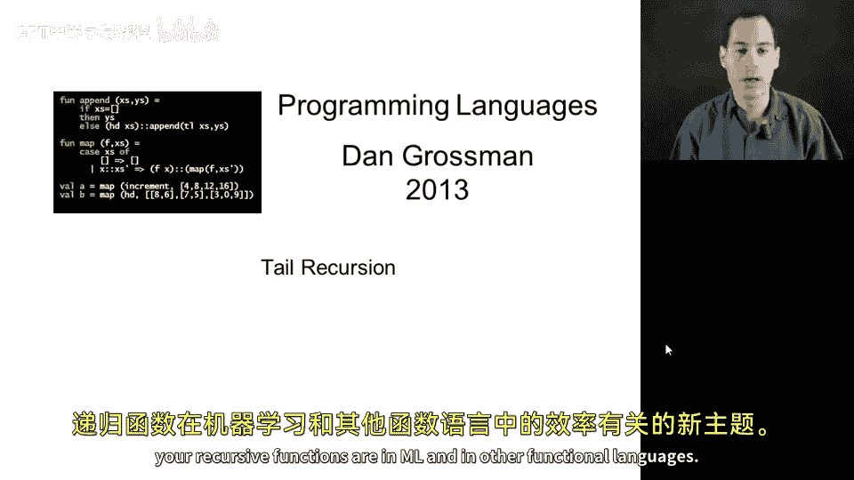
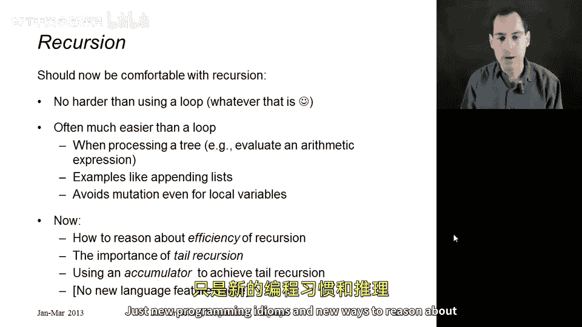
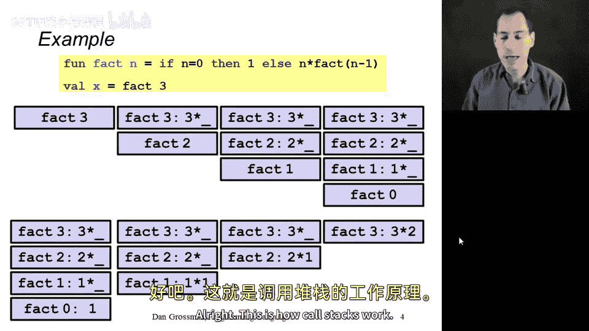
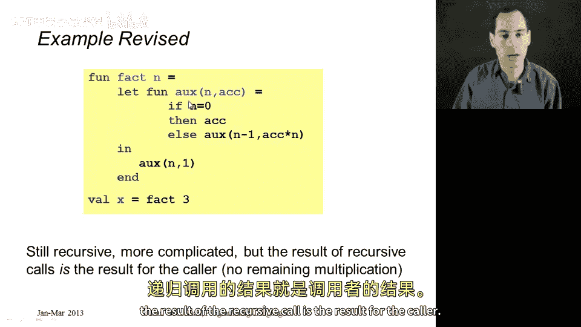
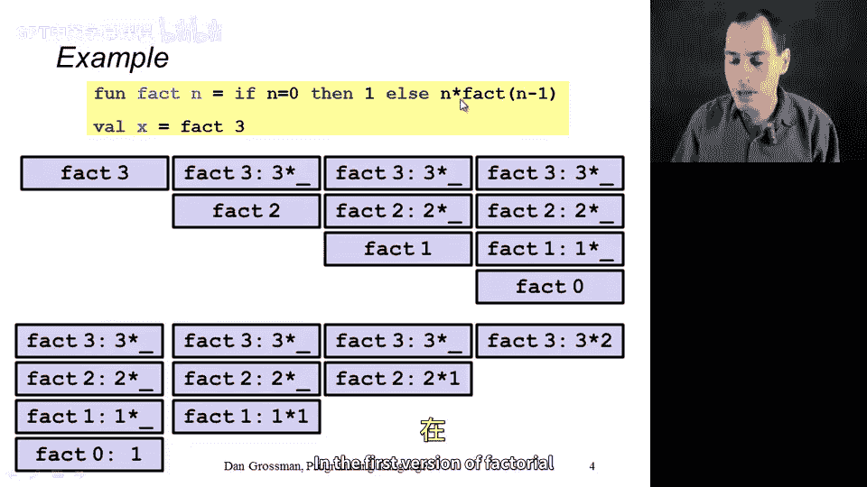
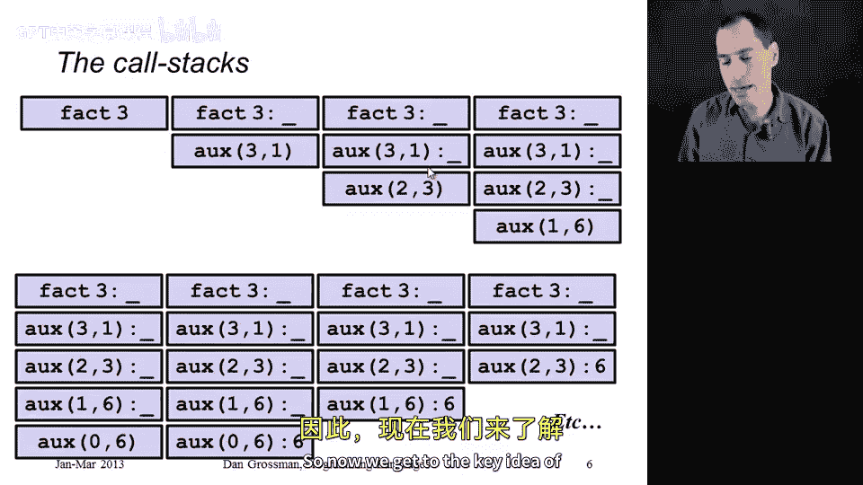
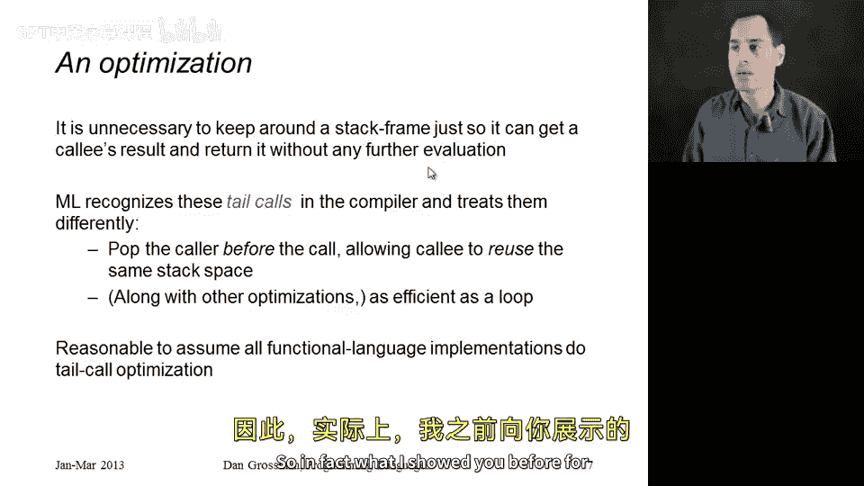
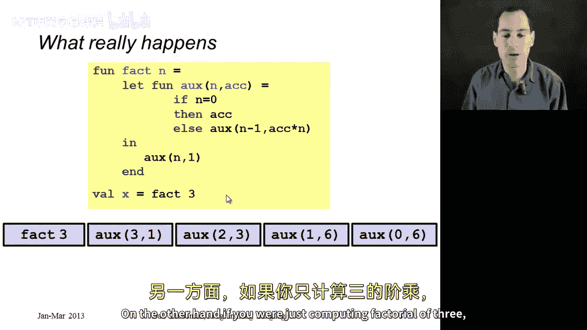

# 编程语言 A/B/C CSE341：48：尾递归 🚀

在本节课中，我们将开始讨论尾递归。这是一个与评估 ML 及其他函数式语言中递归函数效率相关的新主题。

## 概述

目前我们已经编写了许多递归函数。希望你已经确信，编写递归函数并不比编写循环困难。事实上，我们甚至没有讨论过循环。可以说，递归虽然从不比循环更难，但在处理树状结构（如计算算术表达式）时，通常比循环更容易。像列表拼接这样的例子，当我们以递归方式思考时，也变得简单得多。这些递归函数避免了任何对可变状态的需求，即使是局部变量。如果你使用类似 `for` 循环的结构，总是需要递增索引 `i`，而我们正试图远离可变变量。

然而，我们尚未讨论递归是否高效，或者在何种情况下能产生快速代码。很多人认为递归效率低下，但这并非必然。即使在某些情况下确实如此，也往往无关紧要。接下来，我们将探讨“尾递归”这一概念的重要性，并在后续章节中学习如何使用常见模式（如累加器）来实现尾递归。需要明确的是，这里不会介绍任何新的语言特性，只是新的编程模式和评估我们已编写代码效率的新方法。

## 调用栈的工作原理

要理解递归和尾递归，需要了解函数调用是如何实现的。你只需理解调用栈的高层概念。

程序运行时，存在一个调用栈，其中包含所有已调用但尚未完成的函数。当你调用函数 `F` 时，会将一个实例压入栈中。这个实例会一直保留在栈上，直到对 `F` 的调用完成。当 `F` 的调用结束时，会将其从栈中弹出。因此，在任何给定时间，栈中都包含所有已开始但未完成的调用。由于一个函数可以调用另一个函数，栈中可能有很多调用。

这些栈元素（称为栈帧）存储诸如局部变量绑定值等信息，还存储在该函数调用的任何其他函数完成求值后，该函数仍需完成的工作信息。

注意，如果我们有一个递归函数 `F` 调用 `F`，再调用 `F`，依此类推，栈上将有多个栈帧，它们都对应同一段代码（函数 `F`）。这完全合理，也是递归的真正含义。

让我们看一个例子。假设有一个阶乘函数 `fact`，它接收参数 `n`，返回 `n * (n-1) * (n-2) * ... * 1`。它仅对非负数正确工作。假设我们调用 `fact(3)`，最终将得到答案 6（3 * 2 * 1）。

初始调用 `fact(3)` 时，栈上只有一个元素。当 `fact(3)` 执行时，它会调用 `fact(2)`（因为 3-1=2）。因此，栈上会添加一个 `fact(2)` 的调用。`fact(3)` 在其栈帧中记住，当它收到递归调用的结果后，需要将该结果乘以 3，这才是它的最终答案。即 `3 * fact(2)` 的结果。

类似地，`fact(2)` 会调用 `fact(1)`，栈变得更大。`fact(2)` 等待调用结果，并准备将其乘以 2。`fact(1)` 最终会调用 `fact(0)`。此时，栈上有四个元素。当调用 `fact(0)` 时，它求值 `if` 表达式并返回 1，没有额外的调用压入栈。然后返回 1，并从调用栈中弹出。

现在栈变小了，`fact(1)` 获得了它的递归结果。它将 1 乘以 1，得到 1，然后弹出。接着 `fact(2)` 将 2 乘以 1，得到 2，然后弹出。最后 `fact(3)` 将 3 乘以 2，得到 6，然后返回。这就是调用栈的工作方式，也是我们求值 `fact` 时期望发生的情况。

## 一个更高效的阶乘版本

现在展示第二个更复杂的阶乘版本。稍后将说明它实际上更高效，但目前还看不出来。

首先理解这个阶乘版本的工作原理。它所做的就是调用一个局部定义的辅助函数（这里命名为 `aux`，代表辅助函数）。这个辅助函数接收一个数字和一个累加器（`acc`）。它的逻辑是：如果 `n` 等于 0，则直接返回累加器的值；否则，递归调用 `aux`，参数为 `n-1` 和 `acc * n`。

我将展示这实际上也能正确计算阶乘。与简单的递归函数不同，我们现在在递归过程中将结果累积到第二个参数（累加器）中。当 `n` 为 0 时，我们直接返回累加器。`aux` 仍然是递归的，但更复杂。关键在于，当 `aux` 调用 `aux` 时，递归调用的结果就是调用者的结果，调用者没有额外的工作要做。而在第一个阶乘版本中，递归调用返回后，调用者还有工作要做（必须乘以 `n`）。这就是关键区别。

在展示效率差异之前，先看看基于目前理解的调用栈情况。

从 `fact(3)` 开始。`fact(3)` 将调用 `aux(3, 1)`（根据代码，这是累加器的初始值）。然后 `aux(3, 1)` 会调用 `aux(2, 3)`（因为 3-1=2，3*1=3）。注意，此时栈上的这些调用者只是在等待结果返回并立即将其返回。

接着 `aux(2, 3)` 调用 `aux(1, 6)`，`aux(1, 6)` 调用 `aux(0, 6)`。此时，栈比之前版本的实际栈还要大。然后 `aux(0, 6)` 返回 6。`aux(1, 6)` 返回那个 6，`aux(2, 3)` 返回那个 6，`aux(3, 1)` 返回那个 6，最后 `fact(3)` 返回那个 6。程序继续直到结束。

## 尾调用优化

现在进入关键概念：函数式语言执行的一项重要优化。如果一个栈帧的唯一作用就是接收被调用者的结果并立即返回，那么保留这个栈帧是完全不必要的。

这种情况称为尾调用（原因我从未完全理解，但大家都这么叫）。编译器（语言的实现）能识别这些函数调用并以不同方式处理它们。

具体做法是：在发起调用之前，移除调用者的栈帧，使得被调用者直接复用调用者使用的相同栈空间。结合其他一些未展示的优化，这使得使用尾调用的递归函数与其他语言中的循环一样高效。因此，可以合理地假设 ML 语言保证了尾调用的这种效率。

所以，之前展示的更复杂阶乘版本的调用栈情况实际上并不会发生。

我们确实从 `fact(3)` 的栈开始。但在 `fact(3)` 调用 `aux(n, 1)` 的地方，这是一个尾调用。`fact` 在调用 `aux` 后没有其他工作要做，只是返回其结果。因此，我们将重用栈空间，用 `aux(3, 1)` 的栈帧替换 `fact(3)` 的栈帧。

现在我们在求值 `aux(3, 1)`。当执行到递归调用时，之后也没有更多工作要做，所以这也是一个尾调用。因此，我们将为 `aux(2, 3)` 的递归调用重用这个栈空间。同样的情况会发生在下一个递归调用，以及再下一个递归调用上。因此，我们从未构建起一个大的调用栈。当 `aux(0, 6)` 返回 6 时，我们立即得到了答案。

这就是为什么这个更复杂的阶乘版本实际上更高效。如果你计划在非常大的数字上使用阶乘函数并且关心这种效率，这将是一种更好的编写方式。另一方面，如果你只是计算 `fact(3)`，更简单的解决方案可能更可取，因为它更直观。

## 总结

本节课我们一起学习了尾递归的概念。我们了解了函数调用栈的基本工作原理，比较了普通递归和尾递归在实现阶乘函数时的差异。关键在于，尾递归调用后没有额外工作，因此编译器可以进行优化，复用栈帧，避免栈空间随着递归深度线性增长，从而提升效率。这使得在函数式语言中，尾递归可以像命令式语言中的循环一样高效。在后续课程中，我们将学习如何使用累加器等常见模式来编写尾递归函数。