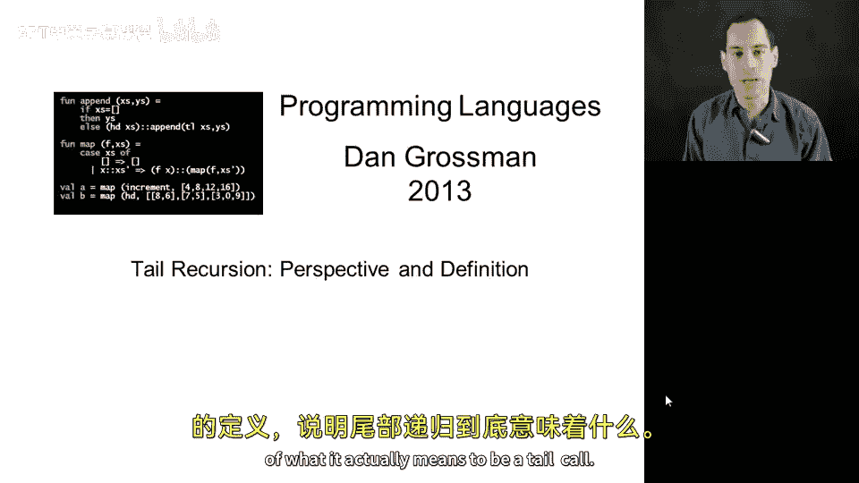
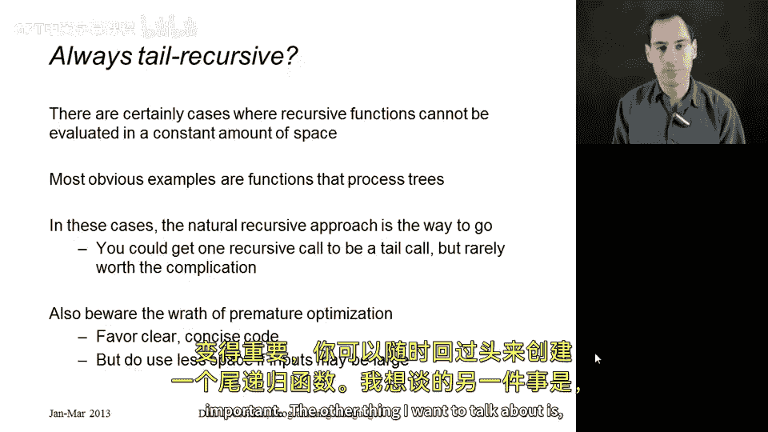
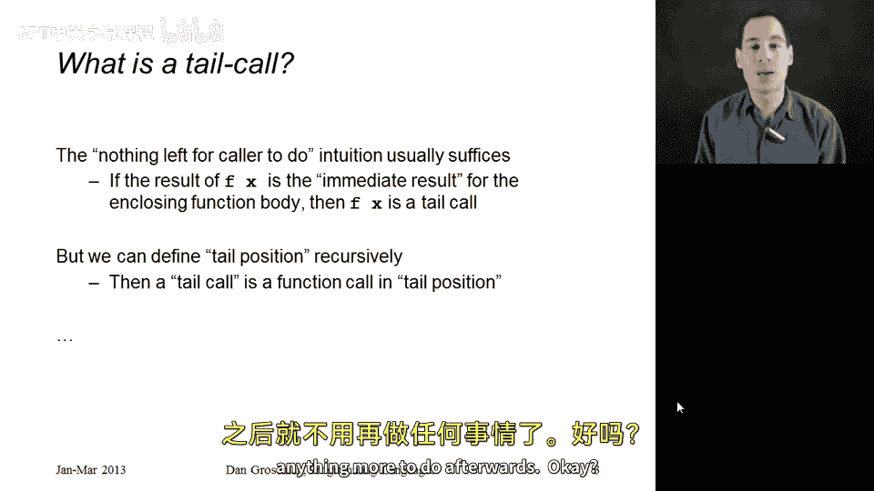
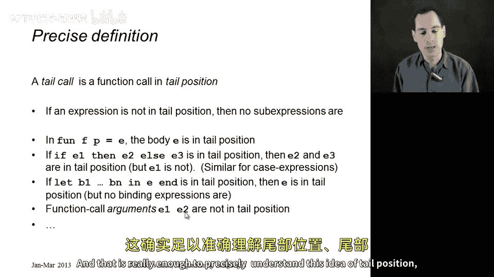

# 【编程语言 A⧸B⧸C CSE341 Coursera】华盛顿大学—中英字幕 p50 49_22_perspective-on-tail-recursion -BV1bw4m1D7MM_p50-

I'd like to finish up our discussion of tail recursion by giving a little bit of perspective on how important it is and then talk about a more precise definition of what it actually means to be a tail call。

So first of all， a lot of times when people learn about tail recursion。

 they're in a big hurry to make everything tail recursive and it's worth pointing out that there are cases where you really cannot do that now technically speaking you could make every function call a tail recursive call a tail call but you can't do it without building other lists and data structures and things that are going to take up just as much space as your call stack would the most obvious examples are functions that process trees when you're doing a recursive traversal over the tree。

 you need to keep track of what part of the tree you have visited and you haven't so far and the call stack is a great way to do that and youre generally not going to end up with tail recursive functions that process trees you can usually use an auxiliary helper function to make one of your recursive calls maybe the one over the left child tail recursive but then you somehow need to keep track of what you need to do for the right child so you're welcome to try。

And I think you'll end up seeing that one of your recursive calls will not be a tail call。

I would also make the more general point that programmers are often in far too big of a hurry to optimize their code。

 a lot of programs we write， it's more important that they be straightforward and readable and easy to verify that they do the right thing and oftentimes a shorter。

 more natural recursive function is perfectly good。

 and you can always go back and make a tail recursive function if it becomes important。

The other thing I want to talk about is what exactly is a tail call so so far we have a perfectly good informal definition all right。

 this intuition that it's a call where after you make it。

 the caller has no more work to do In other words you have some call like F is going to call X and that result is the result for the enclosing function。

Al，But that works。 That's how I think about it。 But how do you know if that's the immediate result。

 It turns out， like many things in programming languages， there's an elegant。

 recursive definition of what it means for a position in a function body to be a tail position。

 And then a tail call is just any function call that is in a tail position。

 So a tail position is there won't be anything more to do afterwards。

So I thought I would show you some of the cases of this definition。

 It's kind of a top down recursive definition about what it means to be in tail position。So。

 first of all， if an expression is not in tail position。

 then neither will any of its subexions be in tail position。 Once something is not in tail position。

 there's more work to do afterwards。 So none of the sub expressionions are going to be the last thing either。

 because there will be even more work to do。On a more positive note。

 if you have a function definition like fun FP equal E， the body itself is in tail position。

 so we start with the entire function body， and that is a tail position。Now here's a recursive case。

 if you have a conditional like if E then E2， LC3， or similar for case expressions。

 case E of a bunch of branches。The test that E1 between the if and the then is not in tail position because we have more work to do afterwards。

 but if the conditional is in tail position， then so are E2 and E3 if there's nothing more to do after the conditional。

 then there will be nothing more to do after E2 and therell be nothing more to do after E3 will do one of them and that will be the last thing we do。

Let's do a local lead expression。 If you have a let expression that is itself in tail position。

 then the body E is in tail position， because that also will be something after which there is no more work to do。

 So a call， if if this E were a function call， that would be a tail call。

 But none of the expressions in the bindings would be in tail position。

 because we still have to do all the other bindings and the body E。And just as a final case。

 if you have the parts of a function call， those are not in tail position。 We have to evaluate E1。

 And afterwards， we still have to evaluate E2。 We have to evaluate E2 and afterwards。

 we still have to do the call。 So even if this call overall is in tail position and is a tail call。

 any subexpressions， any extra work we do in E1 and E2。 Those are not in tail position。

 What this means is if you ever have a nested function call like F of G of X， F might be a tail call。

 but G of x never will be because the caller still has to do the call to F afterwards。

So as is often the case， we have our intuition of no more work to do and then we can make that definition more precise in terms of the recursive structure of our programming language。

 and that is really enough to precisely understand this idea of tail position。

 tail calls and tail recursion。

