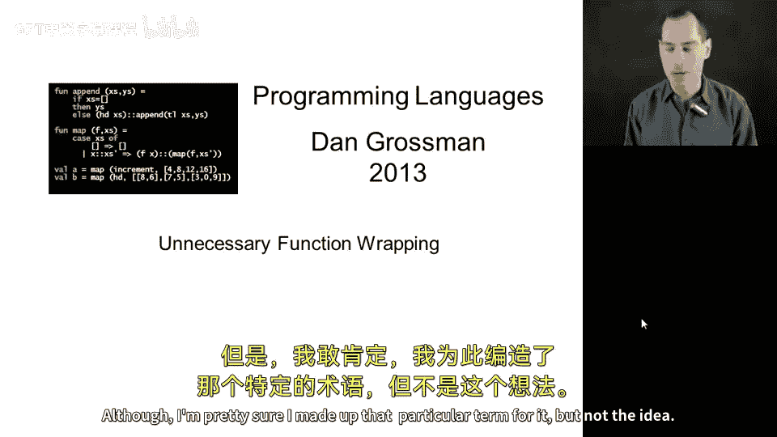
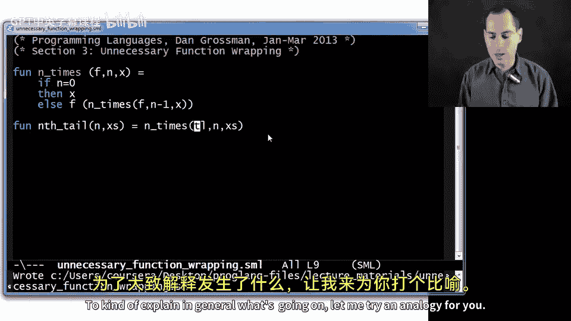
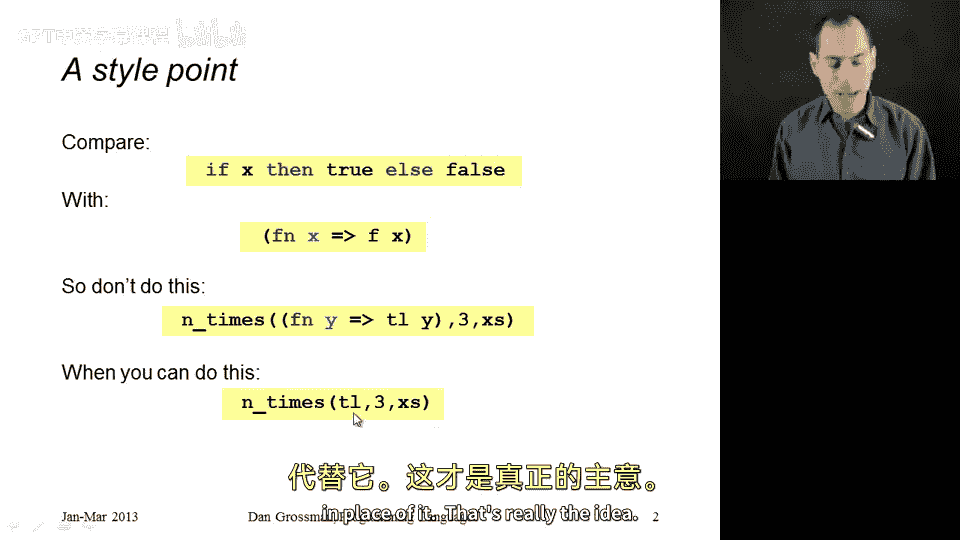
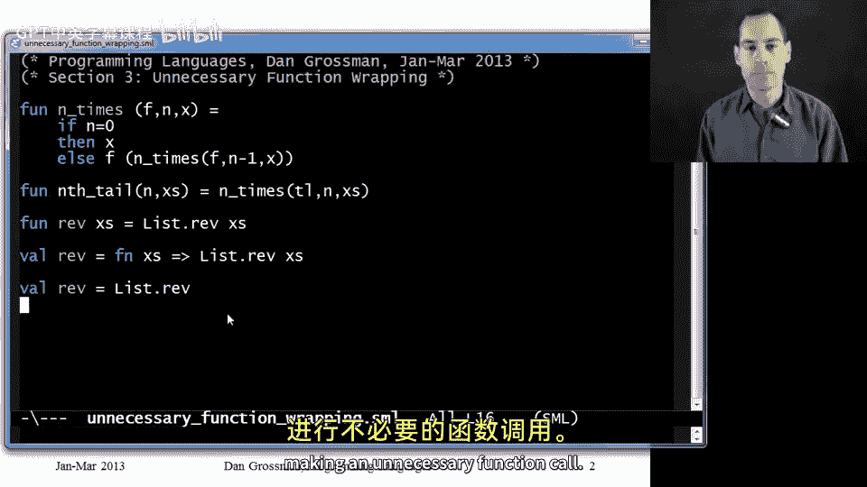

# 【编程语言 A⧸B⧸C CSE341 Coursera】华盛顿大学—中英字幕 p55 54_05_unnecessary-function-wrapping -BV1bw4m1D7MM_p55-

Now that we've learned anonymous functions， I want to show you one programming pattern that's actually poor style。

 It's actually an overuse of anonymous functions where you don't need them。

 and that's something I like to call unnecessary function wrapping although I'm pretty sure I made up that particular term for it。

 but not the idea。 So let's go over here， use our same high order function we've been playing around with for a long time n times and try to write one of the things that's really useful for which is taking the n tail of some list。

 So I'm going have n and X's， which is going to be my list。

 and I want to n times take the tail of the list。 So my second and third argument to n times are clearly going to be n and X's。

 but for the first argument we realize well we just need a function right here that takes the tail of its argument。

 and we just learned anonymous functions。 So let's use them right， let's say fun y tail of Y。

 And this will work。 and it's correct。 and we feel good about using anonymous。

And I'm going to argue this is actually just a very minor bit right there of inferior style。

 And here's why。Let's look at this function we wrote and let's describe what it does。

This is a function that takes one argument and returns the list tail of that argument。

Is there a simpler expression， a more straightforward way of writing down here an expression that is a function that takes the tail of its argument。

 Yes， there is。 And that is to just write tail。Right tail is a variable that when we look it up in the environment。

 we get a function that does exactly the right thing。

 The other version is wrapping that perfectly good function that does exactly what we want with another function that's going to do the same thing。

 It's just longer。 It's a tiny bit slower since one function has to call another one。

 And it obscures the fact that what we want to pass to end times is a perfectly good function for taking the tail。

 So that's unnecessary function wrapping to kind of explain in general， what's going on。

 Let me try an analogy for you。😊。

We've emphasized previously and you may have seen in previous programming courses that you shouldn't write things like if X then true else false。

 this is an expression that returns true if X is true and false if X is false。

 but another thing that does that is just X， right， we don't need the if then else。

 X is already the expression we want。And similarly。

 if you have a function like take in x and return the result of calling F with x。

The expression F will do just as well。So that's the most common situation where you'll see this unnecessary function wrapping is when we have an anonymous function that has this form that all it does is pass its argument to another function。

 then we should just use that function like tail in our example in place of it。

That's really the idea。 Let me show you one other related thing， somewhat similar。

 also a function wrapping， but comes up a little less often and is a little less obvious。

 that's what's going on。 let me for example， you probably don't know this in the standard library from M。

 there's a function list dot rev that reverse as a list。

 So suppose you were going to use this a lot or you trouble remembering that it was list dot and in some file。

 you just wanted your own function Re that did the same thing。 but of course。

 you don't want to reimplement reverse。 There's a perfectly good library function So you would write it like this。

 So this is also a necessary function wrapping。 I have a function reverse that takes in one argument X's and returns。

 it's body is calling list dot rev with X's。 If we use the sort of de sugaruged version of this that might be more obvious since our function Re is not recursive。

We could have written it like this。And now we see indeed。

 this anonymous function here has exactly the pattern that is this unnecessary function wrapping。

 and indeed a superior style solution would be to just write Val Re equals list do rev。

RightThis may look a little strange to you， but it's a great use of first class functions。

 I'm defining a variable rev and what I will bind it to is the result of evaluating this expression list do rev so I look up list rev in my environment I get a function back and so rev will now be bound to the same function as list rev。

 So whenever you want a shorter or simpler or easy to remember name for a function that's defined somewhere else。

 I really prefer this third version to the first version because again。

 it's a little simpler it's more direct what it is you're doing and it's actually even a little bit faster because you're not making an unnecessary function call。

😊。

