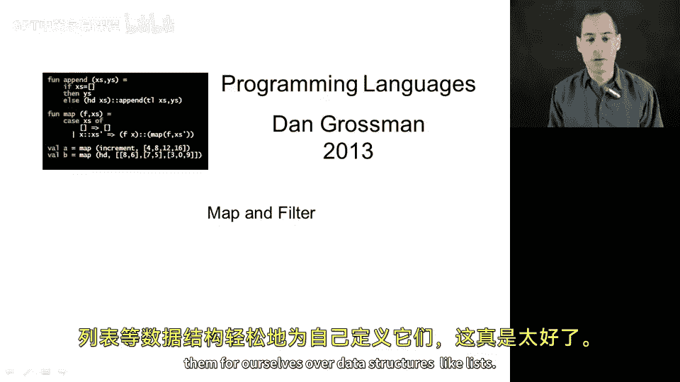
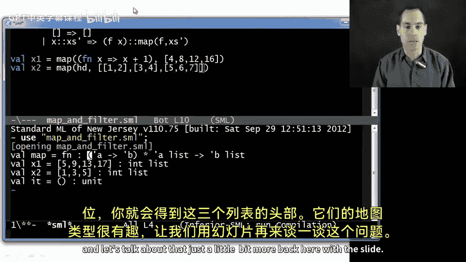
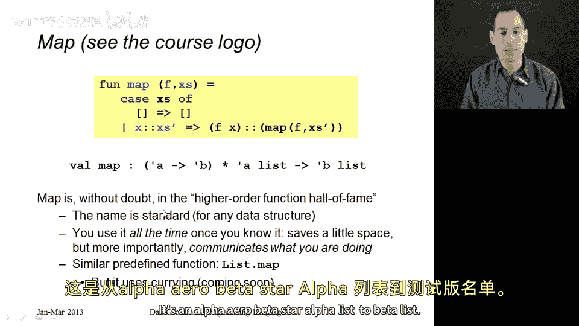
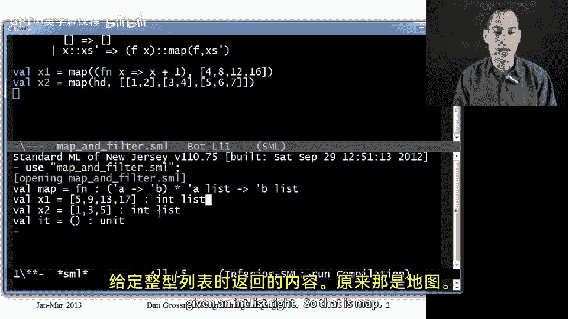
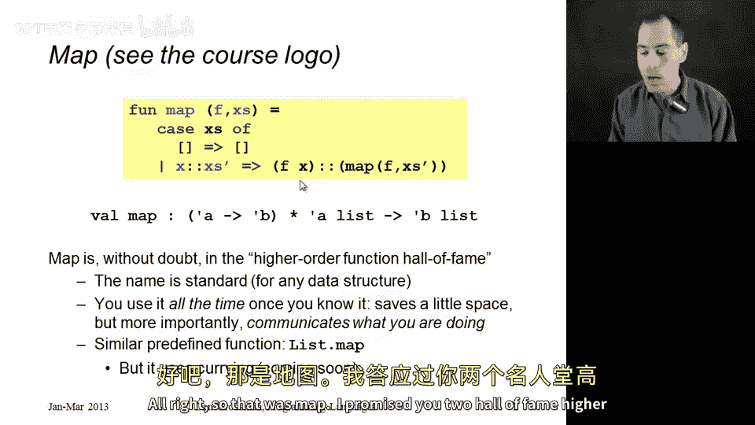
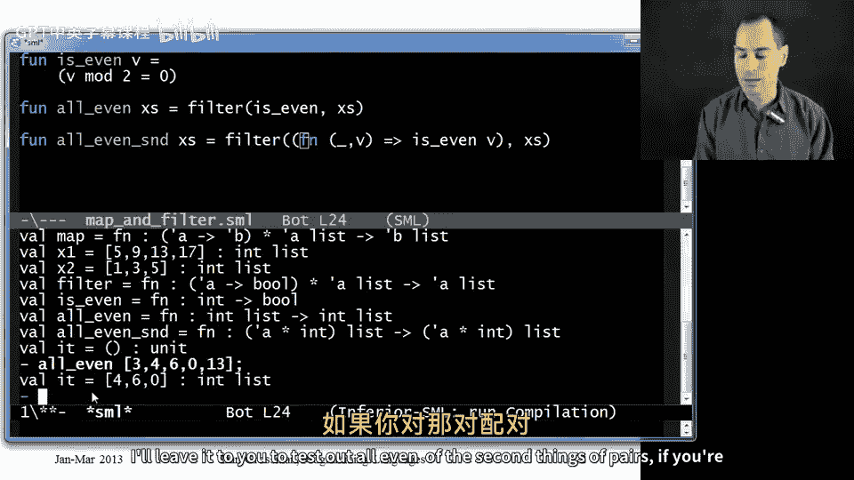
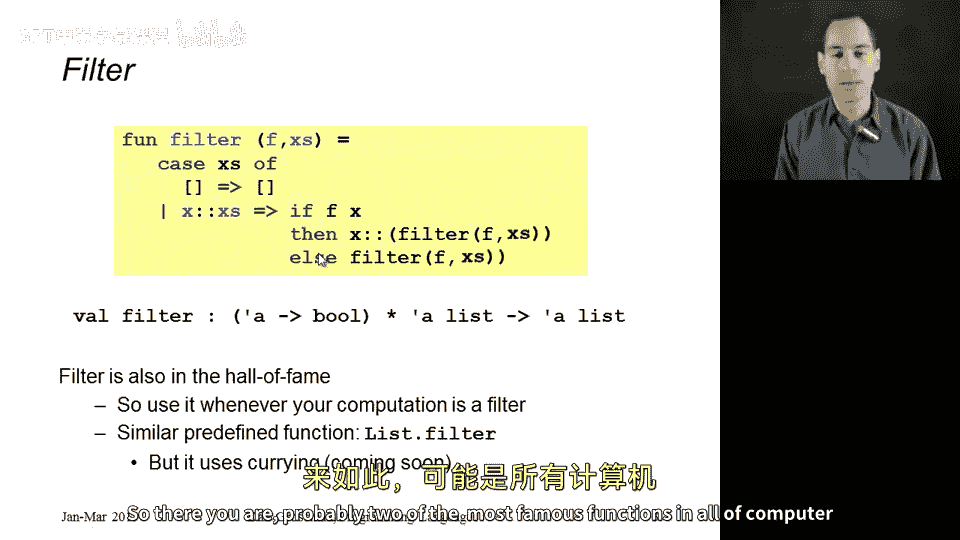

# 编程语言 A/B/C CSE341：第56讲：map与filter高阶函数 🧠

在本节课中，我们将学习并实现两个著名的高阶函数：`map` 和 `filter`。这两个函数在计算机科学和软件开发中极为常见，是处理列表等数据结构的强大工具。我们将通过简单的例子来理解它们的工作原理和类型签名。



## 概述 📋

`map` 函数接受一个函数和一个列表，返回一个新列表，其中每个元素都是原列表对应元素经过给定函数处理后的结果。`filter` 函数也接受一个函数和一个列表，但该函数返回布尔值，`filter` 会返回原列表中所有使该函数返回 `true` 的元素组成的新列表。

## 实现 map 函数

上一节我们介绍了高阶函数的概念，本节中我们来看看如何实现 `map` 函数。`map` 函数的核心思想是将一个函数 `f` 应用到列表的每个元素上。

以下是 `map` 函数的定义：

```sml
fun map f xs =
    case xs of
        [] => []
      | x::xs' => (f x) :: (map f xs')
```



这个函数的逻辑是：
*   如果输入列表 `xs` 为空，则结果也是一个空列表。
*   如果列表非空（由头部 `x` 和尾部 `xs'` 组成），则结果列表的头部是 `f x`，尾部是递归地对 `xs'` 应用 `map f` 的结果。

`map` 函数的类型签名非常通用：`(‘a -> ‘b) -> ‘a list -> ‘b list`。这意味着：
*   第一个参数 `f` 是一个从任意类型 `‘a` 到任意类型 `‘b` 的函数。
*   第二个参数是一个 `‘a` 类型的列表。
*   返回值是一个 `‘b` 类型的列表。

## 使用 map 函数

理解了 `map` 的实现后，我们来看看如何使用它。





以下是两个使用 `map` 的例子：

1.  对整数列表中的每个元素加一：
    ```sml
    val x1 = map (fn x => x + 1) [4, 8, 12, 16]
    (* 结果为 [5, 9, 13, 17] *)
    ```
2.  获取一个列表的列表（`int list list`）中每个子列表的第一个元素：
    ```sml
    val x2 = map (fn lst => hd lst) [[1,2,3], [3,4], [5]]
    (* 结果为 [1, 3, 5] *)
    ```

使用 `map` 是一种良好的编程风格，它能清晰地告诉代码的阅读者：这里正在对集合中的每个元素进行相同的操作以生成一个新的集合。

## 实现 filter 函数



接下来，我们学习第二个高阶函数 `filter`。与 `map` 不同，`filter` 用于根据条件筛选列表中的元素。

以下是 `filter` 函数的定义：

```sml
fun filter f xs =
    case xs of
        [] => []
      | x::xs' => if f x
                  then x :: (filter f xs')
                  else filter f xs'
```

这个函数的逻辑是：
*   如果输入列表为空，则结果为空列表。
*   如果列表非空，则检查函数 `f` 应用于头部元素 `x` 的结果。
    *   如果 `f x` 为 `true`，则将 `x` 包含在结果中，并递归处理剩余部分。
    *   如果 `f x` 为 `false`，则跳过 `x`，直接递归处理剩余部分。

`filter` 函数的类型签名是：`(‘a -> bool) -> ‘a list -> ‘a list`。这意味着：
*   第一个参数 `f` 是一个从任意类型 `‘a` 到布尔值 `bool` 的函数。
*   第二个参数和返回值都是 `‘a` 类型的列表，因为 `filter` 返回的是原列表的一个子集。

## 使用 filter 函数

现在，我们通过一些例子来看看 `filter` 的实际应用。



以下是两个使用 `filter` 的例子：

1.  定义一个函数，从整数列表中筛选出所有偶数：
    ```sml
    fun is_even x = (x mod 2 = 0)
    fun all_even xs = filter is_even xs

    (* 测试 *)
    val result = all_even [3, 4, 6, 0, 13]
    (* 结果为 [4, 6, 0] *)
    ```
2.  定义一个函数，从一个（任意类型，整数）对的列表中，筛选出第二个元素是偶数的对：
    ```sml
    fun all_even_second xs =
        filter (fn (_, y) => y mod 2 = 0) xs
    ```

## 总结 🎯

本节课中我们一起学习了两个极其重要的高阶函数：`map` 和 `filter`。
*   **`map`** 函数用于将同一个操作应用于列表的每个元素，从而生成一个结构相同但内容被转换的新列表。其类型为 `(‘a -> ‘b) -> ‘a list -> ‘b list`。
*   **`filter`** 函数用于根据一个判断条件（返回布尔值的函数）从列表中筛选出符合条件的元素，生成一个子集列表。其类型为 `(‘a -> bool) -> ‘a list -> ‘a list`。



掌握这两个函数是理解函数式编程思想的关键一步，它们也是许多编程语言标准库中的核心工具。