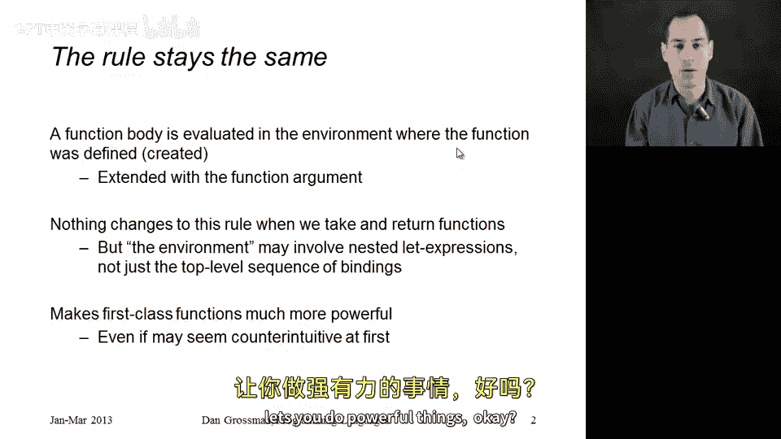
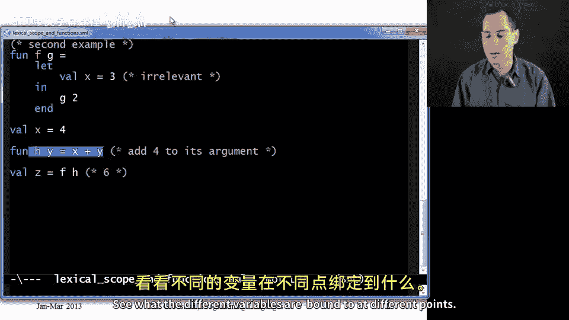
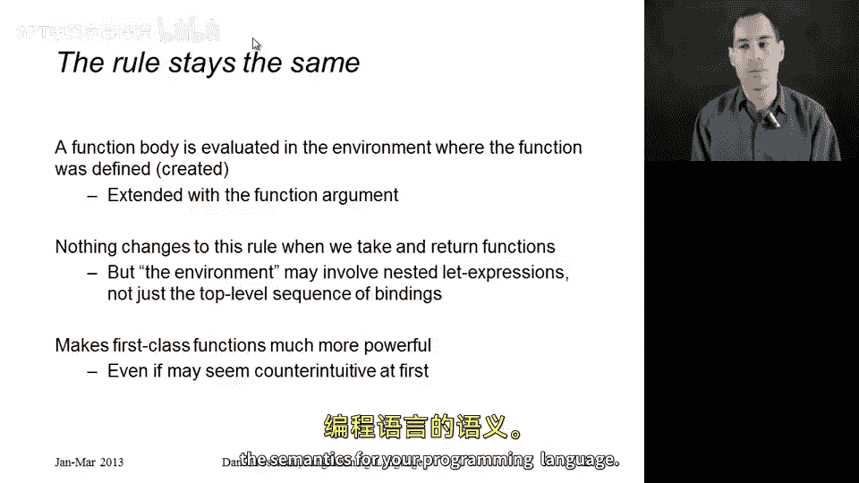

# 【编程语言 A⧸B⧸C CSE341 Coursera】华盛顿大学—中英字幕 p59 58_09_lexical-scope-and-higher-order-functions -BV1bw4m1D7MM_p59-

Okay， I want to continue our discussion of lexical scope。

 now I'm going to toss into the discussion functions that take in return other functions。

So the rule is not going to change。 The rule is that we always evaluate a function body in the environment where the function was defined at the point we created that function。

 we made a closure with the environment we had at that moment and that's the environment we use when we later call the function。

 So nothing is going to change here except what the environment is。

 is going to be much more interesting because we're going to have nested lead expressions。

 we're going to take functions we're going to return functions。

 So in this segment I'm going to do two examples that are a little bit complicated and are silly they're not going to motivate the semantics and then in later segments we'll get to why you want the semantics and how it lets you do powerful things。

So let's go to the code， here is our first example， let's just walk through it line by line。

 so we start with an environment where x is 1， this is going to turn out to be irrelevant because we're going to end up shadowing X anywhere before we could possibly use it。

Then on this next line， we're defining a function Y and this sorry。

 a function F and this function F returns this anonymous function right here。

 So let's just look at this function。 And the great thing about lexicalco is we can figure out what this function does completely separate from the rest of the file and how it's potentially called。

 So the function F takes an argument Y。Creates a local variable X that holds y plus1。

 So that's going to shadow in here， this outer X that would have been in the environment。

 but of course， it's shadowed in the body of this lead expression。We then return this function。

 Allright， So whenever you call F with some y， this is going to take Z and return in terms of F's argument to y plus 1。

 because x is y plus1。 And we're adding x and y and z together。

That is what it will always do because the environment where this function was defined。

Had whatever Y maps to based on the call to F and then x mapping to y plus1。

So let's see that in action with a use of f and a use of the function that's returned down here。

 I'm going to have v x equal 3。 this will again be irrelevant。

 I'm just putting it here to show that it's irrelevant。

And the reason why it's irrelevant is right here I call F with four。

 so this is going to return a function that adds9 to its argument。

The reason why it's9 is because2 y plus 1 where y is 4 is 9。 we call f with 4。

 so we go up to the body of F right here， y is4， we create an environment where y is 4 and x is 5。

 and we return a function that when called， we'll use that environment extended with whatever Z maps do。

So sure enough， right here where I call G， the function returned up here。 When I call G with6。

 I will get。15。Because that is9 plus6。The fact that this y is5 here also irrelevant。😡。

The same way that we're not going to use the fact that x is 3 when we evaluate this x plus y plus Z。

 We're not going to use this y equal 5。 When we evaluate this x plus y plus Z。

 we use the environment where the function was created。 Y is 4。X is 5。

If we had another call to F down here with a different argument that would create a different closure with a different environment。

 one where x was sorry， y was8 and x was 9， so that would return a function that always added 17 to its argument。

So that's our first example。 Let us now go to our second example。 The second example。

 we're going to pass in a function to a function rather than returning a function from a function。😊。

So here is our function F that takes a function G， and all it does is called G with2。

The rest of this is more irrelevant clutter。And in fact， let's look at function F， and again。

 the advantage of lexical scope is we can understand a function just by looking at its definition and what is in its environment。

 we never have to look at how it's called。So if I look at this function， I say oh。

 it takes a function G and it calls it with2。 And in fact， the rest of this is， I mean。

 I'm just defining a variable that's never used。 So I would very naturally just come in here and delete all this。

 I'm commenting it out here so you can still see it。 but that should be exactly the same function。

 a function that takes its argument and calls it with two is the same as a function that defines a local variable X to be3 and then calls G with2。

 So the great thing about lexical scope is you can do this kind of code maintenance and know that it's never going to change how the function behaves。

😊，Let's see that by following through with an actual call， so here I have Val x equals 4。

And now I create a little function here， H， so this function is always going to add4 to its argument。

 why， because it's the same thing at top level when I create this binding H。😡。

I create a closure that has it。 the current environment where the function was defined。

 And then at this point， we have an environment where x is 4。

 So H is bound to a function that will always add4 to its argument。

So now we get to the exciting last line where we're going to call F with H。

 so I'm going to look up F。And I'm going to get this function that always calls its argument with two。

And I'm going to pass in H， which is a function that always adds4 to its argument。 So I will get6。

I will not get seven。7even is what you would get if you passed in this code， which has body X plus y。

And then here said， oh， now I want to look up X in this environment， but that's wrong。

 We always look up X in the body where the function we're calling was defined。

 And here we pass for G， the function H。😡，That's this function。 We looked up H in the environment。

 We got this function that adds forward to its argument。 And so we get 6。

So those are two complicated examples。 If you don't believe me。

 feel free to go back through them more slowly。 try them in the Ritaval print loop。

 see what the different variables are bound to at different points。

 The remaining slides here have the exact same examples。

 and a little bit more text to walk you through it。

 So this was the first example we did when we ended up with 16。

 And this is the second example where we ended up with6 bound to Z。

 So now that we hopefully understand lexical scope。

 and believe me that we didn't change the rule in this segment。 It's the same rule we had before。

 we can move on to discussing why you want the semantics for your programming language。😊。

