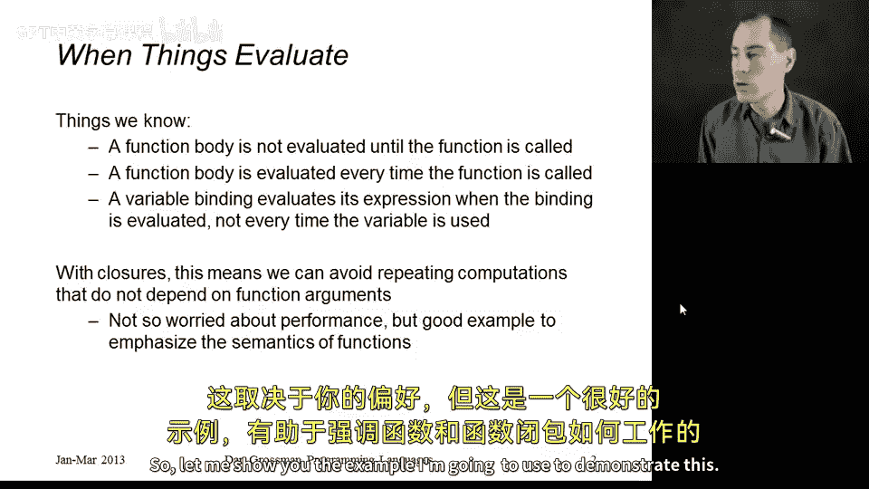
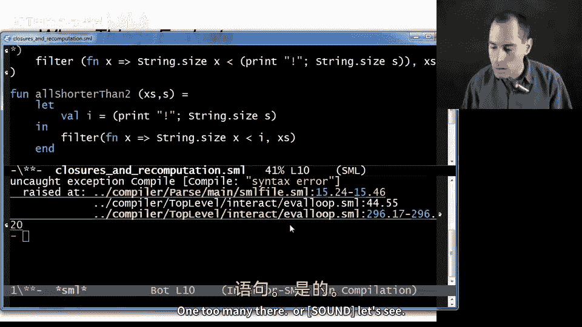

# 编程语言 A/B/C CSE341：第61讲：闭包与避免重复计算 🚀

在本节课中，我们将学习如何利用对词法作用域的理解，在使用闭包时避免不必要的重复计算。我们将通过一个具体示例，展示如何通过简单的代码调整来提升程序性能，并加深对函数闭包工作机制的理解。

## 概述

我们将首先回顾函数求值、变量绑定和闭包的基本概念。随后，通过一个过滤字符串列表的示例，展示一个存在不必要重复计算的初始版本代码。最后，我们将利用闭包和局部变量对该代码进行优化，消除重复计算，并通过添加打印语句直观地展示优化效果。

## 核心概念回顾

在深入示例之前，我们先明确三个关键点：

1.  **函数体求值时机**：函数体中的代码直到函数被调用时才会执行。这与词法作用域无关，是大多数编程语言中函数的通用行为。
    *   **代码示例**：`fun f(x) = ... (* 函数体 *)` 中的 `...` 部分在 `f(5)` 调用时才计算。

2.  **函数体的重复求值**：每次调用函数时，其函数体都会使用当次调用的参数重新求值一次。

3.  **变量绑定求值时机**：变量绑定（如 `let` 绑定）中的表达式仅在绑定被执行时求值一次，而不是在每次使用该变量时都重新求值。
    *   **代码示例**：`let val size_s = String.size(s) in ... end` 中的 `String.size(s)` 只计算一次。

理解以上三点后，我们可以将它们结合起来。利用闭包，我们可以将函数体中那些不依赖于函数参数的计算结果“提取”出来，通过局部变量绑定只计算一次，从而避免在每次函数调用时重复计算。这能提升性能，虽然可能使代码稍长，但有助于清晰展示函数闭包的语义。

## 示例：过滤短字符串

让我们通过一个具体例子来演示。首先，我们使用高阶函数 `filter`。其定义没有变化。

现在，我们定义一个函数 `allShorterThan1`。它接收一个字符串列表 `xs` 和一个字符串 `s`，返回一个新的字符串列表。其类型为 `string list * string -> string list`。

它的功能是过滤出所有长度严格小于字符串 `s` 长度的字符串。

以下是实现方式：调用 `filter`，传入列表 `xs` 和一个合理的匿名函数。该匿名函数接收列表中的一个元素 `x`，并判断 `String.size(x) < String.size(s)` 是否成立。如果 `x` 严格更短，则保留在结果中；否则过滤掉。

这个实现本身没有错误，能得到正确结果。但问题是，对于列表 `xs` 中的**每一个**元素，我们都会重新计算一次 `String.size(s)`。因为 `filter` 会为每个列表元素调用一次匿名函数，而每次调用都会计算 `s` 的长度。这是一个不必要的重复计算，因为 `s` 的长度并不会改变。

## 优化：使用闭包避免重复计算

修复方法如下，我们来看第二个例子 `allShorterThan2`：

我们创建一个局部变量 `i` 来保存 `String.size(s)` 的结果。然后在匿名函数中，判断条件改为 `String.size(x) < i`。

这将产生完全相同的答案。调用者无法区分我们使用的是第一个版本还是第二个版本，除非注意到当列表非常长或 `s` 非常长时，两者存在性能差异。

这正是我想展示的技巧。请注意，这里我们**需要闭包**。如果没有词法作用域，没有在闭包中存储函数定义时的环境，我们将无法在匿名函数内部使用这个局部变量 `i`。这再次证明了闭包和词法作用域是非常自然且必要的概念。

## 可视化优化效果

为了直观展示两者的区别，我们可以在代码中添加一些打印语句，以便观察计算发生的位置。

ML语言中有一个 `print` 函数，它接收一个字符串并将其打印出来。此外，还有一个分号 `;` 操作符。通常，表达式 `E1; E2` 会先执行 `E1` 并丢弃其结果，然后执行 `E2`，整个表达式的结果是 `E2` 的结果。在函数式编程中，我们很少需要这种顺序执行，因为执行一个没有赋值或副作用、结果又被丢弃的计算没有意义。但打印是一个很好的具有副作用的例子，而这正是我们想要的效果。

类似地，我们也可以在调用 `String.size(s)` 之前添加打印语句。我的想法是，每次计算 `String.size(s)` 时，打印一个感叹号 `!`。这样修改后，我们得到两个函数 `allShorterThan1` 和 `allShorterThan2`。

下面是一些测试代码。它会先调用 `allShorterThan1`，然后在一个长度为4的列表上调用 `allShorterThan2`（使用相同的字符串参数），接着再次调用 `allShorterThan2`。

运行这段代码（文件名为 `use-closures-and-recomputation.sml`），在修复了括号问题后，我们得到以下输出：

我们可以看到：
*   对于没有使用局部变量的 `allShorterThan1` 版本，在处理长度为4的列表时，我们得到了4个感叹号，这意味着 `String.size(s)` 被重复计算了4次。
*   而对于调用了 `allShorterThan2` 的版本，`let` 绑定（计算 `String.size(s)`）只执行了一次。尽管匿名函数被调用了4次，我们查找了变量 `i` 4次，但查找变量只是返回值（例如数字3，即列表长度），这个过程没有重复计算。

## 总结

本节课中，我们一起学习了如何利用闭包和词法作用域来优化代码，避免不必要的重复计算。我们回顾了函数求值、变量绑定和闭包的核心概念，并通过一个过滤字符串的示例，演示了如何将不依赖于函数参数的昂贵计算移出函数体，通过局部变量绑定只计算一次。这种技巧虽然可能使代码稍长，但能有效提升性能，并且清晰地展示了闭包如何“记住”其定义时的环境。最后，我们通过添加打印语句，直观地验证了优化前后计算次数的差异。