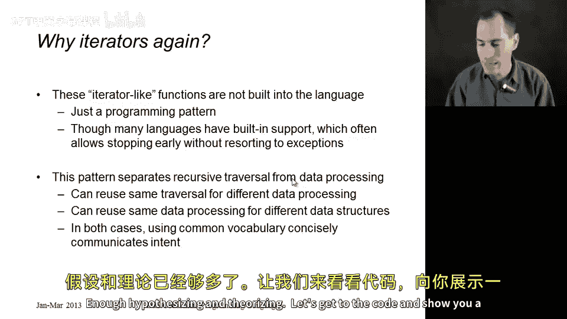
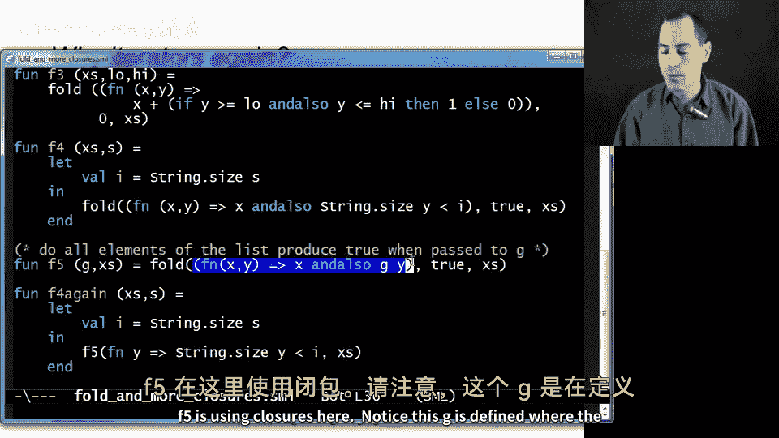
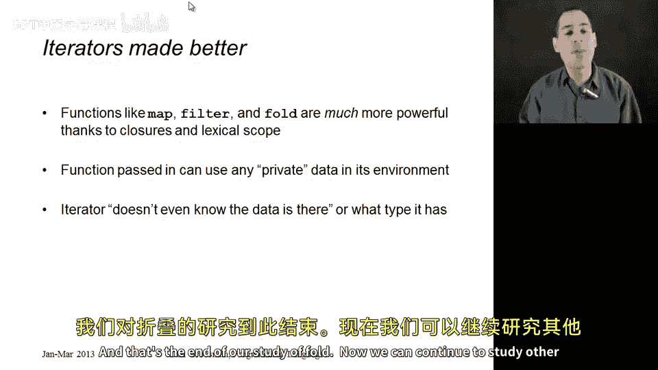

# 编程语言 A/B/C CSE341 Coursera：62：Fold 与更多闭包示例

在本节课中，我们将学习一个名为 **fold** 的著名高阶函数，它用于递归遍历数据结构。我们将通过多个示例来展示如何使用闭包，并深入理解这类迭代式高阶函数的本质。

## 概述

**Fold**（有时也称为 **reduce** 或 **inject**）是一个用于遍历递归数据结构（如列表）并产生单一结果的高阶函数。它的核心思想是，通过一个初始值（累加器）和一个二元函数，依次处理列表中的每个元素，最终得到一个累积结果。

## Fold 的工作原理

上一节我们介绍了高阶函数的概念，本节中我们来看看 **fold** 的具体实现。其工作方式如下：

我们定义一个函数 `fold`，它接收三个参数：一个函数 `F`、一个初始累加器值 `acc` 和一个列表 `xs`。其过程是：
1.  将函数 `F` 应用于累加器 `acc` 和列表的第一个元素。
2.  将上一步的结果作为新的累加器，与列表的第二个元素一起传递给 `F`。
3.  重复此过程，直到遍历完整个列表，最终的结果就是最后的累加器值。

你可以想象列表从左到右展开，然后从初始累加器开始，依次“折叠”每个元素。

在像 ML 这样支持高阶函数和便捷语法的语言中，我们可以用大约三行代码实现 `fold`：

```ml
fun fold (f, acc, xs) =
    case xs of
        [] => acc
      | x::xs' => fold (f, f(acc, x), xs')
```

这是一个从左向右折叠的版本（`foldl`）。如果列表元素从左到右排列，我们也可以编写一个从右向左折叠的版本（`foldr`），但后者通常无法很好地实现尾递归。除非函数 `F` 对顺序敏感，否则方向通常不重要，因此标准库中通常会区分左折叠和右折叠。

## Fold 的类型签名

`fold` 的类型签名清晰地揭示了它的功能。在 REPL 中，其类型可能显示为：

```
(‘a * ‘b -> ‘a) -> ‘a -> ‘b list -> ‘a
```

这告诉我们：
*   函数 `F` 接受两个类型分别为 `‘a` 和 `‘b` 的参数（它们可以相同也可以不同），并返回一个 `‘a` 类型的值。
*   累加器 `acc` 的类型必须是 `‘a`。
*   列表 `xs` 的元素类型必须是 `‘b`。
*   整个 `fold` 函数的最终结果类型也是 `‘a`。

因此，你从一个 `‘b list` 和一个初始答案 `‘a` 开始，使用 `F` 遍历列表，在每个位置产生一个新的 `‘a` 类型答案，最终得到最后一个 `‘a` 作为结果。

## 为何 Fold 如此重要

这类迭代器函数并非内置于语言中，它们只是一种编程模式。我们刚才在幻灯片上用三行 ML 代码就写出了 `fold`。许多语言确实为遍历数据结构和计算结果（如 `fold` 所做之事）提供了内置支持，这并无不妥，因为这些操作非常普遍。

但拥有 `fold` 的美妙之处在于，我们可以直接用语言本身编写它。它是一个**概念**。我们为列表编写了 `fold`，如果面对数组、树、图或集合等不同的数据结构，我们同样可以为它们编写 `fold`。然后，不同的使用者可以传入各种各样的函数 `F` 来使用 `fold`。

这实现了**关注点分离**：一组人可以专注于为复杂的数据结构编写 `fold`，而另一组人可以专注于为特定结果编写计算逻辑。如果你开始使用列表以外的数据结构，可以复用你的计算函数，只需一个新的 `fold` 实现即可。反之，一旦为列表编写了 `fold`，许多人可以将其用于不同的计算。这一切仅仅通过使用高阶函数和传递函数来实现。

## Fold 使用示例

理论阐述已经足够，现在让我们通过代码来展示一系列 `fold` 的示例用法，以帮助你更好地掌握其工作方式。

以下是 `fold` 函数的定义，我们将基于它进行演示：

```ml
fun fold (f, acc, xs) =
    case xs of
        [] => acc
      | x::xs' => fold (f, f(acc, x), xs')
```



### 示例 1：列表求和

第一个示例展示了如何使用 `fold` 对列表元素求和。

```ml
val f1 = fn xs => fold ((fn (x, y) => x + y), 0, xs)
```

在这个调用中，我们传入列表 `xs`，初始累加器为 `0`。匿名函数的第一个参数 `x` 是当前的累加器，第二个参数 `y` 是列表的下一个元素。每一步，我们都将累加器与下一个列表元素相加，结果作为新的累加器。因此，这行代码是使用 `fold` 对列表元素求和的一行式解决方案。

### 示例 2：检查所有元素是否非负

第二个示例检查列表中的所有元素是否都非负（大于等于0）。

```ml
val f2 = fn xs => fold ((fn (x, y) => x andalso y >= 0), true, xs)
```

这里，初始累加器是 `true`。在每一步，我们检查当前累加器 `x` 是否为真，并且下一个元素 `y` 是否 `>= 0`。如果 `y` 是负数，整个表达式将为假；如果 `x` 已经是假，结果也将是假。`x` 会随着列表的每个元素更新。最终，这个函数判断列表中的所有元素是否都非负。

### 示例 3：计算范围内元素个数（使用闭包）

接下来的示例开始展示闭包的真正威力，即函数可以使用其定义环境中的其他数据。

```ml
val f3 = fn (xs, low, high) =>
    fold ((fn (x, y) => x + (if y >= low andalso y <= high then 1 else 0)), 0, xs)
```

我们传入列表 `xs`，初始累加器为 `0`。在匿名函数中，`x` 是当前累加器，`y` 是下一个元素。我们检查 `y` 是否在 `[low, high]` 这个闭区间内，如果是则加1，否则加0。注意，这里使用了私有数据 `low` 和 `high`，它们只在定义此匿名函数的作用域内有效。闭包使得这成为可能。这个函数实际上是在计算列表中处于 `low` 和 `high` 之间（包含两端）的元素个数。

### 示例 4：检查所有字符串长度小于给定字符串

这个示例类似于上一节的内容，它接收一个字符串列表和一个字符串 `s`，检查列表中所有字符串的长度是否都严格小于 `s` 的长度。

```ml
val f4 = fn (xs, s) =>
    let val i = String.size s
    in
        fold ((fn (x, y) => x andalso String.size y < i), true, xs)
    end
```

我们调用 `fold`，初始累加器为 `true`。闭包中的逻辑是：当前累加器 `x` 为真，并且下一个字符串 `y` 的长度严格小于预先计算好的 `i`（即 `s` 的长度）。通过 `let` 绑定避免了对 `String.size s` 的重复计算。这个函数最终判断列表中的所有元素（字符串）的长度是否都严格小于字符串 `s` 的长度。

### 示例 5：通用的“全部满足”函数

最后一个示例定义了一个更通用的高阶函数。

```ml
val f5 = fn (g, xs) => fold ((fn (x, y) => x andalso g y), true, xs)
```

函数 `f5` 接收一个函数 `g` 和一个列表 `xs`。它调用 `fold`，初始累加器为 `true`，并在每一步计算 `x andalso g(y)`。这意味着，`f5` 使用 `fold` 来检查列表中的所有元素在传递给函数 `g` 时是否都返回 `true`。这是一个可复用的函数，用于判断列表中的所有元素是否都满足某个条件（由 `g` 定义）。

基于这个通用的 `f5`，我们可以重新定义之前的 `f4`，而无需直接使用 `fold`：



```ml
val f4_v2 = fn (xs, s) =>
    let val i = String.size s
    in
        f5 ((fn y => String.size y < i), xs)
    end
```

这里，我们只需调用 `f5`，并传入一个简单的匿名函数（检查字符串长度是否小于 `i`）以及列表 `xs`。这是使用高阶函数的另一种方式。注意，在 `f5` 的定义中，函数 `g` 是在其定义处捕获的，这也是闭包的应用。

## 总结

本节课中，我们一起学习了 **fold** 这个强大的高阶函数。我们首先了解了它的工作原理和类型签名，然后通过多个示例演示了它的用法，包括列表求和、条件检查，以及利用闭包引入私有数据进行更复杂的计算（如计数和通用判断）。

这些示例表明，**map**、**filter** 和 **fold** 这三个最重要的高阶函数，在闭包和词法作用域的加持下变得更为强大。我们可以通过作用域传入函数 `F` 所需的任何私有数据，而迭代器 `fold` 本身无需知道这些数据是什么，甚至无需知道其类型。无论是像 `f1`、`f2` 那样不使用私有数据，还是像 `f3`、`f4`、`f5` 那样使用，`fold` 都以相同的方式工作：为列表中的每个元素调用一次函数 `F`，而 `F` 可以使用其环境中的任何信息。



我们已经见识了 **map**、**filter** 和 **fold**，当然还存在许多其他有用的高阶函数。事实上，我们刚刚定义的 `f5` 本身就是一个非常有用且比 `fold` 更简单易用的高阶函数，而我们正是用 `fold` 定义了它。这标志着我们对 `fold` 学习的结束，接下来可以继续探索使用闭包的其他重要模式和惯用法。