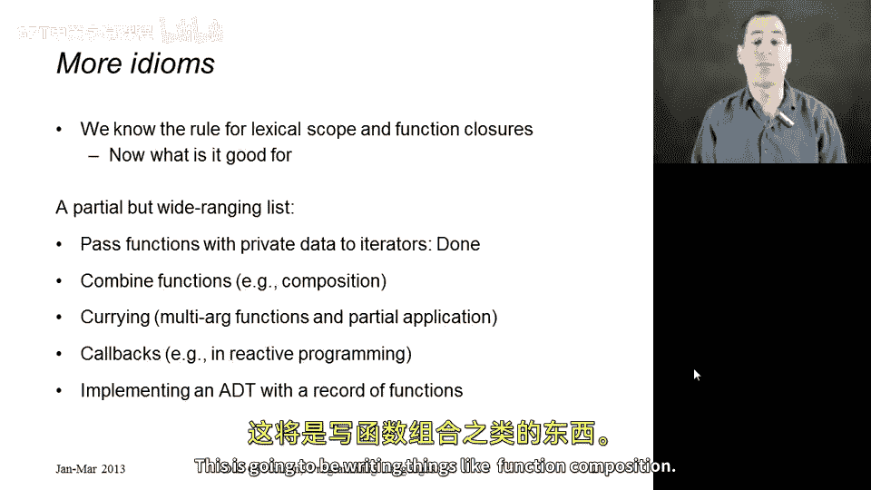
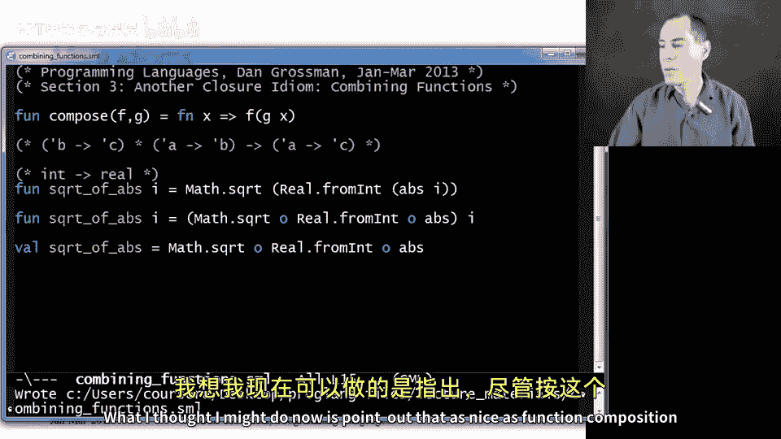
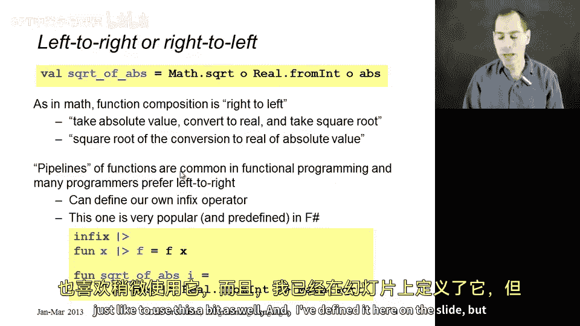
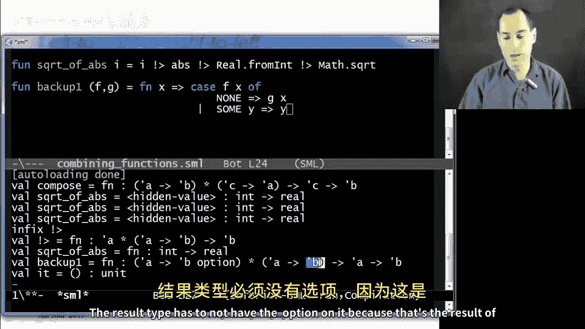

# 编程语言 A/B/C CSE341 Coursera：63：闭包惯用法之组合函数

在本节课中，我们将学习如何利用已掌握的函数闭包知识，探索更多强大的编程惯用法。我们已经了解了词法作用域和函数闭包的语义，并实践了将函数传递给迭代器这一关键惯用法。现在，我们将继续学习其他几种惯用法。本节课将重点介绍**组合函数**，例如函数组合。

## 函数组合



上一节我们介绍了闭包的基本概念，本节中我们来看看如何组合函数。函数组合是数学和计算机科学中的一个基本思想。我们首先编写一个名为 `compose` 的函数，它接收两个函数 `F` 和 `G`，并返回一个新函数。当调用这个新函数时，它会计算 `F(G(x))`。

```sml
fun compose (f, g) = fn x => f (g x)
```

调用 `compose` 并传入两个函数后，返回的函数完全利用了闭包的语义。当调用它时，它可以在定义该函数时存在的环境中查找 `F` 和 `G`。

我喜欢将其类型视为：接收两个参数，一个是 `alpha -> beta`（即 `G`），另一个是 `beta -> gamma`（即 `F`），并返回一个 `alpha -> gamma` 的函数。一旦你看到这样的类型，函数的功能就几乎一目了然：它必须在其参数 `A` 上调用 `F(G(A))`，最终返回类型为 `C` 的结果。

在 ML 中，函数组合已经作为一个中缀运算符提供。它使用小写字母 `o`（不是数字0）表示。因此，你可以写 `f o g`，这完全等同于我们上面编写的函数。

以下是使用示例。首先是不使用组合的常规方式：

```sml
fun sqrt_of_abs i = Math.sqrt(Real.fromInt(abs i))
```

现在，我们使用函数组合来编写一个版本，以更清晰地表达代码意图：

```sml
fun sqrt_of_abs i = (Math.sqrt o Real.fromInt o abs) i
```

由于这符合“不必要的函数包装”这一标准模式，我们可以更直接地表达：

```sml
val sqrt_of_abs = Math.sqrt o Real.fromInt o abs
```

这就是函数组合的用法。我们可以看到，要使这一切正确工作，我们需要闭包。



## 管道运算符

尽管函数组合在数学中顺序自然，但在代码中我们不得不从右向左阅读：先取绝对值，转换为实数，再取平方根。这有点反向，尤其是对于习惯从左向右阅读代码的程序员。

近年来，另一个运算符变得更受欢迎，在 F#（ML 的一种方言）中大量使用，许多函数式程序员也喜欢使用它。这个运算符通常写作 `|>`，但在当前使用的 SML 模式中，我使用 `!>` 来避免冲突。

我们可以定义自己的中缀运算符：



```sml
infix !>
fun x !> f = f x
```

这个函数看起来非常简单：它接收一个参数 `x` 和一个函数 `f`，然后调用 `f(x)`。语义上并不复杂，只是调用了函数和参数。但通过将参数放在左边，它允许我们以一种许多程序员认为易于阅读和愉快的方式编写 `sqrt_of_abs`：

```sml
fun sqrt_of_abs i = i !> abs !> Real.fromInt !> Math.sqrt
```

我们称之为管道运算符，因为它看起来像是建立了一个管道：从数字 `i` 开始，将其通过一系列函数传递，最终得到我们想要的答案。这很巧妙，它只是一个编程惯用法，定义了一个非常简单的高阶函数。

## 其他组合示例

我已经展示了函数组合和管道。当然，你还可以用函数组合做更多有趣的事情。以下是其他一些可能有用的组合示例。

首先，定义一个“后备”函数。假设你接收函数 `F` 和 `G`，你想运行 `F`，但如果 `F` 的结果不合适，则返回 `G` 的结果。我们组合函数，返回一个新函数，该函数接收 `x`，并尝试计算 `F(x)`。按照以下写法，`F` 返回一个选项类型。如果该选项是 `NONE`，则调用 `G(x)`；否则，如果它是 `SOME y`，则返回 `y`。

```sml
fun backup1 (f, g) = fn x =>
    case f x of
        NONE => g x
      | SOME y => y
```

从类型可以看出，`F` 必须是 `alpha -> beta option`，因为我们需要用 `NONE` 和 `SOME` 进行模式匹配。第二个参数 `G` 必须接收与 `F` 相同的输入，因为我们可能用调用 `F` 时相同的 `x` 来调用 `G`。结果类型不能带有选项，因为这是我们整个函数的结果，就像在 case 表达式的另一个分支中返回 `beta` 一样。

你可能更喜欢一个使用异常而不是选项的版本：

```sml
fun backup2 (f, g) = fn x => f x handle _ => g x
```



在这个版本中，`F` 和 `G` 都是 `alpha -> beta` 类型。如果 `F` 在调用 `x` 时引发任何异常（通过 handle 表达式中的模式匹配），则改为调用 `G(x)`。

## 总结

本节课中我们一起学习了组合函数的几种闭包惯用法。我们介绍了函数组合，它允许我们将多个函数串联起来；探讨了管道运算符，它提供了一种从左向右阅读的函数应用方式；还看了一些其他组合函数的示例，如后备函数。这些都是在掌握了将函数传递给迭代器之后，进一步利用闭包语义的强大工具。在下一节中，我们将继续学习下一个闭包惯用法。