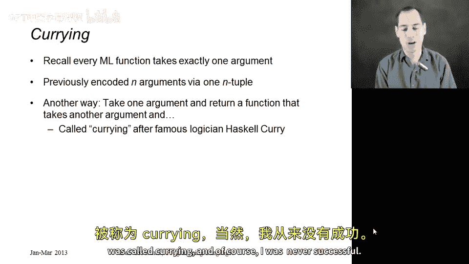
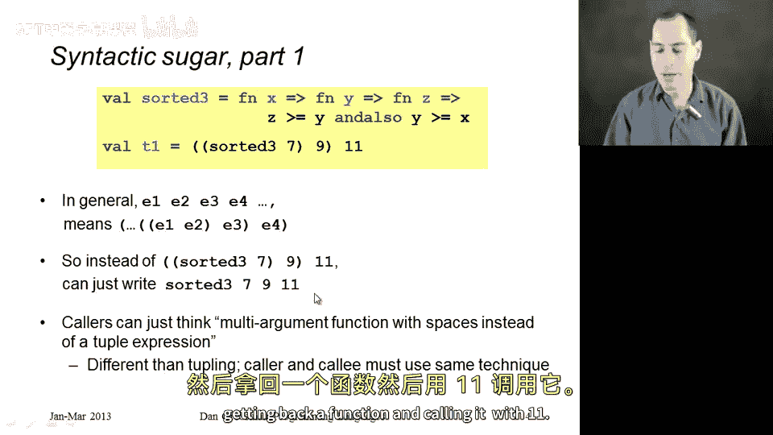
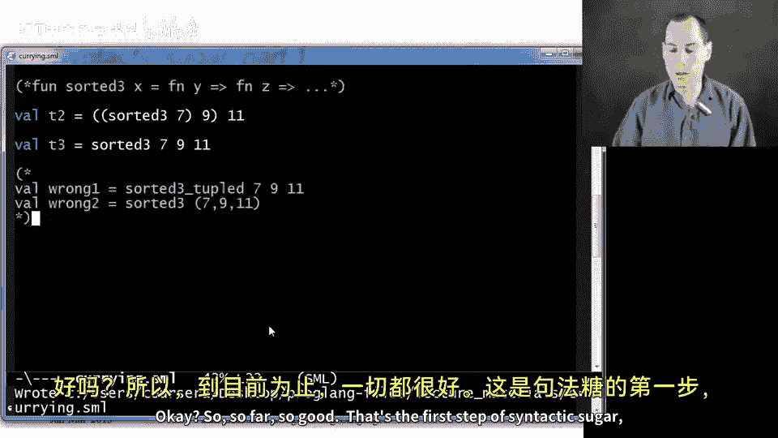
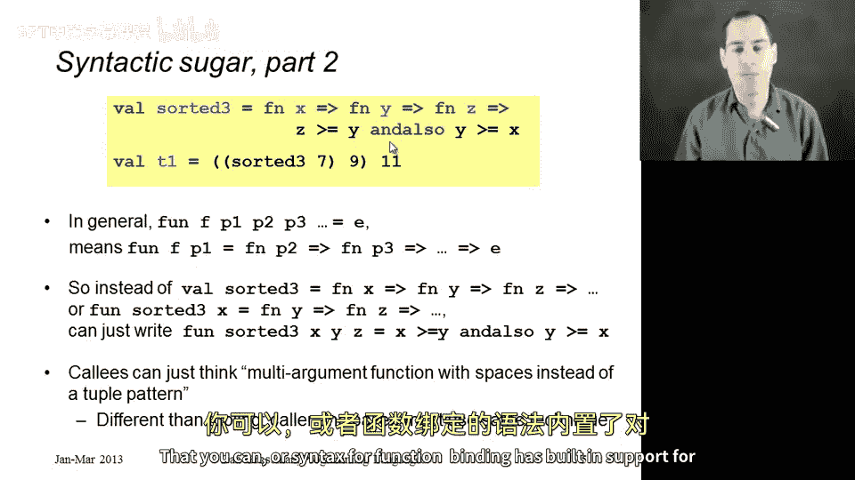
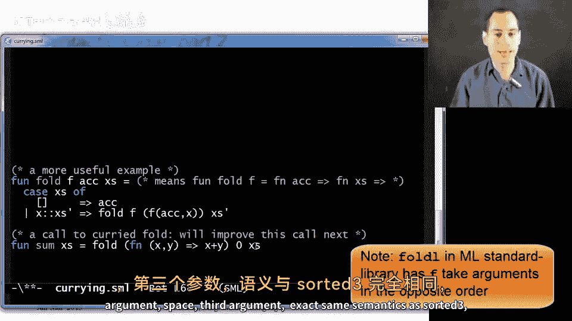
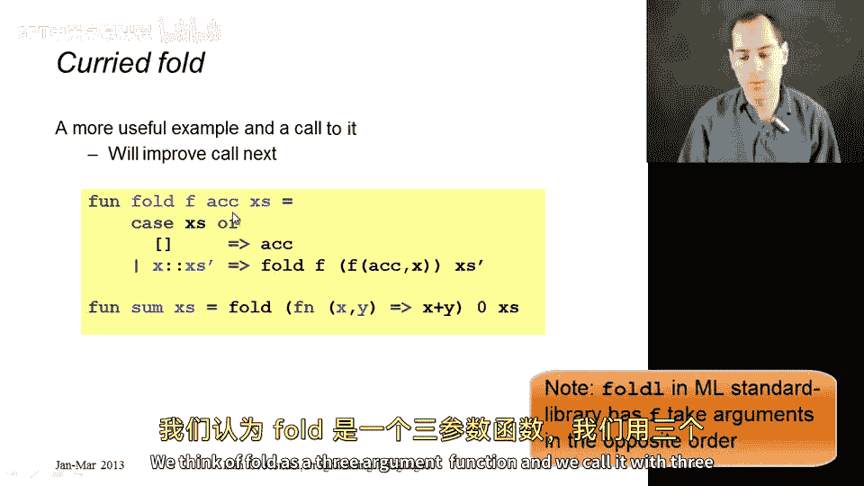

# 【编程语言 A⧸B⧸C CSE341 Coursera】华盛顿大学—中英字幕 p64 63_14_closure-idiom-currying -BV1bw4m1D7MM_p64-

In this segment， we're going to start our study of cur our next closure idiom。

 It's one of my favorite things to do in functional programming。

 and this is a new way to deal with conceptually multiarment functions。

 So you might remember that in ML， every function takes exactly one argument。

We worked around this previously by passing N arguments as n different pieces of a single tuple。

So another way we could do it， which is called currying。

 is to take one argument and return a function that takes the next argument and it'll still be able to use the first argument because it will be in its environment This is calledcurrying after the name of a person just as a funny aside I actually spent years of my life before I knew that trying to figure out why it was calledcurrying and of course I was never successful。

So let me show you an example in the code of how this is going to work。

 so we're going to stick with a very simple example in this section of just a function that takes three arguments conceptually x y and z and sees if they're sorted so in terms of couplingppling。

 just take a triple pattern match against it like this and return true or false based on is z greater than equal to y and is y greater than equal to x。

 and we would call that tud function with a triple like 7，911。

So here is a new way to do it that at first will seem very ugly。

 but then I will show you some syntactic sugar that will make it perhaps even cleaner。

 even more pleasant than the toppled version。So let's just make a sorted 3 function that takes in an X and returns these parentheses are not optional。

 are optional， so I'm going to take them out a function y。

 that when you call it returns a function Z， a function that takes a Z。

 and when you call it says z greater than equal to y。And。Also， y greater than equal to X。 Now。

 if that looks a little funny， too， we could have instead said fund sorted 3。

 Take in in X and then return a function Y that when you call it takes a function Z and so on。

 that's exactly the same thing。 So maybe the Val version will be a little easier here。

 And now what we could do is we could call sorted3。😊，With a number。Like 7。

And that would give us back a function。 right， If we call this with x， we're going to get back this。

So what we could then do is call that function with nine。And that would give us back this function。

And then we could call that。With 11。And this will absolutely work。

And should even give us the right answer， so let's see。Sure enough。

 I have some lower stuff in the file， ignore that sorted tuple takes a tuple of ants and returns a bull。

 T1 was true， sorted3 takes an int， returns a function that takes an int and returns a function and takes an int and that all returns a bull。

 and then we did use it correctly， and so T2 is true。

So let's take a closer look at what's going on because that looks awfully complicated。

It's all the same semantics we already know about closures。So when we called sorted3 of seven。

 we got back a closure。 Remember a closure has two parts。 a code in an environment。

 The code is just the body of the function we called fun Y， Fund Z， Z greater equal Y。

 and also that's the function we got back。 We called sorted 3 was 7。

 It returned this function that takes Y。And the environment for that closure is that x maps the7。

So when we call that closure with nine。We get back a closure whose code is now funds z z greater or equal y and also y greater equal to x。

 because that's what the result is of calling the function with y9， and in the environment。

 x maps to7 and y maps to9。So when we call that closure with 11。

 we evaluate the and expression and we get back through。That's all there is to it。😡。

And while the semantics may seem complicated， it's just closures which we get used to。

 and since curing is such a common pattern， such a common idiom。

 we don't think through it on this level every time we just say， oh。

 I'm using curing so it's like a multi argumentgument function。

And so now let's make it even more pleasant to use by pointing out some syntactic sugar that we happen to have in ML。

So it turns out the first thing we can clean up is this call okay so we don't need all these parentheses in general。

 if you just leave the parentheses out with spaces between arguments。

 the parentheses go in to organize things to the left So if you just write sorted3 space 7 space 9 space 11 it's calling sorted 3 with 7 getting back a function calling it with9。

 getting back a function and calling it with 11 So we don't need those parentheses。

 we can go back to our code here and instead just say Valt3 equals sorted 3，7，9，11。

 and now if you compare this to calling a toppled function， it's actually fewer characters。

 more space characters but less clutter on the screen So that's actually kind of nice and this is a good time to point out that if you have a cur function like sorted3 you can call it either of these two ways if you have a toppled function。

 you can only call it this way， you can't mix and match right if you want to。

Ca a function that takes a tuple。 You have to pass a tuple。

 And if you want to call a function that takes that's cur， you have to do it via a sequence of calls。

 So you can't， for example， write sorted3 tuppd 7，9，11。

 That's going try to call sorted 3 tuled with 7。 You'll get a type error immediately because you're not passing a tuple where you need it。

 And similarly， you cannot call sorted 3 with a tuple。 You will also get a type error。

 It doesn't expect a tuple。 We can see here in the greater than Y greater than or equal to x。

 that x needs to be an int and not a triple min。 So we better comment all that out。Okay。

 so so far so good， that's the first step of syntactic sugar is that callers can just think， oh。

 it's curry， takes three arguments， I'll just separate them by spaces。

It's also easier to define cur functions than I've suggested that you don't have to write all these anonymous functions that return other anonymous functions that you can our syntax for function binding has built in support for。

Curry so I have the definitions here written on the slide。

 but it's sometimes easier just to show an example。 Here is another definition of sorted 3。

 which I'll call sorted 3 nicer。 If you just separate multiple patterns in general here just variables before the equals。

 this means cured function。Allright， so y greater than equal to x。

 And so compared to our previous version here， these are exactly the same。

 This is syntactic sugar for this。Although because we used fun， we could also use recursion。

 we don't need recursion here。 So given this， that's a much nicer way to write the function。

 and we can continue to use it using our syntactic sugar。😊。

And that is a really nice way to think of multi argumentgument functions。

 just the collar separated them by spaces， the col and the collar separated them by spaces。

 But what is going on semantically is closures， functions returning other functions。

 The rest is just syntactic sugar。 I would point out that because this is just syntax。

 you could call sorted three nicer with all these parentheses。

 because this means exactly the same thing as the line above。😊。

 so that is most of what I wanted to show you。 Remember here over in the。

Over in SML in the Reel that these toppled functions will print their arguments looking like this sorted3 niceer would have exactly the same type。

 Remember， the parentheses go to the right here。 So this says I'm a function that takes an int and returns an inarrow in bo。

 meaning that you pass that function in int and you get back a function。

 you pass that function in int and you'll get back a bull。

So as you can see here in the output of the repple， I have one more thing I wanted to show you。

 which was a fold in a cur form。So we've seen fold before as a couple segments ago。

 Here's a version that takes three curried arguments using our syntactic sugar so this first line right here that I'm highlighting means exactly the same thing as I'm a function fold that takes F and returns a function that takes the accumulator if you call that it returns a function that takes x's and this is its body and you'll notice that here in the recursive call since I have a curried function。

 I need to pass those argument separated by spaces and I've done that here's the first argument。

 Here's the second argument and you need these parentheses so that you know where the second argument ends and this third argument begins。

So that's a perfectly fine cured function。 Here's a use of it。

 Here's a function that sums all the elements in a list by just calling fold， which here is curried。

 Here's the first argument， space， second argument， space， third argument。

 exact same semantics is sorted three， just more useful。😊。

So coming back here， in terms of sorted3， our final version here is really very elegant。

 it's actually fewer nonspace characters than the tupleled approach。

 the approach that use tuples and we just know that it's syntactic sugar for this bottom version which is easier to understand what's going on。

 but once you get it once you go， oh， that's what cur is doing。

 then you just think of it as a three argument function like we've thought of topples as multi-argument functions and then for fold。

 we just write it this way to begin with， it's just as elegant。

 we think of fold as a three argument function， and we call it with three arguments。

