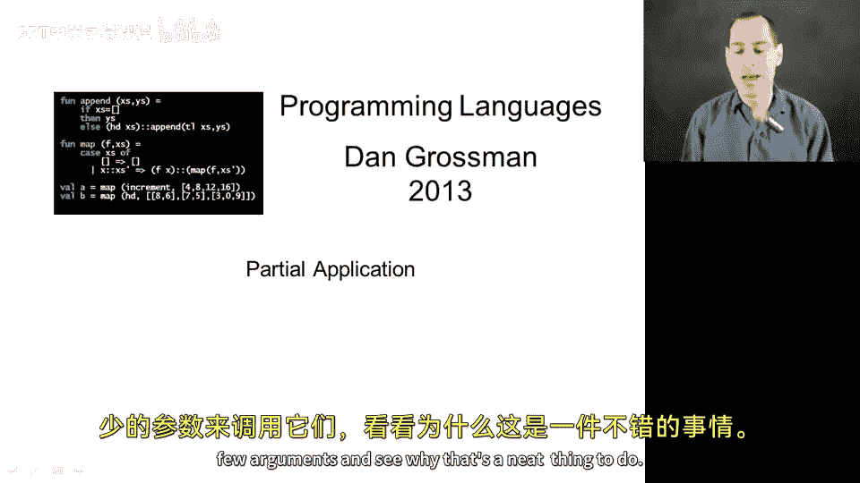
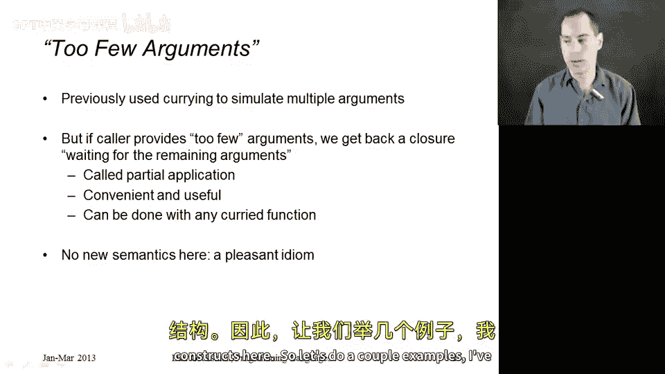
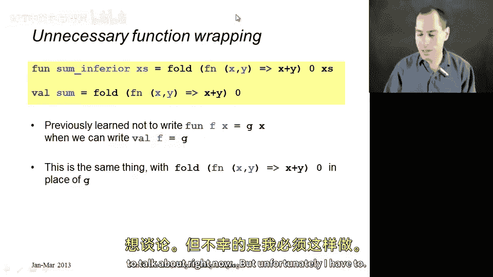
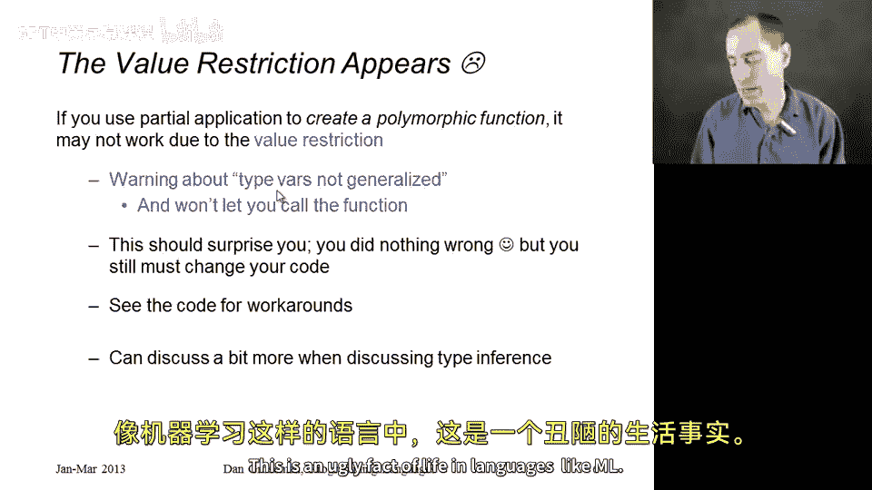

# 【编程语言 A⧸B⧸C CSE341 Coursera】华盛顿大学—中英字幕 p65 64_15_partial-application -BV1bw4m1D7MM_p65-

In this segment， we're going to take cur functions and call them with two few arguments and see why that's a neat thing to do。

So previously we used curing just to simulate multiple arguments。

 if you wanted a three argument function， we used cur to have a function that returned to function。

 that returned to function to have three arguments。

But what if we took those same function definitions And as callers just passed in fewer arguments。

1 or two， instead of three。Well， then what we would get back is a closure that's waiting。

 if you will， for the remaining arguments。There's no new semantics here。

 It's just a pleasant idiom that is completely allowed。

 You can always call a function that returns another function and then save that function and have it around for when you want to call it。

So this is called partial application。 It's very convenient and useful。

 You can do it with any cur function， and I'm not showing you any new language constructs here。

So let's do a couple examples。 I've already written out all the code for this segment。

 so we have our two cured functions from the previous segment。 We have sorted3。

 which takes x Y and z cur and fold which takes f act and x is cur and now let's notice that we could just call sorted3 with two arguments instead of3 So we're going to call sorted3 with0 that well give back a function we'll call that was0 we'll get back another function And when we call that function what we'll end up doing is taking in an argument Z and asking is z greater than or equal to0 and is y is0 greater than or equal to0。

 So fundamentally what we got back was a function that takes in one argument and tells you if it's non- negative。

😊，Well， that's not the most useful function in the world。

 but helps out something actually useful like summing up all the elements in a list here I have a call to fold where I've also passed in two arguments instead of three。

😊，So what I'm going to do is get back a function that expects a list X's。

 It'll basically be this function here， and will fold over it using this for F in its environment and this for the initial accumulator。

 So this will actually sum all the elements in the list。Now there are other ways。

 perhaps more intuitive to you before you've seen this technique。

 ways to write these functions I could write is non negativeg by just being a function that takes in x and calls sorted3 with0 and0 and x or some all the elements the list the same way I showed you in the previous segment where we just create a function that takes in x's and calls fold with these three arguments。

 It's just longer right These are pleasant。 we get used to it。

 it's a convenient thing partial application。 These are not terrible。

 This is not awful style but we want you to get some practice with the shorter way that demonstrates that you understand how cur and partial application work and in fact。

 if I go back to the slides here quickly。The reason why this second version is really the same as the first version is actually something we've seen before。

 just a little bit different。 This top version is just unnecessary function wrapping right we have seen before。

That we shouldn't write fun F x equals G of x when we can just write v F equals G。 Well。

 it's the same thing here， except instead of just having a variable G for the name of the function。

 we have the function that you get by calling fold with this anonymous function and0。Alright。

 so let me show you a couple more examples I have here of just cur and partial application being useful to hopefully get the hang of it。

 Here's a function range， which takes two arguments in a cur form。 And essentially。

 if you call range with something like 3a sorry， not comma。 We're not toppling range 3，6。

 that produces the list 3，4，5，6， something like that。 Alright。

 And so if you call range with just one number， like， say， one。

 that's going to give a function back that when you call it with a number returns from the one up to that number。

 And so。😊，Count up。Of six would return the list， 1，2， 3，4，5，6。

Just another example where we didn't need this unnecessary function wrapping version that you have here。

 The function range one is a perfectly good function。 We can just say vow count up equals range one。

As a more useful example， our iterators， our higher order functions over lists and data structures like that are often written in a cur form。

 so let me show you another example just to sneak in another useful iterator。

 here's a higher order function exists， that takes a function which I'll call predicate and a list x's and returns true。

 if there exists an element of the list for which predicate returns true， otherwise it returns false。

So this is a simple three line function， the empty list should return false。

 there does not exist an element of the list for which predicate is true。Otherwise。

Its predicate applied to the first element of the list。

Or there exists some element in the rest of the list for which predicatet returns true。

So that exists， here's a use of it， if you call exists with a function that checks whether itss argument is 7 and a list that does not have seven。

 you'll get false。All right， so that's the result here， is false。

But much more interesting is to take exists and partially apply it。😡，If we apply it to one argument。

 we'll get back a function that takes a list and returns a bull。So has zero does indeed have type。

Entlist arrow bull。And when you call has zero with an int list。

 it will check whether any of the elements in the list are zero because exists with this anonymous function。

 returns a function， returns a closure that given a list， checks what we want to check。Similarly the。

Built in library functions in the list library provided by Ml standard library are often written in cur forms。

 So list dot map is actually defined for us， but it's cur。

 So if you call it with fun X arrow x plus one。 you get back a function。

 in list arrow in list that will indeed add one to all the elements in the list Re a new list。

 and list dot filter works the same way in the standard library。 If I call it with this function。

 I will get back a list that is also an in list arrow in list is the type of remove zeroes。

 and the list I get back， will have all the zeros removed from it。😊，So that's very elegant。

 And when you go to use these functions， you have to use them in a cur form。 here。

 we're using partial application。 But there is one thing that I don't want to talk about right now。

 but unfortunately， I have to。 So once you start using these polymorphic cured functions with partial application。

 You might run into this thing called the value restriction。

 The value restriction is something that's in M for very good reasons。

 the type system would be broken without it。 but I don't really want to talk about it right now because it's confusing。

 but you may see something about warning type var is not generalized。

 And if you see that warning about some partial application that you have。

 You're not going to be able to use the function you get back。 And this should surprise you。

 you have not actually done anything wrong in terms of what I have taught you so far。

 but you simply have to work around it。 And you know， no language is perfect。

 This is an ugly fact of life in languages like M。

So let me show you an example of what's might happen。

 Use partial application all that you want for now， it's a beautiful idiom。

 but if you do something like this where the result would be a polymorphic function so I'm going to map this across something so this could take any the resulting function could take any kind of list and would return an alpha star int list of the same length where I put a one next to every element of the list and this will give that weird warning and it won't be able to be called and how should you work around this。

Well， the first way is to just give up on the partial application and put in what I said was unnecessary function wrapping。

 but now is a little more necessary。If you don't like that and you really want to do partial application。

 then you can put in an explicit type that's not polymorphic like this。

 and then you have a perfectly fine function， but it can only be used with string lists。

 not with any kind of list。I should also point out that on homework3 and things like that you are not likely to run across this because it only happens when the resulting function would be polymorphic。

 so for example this call will not give any kind of warning because we can tell from this anonymous function that it can only be applied to int list anyway。

 so just wanted to talk about that didn't really want to。

 but in case you hit the warning I didn't want a bunch of questions of that thing you taught me to do isn't actually working。

 it usually works when you get the value restriction for things like list that map。

 I've given you a couple workarounds。