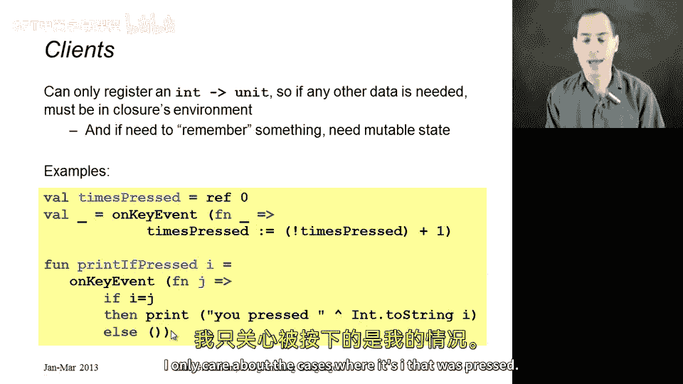
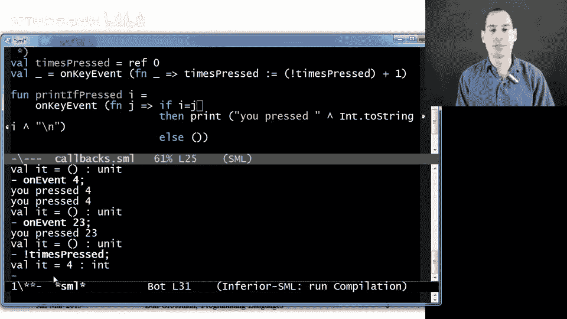

# 【编程语言 A⧸B⧸C CSE341 Coursera】华盛顿大学—中英字幕 p68 67_18_closure-idiom-callbacks -BV1bw4m1D7MM_p68-

We can now move on to our next closure idiom， which are callbacks callback style programming is very common these days。

 the idiom we're using here is that someone writes a library that takes in from clients functions that should be called later when some sort of event occurs。

So example libraries are things that control the keyboard or the mouse or when data arrives from the network。

 so programs may want to know， may want to act on keys being pressed on the keyboard and so what they will do is pass to the library code that should execute when a key is pressed so we really want firstclass functions for this so we can pass in some code that should be called later when an event occurs and that's called a callback。

There doesn't have to be this external data like a keyboard or data from the network。

 sometimes we write games in this style， some player in the game。

 maybe an automatic player should register code that should be called when it's that player's turn to move around in some virtual world。

Now， the way these libraries should work is they should accept multiple callbacks。

 there may be many different parts of the program that all need to know when keys are pressed on the keyboard and they need different data to act on so we don't just need to pass first class functions。

 they need to be closures so that each client passing in a callback can use the private data。

 the bindings in the environment where the function was defined to have access to the data it's going to need when the callback executes so this is where closures are really valuable。

 it's important that that private data not show up in the type of the callback because the library implementer has no idea what that data should be Now object oriented languages for those of you that are used to them also handle callbacks。

 they do it with objects I find closures just as elegant。

 if not more elegant and you can learn the idea of callbacks either way so since we're setting functional languages here will do it that way。

So we are going to use mutable state in our library and I'm going to argue that's appropriate here。

 our library is going to keep track of all the callbacks that have been registered。

 all the code that should execute when an event occurs and when a new one gets registered。

 we really do want to update state so that we can have more things。

 you know we can keep track of what we are supposed to do。

So our library is going to maintain that mutable state for what callbacks are there and it's going to provide a function for adding a new one to that mutable collection Now a real library of course would have lots of other features like for removing a callback that was previously added and we're just going to take a very simple approach that what clients are going to pass us are functions of type int arrow unit so you can think of that int as encoding which key on the keyboard was pressed。

 maybe a is1 B is to that sort of thing。😡，So the only public interface to our library is going to be this function on key event。

😡，It's going to say when a key event occurs， you want me to call this intarrow unit you passed and I will give back to you the int corresponding to what key was pressed。

 so on key event takes an intarrow unit， there's no result here。

 the unit type has no useful content and the result of on key event is just the side effect that I'll call you back later。

 so there's no useful result， so the result here is also unit。😡，Okay， so that's the entire interface。

 Now we just need a library that will implement that interface。So here it is。

 It's in the code file as well， but it all fits on the slide。

 The library is going to internally maintain a mutable reference that holds a list of all the callbacks that have been registered。

 So we'll initialize that mutable reference to have content's empty list because none have been added yet。

Then when someone calls on key event with a function。We will assign to Cs for callbacks。This list。

 which is made out of conzing F onto the previous contents of Cs。

 So this is updating Cs to refer to a list with one more element than it used to， perfect。

Then when some event actually occurs。 So sorry， you know， the key is actually pressed。

 let's assume that this function on event is called with a number。

 I'm not actually going to show you an MLl how to actually hook up to the keyboard。

 We're going fake it through this function。 We're just simulating the idea。

 And all this function does。 I will not explain the details to you is take the contents of CBs。

 as you hear， see here with the exclamation point and go through and call each of the functions。

 right， so for each function in that list， we will call it with I That's exactly what a callback library is supposed to do。

😊，So that's the library。 And remember， all clients are going to do is call on key event with appropriate functions。

So here are a couple example clients and they're always going to pass enclosures that do what they need to do。

So here's my first client here on key event， it actually ignores the integer it's given and all it does is increment this times pressed variable so sorry the reference that times pressed refers to。

 So times pressed refers to an int ref， the contents are initially zero and we register here。

 a callback that every time it's called， it takes times pressed and updates it to previous contents of times press plus1。

 So this is a logger that is counting how many times keys have been pressed。

Here I have a function that every time you call it registers a callback and what it does is when you call print if pressed with I。

 it registers a callback that says， if you give me back J。

 so J was the key that was pressed if I equals J I'll print out a message saying you pressed I otherwise I'll do nothing。

 I only care about the cases where it's I that was pressed。😡。

Okay， so that's all good over here in the code。 I have all the code。

 I just showed you exactly how I showed it to。 And then here at the bottom。

 I use that function print if pressed to add four more callbacks，1 for4。

 so that'll print out you pressed 4。 if indeed4 was pressed  one for 111 for 23，1 for4。

 And so with this one up here that keeps track of how many have been pressed。

 have we'll have five total callbacks registered because we call on keyeven five times。

 So that list will have five things in it。 So let's just load it all up。😊，And it all loads。

 It's all fine。 We can see that by the time the Reple print CBs， it actually。

 the contents actually is five functions。 It's a list with five elements。

 And nothing has been printed yet。 And if I ask times pressed。😊。

I get  zero because there haven't been any events yet。

 So now we're going to simulate events happening with this on event function。

 So when I call on event with a number， it's going to pass that number back to all the closures that were registered with on key event。

 So if I pass in 11。It prints， you press 11 because one of those five callbacks chose to print that。

😡，The other print press did nothing。 Time pressed， by the way， is now one。

So it really did call all that code， we could do on event 79。Nothing gets printed。

 No one wanted to print that。 We could do on event。W玩。

That prints it twice because two of our callbacks chose to print that string。 So that's fine。

 We could do oneven23。 It prints once。 We could， at any time as times pressed。

 that's been incremented every time。 thanks to one of our callbacks and 4。

 because we did four events。 I think we did 11，79，4 and 23。😊，So that's callbacks。

