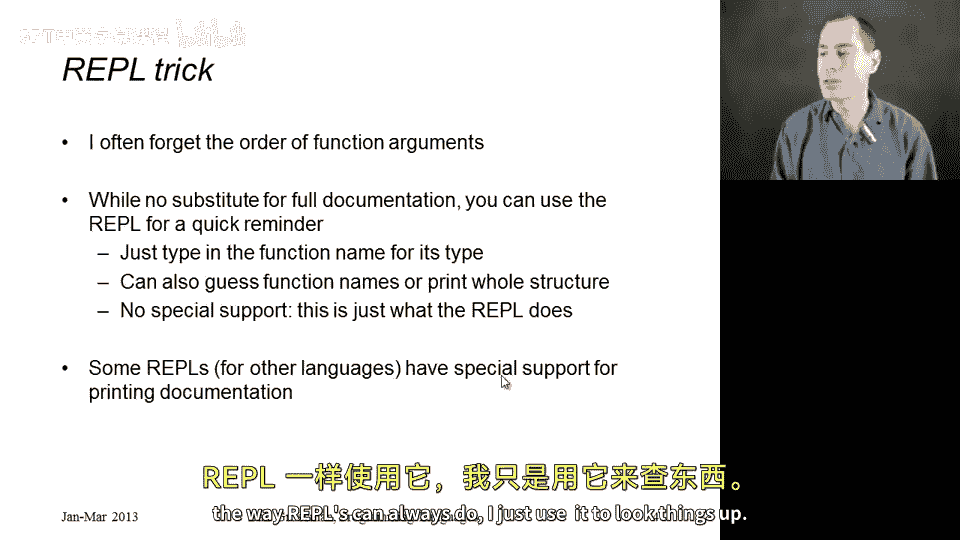
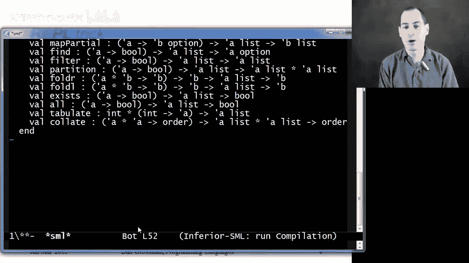

# 【编程语言 A⧸B⧸C CSE341 Coursera】华盛顿大学—中英字幕 p69 68_19_standard-library-documentation -BV1bw4m1D7MM_p69-

There's just one more topic you need for homework3。

 and that's a little bit of guidance on how to find functions in Ml standard library。

 So this doesn't really have a lot to do with the rest of the section other than the standard library does have a lot of useful and in good style。

 higher order functions， but we decided to make it a small part of homework3。

 because learning how new programming languages and how to use them does involve learning how to find things in libraries。

 So M， like most programming languages has a standard library。

 this is just code that is always provided in a particular way with any implementation of the language。

 I like to make this distinction that there are two sorts of things that you put in a standard library when you're designing your programming language。

 First， you put things that if you do not put them。

 no one using your language will be able to do things。

 If you don't give away to open a file on the computer the program is running on you can't write。

codeode that'll do it some other way。 You need libraries for setting timers。

 libraries for accessing the network， libraries for printing things out。

 these are things that you can't build out of other pieces like lists and and numbers and strengths。

The other thing you put in a standard library is actually optional relatively speaking。

 these are just things that are so common that having a standard definition is appropriate。

Since M programmers are going to use list do map， if we define it in the library in one place with one name with one set of arguments in a particular order。

 then everyone can use it and we can all read each other's code more easily and we don't all have to rewrite the same function for every program we're writing。

 So those are the two things one puts in a standard library And as I mentioned。

 you should be comfortable in any language seeking out documentation and gaining some intuition on where to look。

 It doesn't make sense to always every time you need a function， expect that someone。

 like a course instructor will tell you exactly what function to use and where to look for。Okay。

So standard ML has documentation for its standard library。

 it's actually quite a bit more primitive than the documentation for most modern programming languages。

 but it will meet our needs， and it's at this URL that you see here Now it's organized into things called structures and signatures this is using ML's module system which we are going to study just a little bit in the next section but we can use the library before we really understand structures and signatures and on homework3 you just need to look things up in a few places。

 things related to strings， characters， so the char structure lists and they've separated out list pair。

 those are functions that operate over two different lists。

Once you find something the way you use it is exactly like we have been using library functions already。

 Whatever structure it's in， you write the name of the structure， then a dot and then the function。

 So list dot map string dot is substr or anything else。 So I do have a web browser open here。

 This is the URL I've pointed you to and there's a nice long list of things there's functions for arrays。

 some things for the command line， some things for Inet Sock is probably for accessing the network。

 one of the ones that we' be interested in is the list structure where we have lots of stuff over list it gives a little synopsis of what this module is about and then it lists all the different functions that are defined just like the reppo would print them out and then below that it has the actual documentation giving the documentation of the semantics of what these functions will do So for example I never told you there is a function last it takes a list L and returns the last element of L。

It raises a particular exception if the list is empty and so on and so forth。

Okay so that's the documentation， there is no full substitute for proper written documentation about how a library should be used in that form。

 but I wanted to point out one other thing which is that when you're programming with a repple you can often save yourself a little bit of time by using the repple to remind yourself some useful partial information about how things work like what functions are defined。

 what their types are what the order of arguments are and as the way I'm going to show this。

 I'm not showing you anything new feature of the Reple。

 I'm just pointing out that you can use it for this purpose。

 which you might not have thought of and it's so useful to do that that some repples have gone to the next step and they actually have added special commands that let you access the full documentation for libraries written in the language M's Reple does not have that to my knowledge so I just use it in sort of the way Reple。

Can always do。 I just use it to look things up。 So here's my repple。

And I know that if I have a function defined like Fn equals x plus1， if I just type F。I say， oh。

 that's a functionist type intoent。Well， guess what， if I type list。 map。

It nicely reminds me the type of list dot map。 Oh， look， the two arguments are cur， not toppled。

 Maybe that's why I was getting an error message。 So this is just a convenient thing to do。

 You can even guess， oh， list do last。 Was that， Was that the name of the function。Oh， yes， it was。

 right。 You can kind of guess it function names if you want。 If you think it's called fold left。

 turns out you're wrong， you get an unbound variable。 that's not in the library。 and you're like oh。

 is it called fold no， it turns out it's called fold L。

 Now at some point you should stop guessing and messing around and you should look up the documentation。

 but you know this is fairly convenient。 It turns out with one other trick。

 I'm not going to explain why this works。 you can actually get the repple to print out all the bindings for a particular structure。

 And once we know a little bit more about the module system that might make more sense。

 So for example， if you knew there was a list structure。

 and you just wanted to without going to your web browser， look up everything。

 you can write the keyword structure， this is all ML code。

 It's just features I haven't shown you X equals list and this is not very useful。

 it tells you that the signature， which is kind of the type of a structure is list at all capitals。

 And now if I say signature spelled out English。😊，Word x equals list。

 So I'm putting here whatever was after the colon on the previous line and hit return。vo。

 it prints out all that for first part。 Now I can't go the next step。

 I don't get the actual documentation， but you might still find this useful。Anyway。

 that's your brief guide to programming against libraries and that should be everything you need to complete homework three。

