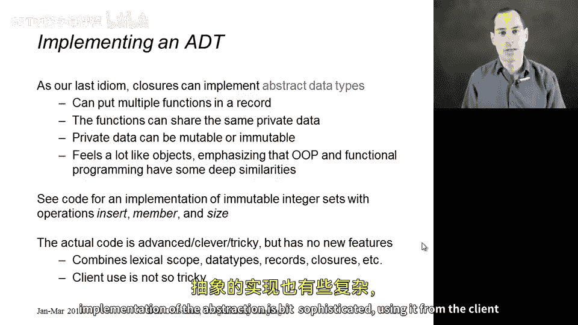
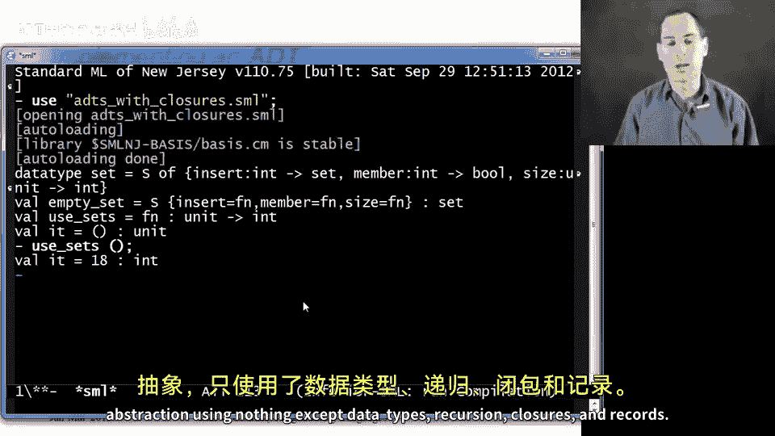

# 【编程语言 A⧸B⧸C CSE341 Coursera】华盛顿大学—中英字幕 p70 69_20_optional-abstract-data-types-with-closures -BV1bw4m1D7MM_p70-

In this optional segment， I'm going to show you one more closure idiom that's significantly more advanced。

 combines a number of the fancier features we've seen， but no new language constructs。

 and we're going to do something pretty neat。So what we're going to do is implement an abstract data type that's going to feel a lot like an object in an object oriented record。

What we're going to do is implement actually a set of integers just to keep the example simple。

 but what we're going to do is have a record of functions。

 So a set is going to be represented by that record。

 The only thing in the fields of the records are functions So the only thing clients of our abstraction are going to be able to do is call our functions。

 but because those functions are closures， they're going to have access to private data。

 and in fact we're going to set this whole thing up so that all the functions in the record have access to the same private data and that's how they're going to be able to work together to implement an abstraction with multiple operations like inserting into a set and finding out if something is in a set。

Now we could have made that private data mutable or immutable。

 It actually would have been a little simpler if we had made it mutable。

 but I want to encourage more functional programming style。

 so we're not going to do it in a mutable way we'll do it immutable and in fact。

 so if you insert anything into a set of integers that doesn't change the set you did insert on it returns a new set that has another element in it if that element was not already in the set。

 So the goal here is to make it feel a bit like object orient programming。

 this will be the first time in the course that I give you a hint that OOP and functional programming actually have deep similarities。

 but even if you're not familiar with OOP it's just a closure example。

 I admit this is advanced and clever， but it's a good way to put together a lot of stuff we've seen lexical scope。

 data types records and closures and even though the implementation of the abstraction is a bit sophisticated using it from the client side once I show you how to do it isn't going to be so tough So we'll do the rest of the set。

In the code where I'll just show you what we've got。So I'm going to start with a type definition。

 Now I'm going to put this back to how it is in just a second。

 but this is the type I would like to implement。 I would like to say that a set just to find a nice type synonym here is this record type。

 So remember records are just things with fields。 you write colon and you write the type of the field。

 and there's no reason why fields can't hold function。 So things of function type。

 So the insert field would hold a closure of type int arrow set。

 give me an int I'll give you back a new possibly different set that contains that int member of type int arrowbo for is the int in the set and how about size which takes no arguments and tells you how many elements are in the set。

 Now， unfortunately， this won't quite work because an M type synonyms can't be recursive。

 So this use of set is not going to work。 So that's why I'm doing this M specific thing let's make it a data type binding。

 of course， data types need constructors and of So this is。Actually。

 a reasonable use of a data type binding that only has one constructor。

 I'm only using data type for the purpose of being able to mention set in the definition of set。

 The same way we mention list in the definition of list。 Okay， so now I'm gonna have this type。

 This S constructor is going to be a bit of a pan， but we'll be able to use pattern matching to get rid of it when we need to and so on。

 So the next easiest thing to show you is to keep this type in mind。 In fact。

 why don't I make a copy of it。 So we'll be able to see it。

 I need to put this in a comment and bring it down with me to show you a client。Okay。

So I'm going to copy this down。 Here is an example client。 just a little function Use sets of type。

 I think unit arrow int。 So we don't know how this set is implemented， but we do know its type。

 We know it has， it's a record with fields， insert member and size， each of which are functions。

So let's just start with the empty set， oh， I should have emphasized that the only public value that's going to be available to us is empty set of type set。

 and I'll show you how we implement that later。😡，And so we're gonna have to build our set starting from the empty set。

 So I have this empty set value。 I'm gonna be able to say let Val。 essentially S1 equals empty set。

 I'm putting the constructor here to pattern match away。 the constructor don't worry about that。

 I don't want to focus on that， but you do need this because otherwise this S1 would not be a record of functions。

 It would be S and then we'd have to pattern match later。 So S1 is now this record of functions。

 So what I could do is take S1 read out the insert field that will get me back in int arrow set function。

 So I could call it with 34 and I'd get back a set。

 I could then strip off the s constructor that and have a new record of three functions。

 So I really like this because you might be in other language is more used to writing something like insert 34。

 but you know your way my way， it's just rearranging the same ideas。

 you can't really argue one is more complicated than the other。😊。

So I could then take that S2 insert again the same number 34 so it would not actually add it because that's not how sets work。

 so sets don't have duplicates， so that would produce S3 then S3 I could insert again and have 19 and so this would logically be the set holding 19 and 34 but represented in S4 as just a record holding three functions。

 so then down here I could use the member function I could take S4 and I say if 42 is a member of that set then 99。

 it's not else if member S41919 is in that set I could say 17 plus the size of S3 and I believe therefore this whole thing will evaluate to 19 It's a silly client but it shows that once I'm given this abstraction using it as a set is pretty much like we would want to program with sets we just use the functions that are provided to us。

Okay， so that was actually the easy part。 that's what clients would do。

 We always want the client to be easier than the library because we only have to implement the library once。

 so now let me show you that fancyiness all we have to do is implement empty set。

 but we have to do that in a way that's actually correct that when we call insert we'll get back something that you know willll then act as an appropriate set that is not empty。

So there's a lot of ways to do this， I think this is a short and elegant way that I don't claim it's particularly easy to understand。

 so I'm defining a v empty set right what I'm going to do is I have this little helper function that I'm going to use and what this helper function does is it takes a list of elements that should be in the set it assumes that list does not have duplicates but it's a local helper function so that's a reasonable assumption and then what we just return for empty set is make set of the empty list all right so now all we have to do is understand make set and we're done。

So let's understand makeet， it has this little helper function that we'll explain in a minute。

 but fundamentally what it returns is this record wrapped in the S constructor。

 so all we have to do is return a record where insert does the right thing for a set that contains the numbers and x's。

 member does the right thing and size does the right thing so let's work bottom up which is from easier to more difficult。

So remember we know that x's has no duplicates in it。

 that's an invariant we're going to maintain here， and so all we have to do is just take the length of that list。

 so size is a record field that contains this anonymous function of type unit arrow int which is exactly what we need for the size field and it does the right thing notice we're using private data here。

 we're returning a record that is using X's which is in scope right here。

Remember where we just need to go down this list and see if there's anything in the list that equals the number we're looking for。

 So I actually， for reasons we'll seen in a minute have put this in a helper function here contains so contains takes a number I and returns true if I is in X's。

 so again I can use private data here， I can use x's。

 can use a nice library function list exists which works just like the exists function I wrote for you a few segments ago。

 it's cur。 I pass in this predicate function that says for each element of the list J does I equal J and then this is a perfectly good function of type int arrow bo。

 so that's exactly the function that I want to put in the member field of the record I'm returning。😊。

Okay， now all we have to do is insert。The tricky thing about insert is that it's going to use make set recursively。

 that does make sense since when you insert an element into a set， you make a new set。All。

So insert has the have type int arrow set。 So here's an anonymous function that does what we need。

 takes in that integer I。If。I is contained in X's。 So there's my second use of my helper function contains。

 which is why I made a helper function for it。Well， if I already have it。

 then I want to return the same set I already have。

 but there's no harm in making a new set in the easiest way here is just call make set with the same list X's right and that will work fine。

😡，Otherwise， make set with icons onto X。😡，And that's it。You can look at this。

 you can stare at this and see that the three functions I put in here do exactly the right thing。

In the case that X's are the elements we want in our set。

 the trickiness is that make set is recursive and that we provide the empty set where we make set of the empty list and the recursion of make set takes care of the rest。

 So I have this all compiled over here， you'll see that we defined our type definition for sets。

 empty set is just something of type set that is a record of three functions wrapped with this S constructor。

 and then our example client is something that just read out the fields of the record and used them in various ways。

 And if I call it。I actually get back 18。 Earl I said it was 19。

 I must have been misreading the code， I'm sure the compiler is right。

 so let's flip back here to the file and look down here at the client and sure enough。

17 plus the size of S3 I think I thought we were taking the size of S4 you see here that S3 is this one that only has one element in it 34 because we don't put duplicates in there and so 17 plus1 is 18 so that's our implementation。

 our client and our testing code and we really have implemented abstraction using nothing except data types recursion closures and records。

