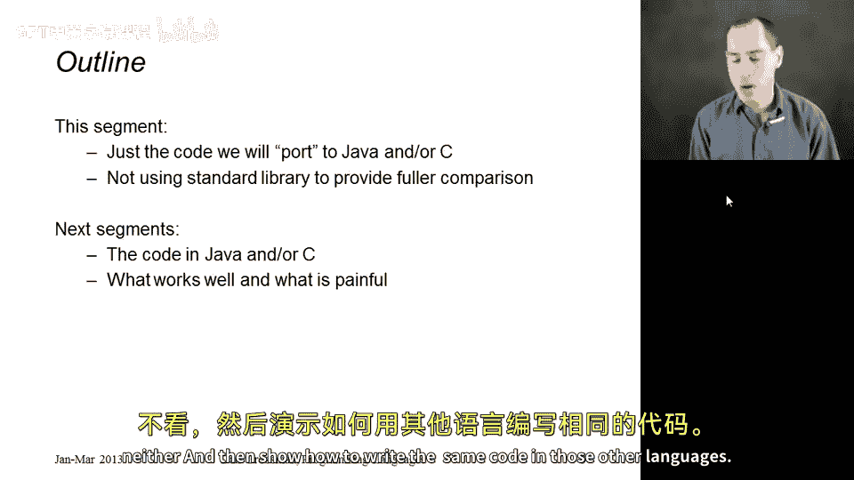
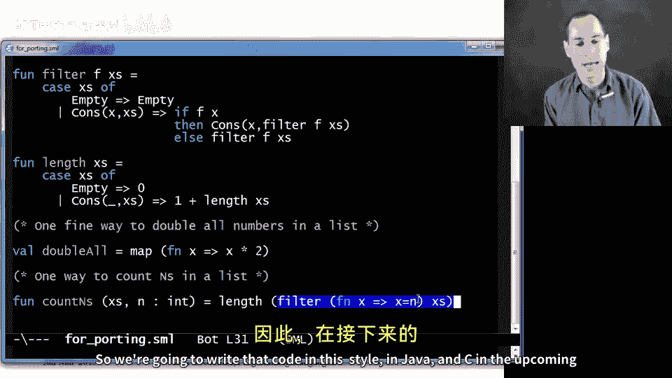

# 编程语言 A/B/C CSE341 Coursera：71：无闭包环境下的闭包惯用法移植 🧩

在本节课中，我们将学习如何将依赖闭包的高阶函数编程惯用法（如 `map` 和 `filter`），移植到本身不支持闭包特性的编程语言中。我们将通过对比 ML、Java 和 C 语言的实现，来理解不同编程范式之间的联系与差异。

接下来的几个小节是可选的，它们相互关联，核心内容是探讨如何将我们熟悉的闭包惯用法，移植到那些实际上没有闭包特性的语言中。

高阶函数编程（例如使用 `map` 和 `filter`）非常强大。当你的语言支持闭包时，这种方式尤其简单，因为你可以轻松创建带有私有数据的函数并传递它们，函数类型正好符合我们的需求。但是，如果你的语言没有闭包，你仍然可以用这种风格编程，只是过程通常会繁琐得多。你通常需要手动创建概念上的“闭包环境”。

通过展示如何在您可能熟悉的语言中实现这一点，我们可以看到不同编程风格之间的一些联系。其中一个小节将使用面向对象的风格在 Java 中实现，其关键思想是使用只有一个方法的接口，这类似于闭包中的“可调用代码”部分。另一个小节则在 C 语言中实现，C 语言有函数指针但没有闭包，我们需要将环境作为额外的参数显式传递。

这些是可选的章节，因为你需要对 Java 有一定了解才能理解 Java 部分，对 C 语言有一定了解才能理解 C 部分。即使你懂一些 Java 或 C，也可能觉得这部分内容有些深奥，这没关系。我提供这些内容，是希望将来如果你在使用这些语言并希望以函数式风格编程时，可以回头参考这些章节，它们或许能为你指明正确的方向。

这展示了不同语言和特性之间的联系，有助于你理解闭包和对象的本质。最终，这些实现方式会显得有些笨拙，这可能会让你更希望有更多的编程语言真正支持闭包，这样我们就不必去模拟它们，也不必用更繁琐的方式编码相同的惯用法。

本节将展示我们随后要移植到 Java 或 C 的 ML 代码，这通常被称为“移植”。它只是一个小型的列表库。我不会使用 ML 内置的列表，因为我想展示所有代码，并且希望提供一个更全面的比较，因为我们将在所有三种语言中自己编写所有内容。接下来的章节是独立的，你可以观看其中一个、两个、或者都不看，它们将展示如何在其他语言中编写相同的代码。

以下是 ML 代码的实现：

```ml
(* 定义自定义多态列表类型 *)
datatype 'a mylist = Cons of 'a * 'a mylist | Empty



(* map 函数 *)
fun map f lst =
    case lst of
        Empty => Empty
      | Cons(x, xs) => Cons(f x, map f xs)

(* filter 函数 *)
fun filter f lst =
    case lst of
        Empty => Empty
      | Cons(x, xs) => if f x
                       then Cons(x, filter f xs)
                       else filter f xs

(* length 函数 *)
fun length lst =
    case lst of
        Empty => 0
      | Cons(_, xs) => 1 + length xs
```

然后是两个使用这些函数定义更具体功能的客户端代码示例：

```ml
(* 示例1：将整数列表中的所有元素加倍 *)
val doubleAll = map (fn x => x * 2)

(* 示例2：计算列表中等于 n 的元素个数 *)
fun countNs lst n = length (filter (fn x => x = n) lst)
```

第一个函数 `doubleAll` 接收一个整数列表，并将所有元素加倍。我们通过部分应用 `map` 函数并传入一个匿名函数 `(fn x => x * 2)` 来实现。

第二个函数 `countNs` 接收一个列表和一个整数 `n`，返回列表中等于 `n` 的元素个数。一种实现方式是先使用 `filter` 函数筛选出所有等于 `n` 的元素，然后计算这个结果列表的长度。虽然这不是计算此结果最高效的方式，但它是可行的。

在接下来的章节中，我们将用 Java 和 C 语言以这种风格编写相同的代码。



本节课中，我们一起学习了在没有原生闭包支持的语言中模拟函数式编程惯用法的基本思路。我们首先在 ML 中定义了一个自定义列表类型以及 `map`、`filter`、`length` 等核心高阶函数，并看到了它们简洁的实现。然后，我们探讨了将这些概念移植到 Java（通过单方法接口模拟函数对象）和 C（通过显式传递环境参数给函数指针）的总体策略。理解这些不同实现方式之间的对比，有助于我们更深刻地认识到闭包这一语言特性的价值与便利性。