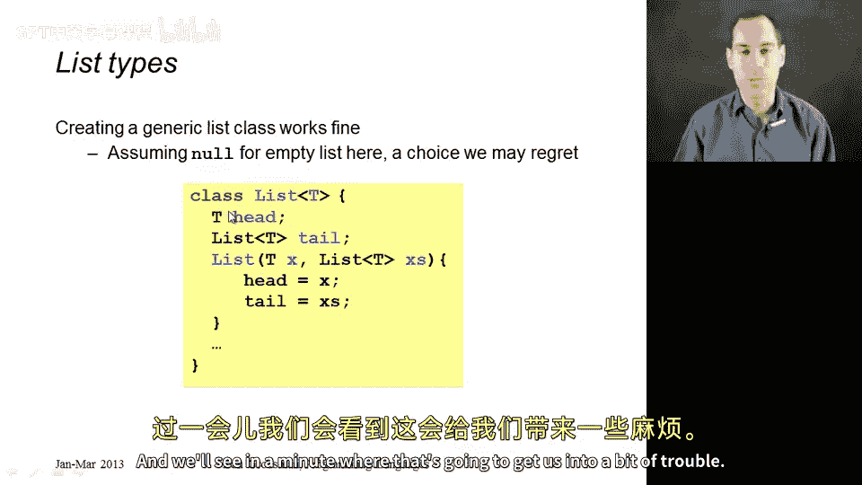
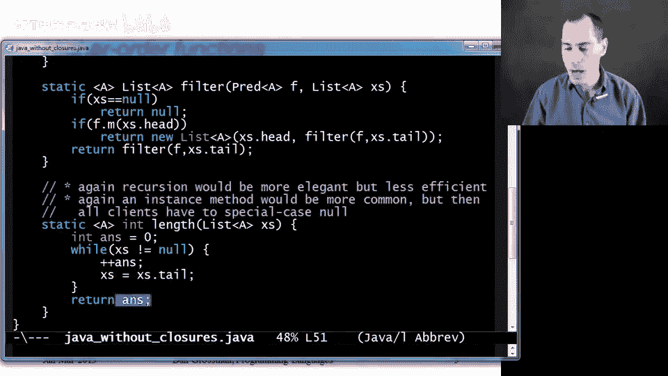
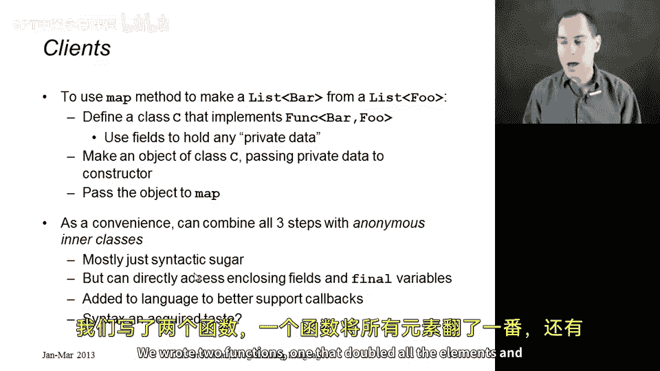
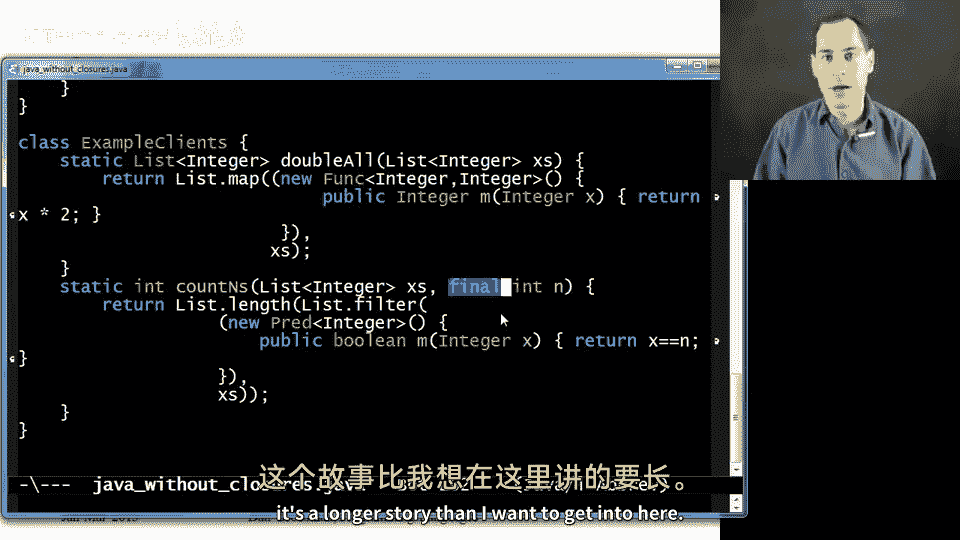
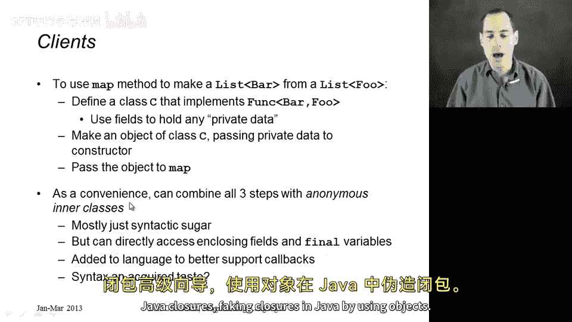

# 编程语言 A/B/C CSE341 Coursera：72：在Java中模拟闭包 🧙‍♂️

在本节可选课程中，我们将学习如何在像Java这样的语言中使用对象来模拟闭包。虽然这种方法不够优雅，但我们将能够成功地将上一节中的ML代码移植到Java中。本节的核心是理解如何利用Java的类和对象机制，编写出类似于ML风格的函数式代码。

## 概述：模拟闭包的核心思想

上一节我们介绍了ML中的闭包概念。本节中我们来看看，在没有原生闭包支持的Java中，如何通过对象来模拟这一功能。

核心技巧是定义只有一个方法的接口。因为一个函数很像一个只有一个方法的对象，你只需要调用这个方法即可。

以下是两个核心接口的定义：

```java
interface Fun<A, B> {
    B m(A a);
}

interface Pred<A> {
    boolean m(A a);
}
```
*   `Fun<A, B>` 接口模拟一个从类型 `A` 到类型 `B` 的函数。
*   `Pred<A>` 接口模拟一个判断类型 `A` 的值是否满足条件的谓词函数。

我们将通过创建实现了这些接口的对象来模拟闭包，并在对象中使用字段来保存闭包所需的环境数据。

## 构建链表库 📚



有了上述背景，我们现在开始构建我们的链表库。我们将从一个基本的面向对象风格的链表定义开始。

```java
class List<T> {
    T head;
    List<T> tail;
    List(T head, List<T> tail) {
        this.head = head;
        this.tail = tail;
    }
}
```
这里我们做了一个稍后会带来麻烦的选择：使用 `null` 来表示空链表。这是Java中一种常见的做法，但空链表将不是一个对象，也没有对应的类。

## 实现 map、filter 和 length 函数

现在，我们来实现ML库中的三个核心函数：`map`、`filter` 和 `length`。由于我们使用了 `null` 表示空链表，我将它们实现为静态方法。

### 实现 map 函数

`map` 函数接收一个链表和一个函数，将函数应用到链表的每个元素上，并返回一个新链表。

```java
static <A, B> List<B> map(List<A> xs, Fun<A, B> f) {
    if (xs == null) {
        return null;
    }
    return new List<B>(f.m(xs.head), map(xs.tail, f));
}
```
这段代码几乎和ML版本一样：如果链表为空（`null`），则返回空链表；否则，构建一个新链表，其头节点是函数 `f` 应用于原链表头节点的结果，尾节点是递归调用 `map` 处理原链表剩余部分的结果。

### 实现 filter 函数

`filter` 函数接收一个链表和一个谓词，返回一个只包含满足谓词条件的元素的新链表。

```java
static <A> List<A> filter(List<A> xs, Pred<A> p) {
    if (xs == null) {
        return null;
    }
    if (p.m(xs.head)) {
        return new List<A>(xs.head, filter(xs.tail, p));
    } else {
        return filter(xs.tail, p);
    }
}
```
逻辑与ML代码一致：检查当前头元素是否满足谓词 `p`，满足则将其包含在结果中，否则跳过。



### 实现 length 函数

`length` 函数计算链表的长度。这里我选择使用循环而非递归来实现，因为循环版本在这种情况下更简洁。

```java
static <A> int length(List<A> xs) {
    int ans = 0;
    while (xs != null) {
        ans++;
        xs = xs.tail;
    }
    return ans;
}
```

## 关于方法设计的讨论 🤔

你可能会问，为什么将这些函数设计为静态方法，而不是链表类的实例方法（如 `xs.map(f)`）？

原因与我们使用 `null` 表示空链表有关。如果 `xs` 是 `null`，调用 `xs.map(f)` 会抛出空指针异常。这迫使每个客户端代码在使用前都必须检查 `null`。而我们的静态方法 `List.map(xs, f)` 在内部处理了 `null` 的情况，对客户端更友好。

更纯粹的面向对象设计应该避免使用 `null`，而是为链表定义两个子类：一个表示空链表，一个表示非空链表。这样，实例方法就能正常工作，空链表子类可以简单地实现 `map` 和 `filter`（返回新的空链表）以及 `length`（返回0）。这实际上是更好的设计。



## 客户端代码示例 👨‍💻

最后，让我们看看如何使用这个库来编写客户端代码，就像我们在ML中做的那样。以下是两个例子：一个将所有元素翻倍，另一个计算链表中等于某个值 `n` 的元素个数。

```java
// 1. 将所有元素翻倍
static List<Integer> doubleAll(List<Integer> xs) {
    return List.map(xs, new Fun<Integer, Integer>() {
        public Integer m(Integer x) {
            return x * 2;
        }
    });
}

// 2. 计算链表中等于 n 的元素个数
static int countNs(List<Integer> xs, final int n) {
    return List.length(List.filter(xs, new Pred<Integer>() {
        public boolean m(Integer x) {
            return x.equals(n);
        }
    }));
}
```
*   在 `doubleAll` 中，我们创建了一个实现了 `Fun<Integer, Integer>` 接口的**匿名内部类**对象。它的 `m` 方法接收一个整数 `x` 并返回 `x * 2`。这个对象被传递给 `map` 函数。
*   在 `countNs` 中，我们创建了一个实现了 `Pred<Integer>` 接口的匿名内部类对象。它的 `m` 方法检查输入 `x` 是否等于外部的 `n`。注意，为了在内部类中访问局部变量 `n`，必须将其声明为 `final`。

## 总结 🎯



本节课中我们一起学习了在Java中模拟闭包的技术。我们了解到，通过定义单方法接口（如 `Fun<A, B>` 和 `Pred<A>`）并创建实现这些接口的对象，可以模拟函数的行为。这些对象利用字段来保存环境数据，从而实现了闭包的功能。

我们构建了一个简单的链表库，实现了 `map`、`filter` 和 `length` 函数，并讨论了由于使用 `null` 表示空链表而采用静态方法设计的原因。最后，我们通过客户端代码示例，展示了如何使用匿名内部类来创建这些“函数对象”，并完成具体的计算任务。



虽然这种模拟方式代码略显冗长，但它清晰地展示了函数式编程思想在面向对象语言中的一种实现路径。随着Java 8及更高版本引入了Lambda表达式和Stream API，这种模式现在可以写得更加简洁。