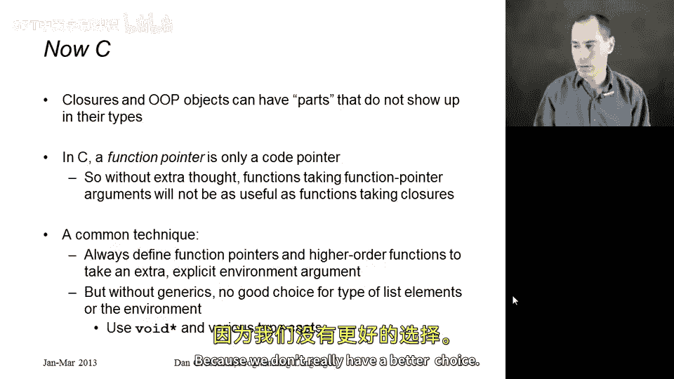
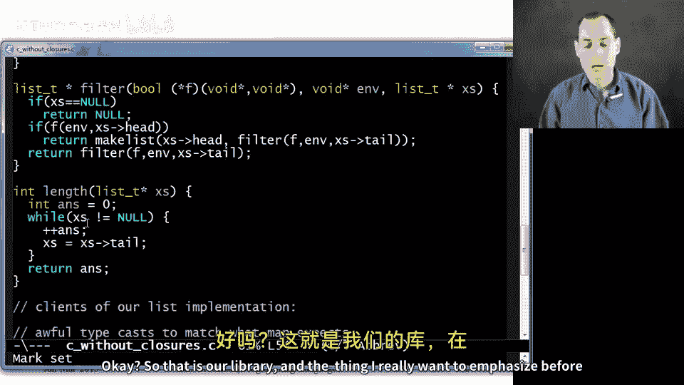
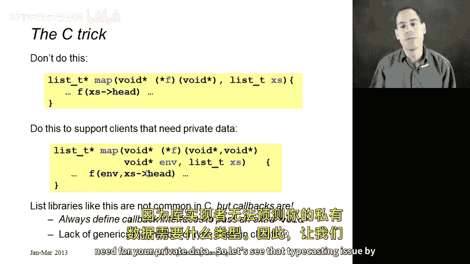
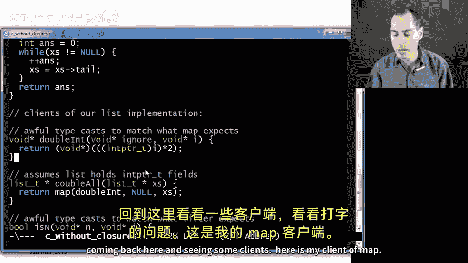

# 【编程语言 A⧸B⧸C CSE341 Coursera】华盛顿大学—中英字幕 p73 72_23_optional-c-without-closures -BV1bw4m1D7MM_p73-

In this segment we're going to port our ML list library to C。

 which is a language that does not have objects or closures。

 we're going to use some fairly advanced C so if you're not an expert C programmer there may be some little parts that don't make sense to you。

 but perhaps you can still get the high levelve idea if you're a more novice C programmer you might want to leave this segment for another day but give it a try and see if you get the sense of it。

So as I mentioned， closures and object orientnate programming objects have something that seed does not build in by default。

 and that's that you can have parts of your things， your closures。

 your objects that do not show up in their types， the fields of an object that implement an interface。

 not relevant to the interface you're implementing， and for everyone。

 the ML function types do not mention the types of the private fields。

 the things that happen to be in the environment。Now in C， in case you didn't know this。

 functions really are first class in the sense that you can pass them around。

 you can put them in data structures。 you can pass one function to another。

 but they are just function pointers closures in ML have code and environment function pointers in C are only the code So if you just pass the function pointer with the normal sort of arguments that you expect it will only be able to use those arguments and any global variables。

 it has no access to any other environment， certainly not the the environment where the function was defined and in fact。

 functions have to be defined at top level right you can't to define find one function inside of another。

 although some C compiler support some extensions to allow that。And so we have to do this ourselves。

 And so there are various ways to do this。 But the common technique。

 the technique I usually see an idiomatic C code is that whenever you're using function pointers。

 have them take an extra argument。 And that extra argument should be the environment。

 and it can be some whatever is needed and it should be passed along with the function pointer。

 and then passed back to the function pointer when the function pointer is used。

 and I'm going to show you an example of that。 The other high levelvel idea in our code is that we don't have type variables。

 we don't have quote a， quote B， we don't have generics like in Java or C sharp or scala。

 And so we're going to have to just use this type void star。

 which is going to lead to lots of casts between types because we don't really have a better choice。

 so with that， let's look at the code。

Here I'm just defining a little list type it's just something with two fields。

 a head field and a tail field， my head field there's no good type for it because I want it to be generic so I'll just use void star my tail will be a pointer to another list。

 I have a little helper function here for constructing list It just takes in the field the head and the tail Malex allocates room initializes the field and returns a pointer to the allocated thing I am using null here or some sort of sententinel0 if you will。

 for representing the empty list so that's the end of the simple stuff now our library has to implement map filter and length。

So here is map and the syntax for function pointers in C is not something I've ever been particularly fond of but it gets the job done。

 I want to take in a function argument and a list argument we're used to that okay what we're generally used to is that we have this list and this function would take one argument which would be the element of the list and return one argument which is the thing to put in the new list。

But if you just do it that way， if you just had one argument here and you don't have the second argument。

 I'm about to explain that function pointer cannot be a full closure。

 it can only refer to its argument that will work for some things like our example where we want to double every element to the list because we can multiply by two with nothing else。

 but it won't work for other clients like our account ends because there's no way to get that value n back to F。

😡，So the idiom in C is to always have an extra argument in two places。

 F takes an extra argument and map takes an extra argument。

 And what map is going to do is every time it calls F， it's just going to pass end back。

 And so whatever the color to map needs F to know about those private fields from our closure aren't so private anymore。

 They're now in this end argument， and then we can pass it to F。 and that makes map much more useful。

 Now， again， we're using the type void star because we have no idea what the type of end should be and that's going to lead to a lot of annoying typecast when we go to use map And in C that's unavoidable if you want map to work for lists and functions of any type。

Alright， so given all that， the actual body of map is pretty easy if you write it in a recursive way。

 it's not particularly conventional to write a lot of recursive functions in C。

 It's considered less efficient， but it's much more elegant。

 I'm much more confident this is correct than if I wrote a complicated version with while loops and pointers and all this sort of stuff。

 So if x is is null， the empty list is passed in， return the empty list otherwise make a new list out of calling F not just with the head of the list。

 but also with N and then the tail of the list is mapping F with the same end across X's arrow tail。

😊，So， that is map。Filter is similar。 The function we want to pass in should now return a bo or an int if you prefer bo is now standard in C。

 again， I want this f to take not just the list element which I'll put right here but also an environment which is this second argument to filter and then of course filter needs to take in a list and if given the empty list it returns the empty list here I call this predicate function F with the environment passing back whatever data it needs and the head of the list if that returns true then make a list that includes the head where the tail is filtering F across the tail otherwise just filter with f across the tail for length there's really no reason for recursion。

 no function pointers this is pretty easy I went ahead and allowed myself to use a mutable variable in a while loop and just walk down the list x is equals x is0 tail incrementing an's and then returning it mutating local variables is a fairly。

Reasonable thing to do and see and actually in any programming language。 Okay so that is our library。

 And the thing I really want to emphasize before we get to the clients of the library is that whenever you're using function pointers in C。

 I don't want you to just take in the argument like the head of the list that you think the function needs。

 always add one extra argument like you saw in the code and you see in the second yellow box on the slide and have the caller take in that extra argument Now if you don't want that extra argument。

 you can code this up withstructs and other things， but always have the function pointer。

 take the extra argument。

Now， why am I emphasizing this， It turns out list libraries like this are not common in C okay people don't write list libraries like this。

 They just kind of live without map and filter to be honest with you。

 but they do have callbacks a different closure idiom that I think is just as important。

 And when you're writing interfaces and libraries that use callbacks， please do the same thing。

 let the functions that are registered as callbacks have access to an environment so they have the private state they need conversely。

 if you're using these libraries and you see these extra voidstar arguments。

 now you know why they are there and hopefully you can use them effectively to get the benefit of closures with the tiny detail that you have to cast to and from voidstar all over the place because the library implementer can't predict what type you need for your private data。

So let's see that typecasting issue by coming back here and seeing some clients。

 Here is my client of map。 So this is a function that takes in a list presumably of integers that should really be documented somewhere that we assume x's here holds ins and returns a list of ints where every element is doubled And what I want to do is I want to call map with this function。

 double int I defined right here。 So that's how you pass a function pointer in C just like M。

 we've defined a function now we can pass it to another function。 We don't need an environment here。

 So double int can just ignore it。 So let's just pass a null for that argument map takes requires an argument there we just don't care what it is and of course the list。

 And so double int to be the type that map expects has to take a void star for the argument。

 I've called it ignore because I'm not going to use it and a void star for the list element。

 which we know will be an int， but that's not the type that C expects。

 So now in the body we have to take that I cast it。

An inpointer then multiplied by two， then cast it back to a void star。 If you do that。

 you'll avoid all compiler warnings related to the types。

And then that was double all Now we need to count ends。

 so the way we did in ML is we filtered our list so that it only held the elements that were equal to n to begin with and then we took the length of that so I'm doing the same thing here。

 length of filter of something so we just need to understand the argument to filter clearly we pass in the list we pass in this function pointer is n that just decides if the argument it is given is the same as aha。

 this n that we're passing in the environment， the private data we need here is n that was what we use from our environment in ML and now we're going to pass it as this extra argument。

And so now here's our function is N， it takes an environment， which will be the n we're looking for。

 and the next element of the list， which is I， those both have to have type void star to appease the type checker。

 so we cast them both to ints。 This is the type you're supposed to use when casting to and from pointers。

 we see if they're equal and we return the corresponding blue。Allright， bottom line。

 extra argument to your function pointers， get used to casting to and from void star。

 and you can actually use closures in C by manually constructing the environments as you need them。

 if you think that's painful， then you agree with me that you want a language that helps you automatically construct your closures so that you can use them without all this pain。

