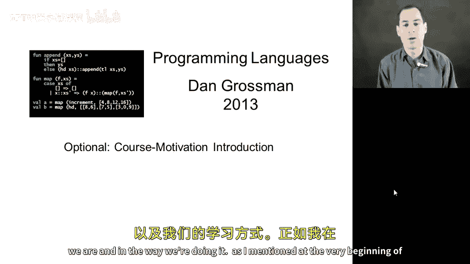
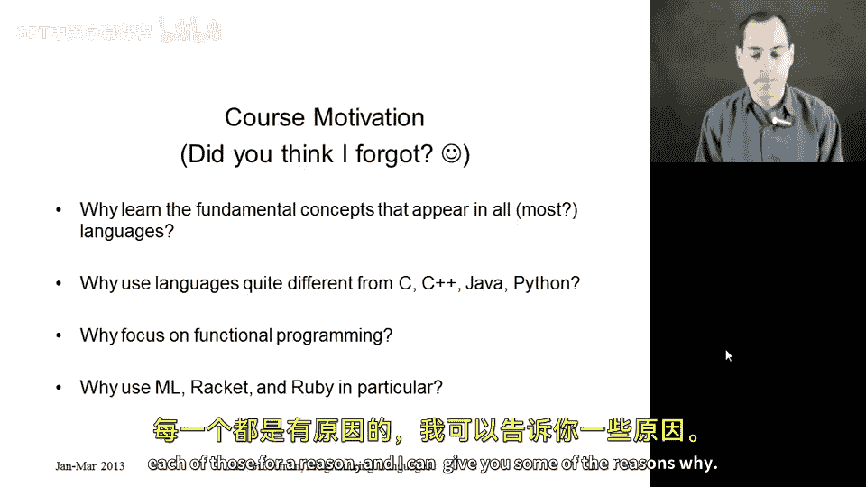
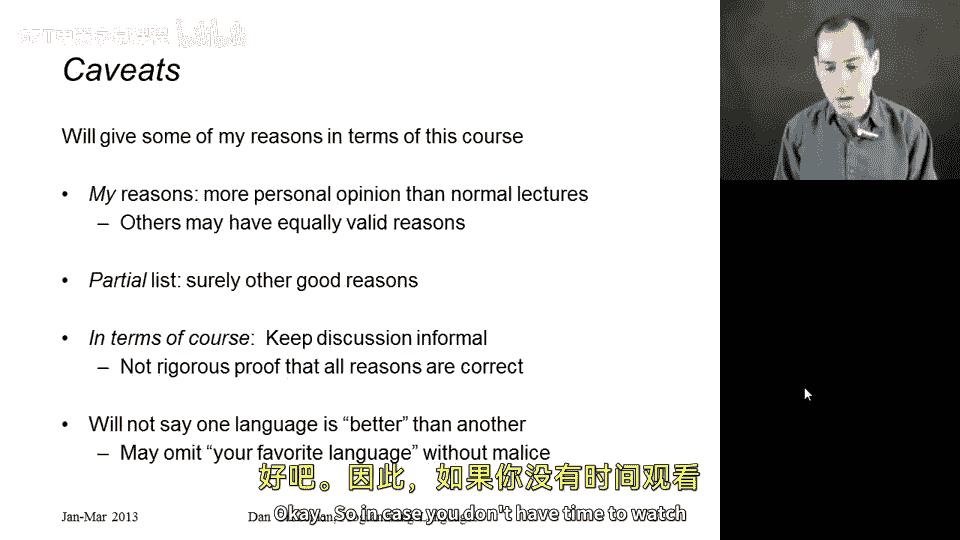
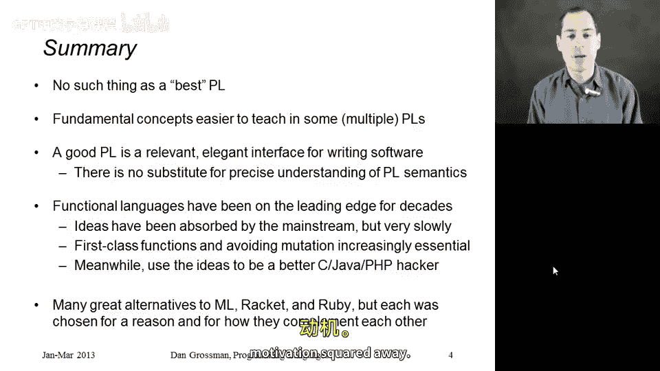

# 【编程语言 A⧸B⧸C CSE341 Coursera】华盛顿大学—中英字幕 p74 73_01_course-motivation-introduction -BV1bw4m1D7MM_p74-

This is the beginning of an optional section where I'm finally going to get around to motivating the course。

 why we're studying the particular topics we are and in the way we're doing it as I mentioned at the very beginning of the course this is something people tend to do in the first or second lecture I did not forget to do that I just feel that it's much easier and more informative to talk about the course and why we're doing it the way we are after we've had a couple weeks of learning the kind of programming and the style of material the course is actually about so I give a little teaser at the beginning and now I feel I can go much deeper。

 you might even want to watch these again after the entire course is over。

Everything in this section is optional。 I'm not going to test you on any of this stuff。

 but I do hope that it helps motivate you and helps you understand the purpose of the material we're learning in the course。

 I'm going to focus on four questions over the next set of videos that I think cover motivation pretty well。

 First， why should you spend your time learning the fundamental concepts that sort of cut across all programming languages。

 Why is that a useful course of study and why wouldn't you just pick up one language at a time。

 that sort of thing？ Why use languages that are very different from some more mainstream languages like Java or Python or C or C plus plus What benefit do you have from using somewhat more exotic languages。

Then why in particular for at least two of those three languages did I pick functional programming and why is functional programming something that we spend so much time on in a course that's more generally called programming languages。

 and then finally we know that in this course where we' used as particular vehicles for understanding the material。

 ML Raet and Ruby， there are other fine choices we could have made instead of those。

 but I chose each of those for a reason and I can give you some of the reasons why。

So as we get into this section， I want to be a little bit clear that I'm going to focus on my reasons and in terms that people taking this course can appreciate so compared to most of the course where I'm actually rather careful to keep my personal opinions in check and focus on the precise technical material I want to present here I'll allow myself a little more subjective opinion。

 it doesn't necessarily mean I'm right。This is going to be a partial list。

 I'm not going to take the time to go through every possible reason one might study programming languages that doesn't mean other reasons aren't also very good。

I'm going to explain this in terms that people in the course can probably appreciate and understand if you're already very familiar with programming languages。

 you're also a programming language researcher or instructor。

 then there might be a different set of alternatives we could consider and discuss but I want to make sure that everyone watching these doesn't feel that I'm talking way over their head and I want to point out that at no point in this section would I ever say one language is better than another just because I omit your favorite language I apologize in advance I'm just trying to use some languages to point out the landscape of what's out there and and what you can get out of approaching things from different perspectives and I want to be a little bit careful not to say。

 well these are the six good languages that we could have used then anything I didn't mention is therefore not as good I explicitly do not mean that。

Okay， so in case you don't have time to watch all the videos。

 here are the high level takeaway points that I'm going to try to justify in the rest of the section。

First， there is no such thing as a best programming language， there never will be。

 different programming languages are well suited for different perspectives and different tasks。

 and on a deep theoretical level， pretty much all programming languages are equivalent if you can do something in one。

 there's a way to do it in another。Nonetheless， if you look at the fundamental concepts that underlie all software in all programming languages。

 they can be easier to teach， certain concepts are easier to teach in one language than another。

 and I can't think of a better way to understand the universality of a concept than to see it come up in multiple programming languages。

 which is why we use three languages in the course instead of one。

A good programming language is an interface， right， you have constructs， you can use them。

 you can think of the entire language definition in semantics itself as an interface。

And if you're going to use a programming language， just like if you're going to use any interface。

 there is no substitute for precisely understanding its meaning。That's extremely important。

 you have to know your language constructs if you want to know how you can and can't use them。

So those are the general programming language ideas in terms of functional languages in the languages we're using。

 I will argue that functional languages have been on the leading edge of progress in programming languages for decades。

 now the ideas often take a very long time to make their way out into more popular mainstream languages that more people know about but they do make it and we have historical evidence of that and the two things we've emphasized firstclass functions in avoiding mutation are increasingly essential。

 if you look at where software is going towards more complicated systems and more parallel systems。

 and in the meantime， even if some of the constructs and ways of thinking I show you are not what's best supported by see your Java or PhP。

 I think learning to look at your software from a different perspective from a different direction makes you a better programmer in any language you might use。

And then finally in terms of ML rackcet and Ruby， there are many great alternatives。

 I'm not saying these are necessarily the three best。

 but I chose each for a reason both because those languages have individual things I wanted to use in presenting the material and the three together complement each other very nicely in the ways they do some things the same and some things in exactly the opposite way and that's a great way to see some of the differences so from here we'll move on to more details let me justify each of these things and then I hope we'll have the course motivation squared away。

