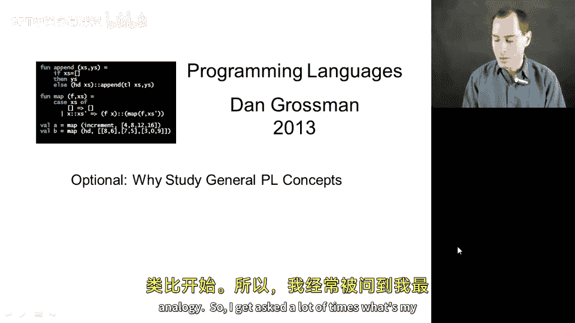
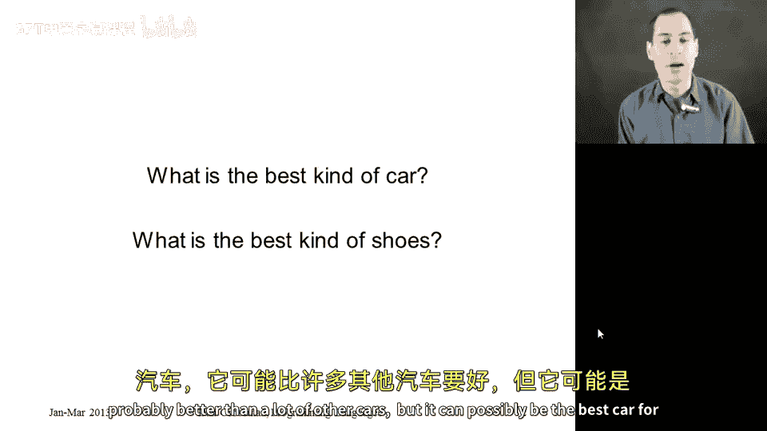
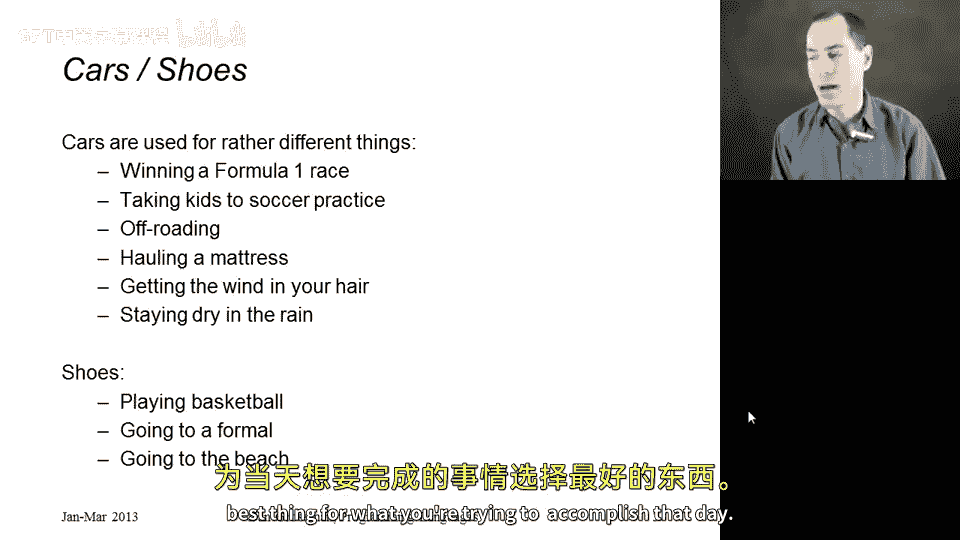
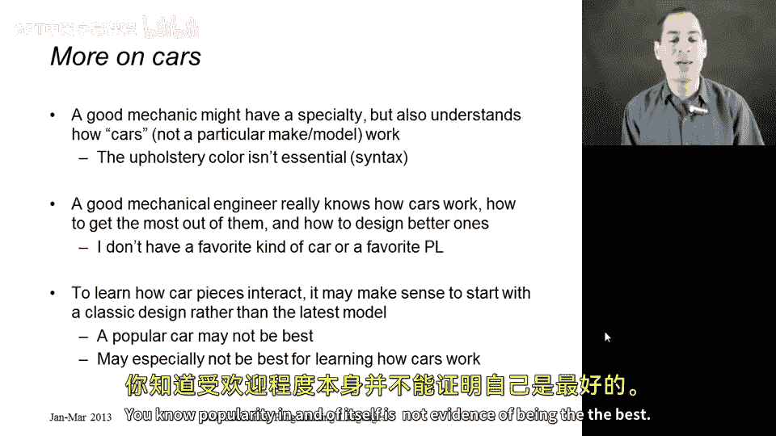
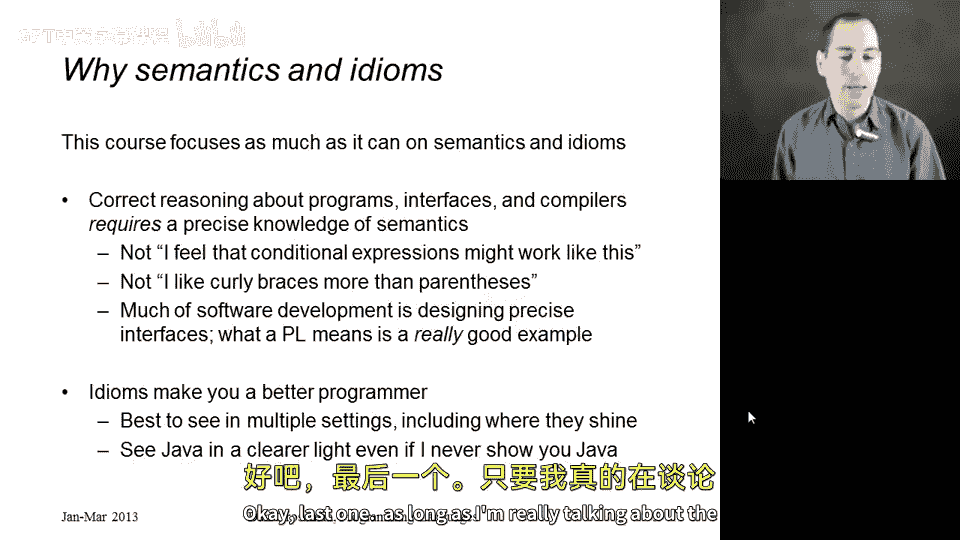
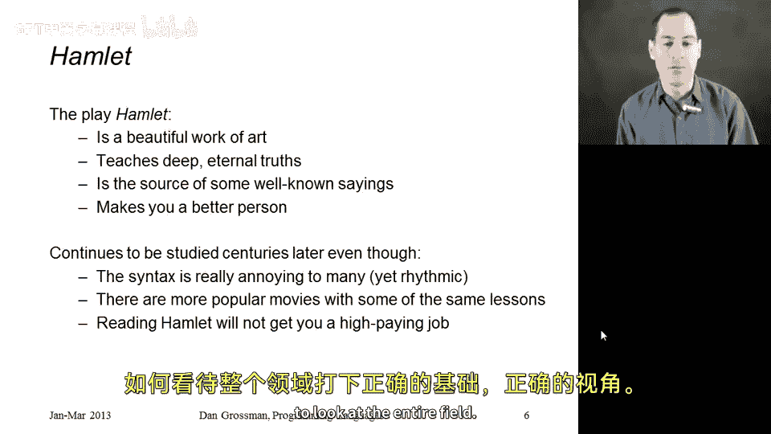

# 【编程语言 A⧸B⧸C CSE341 Coursera】华盛顿大学—中英字幕 p75 74_02_why-study-general-pl-concepts -BV1bw4m1D7MM_p75-

So now let's give some indication of why it's valuable to study general programming language concepts outside the context of any particular detail or programming language。

 this is the most abstract question in terms of motivation so it will have the most abstract probably least precise answer and I'd like to start basically with an analogy so I get asked a lot of times what's my favorite programming language and my favorite answer is well what's your favorite kind of car or what's your favorite pair of shoes so go ahead and take a second and imagine in your head the best kind of car what do you think the best car ever made anywhere in the world is and in think you know that's the best car it's better than all the other cars。

And whatever you think of is actually probably a really good car and it's probably better than a lot of other cars。

 but it can't possibly be the best car for all purposes。

 right you know cars are used for a lot of different things I seriously doubt that whatever car you picked is good at winning race。

 you know， one of these things where people drive around at 300 kilometers an hour and good for taking a group of children to go play soccer or football。

RightCars just can't do both of those really， really well。 And yet。

 any car can participate in a race and can take people to where they need to go。

 So it's not that you can't do it with these other cars。

 It's just that they focused on certain aspects of the design at the expense of other aspects of the design。

 right， There's bunch of other things you might do with a car。

 You might want to go off of the highway onto dirt and rocky roads。

 You might want to haul big items around like a mattress。

 You might want to just have fun and roll down the top of a convertible car。 It might be raining。

 In which case that's a bad idea。 A lot of these things are in conflict with each other。 even though。

The basic idea of what a car can do and how a car can participate in these activities is fairly universal。

And of course it's the same with shoes。 A lot of people imagine their favorite shoes。

 something they would wear with a very fancy dress or a suit or something like this。

 Other people really like to play sports。 I probably could play basketball with my fanciest pair of shoes on。

 but it would be painful。 it would not be pleasant。

 and I hope the analogy is clear here that programming languages in some sense are a kind of shoe or a kind of car and once you learn how to drive in general。

 it's not that hard to switch cars， it gets easier after you've done it a few times。

 but you still want to pick the best thing for what you're trying to accomplish that day。

Let me push this analogy a little bit further， one more slide on cars， and then we'll move on。

 I promise。It's perfectly reasonable for a mechanic， someone who fixes cars to have a specialty。

 they work on cars from a certain company or of a certain age or whatnot。

 and programmers can be better at certain languages。

But I think mechanics do have a general understanding of how cars work。

 and they can participate and help， even with cars that aren't right in their core specialty。

They also have a very good idea of what's important and what's not。

 I've never gone to a mechanic and said， my engine is making a funny noise。

 Can you help me and have the engine have the mechanics say well。

Your seats are blue and I only really like cars where the seats are brown。Right。

 and the analogy there is that that sort of unessential detail is syntax。 Now。

 syntax does matter to people。 People when they purchase cars， really like certain colors。

 really like certain mirrors and things like this。 But it's not essential to how the car actually runs and accomplishes its goals。

😊，Okay， so that's kind of from the mechanics perspective。 what about someone actually designing cars。

 whether it's a mechanical engineer or someone else。

 Someone really trying to make changes or understand what it is to be a car to be an automobile really has to know how to get the most out of the different design constraints that if you try to make something better over here it might be harder to make this other feature as good over there that certain things are in conflict。

 And that's why I simply don't have a favorite programming language。

 and I don't have a favorite kind of car either。 I find the question a little bit silly。

 It really does depend on what I'm trying to do。Now， if you're trying to learn more about cars。

 how they run， how to fix them， how to design better ones。😡。

One approach would be to take a number of really good， really fancy。

 really expensive cars and study why they're so good at what they do and why people spend so much money to buy them。

But I would argue that that's often counterproductive。

That those cars are very complicated and they're the result of over 100 years of engineering and improvement and sometimes the best way to learn is to go back to a simpler model in older model。

 something like， say， the ML language， which is I would say over 25 years old， because it's simpler。

 it doesn't deal with every modern feature in advance and computerconted gizmo。

 and it's much easier to understand an older car， you can actually open the hood and see the pieces and then after you've learn those basics。

 the modern state of the art。 the more current things actually can be easier to understand and in some ways you can understand is actually less elegant in some ways。

 because things have become more complicated over time， due to historical improvements。 Finally。

 we also know that sometimes cars are very popular even if they're not the best cars you know。

 popular is a very hard。To understand why it happens or how it happens。

 That doesn't mean popular things are bad。 but we also know that popular things are not necessarily good。

 You know， Pity in and of itself is not evidence of being the best。

So in this course， we don't just study programming languages。 We focus on two key parts of them。

 The semantics， what do programming language constructs mean and the idioms。

 what are ways to use those language constructs to perform common tasks in elegant ways。

 the reason I focus on this is really， first of all。

 the semantics that if you want to reason correctly about what your program does。

 is the implementation of the language correct， you wrote a library someone's complaining that it's not working properly are you wrong or are they wrong。

 you have to understand language semantics。 There's simply no room and software development for well。

 I don't feel that's the way conditional expressions actually work。

 or that's the way they should work。 No， there's a way conditional expressions work in a programming language and either you're using them correctly or they're not。

This is not a matter of do you like curly braces or parentheses or using the word and also versus the and character two times in a row。

 this is really about what the concepts mean and so much of software development is designing a precise interface and then using it and programming languages are probably the best example of this where the definition has to be so precise that people all over the world can use the language and agree on what's supposed to happen。

So that's semantics， in terms of idioms， I just think they make you a better programmer that if you see something in multiple settings。

 including languages where it's very convenient， then you can use it anywhere that once you've seen data type bindings and case expressions。

 it teaches you to think in terms of one of types and all the different possibilities and even if your language does not provide direct support for writing down your algorithm that way。

 it's still a great way to think and you find your code suddenly being much more nicely laid out and in terms of exactly the cases you need to cover and that's why I often like to say that a lot of students taking this class have seen Java in the past。

 we do almost no Java in this course and yet I truly believe this course will make you a better job a programmer。

Okay， last one， as long as I'm really talking about the beauty and generality of programming languages and why it's useful to learn。

 let me tell you about the play Hamlet by William Shakespeare。

The play Hamlet， if you've never seen it or watched it， I highly encourage it。

 it is a beautiful work of art。 It teaches deep eternal truths about the human condition。

 It teaches about family relationships and revenge and jealousy and murder and letting our emotions get the best of us。

It's also even in modern day， the source of a number of expressions and sayings that we actually use to understand life。

If you've ever heard someone say the most important thing in life is to be true to yourself in Hamlet。

 the line is actually this above all to thine own self be true if I recall correctly and we study this stuff because it makes us a better person okay programming language concepts are like that there really are deep eternal truths going on here the fact that the booleions and conditional expressions are nothing more than syntactic sugar for a data type binding with two constructors called true and false is a deep truth about logic and how things fit together and how we can express there being two possibilities。

 yes and no true and false and it's worth studying those things in sort of the purest settings that we can and to see them in multiple settings the same way the lessons of Hamlet come up in movies and plays and novels over and over and over again and we should learn these things even if the syntax is really annoying I don't particularly。

Like reading Shakespeare because it's very hard to understand and English is my first language。

 But if I can get past the syntax and understand the deep truths that are going on。

 it makes me a better person。 and I don't have to worry so much about will learning this thing。

 this thing that will increase my understanding of either the human condition for Shakespeare or software for programming languages。

 I don't need three weeks later to be able to apply for a new job。 that will come。

 I'll be able to pick up the skills later。 but in the meantime， I can get the right foundation。

 the right perspective for how to look at the entire field。

