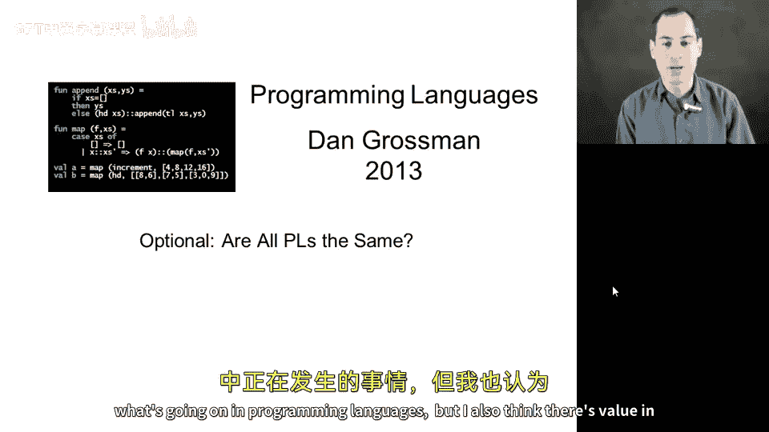
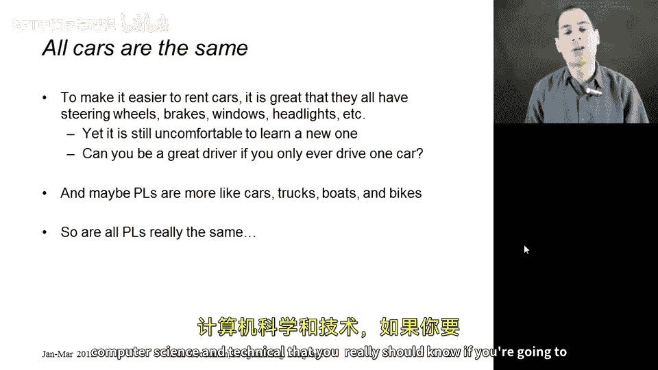
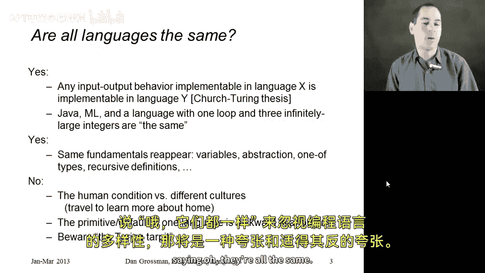

# 编程语言：CSE341：所有编程语言都一样吗？🚗💻

在本节课中，我们将探讨一个核心问题：所有编程语言本质上是否相同？我们将从类比入手，逐步深入到计算机科学的技术层面，分析编程语言的共性与差异，并理解学习多种语言的价值。

## 概述

本节课程旨在分析编程语言的相似性与独特性。我们将首先通过一个汽车类比来直观理解，然后从理论（丘奇-图灵论题）和实践（语言特性与设计）两个层面进行探讨。最后，我们会总结为何在承认语言普遍能力的同时，仍需重视其多样性。

## 从汽车类比谈起 🚗

上一节我们引入了编程语言的基本概念，本节中我们来看看一个生动的类比。

当你去租一辆车或开朋友从未驾驶过的汽车时，如果你会开车，你基本上能操作它。这是因为全球在方向盘功能、刹车位置、车窗开关方式以及车头灯设置等方面存在某种标准化。这种标准化是有益的，它使得即使不熟悉所有细节，阅读另一种语言的代码也变得更加容易。

然而，这种标准化也可能带来麻烦。如果某些东西位置不对，或者你不真正理解某个特定语言结构（或汽车功能）的工作原理，就会感到非常不适。随着你学习标准通用概念并获得驾驶不同汽车（或使用不同编程语言）的经验，你的舒适度会逐渐提高。

编程语言之间的差异可能比汽车之间的差异更大。也许它们更像汽车、卡车或船只的区别。虽然不确定如何精确衡量，但这个类比相当贴切。

你还可以论证，标准化的所有好处实际上可能阻碍进步。如果有人设计汽车的方式好得多，但为了实现它，油门和刹车踏板必须放在人们不习惯的位置，那么这个想法将很难被采纳，因为人们使用那辆车会非常困难，并认为它非常危险。

## 理论层面的同一性：丘奇-图灵论题 💡

现在，让我们进入更计算机科学和技术性的内容。如果你要学习编程语言，这一点你真的应该知道。

在非常技术性的层面上，所有编程语言在以下意义上实际上是相同的：任何你能用语言X编写的程序，你也能用语言Y编写。这里“程序”指的是，给定一些参数，它返回什么结果？如果它接收一些输入并返回输出，并且有办法在Java中实现它，那么在ML、Python、PHP中也都有办法实现它。事实上，甚至有一种编程语言，其中你只有一个while循环和三个可以存储无限大数字的变量，也能实现它。

这是一个事实。这本质上就是著名的**丘奇-图灵论题**。我们发现这是正确的：对于每一种我们认为具有足够能力的编程语言（你需要学习另一门课程来精确研究这种能力是什么，这里不深入探讨），都存在从一种语言的任何程序到另一种语言程序的翻译。

因此，从这个意义上说，所有编程语言都是同等强大的。

## 实践层面的相似性：共享的核心概念 🔧

从另一个意义上说，在实践中，我们在世界各地实际用于开发软件的所有语言都具有相同的基础。

以下是它们共享的一些核心概念：
*   **变量**：都有某种变量的概念。
*   **封装**：都有某种方式将代码的一部分对其他部分隐藏起来。
*   **类型**：都有某种类型的观念。在课程后面，我们将看到面向对象编程如何处理类型。
*   **递归**：都支持某种形式的递归定义。

所以，所有语言都是相似的，它们只是以不同的方式组合这些相同的特性。

## 强调差异性的理由：文化的多样性 🌍

现在，让我从另一个角度论证：仅仅因为所有语言都有这些相似性，具有相同的表达能力，并为许多相同的概念而构建，并不意味着它们完全相同。

我喜欢做的类比是：我相信在很多层面上，人就是人。无论你生活在哪个国家，说什么语言，处于什么社会，总有一些事情让我们快乐、悲伤，在智力方面总有一些事情对我们来说困难或容易。有很多相似之处。

然而，没有人会否认世界各地存在的巨大文化差异。这就是为什么我喜欢旅行，为什么我喜欢有来自世界各地的朋友，因为这些差异也令人兴奋。

事实上，去世界另一个地方旅行或学习另一种语言的最佳理由之一，是因为你能更欣赏你来自哪里，以及你的语言是如何运作的。编程语言也是如此。

## 实践中的差异：便利性与“表达方式陷阱” ⚠️

在软件方面，编程语言中经常出现的情况是：一种语言中的原语或默认功能在另一种语言中也能实现，但会非常笨拙。

例如，在另一种语言中可以实现类似`case`表达式的编程，但如果没有对`case`表达式的原生支持，代码会冗长得多，你必须绕很多弯子，添加额外的变量。

反之，如果你想在ML中实现类似对象的功能，坦白说，体验并不愉快。需要做大量额外工作，必须正确处理许多细节，而且得不到方便的错误信息，因为编译器不理解你正在使用的惯用法。

这没关系。通常，理解一种语言结构的最佳方式，就是理解如何在另一种语言中用其他语言结构来编码实现它。我们将在本课程中看到这样的例子。

幻灯片上的最后一行是：**谨防“图灵焦油坑”**。这是一个著名的表述。它指的是：我们知道你的编程语言可以实现所有需要实现的东西，丘奇-图灵论题保证了这一点。但“焦油坑”在于，你并没有使用方便的特性，而是说：“好吧，我有办法做到。这对我来说很优美，对我来说足够好，我能完成这个任务。”但你最终使用了笨拙、易错、复杂、效率较低或不够直接的功能来完成工作。

因此，编程语言课程的一部分，就是提炼出优雅的思维方式，而不是总是用其他概念来编码实现。

## 总结 📝

本节课中我们一起学习了编程语言的普遍相似性，但如果说“哦，它们都一样”来否定编程语言的多样性，那将是夸大其词且适得其反的夸大。

编程语言在理论能力上是等价的，并共享许多核心概念。然而，它们在设计哲学、语法、特性支持、惯用法和社区文化上存在显著差异。这些差异使得学习多种语言不仅能拓宽视野，加深对编程本质的理解，还能让你在解决特定问题时选择更合适的工具，并最终成为任何编程语言中更好的程序员。