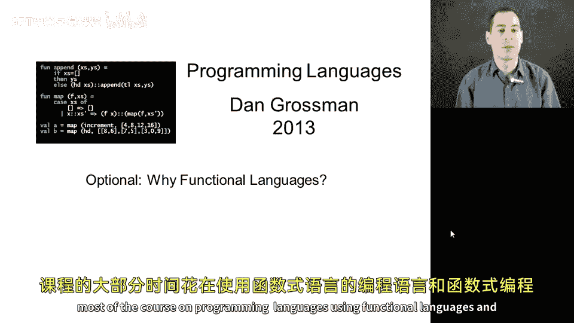
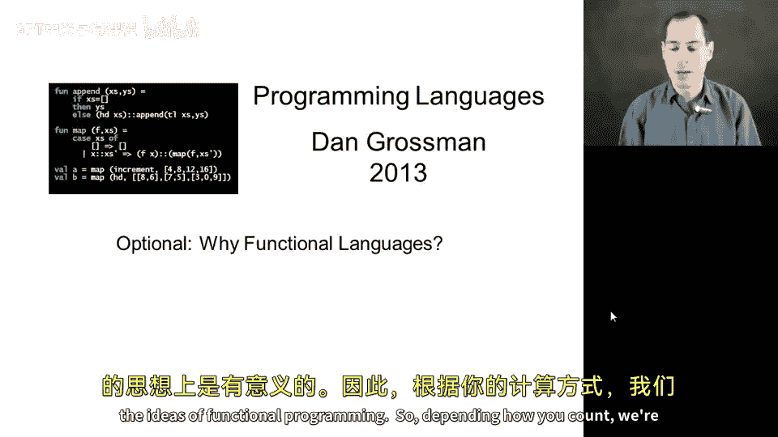
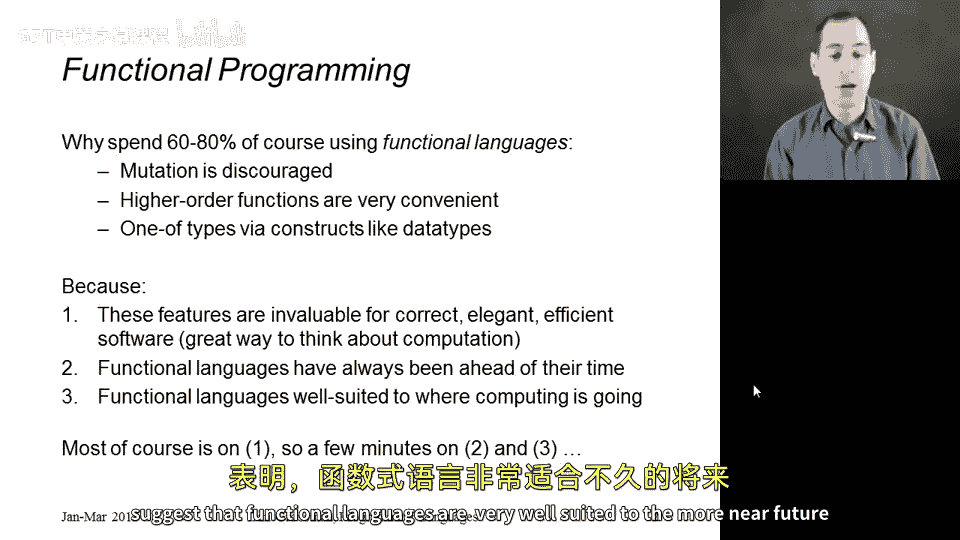
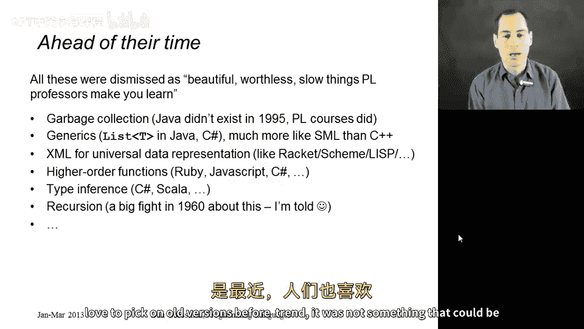
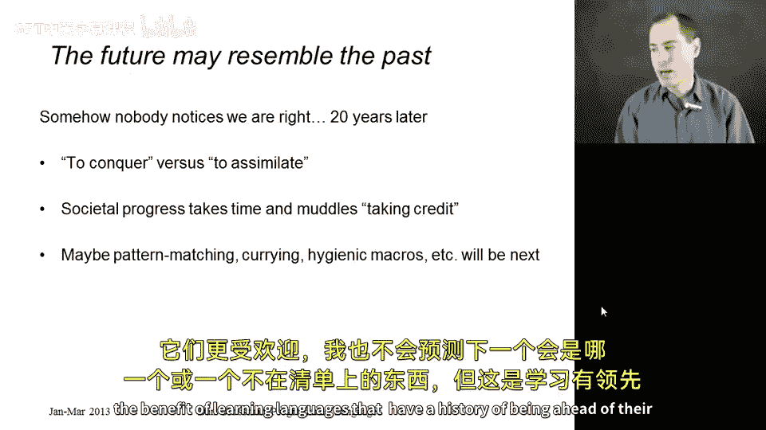
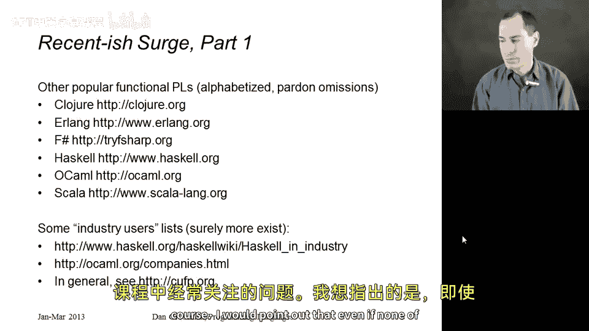
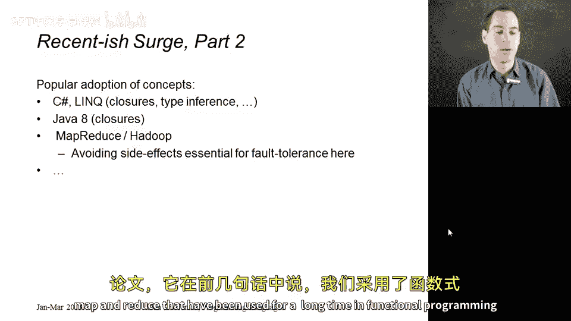
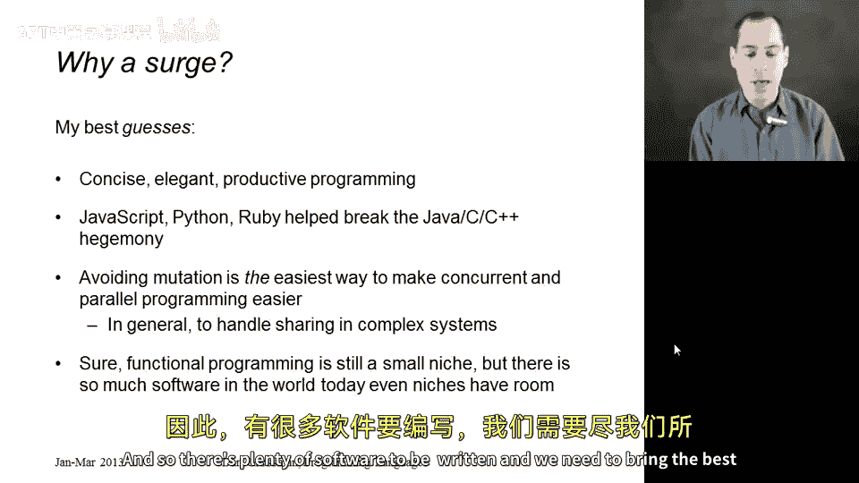

# 【编程语言 A⧸B⧸C CSE341 Coursera】华盛顿大学—中英字幕 p77 76_04_why-functional-languages -BV1bw4m1D7MM_p77-

This is the segment where I want to justify why it makes sense to spend most of a course on programming languages using functional languages and the ideas of functional programming。

So depending how you count， we're probably spending 60 to 80% of the course using these languages where mutation is discouraged where higher order functions like with study in the section on that very convenient and where one of types like use things like data types and this sort of thing So why do this Well the first reason is that these language features and this approach to software is invaluable for correct elegant efficient software。

 it's a great way to think about your computations。

 but that's what I've been emphasizing in all of the other parts of the course right that's kind of what half of the course is about。

 So in this sort of more course motivation background segment。

 let me try to make two other arguments that are actually quite different。

 The first is that functional languages have for many decades been ahead of their time and so studying them is a great way to see where the future of software may be going and in particular some current trends suggest that functional languages are very well suited to the more near。

Future， as opposed to something further out。So it turns out that there is a long history of decades of people learning things in programming languages classes。

 using functional languages that were dismissed as， well that's a pretty idea。

 but that's not how real languages work。 It's too slow。 It's not what people are used to。

 it looks too weird。 I just don't like it， etc。 So I put a list here。 I'm not a historian。

 you might be able to quibble on the details， but garbage collection。

 just the idea that you can create all the data you want。

 and the language implementation will take care of reusing the memory when you're done with things is something that is recently as 20 years ago was considered impractical for a lot of real software。

 There are still systems where it's probably impractical。

 but there's a lot of software where it is not and most of our modern popular languages happily embrace garbage collection。

Generics， the type variables， the quote A' is and alphas we've seen in ML。

 this is something that was more recent than garbage collection to really catch on mainstream。

 I would say was the last 10 or 15 years， and yet SML， the ML like languages we've been studying。

 have had these ideas since the 1980s。In XML， this is a universal data representation。

 all the HTML on the Internet， all the Xm tools that you see everywhere。

 the basic idea of XmL is that we can write down in text。

 something that is trivial to transform to a tree There's never any ambiguity if I write one plus two times3 did I mean one plus two times3 or did I mean one plus two times3 when you have the full structure of Xml。

 there's never any such ambiguity， you always have all your open tags in all your closed tags and yet this is exactly the syntax we're going to see in racket and before its scheme and before it lisp which goes back to 1958。

 the idea that if we put enough parentheses in XmL case Xml's case angle brackets into our code then there's no ambiguity and it's easy to process that text in a structured recursive way。

High order functions， of course， a huge emphasis in the course。 We now see them in most languages。

 We see them in Ruby and Javascript and C sharpharp。 They're slated to be added to Java soon。

 It took us a long time to get there。 I would say this is something that's more like the last five or10 years that people understand these should really be in your general purpose programming languages type inference。

 the idea they you can have a statically typed language without having to suffer the burden of writing down all the types is something is now limited support in C sharpp for more support and sca。

 it's something that again in functional languages goes back for 30 years and my favorite one maybe or at least the one I learned about most recently is even the idea of supporting recursion of letting a function call itself。

 most languages have supported this for a long long time。

 but back in the 1960s it was a very controversial idea of whether your language should have to support this and of course even more recently people love to pick on old versions of Forran it was not something that could be conveniently done in。

Languages。So。This slide is a bit speculative。 I can't。 I can't give you a proof of this。

 but it does seem to me that functional languages and the people who design them are often right。

 The world comes to see that the language constructs and approach being advocated are useful。

 whether it's garbage collection or higher functions。 It just often takes a couple decades。

 So the way I like to think of it as functional languages have never succeeded in conquering the world in taking over the world and replacing what came before them。

 But the ideas get assimilated。 They get incorporated into other languages。

 And that's what I mean by functional languages being ahead of their time being the leaders that then things get adopted elsewhere。

 I think that's fine。I think societal progress often takes time and can be frustrating to people sometimes how long change takes when something like this takes so long。

 you can't give credit。 I'm not saying that C sharpharp has type inference because M has type inference It's a much more complicated story。

 I'm not saying that one person is the blame in another single person is to take credit。

 but there is influence and there is a reasonable historical path from one place to another place and being speculative。

 perhaps the next thing will be something you'll learn in this class。

 whether it's pattern matching or occurring or we study macros a bit when we study racket all of these things are good ideas are elegant concepts that I would like to see be more popular and I'm not going to predict which one or something not on the list might be next。

 but thats some of the benefit of learning languages that have a history of being ahead of their time。

Now。That's really about the past。 What about what's been happening recently。

 I think it's quite clear to me， although I may be biased that in the last few years。

 there's been a real surge of interest and popularity and using functional languages for real real companies。

 real projects， real systems and I've made a list here。

 I apologize if I left the language off but these are all languages that have active user communities that are still growing。

 they're all absolutely functional languages， no one would deny that perhaps with Sca or F sharpp。

 you would say they are also objectoriented languages。

 but the new thing they bring to the table in my opinion is really the functional aspects and people really like these languages I'll talk in the next segment about why we're not using those in this course and there are reasons for and against that for a couple of these I happen to know of URLs that list a number of companies。

 not one or two but more like 10 or 20 or 50 that use these languages for real。Projects。

 if you know of some for the other languages， I encourage you to post them on the discussion board。

 I didn't mean to leave anyone out and in general you might be interested in this last URL CFP。

 org that's the commercial users of functional programming sort of group and website they have an annual meeting that sort of thing I just don't want to leave the impression that functional languages have no real world use。

 they do and of course it's not something I focus on a lot in this course。

I would point out that even if none of these languages existed。

 you could still very much argue that functional language ideas are more popular and more important than ever。

 so we see other languages adopting ideas， C sharp and its link support on the dotnet framework。

 This is stuff from Microsoft is fundamentally about starting with an object orian language and then adding things like function closures and type inference and they feel this adds a lot of benefit and good things to their language。

 as I already mentioned Java plans that add closures in the near future。

 perhaps even they have by the time you're watching this video and then another example is if you've heard of map reduce or the open source variant Hadoop。

 this is this idea of doing a largescale data computations on fault tolerant distributed clusters where there's a complicated implementation of the infrastructure but on top of that。

 you just write functions that are essentially map and fold， reduce and fold or。Essentially synonyms。

 and then many things are taken care of for you。 and if you actually go back to the original paper。

 research paper， introducing the idea of Mareduce， it says right in the first few sentences that we take the ideas of the functions map and reduce that have been used for a long time in functional programming languages。

So why this sort of recentish surge to the extent that there is one here I really am guessing but I thought it'd be nice to kind of give some ideas on why I think this might be happening。

 Of course， the first one is these functional language ideas are concise and elegant and make people productive。

 but that's always been the case。 So it doesn't really explain sort of more recent phenomenon unless you just say well。

 people have finally gotten the message or wish to pursue these ideas。

 I think some credit actually goes to languages like Javascript or Python or Ruy or whatever that people now understand that real systems in real things you want to write and do don't have to be written in C or C plus plus or Java or C sharpp or whatever that it's helpful to have a diverse heterogeneous programming language landscape rather than trying to find one language or one system that everyone will use。

 I also think that avoiding mutation in particular。

 which is one of the key things that functional languages offer is the easiest way。

make concurrent and parallel programming easier that with a world with so much parallel processing。

 multichose in your phone or your laptop or your desktop， as well as in data centers。

 we need to make parallel programming easier and it is hard to share data that can be updated by other threads and so this is something where functional languages should shine。

 I think in general， our software has gotten so complex that it's very hard to keep track of all the places in your system that someone might have access to a particular piece of data and if that data cannot be updated。

 then you often have to worry much， much less about who else might have an alias to it。

 we talked about that early in the course with the benefits of no mutation although only with a small example。

And then finally it might well be that functional programming remains a very small niche in the overall landscape。

 I don't know how to measure how much software industry there is， how much software is being written。

 other people probably try to do that sort of thing but there's so much software in the world today that there's room for everybody there's room for ML programmers and MATLb programmers and JavaScript programmers and see programmers and assembly programmers and Java programmers and so there's plenty of software to be written and we need to bring the best tools to bear that we can on every problem that we need to solve。

