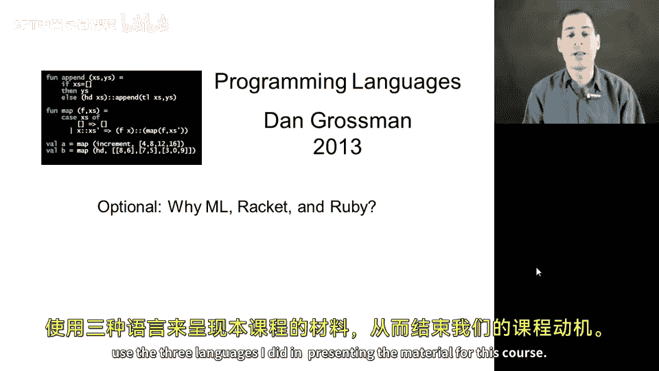
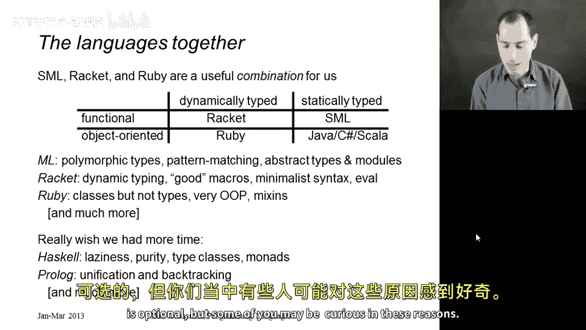
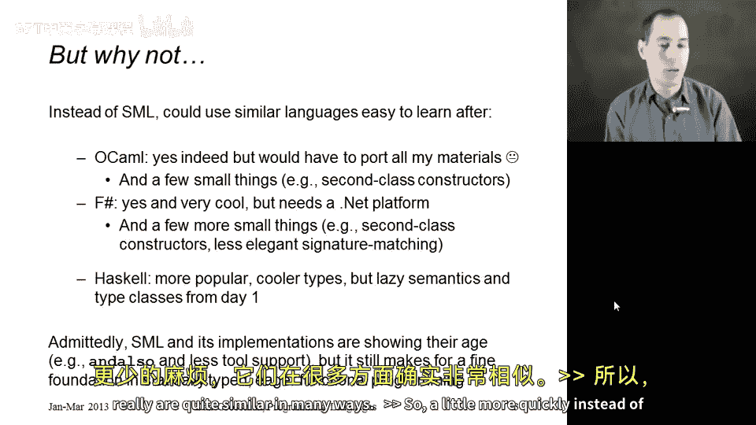
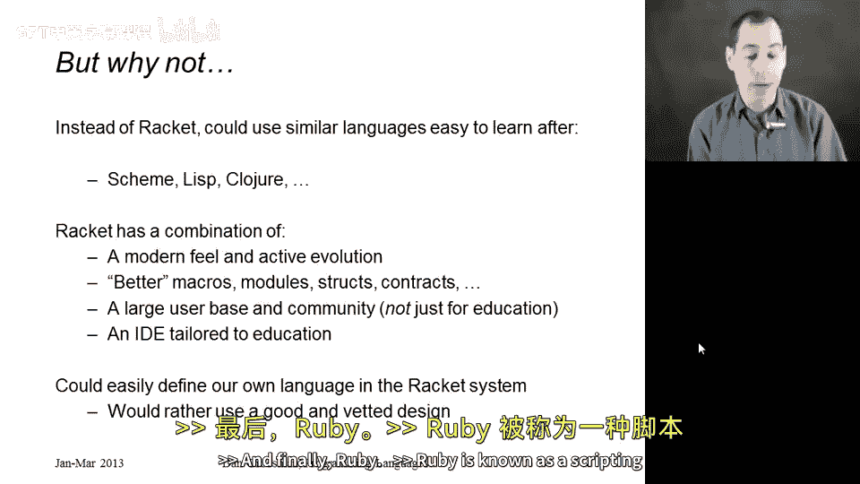
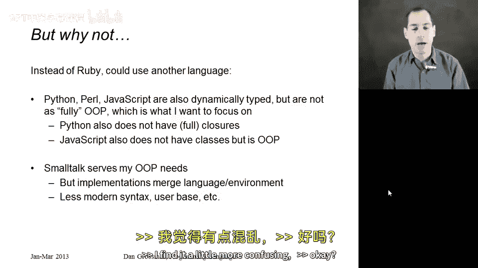
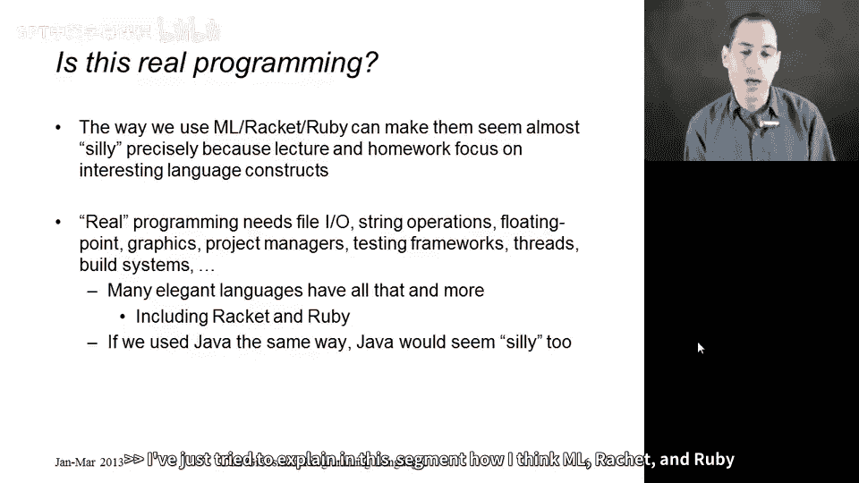
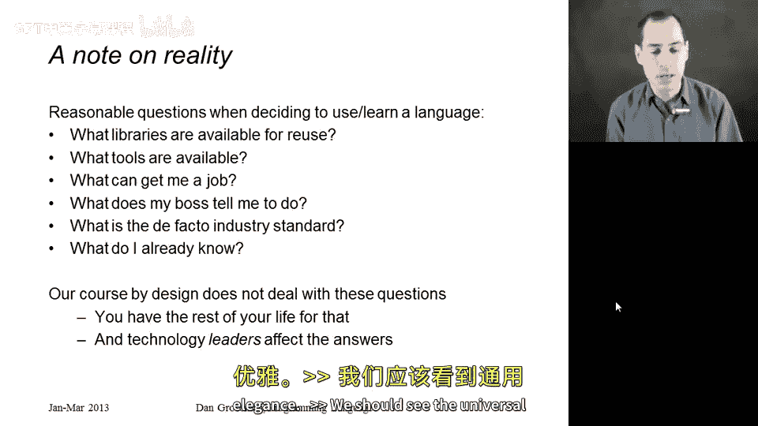

# 【编程语言 A⧸B⧸C CSE341 Coursera】华盛顿大学—中英字幕 p78 77_05_why-ml-racket-and-ruby -BV1bw4m1D7MM_p78-

So let's conclude our course motivation by discussing why I chose to use the three languages I did in presenting the material for this course。

Here I'll distinguish ML which sometimes is used as a more general term for SL OKmo and F sharpharp from standard MLL or SL which is what we're actually using and I'll point out first of all that SML racket and Ruby provide a very useful combination for us so I have a two-dimenal grid here where you can see that some languages are more dynamically typed and others are more statically typed we'll study the differences between those a lot in this course you'd also say that some languages promote more of a functional style while there promote more of an objectoriented style there are other rows one could add to this chart not all languages are functional objectoriented but it's useful to us for this course that rackcet Ruby and SML correspond to three of the fourth positions I don't think we have time for a fourth language and many people before coming to a course like this have already seen the fourth segment if they've programmed in Java C sharpharp or use the object oriented features in sca or whatnot that's not true if you program。

In Python， which is dynamically typed， but nonetheless three out of four positions help show that functional versus object oriented is an orthogonal issue from dynamically versus statically typed。

 so that's why I picked these three as a package。 Why did I pick each one individually。Well。

 for any of the ML like languages， including SML， I really like it as polymorphic types so we can use the type system to understand how code can be reusable when we see quote A types。

 it has pattern matching， which I think is a wonderful way to think about how to decompose your data。

 and I really like the module system， which we will study in order to see how you can use abstract types to enforce invaris that clients of your library cannot violate。

For rackcet， I want a language with dynamic typing。

 I like to do a short segment on macros and rackcet has a very good macro system that makes a lot of sense。

 I like that it has minimalist syntax by using more parentheses everything has a very regular very easy to understand syntax even if many people don't tend to like it and it has Eval which is a particular concept we can talk about and relate it to some other concepts I really like rackcet as a language and so that's why I picked it。

And finally， Ruby it's an object oriented language， it uses classes， but it does not have types。

 so that's a good contrast with a lot of other objectoriented programming languages。

 It's very objectoriented all the data in Ruby as an object， not just most of it。

 which I like as some small features that I find useful to teach and I'll try to include the particular topic of mixins。

 which you can accomplish with Ruby's modules。 So there's a lot of other small reasons but that gives you a sense that I didn't just pick these because I liked them or because I thought they were fine or I liked their syntax or something like that。

I do wish I could complement these three languages with Haskell and with prologue because I think they are qualitatively different from the three we will use and we simply just don't have time Haskell's approach to laziness。

 a topic we will study briefly with racket is what really sets it apart as well as its pure functional nature that it's really separates out even more than ML。

 the ability to mutate things into a separate part of the language and it does that and does other things as well with the wonderful features of type classes and Monads which I just don't have time to get into。

 and then prologue is really a very different paradigm its logic programming where it has built into the language semantics。

 the idea of searching for a solution and it's a very different perspective on how to think about computation。

So for most of the rest of the segment， why don't I explain reasonable options as alternatives to ML Racet and Ruby and a little bit of why I didn't pick them。

 like everything in this section， this is optional， but some of you may be curious in these reasons。

So instead of SML， we could have easily used a similar language， a more functional language。

 maybe Ocal， F sharp， Pascal scala， all of which are more modern a little more convenient to modern eyes have more tool support and I did pick SML for some good reasons。

 really good reasons and some more accidental ones so probably the closest choice。

 the thing I would have been next to pick would have been OcaMl it has all the things we need but I would have to port all of my course materials and I' probably introduce a lot of bugs when I did that and there are a few small things that I do use in the class where SML is a little more elegant in particular in SML but not in Ocal。

 those constructors from our data type binding are actually functions that can be passed around just like any other function and I find that SML's approach to signature matching when we study the module system lets me point out a few elegant things that don't work quite as well as in OcaMl OcaM is a wonderful language as is F sharpp。

😊，FSharp is really a dialective Ocal that runs on Microsoft's donet platform。

 I steer it away from it a bit because it's a more sophisticated and complicated language and you need an implementation of donet to run it。

 And so that's a little more difficult， although not impossible on a non Windows platforms。

 And compared to Ocal， there's even a few more small things that don't work as well in particular。

 the fact that you cannot take a polymorphic function and export it in a signature as a nonpolymorphic function。

 These are minor things you could absolutely do the course in F sharpharp。

 but you know it's enough to cause me to stick with SMmL。Haskell。

 I would be less likely to pick Haskell is a wonderful language。

 but the way I teach semantics and the way I want you to think about evaluation rules does not work well with the lazy semantics and Haskell and Haskell things don't evaluate in the order that they do in ML and in most other programming languages and I find that much harder to teach with other people do start with Haskell even in a first programming course。

 and I have nothing bad to say about those courses。

 but I find it too difficult to present a crisp and accurate view of computation in the presence of laziness so SML is a less modern language than these others。

 that's not to say you couldn't build a real system with it today。

 we've been writing programs with it but I find it still a fine foundation for teaching functional programming and after you've learned it you will have much much less trouble picking up another one of these languages they really are quite similar in many ways。

So a little more quickly instead of racket， we could have used scheme or listsp or closure that are share a lot of the similarities for me racket is a modern language。

 it's continuing to evolve which is both a blessing and a curse it's a bit more of a moving target but it improves in many ways on these other variant and in the ways that it doesn't really matter for us I particularly like its module system。

 it support forstructs which are a lot like records and other languages and it's contract system although we won't really get into the contract system。

 it's nice to have a language where you can go on and learn more on your own for that sort of thing it has a large user base it's probably best known for its role in computer science education but that is not all that is used for and it comes with the Dr。

 Raet IDE which makes it easier for teaching because the development environment was always designed to be useful for teaching at the bottom of the slide it turns out in rackcet you could。

Des your own language very easily。 it's a very cool feature of the Dr Raet system and the rackcque infrastructure and it's tempting to do that for anyone's class and then come up with a language it's exactly like you want so a slight variant of racket but I decided it would be better to use the more common language that other people also use it's a good design it's already been used by other people and even if there are a few rough edges for us it seemed better to stick with a language as already defined。

And finally Ruby， Ruby is known as a scripting language so why not use Python or perl or JavaScript。

 they are also dynamically typed most of those languages like Python and JavaScript do also have many of the objectoriented features but they are not as fully objectoriented as Ruby and Ruby it's really a more complete commitment to objectoriented programming in ways that we will see Ruby also has full closures which Python does not。

 Python doesn't provide the full power of closures as we have seen or well see in ML。

 and JavaScript is a very objectoriented language but it does not have classes。

 it has prototype-based than inheritance， a topic we won't get to in this class and I don't necessarily have a preference for one over the other。

 but I'm happier starting with a dynamically typed class-based objectoriented language because I feel it makes an easier contrast with statically typed class-based。

Objector any languages like Java and C sharpharp and Scala。

So the other language that actually shares everything with Ruby that I've said so far is actually small talk。

 and I used to actually use small talk。 It's a much older language language。

 People find the syntax very strange， which of course doesn't bother me in the slightest because it's just syntax a couple things I like less。

😊，Is that it is just less common fewer people know about it， there's less modern tools for it。

 and small talk implementations have traditionally merged the language with the environment and what I find to be a somewhat strange way and a way that makes it harder for me to tease out the actual language construct。

 people who like small talk consider that a feature， I find it a little more confusing。

Okay so there's your background。 just to finish up very briefly。 Let me remind you。

 I think I said this at the beginning of the course。

 the way we use these languages in this course can make them seem silly。

 we write small little functions we test individual concepts at a time。

 I'm fully aware that real programming languages need lots of things。

 You want tools like testing frameworks and bug tracking systems and project managers。

 you want libraries for things like fileo and accessing the network。

 You want constructs for floating point and string operations and multithreading。

 many of the elegant languages have that in more rack and Ruby actually have all of these things。

 but we just don't use them in that way in a course on programming languages。

 and so you know there are other languages like Java that we could also use in this sort of silly way in order to teach language constructs。

 I've just tried to explain in this segment how I think M Raet and Ruby better serve our purposes。

And so finally， let's finish up motivation with after this course。

 will you ever use any of these languages again， It's quite likely you will。 I encourage you to。

 you might use similar enough languages that it's almost like you're using these languages。

 but you might not。 You might spend the rest of your career programming and C++ and that's because of real worldord concerns。

 right you need the libraries that you need， you need to use the languages that your boss wants you to use。

 you need to be able to hire people under your team that have the background in the skills that you need。

 there may be an industry standard， you may need to communicate your ideas the people who have not taken this class and so on。

 I get all that。 you know， a course like this by design。

 the thing that separates a course from sort of industry practice and the real world is that we don't have to deal with all of those questions。

 we can focus just on the programming languages。 This is a course on programming languages not the more general issues of software engineering and software development。

And that affords us the opportunity， the benefit to push those reasonable questions off to the side。

And it's really about taking a more longterm view， right， technology leaders。

 and I hope many of you are technology leaders get to affect answers like what is the industry standard。

 What sort of people should I be hiring， How should we educate software developers。

 And so we shouldn't feel overly constrained by how the world necessarily works today。

 We should plan for the future。 We should see the underlying elegance。

 We should see the universal features， And I like to use M， Raet and Ruby to do that。

