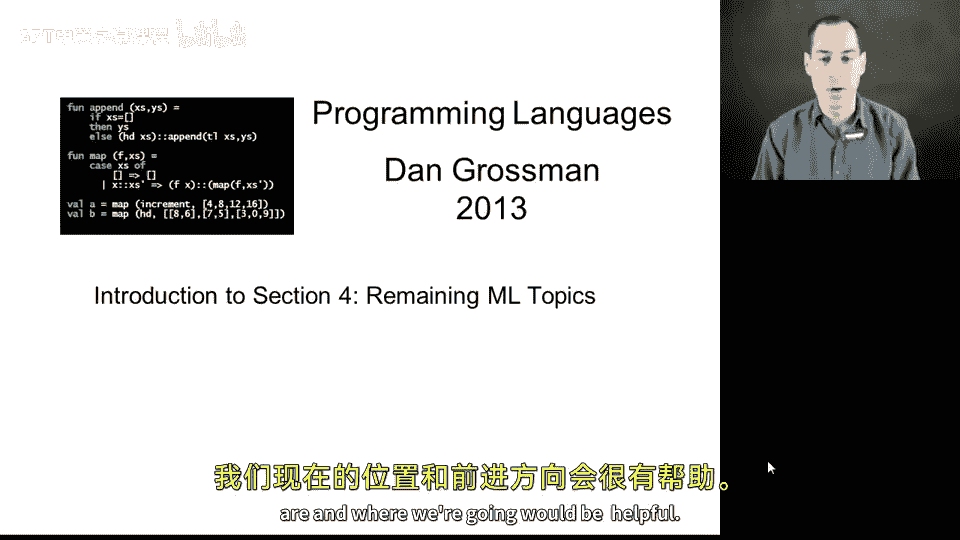
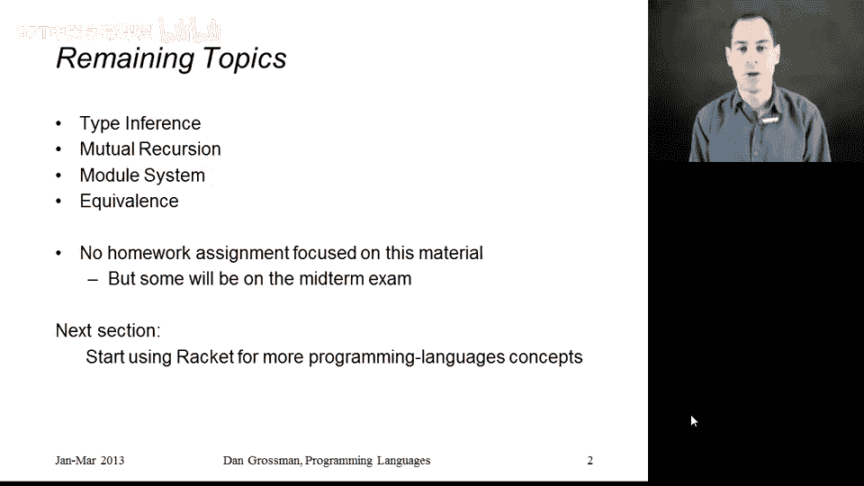

# 【编程语言 A⧸B⧸C CSE341 Coursera】华盛顿大学—中英字幕 p79 78_01_section-introduction -BV1bw4m1D7MM_p79-

Welcome to section 4 of the course。 This is gonna be the last section where M is our primary programming language。

 So I thought a short introduction just to remind us where we are and where we're going would be helpful。

 So we've done most of what we need to do with M。 we've studied pattern matching， higher functions。

 closures， all the main big topics， but there's four things that I put off just because we didn't need them for the homework but I think complete our proper introduction to this first half of the course。

 So in this section which manned up being a little bit shorter than the others。

 we're going to study type inference。 how M has been able to figure out what types all our functions and binding should have。

 mutual recursion， I just never showed you how to have multiple recursive functions I'll call each other。

 The big topic on most excited about is the module system。

 how we're going to be able to write modules that can hide things。

 keep things private from other parts of the program。

 Ml has a very elegant module system for that purpose we will do just the basics of it and then。

It's more conceptual about when two functions in a language like MLl are equivalent。

 and you can replace one with another。Now this section is not going to have a homework assignment associated with it。

 we have time in the course for I believe seven homework assignments and we will have eight or possibly nine sections and that will give us more time to study for the midterm which sort of fits nicely at the end of this section so the midterm will have short answer questions covering all of the first four sections including some questions on this material as well as the earlier sections then after that we'll move on to more concepts and we'll switch our programming language to racket because it'll be better suited for the concepts we want to cover with that。

