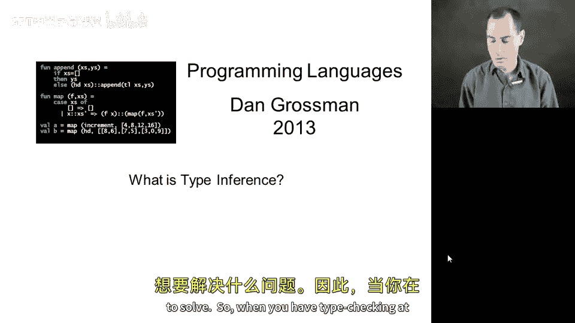
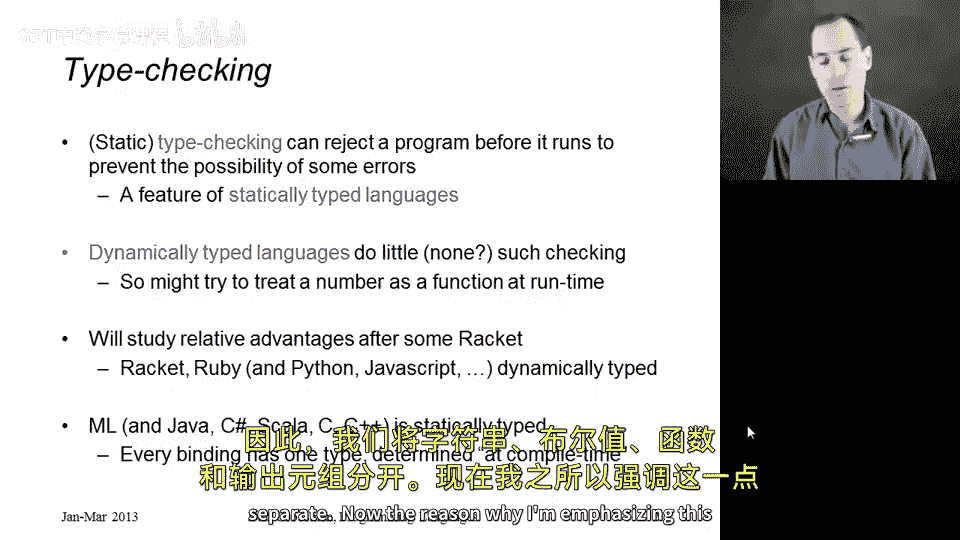
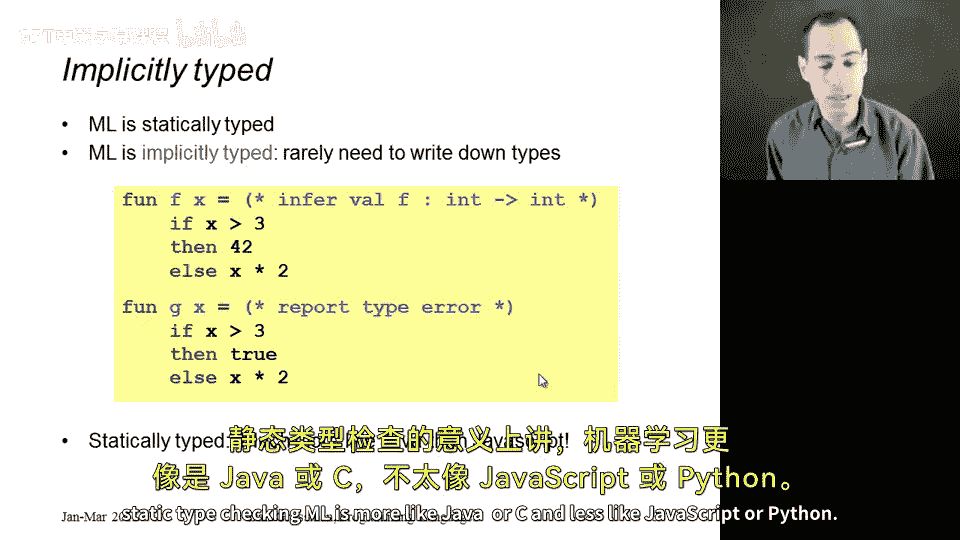
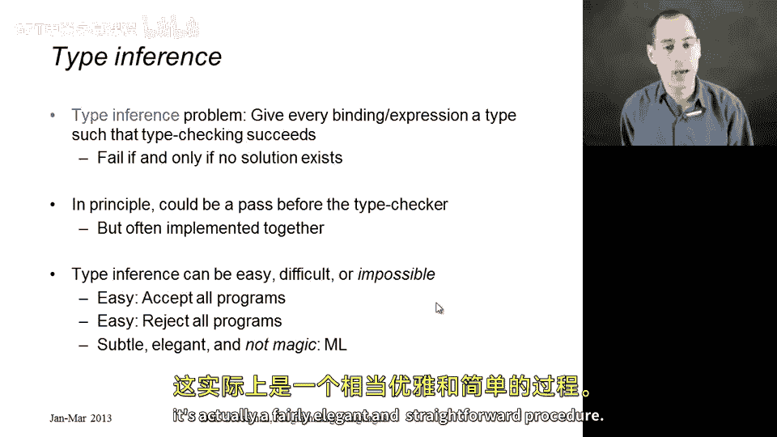

# 编程语言 A/B/C CSE341：80：什么是类型推断 🧠

在本节课中，我们将学习**类型推断**的概念，了解它试图解决什么问题，以及它在静态类型语言（如ML）中的作用。我们将通过对比静态类型检查和动态类型检查来阐明类型推断的必要性。

## 静态类型检查与动态类型检查

上一节我们介绍了类型推断的总体目标，本节中我们来看看类型检查的两种主要方式。

当你在编译时进行类型检查（称为**静态类型检查**）时，它允许我们在程序运行之前就拒绝某些程序。我们这样做是为了防止潜在的错误。因此，静态类型编程语言（或具有此功能的语言）中，某些函数可能无法通过类型检查。例如，一个可能尝试将数字当作函数调用的函数，我们实际上不需要执行该函数就能得到错误，我们在运行程序之前就会得到该错误。

相反，**动态类型语言**很少或根本不进行这种检查。因此，你必须实际调用函数，并且在变量绑定到正确值的情况下，对特定的问题表达式求值后，才能看到潜在的错误。

静态和动态类型检查的相对优势是本课程的一个主要概念，我们将在使用动态类型编程语言（如Racket）一段时间后再深入研究。目前，我们只见过ML。像Java、C、Scala等语言一样，ML是静态类型的。它具有这样的特性：某些代码在运行前就无法通过类型检查。

所有这些静态类型语言的共同点是，我们引入的每个变量都被赋予一个类型。每个绑定都有某种类型，并且在其可用的作用域内，它保持该类型，并且只能持有该类型的值。因此，我们将字符串、布尔值、函数和元组区分开来。

## ML的隐式与静态类型

现在强调这一点是因为，尽管ML是静态类型的，但自第2节左右开始，它一直是**隐式类型**的。我们从未为任何变量写下类型，对于`val`绑定从未写过，只在课程开始时使用`fun`定义函数时，为函数的参数写过类型。

所以，仅仅因为ML是隐式类型的，有时可能会让人混淆，忘记它实际上是静态类型的。例如，在第一个函数`f`中，两个变量`f`和`x`都有类型：`f`的类型是`int -> int`，`x`的类型是`int`。它们和Java或C语言一样是静态类型的，在Java或C中我们必须在引入变量时写下所有变量的类型。

这就是为什么当你有一个像`g`这样的函数时，我们会得到一个类型错误。这里类型错误的原因是，ML的类型检查规则之一是：条件表达式的`then`分支和`else`分支必须具有相同的类型，这样整个`if`表达式才能具有该类型，从而也决定了`g`的返回类型。当这两个分支类型不匹配时（例如这里是`bool`，那里是`int`），我们就会得到一个类型错误。这正是动态类型语言中通常被允许的情况，根据`g`的参数，你可能返回一个`bool`或一个`int`。因此，在静态类型检查的意义上，ML更像Java或C，而不像JavaScript或Python。

## 什么是类型推断问题？

那么，**类型推断问题**到底是什么呢？

类型推断问题是：给定一个程序（就像我们在上一张幻灯片中看到的那样），尝试为该程序中的每个变量、绑定和表达式赋予一个类型，使得如果你写下所有这些类型，类型检查就会成功。我们需要推断出所有类型，以便程序能够通过类型检查。

如果我们无法做到这一点，即不可能给出这样的类型（就像第二个例子中，`true`和`x * 2`根本没有相同的类型），那么类型推断的作用就是失败，并可能给出某种错误信息。

原则上，你可以像这样设置：可以有一个类型推断过程为所有东西写下类型，然后有一个类型检查器在实践中检查这些类型。但在像SML这样的语言实现中，我们通常不会如此清晰地将两者分开。我们通常让类型推断器和类型检查器是同一个东西，你的程序要么通过类型检查，要么不通过。

## 类型推断的复杂性与优雅性

在进入下一节讨论ML的类型推断之前，我想强调的最后一点是：本小节实际上是关于类型推断的一般概念。类型推断可能容易、困难或不可能，这取决于你试图为之推断类型的类型系统。

以下是两个极端的观点：
*   如果每个程序都能通过类型检查，那么推断起来非常容易，直接说“是”即可。
*   如果没有程序能通过类型检查，推断起来也很容易，直接说“否”即可。

因此，类型推断的难易程度并不一定取决于类型系统是接受更多程序还是接受更少程序。要弄清楚这一点并不简单。这是语言设计难度的一部分，如果你想要类型推断的话。

但我们之所以要研究ML的类型推断，是因为它虽然有些微妙，但也极其优雅。在课程的现阶段，它可能看起来像魔术。我们已经看到这些多态类型似乎是为我们推断出来的。但通过一系列例子，我想让你相信，它实际上是一个相当优雅且直接的过程。

---

**本节课中我们一起学习了**：类型推断的定义及其目标，静态类型检查与动态类型检查的区别，ML作为隐式但静态类型语言的特性，以及类型推断问题的本质——为程序中的所有元素推断出使其通过类型检查的类型。我们还了解到类型推断的难度取决于具体的类型系统，而ML的类型推断机制以其优雅性著称。