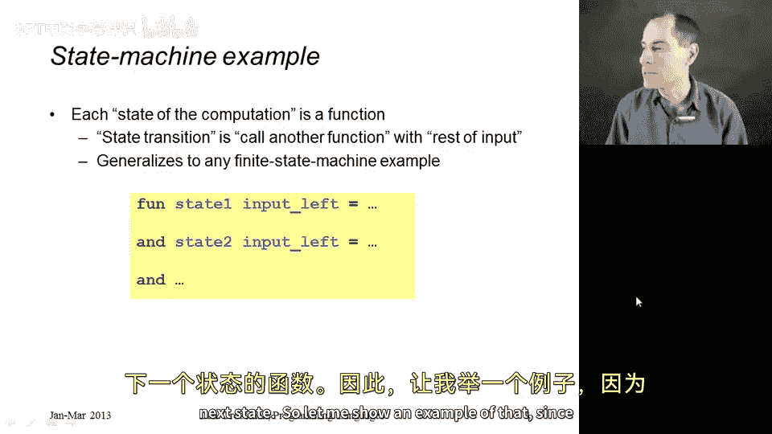
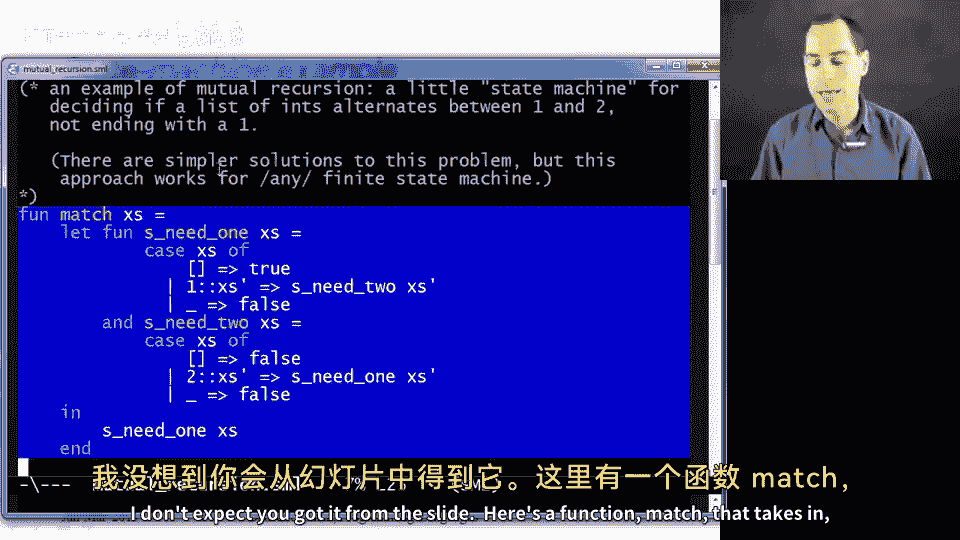
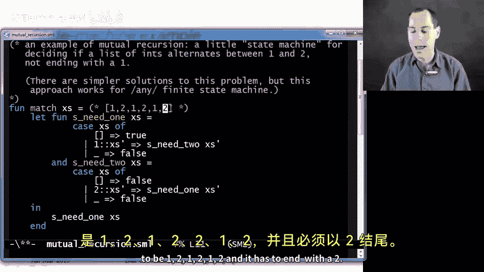
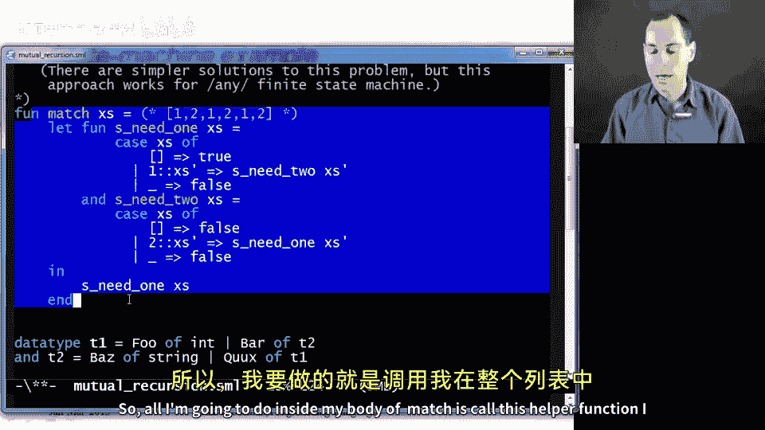
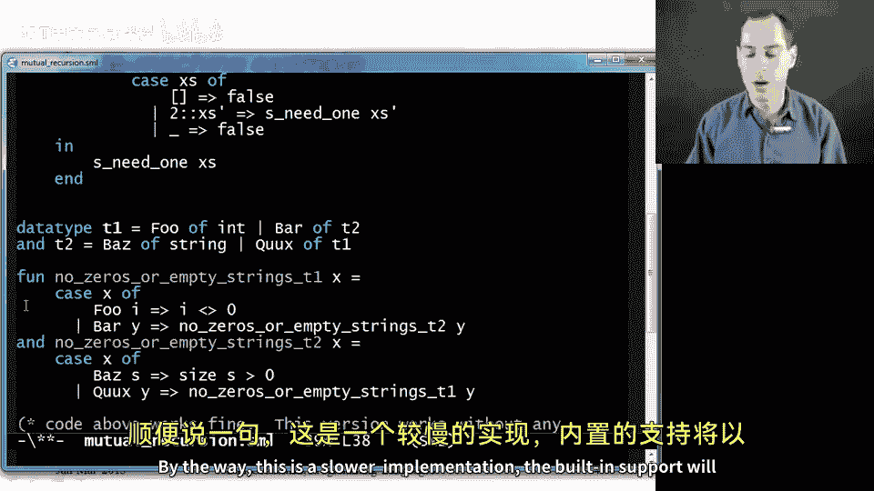
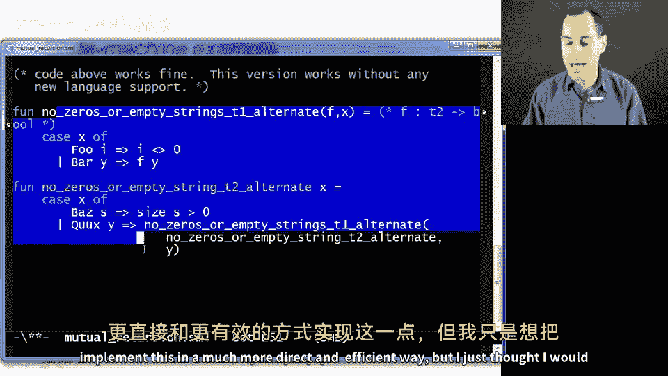
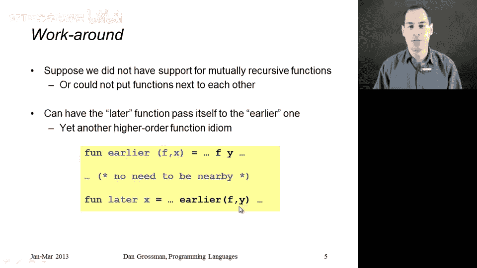

# 编程语言 A/B/C CSE341：85：相互递归 🌀

在本节课中，我们将学习相互递归（Mutual Recursion）的概念。相互递归指的是两个或多个函数相互调用的情况。虽然这是一个小主题，但在某些编程模式和习惯用法中非常有用。我们将通过实现一个简单的状态机来展示其应用，并介绍两种实现相互递归的方法：ML语言的内置支持以及使用高阶函数的变通方法。

## 内置支持：`fun` 与 `and` 关键字

在ML语言中，我们可以使用 `fun` 和 `and` 关键字来定义相互递归的函数。具体做法是，在第一个函数定义后使用 `and` 关键字连接后续的函数定义。这样，这些函数就可以相互调用，它们被视为一个整体添加到环境中，并进行类型检查和求值。

例如，定义两个相互递归的函数 `F` 和 `G`：

```sml
fun F x = ... (* F 的定义，可以调用 G *)
and G y = ... (* G 的定义，可以调用 F *)
```

同样，我们也可以定义相互递归的数据类型：

```sml
datatype T1 = Foo of int | Bar of T2
and T2 = Baz of string | Qux of T1
```

## 状态机示例：处理整数列表



相互递归的一个常见应用是实现有限状态机（Finite State Machine）。状态机用于处理未知长度的输入列表，根据当前状态和输入元素决定下一个状态。最终，某些状态表示接受输入，某些状态表示拒绝。





以下是一个简单的状态机示例，它只接受形如 `[1, 2, 1, 2, ...]` 的整数列表，且必须以 `2` 结尾：



```sml
fun match xs =
    let
        fun need_one [] = true
          | need_one (1::xs') = need_two xs'
          | need_one _ = false
        and need_two [] = false
          | need_two (2::xs') = need_one xs'
          | need_two _ = false
    in
        need_one xs
    end
```

在这个例子中，`need_one` 和 `need_two` 是两个相互递归的函数，分别代表两个状态。`need_one` 状态期望下一个元素是 `1`，而 `need_two` 状态期望下一个元素是 `2`。通过相互调用，它们实现了状态之间的切换。

## 相互递归数据类型示例

假设我们有两个相互递归的数据类型 `T1` 和 `T2`：

```sml
datatype T1 = Foo of int | Bar of T2
and T2 = Baz of string | Qux of T1
```

我们希望编写两个函数，分别检查 `T1` 和 `T2` 类型的值中是否包含 `0` 或空字符串。由于这两个数据类型相互引用，我们需要使用相互递归的函数来实现：

```sml
fun no_bad_T1 (Foo i) = i <> 0
  | no_bad_T1 (Bar y) = no_bad_T2 y
and no_bad_T2 (Baz s) = size s > 0
  | no_bad_T2 (Qux x) = no_bad_T1 x
```

## 高阶函数变通方法

如果我们无法使用内置的相互递归支持，可以通过高阶函数来实现相同的功能。具体做法是将一个函数作为参数传递给另一个函数。例如，我们可以重写上面的示例：

```sml
fun no_bad_T1 (f, Foo i) = i <> 0
  | no_bad_T1 (f, Bar y) = f y

fun no_bad_T2 (Baz s) = size s > 0
  | no_bad_T2 (Qux x) = no_bad_T1 (no_bad_T2, x)
```

在这个版本中，`no_bad_T1` 接受一个函数 `f` 作为额外参数，这个函数就是 `no_bad_T2`。通过这种方式，我们实现了相互递归的效果，而不需要依赖语言的内置支持。

## 总结







本节课中，我们一起学习了相互递归的概念及其在ML语言中的实现方法。我们介绍了如何使用 `fun` 和 `and` 关键字定义相互递归的函数和数据类型，并通过状态机的例子展示了相互递归的实际应用。此外，我们还探讨了使用高阶函数实现相互递归的变通方法。相互递归虽然是一个小主题，但在处理复杂的状态切换和相互引用的数据结构时非常有用。