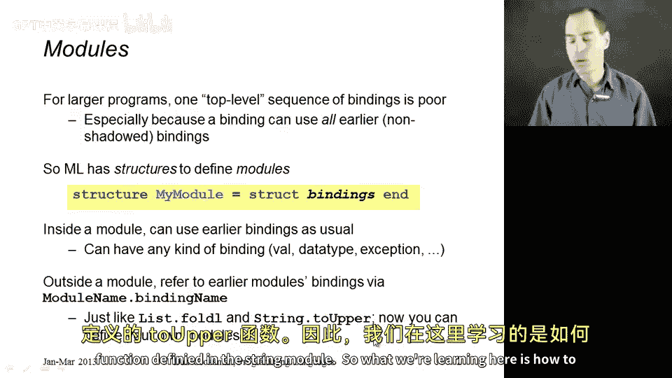
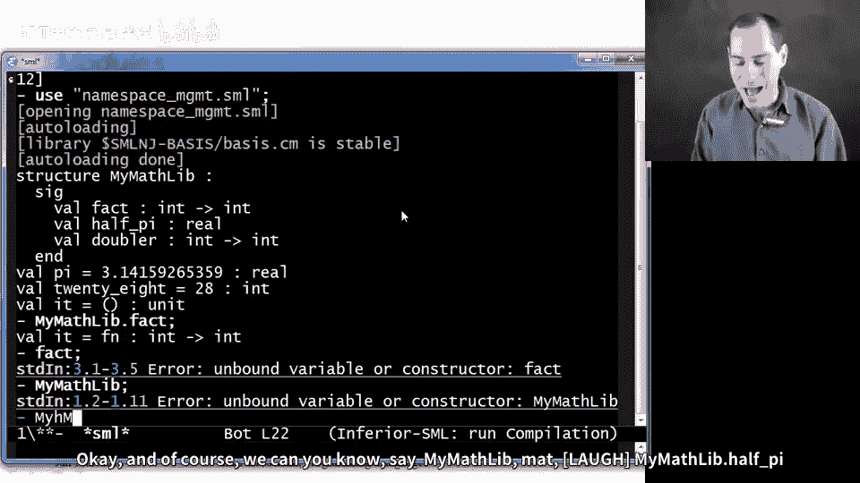
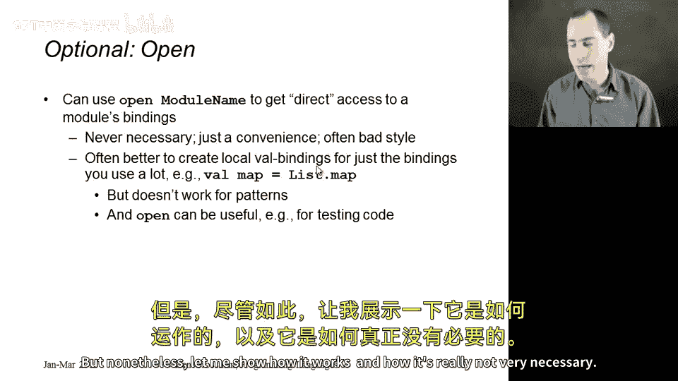
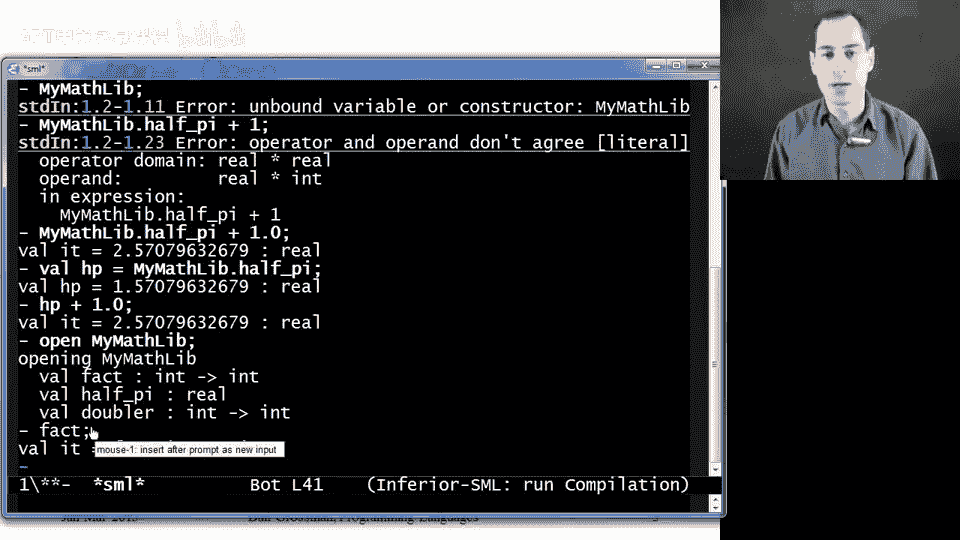

# ML编程语言：第8章：模块系统入门 🧩

在本节课中，我们将开始学习ML的模块系统。这是一个相当庞大的主题，我们将通过多个章节来探讨，尽管我们只会触及表面，了解模块系统的基本概念和功能。

## 概述

到目前为止，我们编写的所有程序都只是一个顶层的绑定序列。我们可能在函数内部有辅助函数或局部绑定，但整体上只有一个序列。对于编写大型程序来说，这种组织方式并不理想。ML语言意识到了这一点，并且像许多编程语言一样，提供了更多支持来组织大型程序。

我们将主要关注ML的**结构**。结构定义了一个模块，你可以在其中拥有一系列绑定，这些绑定与其他模块及其绑定是分开的。在本节中，我们将介绍语法和基础知识，然后在此基础上继续深入。

## 结构绑定语法

本节我们将介绍的主要结构是**结构绑定**。其语法如下：

```sml
structure 模块名 = struct
    绑定1
    绑定2
    ...
end
```

按照惯例，模块名通常以大写字母开头，但这并非强制要求。在`struct`和`end`之间，你可以放置任何类型的绑定：数据类型、异常、变量、函数等。

在模块内部，这一系列绑定的求值方式与我们之前在顶层看到的一样。按顺序求值每个绑定，后面的绑定可以使用前面的绑定。定义模块后，在模块外部你可以使用这些绑定，但不能直接通过语法使用它们。如果模块内有一个名为`binding_name`的绑定，你需要写成`模块名.绑定名`。



这应该不会让我们感到意外，因为我们已经使用了标准库中的一些模块。例如，当我们使用`String.toUpper`函数时，它就是定义在`String`模块中的`toUpper`函数。因此，我们现在学习的是如何定义自己的模块。

## 示例：自定义数学库

下面是一个简单的示例，我们定义了一个名为`MyMathLib`的结构：

```sml
structure MyMathLib = struct
    fun fact x = if x=0 then 1 else x * fact(x-1)
    val half_pi = Math.pi / 2.0
    fun doubler x = x * 2
end

val pi = MyMathLib.half_pi + MyMathLib.half_pi
val twenty_eight = MyMathLib.doubler 14
```

我们可以像运行任何其他程序一样求值这个程序。REPL会告诉我们确实存在一个结构`MyMathLib`，其中包含`fact`、`half_pi`和`doubler`绑定。在顶层，我们得到`pi`的值为3.14159，`twenty_eight`的值为28。

需要强调的是，在我们的环境中，我们有诸如`MyMathLib.fact`这样的东西，它是一个从`int`到`int`的函数。但在顶层环境中，我们并没有`fact`这个绑定，它根本没有被绑定。同样，我们也没有一个名为`MyMathLib`的变量。结构名不是变量，它们是ML中不同的东西。我们有这些模块，但必须使用其中的绑定，不能一次性使用整个绑定。例如，`MyMathLib`本身并不是一个可用的值，这只是模块系统的一部分，与语言的其他部分略有不同。

当然，我们可以这样使用：`MyMathLib.half_pi + 1.0`，这完全可以正常工作。



## 命名空间管理

到目前为止我们所做的工作，我称之为**命名空间管理**。通过使用模块，我们可以将不同绑定的名称分开。这使得当你的程序中有大量函数和变量时，管理起来要容易得多。

ML甚至支持在其他模块内部定义模块，形成一个完整的层次结构。这非常棒，因为一个列表库可以有一个`map`函数，一个树库也可以有一个`map`函数，它们不必担心将其命名为`List.map`和`Tree.map`，每个模块都可以有自己的`map`。

这对于大型程序非常重要，但就其本身而言并不十分有趣。本节内容很短，关于命名空间管理，我要说的基本就是这些。是的，你应该使用命名空间，我们很高兴语言提供了这种功能。

## 可选特性：`open`关键字

为了结束本节，介绍一个可选特性，因为人们总是会问到它。有时人们想知道，是否有办法说“我想使用模块中的所有内容，而不必键入模块名”？在ML中，你可以通过`open`特性来实现。

你可以在模块内部使用它，也可以在REPL中使用。我个人不太喜欢它，因为它倾向于将所有那些原本很好地放在命名空间中的东西“打开”，而模块中通常包含的不仅仅是你想要的东西。但尽管如此，让我展示一下它是如何工作的，以及它实际上并不是非常必要。



例如，如果我打算经常调用`half_pi`，我可以直接写：
```sml
val hp = MyMathLib.half_pi
```
然后我就可以说`hp + 1.0`，这完全没问题。

如果你真的想要模块中的所有内容，那么你可以说：
```sml
open MyMathLib
```
现在，我在顶层环境中就有了`fact`、`half_pi`和`doubler`的绑定。我认为这在REPL中测试模块时非常有用，但除此之外，我并不觉得它特别有用。尤其是如果你在想“我真的很想经常使用`fact`”，却忘记了模块中还有一个`doubler`绑定，当你使用`open`时，实际上会**遮蔽**环境中可能已经存在的任何`doubler`绑定。

尽管如此，如果你想使用`open`，你可以。它在ML中存在是有原因的，有些人觉得它很方便。我将其视为一个可选主题。

## 总结



本节课中，我们一起学习了ML模块系统的基础知识，以及如何将其用于命名空间管理。我们介绍了结构绑定的语法，通过示例创建了自己的模块，并理解了如何通过`模块名.绑定名`的方式访问模块内部的成员。我们还简要探讨了可选的`open`关键字，它允许直接使用模块内的绑定而无需前缀，但使用时需要注意潜在的命名冲突问题。模块系统是组织大型ML程序、避免命名冲突和实现代码封装的强大工具。